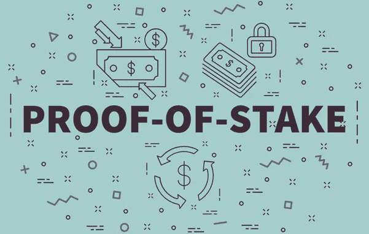

# 利害关系证明

> 原文：<https://medium.com/coinmonks/proof-of-stake-d1a68e402483?source=collection_archive---------63----------------------->

在本文中，您将了解什么是利益相关证明，如何从中获利，哪些加密货币使用这种共识机制以及许多其他机制。

在我们开始之前，您需要知道，目前大多数公共区块链网络使用被称为工作证明或利益证明的流程来提供共识，而私有和分布式账本技术(DLT)可以以各种方式构建，以优先考虑速度、安全性和可扩展性。

股权证明是一种加密货币共识机制，用于处理交易和在区块链中创建新块。共识机制是一种用于验证进入分布式数据库的条目并保持数据库安全的方法。在加密货币的情况下，数据库被称为区块链，因此共识机制保护区块链。

利益证明区块链通过要求验证者标记他们的令牌来保证网络的安全和验证者的诚实。如果验证者恶意或不称职，他们就会失去他们的股份，并通过一个叫做“砍”的过程访问网络。这种激励结构确保验证者通过合法操作比违反规则获得更多。

**有股权证明能赚钱吗？**

简单的回答是肯定的。利益证明概念表明，用户可以根据个人账户中的硬币数量来挖掘或验证大宗交易。矿工拥有的硬币越多，用户的采矿能力就越强。

赌注凭证的持有者可以通过押上他们的密码并成为网络验证者来赚取他们所持有的“密码红利”。因为这有时需要大量的投资，交易所已经承担起责任，使这一过程变得更简单，让普通用户更能负担得起。

但即使这听起来像是太多的责任，你仍然可以通过加入别人经营的赌注池来参与赌注——并为 crypto 赚取奖励，否则这些奖励将无所事事。

在本质上，赌注是最纯粹的持有方式。通过抓住你的硬币以获得更多的机会，同时加强网络，你展示了你对硬币本身潜在技术的信念。正如我们之前简单提到的，下注一个你不想积累更多的硬币是没有实际意义的。通过标桩，你基本上表明了你对项目、团队和最终用途的可行性的信念。

因此，选择合适的硬币来下注，既是一个数字游戏，也是一种直觉。如果你选择开始赌注，一定要从研究最低金额、赌注回报、特定的赌注协议等开始。但是也要记得选择一个能引起你共鸣的项目，一个你期望在未来很久还会存在的项目。毕竟，通过跑马圈地，你正在帮助实现这一目标。

**股权证明特征**

**低入口**

股权证明系统的另一个显著特点是它们的准入要求较低。我们已经表明，与工作证明系统不同，在这里，您不需要投资采矿设备来验证交易。相反，你的股份是你参与验证过程的门票。

**·被动收入**

与其他系统相比，股权证明系统的一个优势是它允许你赚取被动收入。就像采矿用一定数量的密码奖励你的努力一样，赌注也是如此。标桩显示了你对项目的信心。此外，你不交易的事实减少了它的流通量，这反过来提高了代币的价值。因此，该项目将支付你持有它，你毫不费力地赚取收入。

**验钞机收取交易费**

在工作证明系统中，矿工从开采的硬币中获得奖励，而利益证明验证者从交易费用中获得奖励。重要的是，验证不会产生新的硬币，这有助于控制给定硬币/代币的供应。

**比特币可以转换成股权凭证吗？**

不，比特币在未来不会成为赌注的证明。工作证明是比特币作为价值储存手段的基本用例的基础，可以在没有审查的情况下安全可靠地转移。关于工作证明的更详细的视频将在下周发布在我们的频道上。越来越多最受欢迎的加密货币使用了某种形式的利益证明协议。以下是部分列表:

**·埃尔隆德或 EGLD**

埃尔隆德区块链旨在为分布式应用和企业等提供去中心化、安全性和可扩展性。埃尔隆德网络自称为互联网规模的区块链，这意味着它旨在处理与主要互联网平台相当的交易吞吐量，而不是与其他区块链网络相关的相对较低的吞吐量。从埃尔隆德的吞吐量来看:比特币网络平均每秒可以确认 7 笔交易(TPS)；埃尔隆德加密团队声称他们的网络可以处理 15,000 TPS，并且每笔交易的成本仅为 1 美分。埃尔隆德网络自称为互联网规模的区块链，这意味着它旨在处理与主要互联网平台相当的交易吞吐量，而不是与其他区块链网络相关的相对较低的吞吐量。

**卡尔达诺或阿达**

Cardano 建立在开创性的利益相关共识协议 Ouroboros 的基础上，是第一个通过同行评审研究开发的区块链共识协议。该协议的核心是股份池，由股份池运营商运营的可靠服务器节点，ADA 持有人可以向其委托股份。利益池用于确保每个人都可以参与协议，而不管技术经验或保持节点运行的可用性。这些股份池侧重于维护，并持有一个实体中各种利益相关者的组合股份。

**·索拉纳或索尔**

在 Solana 网络上，许多不同的人和实体在称为验证器的专用计算机上运行一个程序。验证器在维护和保护索拉纳区块链中起着关键作用。验证器负责处理网络上新的传入事务，以及投票和向区块链追加新的块。

**波尔卡多或圆点**

Polkadot 使用指定的利害关系证明作为算法来选择一组在每个时代选出的验证者。这些验证器的数量总是有限的(出于性能原因)，现在大约有 200 个，目标数量是 1000 个。在 Polkadot 中，定义了两个角色——提名者和验证者。验证器负责运行共识算法和创建块，而命名器用它们的点标记支持验证器。任何验证者都可以成为候选人，从而在给定的时代参与验证者活动集的选举——对验证者没有要求。

理解如何证明利害关系是理解加密货币及其工作原理的关键。总的来说，在参与之前，最好先知道你投资的是什么。

> 加入 Coinmonks [电报频道](https://t.me/coincodecap)和 [Youtube 频道](https://www.youtube.com/c/coinmonks/videos)了解加密交易和投资

# 另外，阅读

*   [新加坡十大最佳加密交易所](https://coincodecap.com/crypto-exchange-in-singapore) | [购买 AXS](https://coincodecap.com/buy-axs-token)
*   [投资印度的最佳加密软件](https://coincodecap.com/best-crypto-to-invest-in-india-in-2021) | [WazirX P2P](https://coincodecap.com/wazirx-p2p)
*   [7 个最佳零费用加密交易平台](https://coincodecap.com/zero-fee-crypto-exchanges)
*   [最佳网上赌场](https://coincodecap.com/best-online-casinos) | [期货交易机器人](/coinmonks/futures-trading-bots-5a282ccee3f5)
*   [分散交易所](https://coincodecap.com/what-are-decentralized-exchanges) | [比特恩斯 FIP](https://coincodecap.com/bitbns-fip) | [宾邦评论](https://coincodecap.com/bingbon-review)
*   [用信用卡购买密码的 10 个最佳地点](https://coincodecap.com/buy-crypto-with-credit-card)
*   [加拿大最佳加密交易机器人](https://coincodecap.com/5-best-crypto-trading-bots-in-canada) | [Bybit vs 币安](https://coincodecap.com/bybit-binance-moonxbt)
*   [阿联酋 5 大最佳加密交易所](https://coincodecap.com/best-crypto-exchanges-in-uae) | [SimpleSwap 评论](https://coincodecap.com/simpleswap-review)