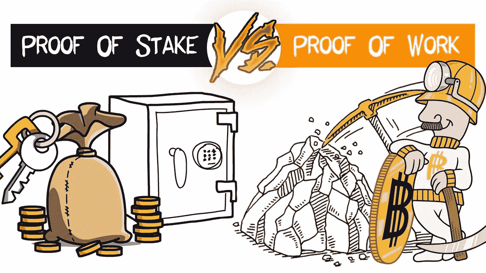

# 利益相关证明是金融革命的恰当共识

> 原文：<https://medium.com/coinmonks/proof-of-stake-is-the-appropriate-consensus-for-the-financial-revolution-6c559e223827?source=collection_archive---------4----------------------->

工作证明(PoW)和利益证明(PoS)是执行相同任务的两个不同概念。这两种方法都有其不可否认的优点和缺点。不幸的是，反对保护令的论点往往源于误解或忽视了战俘问题。让我们在本文中为 PoS 做一个案例。

# TLDR: