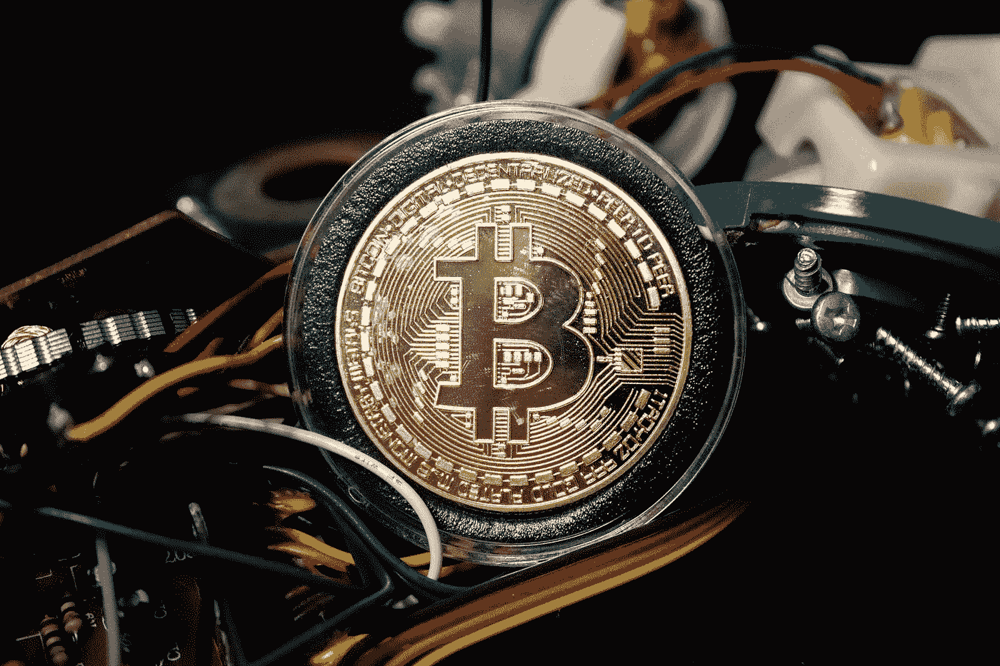
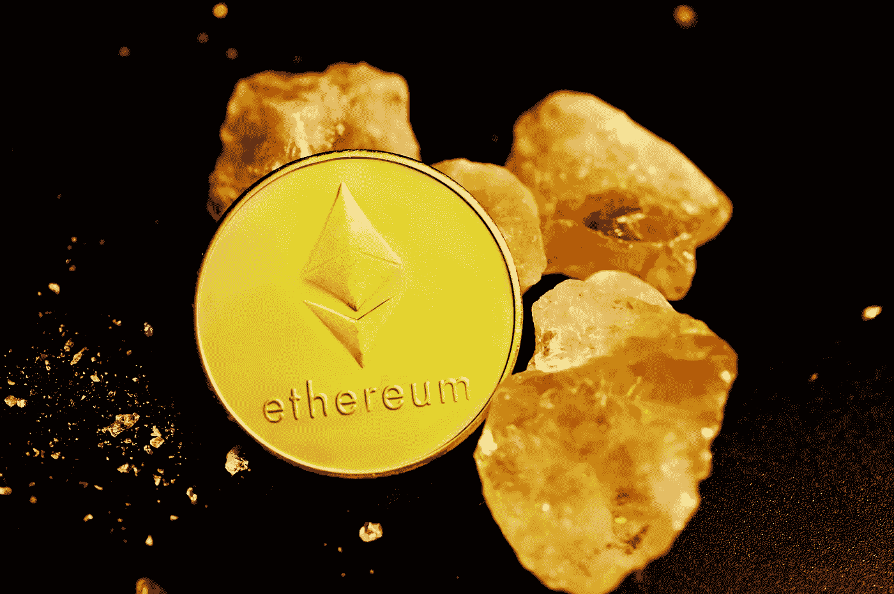

# 利害关系证明与工作证明的解释。

> 原文：<https://medium.com/coinmonks/proof-of-stake-vs-proof-of-work-explained-14737f2c4ada?source=collection_archive---------44----------------------->

Source: Unsplash.com

当中本聪创造第一种加密货币比特币时，他需要一种不依赖第三方的交易验证方式。他通过发明工作证明系统实现了这一点。

实质上，工作证明决定了区块链如何达成共识。换句话说，网络如何确定交易是合法的，并且没有人试图通过两次花费相同的资金来进行欺诈？

> **另见:** [**是什么赋予了加密货币价值？**](/@bitxmiblog/what-gives-cryptocurrencies-their-value-210c59207584)

**工作证明说明**

工作证明是基于一个被称为“密码学”的复杂数学分支。这也是比特币、以太坊等‘加密货币’被称为数字货币的原因！

密码学使用的数学方程很难求解，只有强大的计算机才能解决。因为没有两个等式是完全相同的，所以一旦解决了，网络就知道交易是合法的。

许多其他区块链基于原始比特币代码编写代码，因此也使用了工作证明方法。虽然工作证明是一个令人难以置信的发明，但它远非完美无缺。工作过程的证明消耗大量的电力；它同时处理的事务数量也极其有限。因此，开发了其他共识流程，其中利益证明模型是最受欢迎的一种。

**股权证明说明**

2012 年，斯科特·纳达尔(Scott Nadal)和桑尼·金(Sunny King)发明了股权证明。比特币推出之时，其创始人辩称，工作证明方法需要相当于 15 万美元的日常电力支出。无论如何，Peercoin 是第一个实施利益证明机制的区块链项目。最初的好处包括一个更加公平和公正的采矿系统，可扩展的交易，以及减少对电力的依赖。

**采用利害关系证明与采用工作证明**

最合理的起点是工作证明的先驱比特币区块链。每次交易发送后，网络会在大约十分钟内确认。此外，比特币区块链被限制在每秒大约 7 次交易。

因此，自 2009 年开始开采以来，交易费用大幅增加。例如，比特币的成本最初只有几分之一美分，这使得该网络对小额交易很有吸引力。然而，在 2017 年 12 月的高峰期，这一价格飙升至每笔交易 40 美元！

尽管这些费用近年来有所降低，但仍过于昂贵，不符合全球支付系统的标准。这些挑战中的大多数主要是由于证明工作的局限性而产生的。尽管如此，工作证明给比特币带来的可扩展性困难也影响了以太坊，直到最近以太坊 2.0 出现。

在此之前，以太坊区块链的最大交易容量为 15，远远低于网络的要求。随着以太坊股份证明的推出，希望它能将这一数字提高到每秒数千笔交易。

另一方面，一些非常流行的加密货币目前正在利用股权证明。其中之一是 Dash，这是一种加密货币，用户可以在几秒钟内完成转账和收款。NEO 是另一个著名的区块链，在股权证明的基础上运作。自 2016 年问世以来，中国智能合约协议取得了令人难以置信的增长，其价值提高了 100，000%以上！

> **另见:** [**帮助你入门加密货币的 6 个小技巧。**](/coinmonks/6-tips-to-help-you-get-started-with-cryptocurrencies-10a886cbec0e)

如何验证交易？

Source: Unsplash.com

正如你所料，成千上万的人利用比特币和其他基于工作的区块链证明。因此，该方法对于区块链的其他工作证明是相同的。如前所述，比特币交易在十分钟后被确认为合法。每隔 10 分钟，就会创建一个新的“块”。

每个区块包含不同的交易，必须单独确认。为了在没有第三方帮助的情况下完成这一任务，比特币网络需要有人运用他们的处理能力来解决一种加密算法，这通常被称为工作证明。

一旦完成，交易不仅被标记为真实的，而且还在公共区块链上公布，让所有人都可以看到。你可能会问，为什么有人会购买硬件并花费大量电力来帮助确认比特币交易。

简而言之，个人的工作会得到额外的比特币(或任何工作证明确认的加密货币)奖励。要记住的关键一点是，不是每个人都能获奖。成千上万个独特的设备竞相首先解决加密算法。谁先找到答案，谁就获奖。

工作证明的一个主要问题是，这是一个固有的不公平系统，因为那些拥有最强大和最昂贵的硬件设备的人总是有最好的机会获得奖励。

继续，由于密码难题的构造方式，解决它的唯一方法是通过反复试验。总的来说，硬件越强大或者你拥有的硬件设备越多，你首先完成拼图的机会就越大。

如何核实股权交易的证据？

利益证明概念有一个独特的确认交易和达成共识的机制。虽然系统继续使用加密方法，但该机制的目标已经改变。

虽然工作证明补偿矿工解决困难的方程，但利益证明根据他们的利益决定谁创造下一个区块。更简单地说，赌注由个人拥有的区块链硬币数量决定，他们试图在这些硬币上采矿。

在这里，没有街区奖励。虽然比特币的工作证明模型在新的区块得到验证时会奖励用户一个区块奖励，但为股份证明系统做出贡献的个人只能获得交易费。

首先，用户需要将他们的资金存放在一个特殊的钱包中，以便验证交易。这个钱包有效地冻结了硬币，表明它们正被押在网络上。区块链的大多数赌注证明要求最低数量的硬币开始下注，这需要相当大的初始承诺。

例如，要验证 Dash 网络上的交易，你需要冻结至少 1000 枚 Dash 硬币。这将在 2017 年 12 月加密货币的历史高点期间花费相当于 150 万美元的真实世界，当时每枚硬币超过 1500 美元。

尽管如此，如果你已经下了必要的最低赌注，你获得奖励(交易费)的几率与你拥有的硬币总数成正比。

因此，需要明确的是:

工作证明迫使所有矿工尝试解决一个困难的等式，获胜者由谁拥有最强大/数量最多的硬件设备来选择。

赌注证明机制根据下注金额随机选择获胜者。利益一致证明技术的基本理论是，利益相关的个人希望通过正确地进行交易来为网络的安全做出贡献。试图入侵网络或进行恶意交易的伪造者将失去他们的全部利益。

这就是这个模型如此有效的原因。你赌的钱越多，你赚的钱就越多。然而，你越是反抗这个制度，你就失去得越多。

> **参见:** [**不同种类的加密货币**](/coinmonks/different-kinds-of-cryptocurrencies-c935665d6bbc)

**股权证明比工作证明有什么优势？**

Source:Unsplash.com

利害关系证明模型优于工作证明模型，因为它解决了许多问题，我们现在将详细介绍这些问题。

**集中化**

作为工作证明方法的结果，集中化的公司已经购买了数千台具有最大挖掘能力的设备(称为 ASICs)。这被称为“挖掘池”，使个人能够集中他们的资源，以增加他们首先解决密码总数的机会。

结果，仅仅四个矿池(其中大部分位于中国，那里的电力很便宜)就控制了超过一半的比特币开采能力。

这是一个不公平的系统，因为它消除了普通人获得采矿奖的可能性。这就是利害关系证据的不同之处。这种方法阻止了人们仅仅为了利益而联合起来控制网络。而不是那些通过冻结他们的硬币对网络做出贡献的人根据他们的投资得到补偿。

**用电量**

根据最近的一项分析，保持比特币网络运行所需的总电量超过了超过 159 个国家的消耗量！

这不仅在环境上不可持续，也延缓了加密货币在现实世界中的普及速度。这是因为电费必须用法定货币支付！

另一方面，股权证明不需要解决过于复杂的金额，这使得验证交易的电力成本大大降低。

**51%突击**

当一个团体或个人获得超过 50%的总开采权时，就会发生 51%的攻击。如果这发生在工作证明区块链，如比特币，个人将能够修改特定的块。如果这个人是一个罪犯，他们可以改变块对他们有利。

最近，针对“边缘区块链”的攻击发生了 51 %,让黑客带走了 3500 万 XVG 货币。这相当于攻击发生时的真实价值为 175 万美元！

在采用利益相关者共识证明流程时，尝试 51%的攻击在财务上毫无意义。坏演员需要持有至少 51%的流通加密货币才能实现这一目标。他们只能在公开市场上购买硬币。

如果他们选择购买这个数量的硬币，硬币的真实价值将在这个过程中增加。因此，他们花的钱将远远超过他们从攻击中获得的收入。此外，一旦网络的其余部分明白发生了什么，坏演员将失去他们的全部股份！

**利益证明模型有哪些缺点？**

当谈到股权证明与工作证明时，一些人的第一个反对意见是，股权证明有助于富人变得更富。这是因为你买得起的硬币越多，你可以下注和赚取的硬币就越多。

请考虑以下情况。如果你有资金满足最低赌注标准(大多数个人没有)，你可以确保你的投资有很高的回报率。富人总是有最高的机会获得奖励，从而使富人更加富有。

然而，这与“工作共识证明”方法几乎相同，后者允许富有的矿工简单地购买数百个 ASIC 设备。

针对股权证明的第二个批评是，它能够验证跨几个链的交易，而工作证明则不能。这可能是一个问题，因为它将允许黑客进行双重花费攻击。

当某人将资金转移到另一方，但在交易被验证之前设法将资金花掉时，就会发生这种情况。通常情况下，当网络上的所有其他矿工意识到这一点时，这种企图就会被挫败。此外，因为工作证明允许设备在单个链上挖掘，所以不诚实的链将被直接拒绝。

另一方面，使用 Stake 架构的证明，伪造者不会因为在几个链上挖掘而受到惩罚，这可能会让一些人有效地进行双重花费。也就是所谓的“没有什么是危险的”问题。

事实上，利害关系证明与工作证明的争论总是会产生分歧。然而，考虑到最初挖掘以太坊的方法已经更新，很明显哪个过程更好。

> 加入 Coinmonks [电报频道](https://t.me/coincodecap)和 [Youtube 频道](https://www.youtube.com/c/coinmonks/videos)了解加密交易和投资

# 另外，阅读

*   [交易信号是什么？](https://coincodecap.com/trading-signal) | [Bitstamp vs 比特币基地](https://coincodecap.com/bitstamp-coinbase) | [买索拉纳](https://coincodecap.com/buy-solana)
*   [ProfitFarmers 回顾](https://coincodecap.com/profitfarmers-review) | [如何使用 Cornix Trading Bot](https://coincodecap.com/cornix-trading-bot)
*   [十大最佳加密货币博客](https://coincodecap.com/best-cryptocurrency-blogs) | [YouHodler 评论](https://coincodecap.com/youhodler-review)
*   [MyConstant Review](https://coincodecap.com/myconstant-review) | [8 款最佳摇摆交易机器人](https://coincodecap.com/best-swing-trading-bots)
*   [MXC 交易所评论](/coinmonks/mxc-exchange-review-3af0ec1cba8c) | [Pionex vs 币安](https://coincodecap.com/pionex-vs-binance) | [Pionex 套利机器人](https://coincodecap.com/pionex-arbitrage-bot)