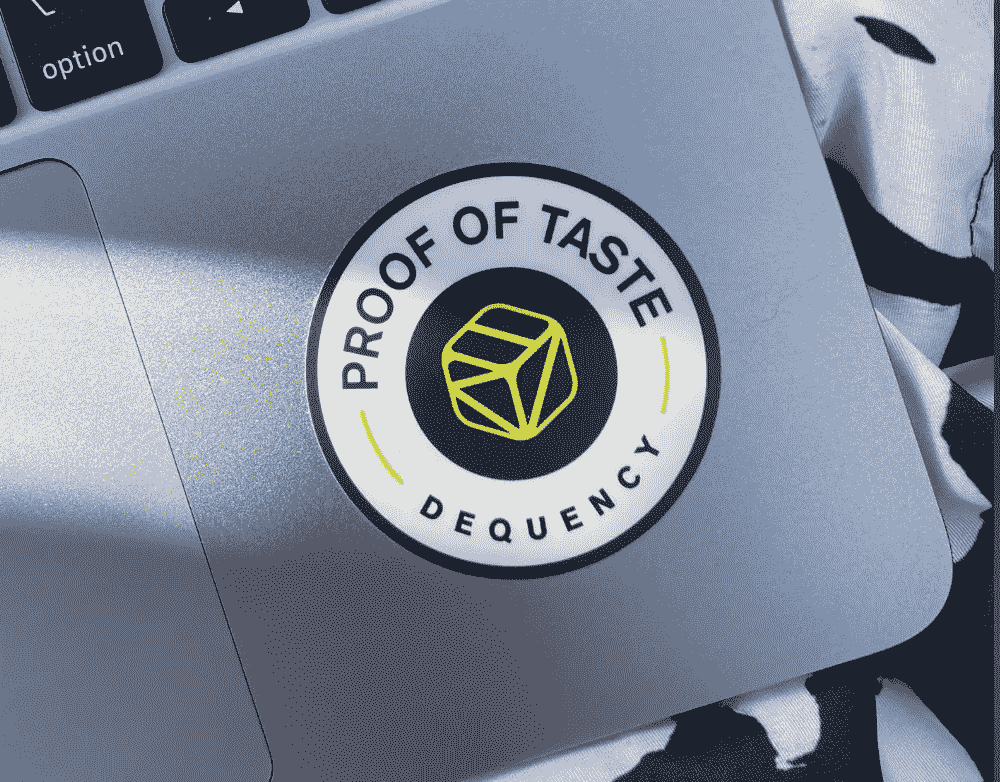

# 品味的证明:Dequency 更新 3/4/22

> 原文：<https://medium.com/coinmonks/proof-of-taste-dequency-update-3-4-22-d40fea0edd6e?source=collection_archive---------11----------------------->

*欢迎来到我们每周一期的新闻简报，在这里我们尽最大努力在公众面前展示。订阅成为第一个听到产品发布、公司新闻、硬币新闻(👀)，以及其他重要更新。前进！*

# 你觉得你有品味吗？证明一下。

上周，我们发布了我们的[精简版白皮书](https://dequency.notion.site/Dequency-Lite-Paper-321346b65f6c40aebf36445553944315)，这是我们更具技术性的白皮书的“小吃”版本(我们将在今年晚些时候发布；你会先看到白皮书，然后再看到令牌，所以请冷静地思考“我愿意吗？”).在 Lite 白皮书中，我们介绍了我们的口味验证协议，这是支持 Dequency 生态系统的基本引擎。

**该协议的最终目标是逐步去中心化，这意味着总部不再是平台的看门人；社区是。**对于艺术家来说，这意味着如果你的音乐吸引了众多参与共识协议的“时尚引领者”,你的歌曲可能更有可能被发现并获得许可。这意味着社区可以参与上传的音乐，并积极管理平台，以改善用户的许可体验(并因此获得独特的奖励)。如果我们以一种集中的方式来做这件事，那么你必须吸引我(或者负责一个& R 的执行官)…而现在，我只对 [slimecore 吐步](https://www.youtube.com/watch?v=HanBb8FonWs) & [小丑 core](https://www.youtube.com/watch?v=6Gha9xrM10w) 艺术家感兴趣。

If the last joke missed you, check the twitter thread above for a “best of” list of musical subgenres (and while you’re there, reply with your own faves!)

# 这场革命将由硬币操纵

大规模的质量控制是如何激励社区成员(“品味制造者”)的一个关键考虑因素，他们通过完成最终提高可用于同步的音乐质量的任务来获得效用令牌，并提高用户为其项目定位完美曲目的能力。

从[简装纸](https://dequency.notion.site/Dequency-Lite-Paper-321346b65f6c40aebf36445553944315):

> 品位创造者可以通过各种目录管理机会获得代币，例如播放列表的创建，以及音乐上传过程中的质量控制检查。时尚创造者受到激励，提供准确的数据和周到的反馈，因为他们的收入基于公众对他们管理目录以实现最高质量和可用性的能力的共识。

Folks who hung with us at ETHDenver might recognize these stickers! If you missed out: I’ll send an envelope with a few stickers to the first 10 people who tweet a link to this article ;)

# 「侵权」是否暗示「外圈」的存在？无论如何，这一段是关于版权侵权的政策。

所以，我们已经谈了一些关于音乐如何保持高质量和可发现性的问题…但是我们如何知道什么是真正合法的许可呢？如果某个混蛋从 Spotify 上下载了一大堆音乐，然后把它们放到 Dequency 上，希望某个可怜的不知情的艺术家会试图从一个未经证实的账户授权一个油炸版的“Paint it Black ”,天真地认为滚石乐队正在出售 50 美元的同步许可证？

基本上每个允许个人上传内容的平台都存在侵犯版权的问题。从 YouTube 到抖音再到 SoundCloud，人们正在使用他们不拥有的艺术品。有时它就像个人博客上一张漂亮照片的截图一样单纯，但其他时候它是一种从别人所有的艺术品中获利的协同努力。虽然解决整个互联网的版权侵权问题超出了这篇 lil '博客文章的范围，但我还是想介绍一下 Dequency 采取的基本措施，以防止许可方上传他们不拥有的音乐:

1.  该系统必须要求音乐上传者提供身份证明(对不起，但这是一个例子，一个小 KYC 走了很长的路)和所有权。他们将通过提供所有版权信息并签署数字担保来承认他们对音乐的控制。
2.  此外，用户为新上传的音乐提供的版权信息将通过编程方式对照公共演出组织数据库进行检查。音乐版权所有者必须在上传被批准前解决任何发现的差异。
3.  最后，作为口味验证协议的一部分，社区成员将被激励参与新上传的质量控制检查，以帮助识别版权侵权。

感谢跟随会议。通过[点击测试版](https://dequency.io/)加入社区(购买 NFT 同步许可证！)和[跳进我们的不和](https://discord.gg/Vqu5ZHWz2x)，我们放下阿尔法，实时回答问题，甚至在我们感觉慷慨的时候听你的混音带。星期五快乐！

-团队解散