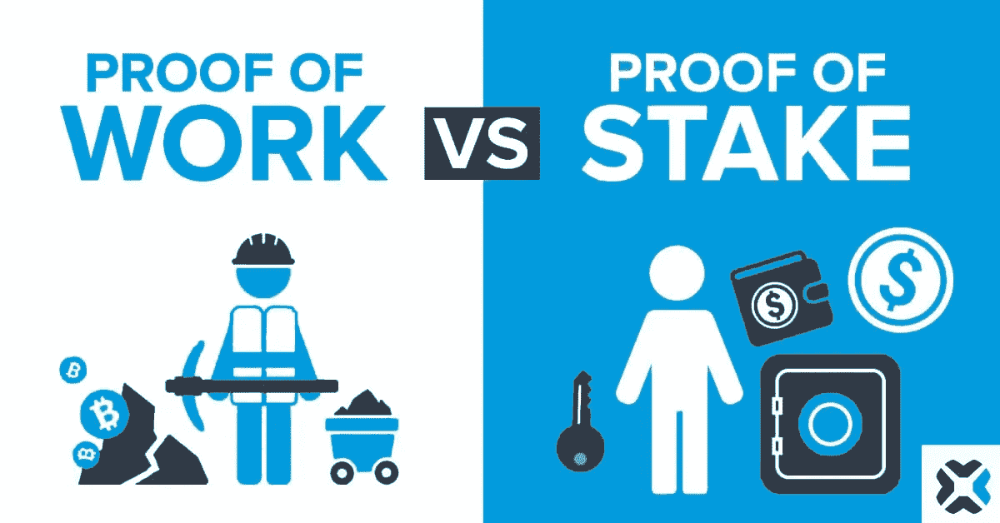

# 工作证明(PoW)与利益证明(PoS)

> 原文：<https://medium.com/coinmonks/proof-of-work-pow-vs-proof-of-stake-pos-203c24834e71?source=collection_archive---------14----------------------->

在了解 PoW 和 PoS 的区别之前，我们先了解一下共识是什么意思？

## 什么是共识？

想象一下，有 10 个朋友，你打算看一部电影，但有两部电影可供选择，你只能看一部。所以大家一致同意的最佳方法是“ ***多数胜*** ”。举个例子:如果 10 个人中有 7 个人给电影 1 投票，那就意味着这 10 个人都会去看电影 1。这只不过是一个共识的典型例子，在这个例子中，互不信任的不同党派共同决定什么是正确的，什么是下一步。

## 工作证明

工作证明(PoW)是比特币运作的共识机制。它最初是为了对抗垃圾邮件而开发的。在 PoW，我们有使用特殊硬件和电力解决复杂数学问题的**矿工**。这些数学问题可以比作一个难题。谁先解决这个难题，谁就有机会开采区块链的下一个区块，其他矿工验证它，一个新的区块就形成了。开采区块的矿工获得当前区块的交易费和区块奖励——即 **6.25 比特币**。

## 利害关系证明

为了克服工作证明的缺点，2011 年提出了利益证明。矿工被**验证者**取代，采矿力量被赌注的代币数量取代。一个验证者是随机选择的，也是通过添加他们下注的令牌量来挖掘下一个块。为了让验证者更加负责，PoS 引入了对有害行为进行惩罚的删减。PoS 共识还支持链上治理，授权者可以对与协议或项目相关的提案进行投票。一般来说，要成为委托人需要下注的最小金额，就像即将到来的 ETH 2.0 信标链中的 **32 ETH** 。如果验证程序想要取消令牌的授权，他们可能需要等待一段时间才能完全收回令牌。

## **谁是那个**

哪个更好没有完美的答案，完全取决于用例。我可以列出一些主要差异，您可以决定哪一个最适合您的用例。

1.  在 PoW 的情况下，大部分电力消耗在计算散列上，而在 PoS 中不需要这种机制，它完全基于用户标记令牌。
2.  另一个区别是，在 PoW 的情况下，新令牌是在每个新块之后“*”生成的，但在 PoS 的情况下，令牌是“*预先生成的”，并通过 ICO、IDO 或 airdrop 分发。**
3.  **PoW 为任何人提供了参与的自由，但是在 PoS 的情况下，只有具有最小象征性股份的验证者可以参与。**
4.  **权力很难操纵，而在 PoS 中，任何人都可以购买大量代币并对提案进行投票，然后扔掉代币。**
5.  **由于分散化，power 中交易速度较慢，而 PoS 由于验证器数量较少且更加集中，因此速度更快。**

**感谢阅读！**

> **加入 Coinmonks [电报频道](https://t.me/coincodecap)和 [Youtube 频道](https://www.youtube.com/c/coinmonks/videos)了解加密交易和投资**

# **另外，阅读**

*   **[Bookmap 点评](https://coincodecap.com/bookmap-review-2021-best-trading-software) | [美国 5 大最佳加密交易所](https://coincodecap.com/crypto-exchange-usa)**
*   **最佳加密[硬件钱包](/coinmonks/hardware-wallets-dfa1211730c6) | [Bitbns 评论](/coinmonks/bitbns-review-38256a07e161)**
*   **[新加坡十大最佳加密交易所](https://coincodecap.com/crypto-exchange-in-singapore) | [购买 AXS](https://coincodecap.com/buy-axs-token)**
*   **[红狗赌场评论](https://coincodecap.com/red-dog-casino-review) | [Swyftx 评论](https://coincodecap.com/swyftx-review) | [CoinGate 评论](https://coincodecap.com/coingate-review)**
*   **[投资印度的最佳密码](https://coincodecap.com/best-crypto-to-invest-in-india-in-2021)|[WazirX P2P](https://coincodecap.com/wazirx-p2p)|[Hi Dollar Review](https://coincodecap.com/hi-dollar-review)**
*   **[加拿大最佳加密交易机器人](https://coincodecap.com/5-best-crypto-trading-bots-in-canada) | [库币评论](https://coincodecap.com/kucoin-review)**