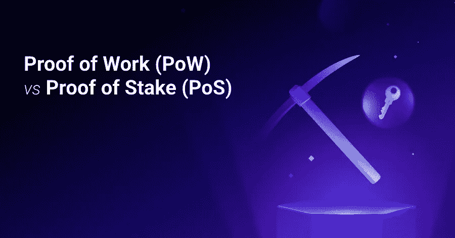
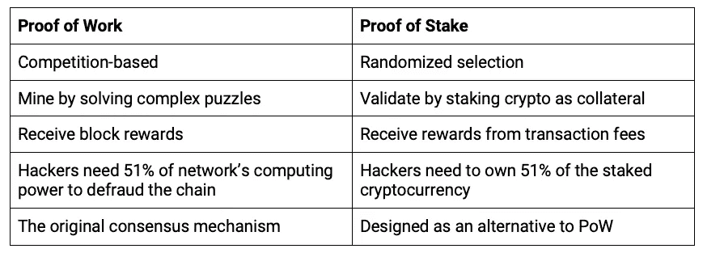

# 工作证据与利益证据:你需要知道的

> 原文：<https://medium.com/coinmonks/proof-of-work-vs-proof-of-stake-what-you-need-to-know-1dec9cd69c8a?source=collection_archive---------18----------------------->

●工作证明(PoW)要求矿商解决复杂的数学难题，以验证区块链上的新交易。他们收到新生成的硬币作为奖励。
●赌注证明(PoS)随机选择已下注硬币的验证者来验证新交易。他们收取交易费作为报酬。

想知道工作证明(PoW)和利益证明(PoS)机制是如何发挥作用的吗？首先，我们应该了解区块链是如何运作。

# **什么是区块链？**

区块链是一个数字化、分散的公共数据库。数据存储在集合中，或者我们称之为块，并串成一条链。因此得名“区块链”。随着更多的事务发生，更多的数据和更多的块被添加到链中。

比特币的化名创始人中本聪在发明比特币时实现了第一个区块链。区块链本来是硬币的公共交易分类账。从那时起，加密技术的创新迅速推动了区块链技术的发展。

由于区块链被设计成没有中央权威并且是分散的，它需要许多参与者来验证在其上发生的交易。这就是共识机制的用武之地。

# **共识机制**

本质上，共识机制是参与者遵循的一组规则，以使分布式系统能够协同工作并保持安全。在这种情况下，共识机制有助于决定如何以及验证哪些交易。今天，两个最流行的共识机制是 PoW 和 PoS。

共识机制也有助于防止网络攻击。通常，如果攻击者控制了 51%的网络，他们就可以破坏共识。因此，共识机制通常旨在使这一点变得不可能，或者至少不切实际。

利用 PoW 的区块链的例子有比特币、以太坊 1.0 和莱特币。利用 PoS 的区块链的例子有 Cardano、Polkadot 和 aspiring Ethereum 2.0。

# **功率和位置的主要区别**

# **动力**

●矿工们竞相解决复杂的计算难题。它们通常需要具有大处理能力的昂贵设备来实现。
●第一个解决难题的矿工赢得验证新交易并向区块链添加新区块的机会。
●成功为区块链增加一个街区后，他们还会获得一个街区奖励。方块奖励大多由新生成的硬币组成。
●黑客需要 51%的网络计算能力来成功地破坏共识和攻击链条。
● PoW 是比特币网络上实现的共识机制。因此，它在较老的网络中被广泛使用。

# **位置**

●相比之下，在 PoS 中，网络成员将加密作为抵押品，以赢得验证块的机会。他们被称为“验证者”。
●然后随机选择验证器来验证块。当特定数量的验证器验证该块是准确的时，它被添加到区块链中。
●验证者从交易费用中获得奖励。
●黑客需要拥有 51%的赌注加密货币才能成功妥协。
● PoS 是一种低成本、高能效的共识机制。

# **战俘的利与弊**

优点
●矿块奖励通常高于交易费奖励
●更高的安全等级；仅仅为了攻击像比特币这样的大型网络而在硬件和能源上进行巨额投资是不切实际的

缺点
●高能耗
●普通用户可能无法获得，因为 power 需要昂贵硬件
●较长的处理时间
●较小的 power 网络可能不太昂贵

# **PoS 的利弊**

优点
●黑客需要拥有网络上至少 51%的加密技术；通常不可行
●更节能；不需要设备
●不需要技术经验；普通用户可以参与

缺点
●鼓励囤积密码
●交易费用的奖励通常低于批量奖励
●密码将在赌注期间被锁定

# **结论**

PoW 和 PoS 是在加密和区块链环境中广泛使用的两种不同的共识机制。在当今重视气候的世界里，PoS 通常被认为更节能，因为它不需要很大的计算能力。与 PoW 相比，它还减少了处理时间。

采用 PoS 的一个突出例子是以太坊。以太坊 1.0 是一个 PoW 模型，目前[正在向以太坊 2.0 转移，以太坊 2.0 是一个 PoS 模型](https://ethereum.org/en/developers/docs/consensus-mechanisms/pos/)，理由是迫切需要减少以太坊的碳足迹并更有效地扩大规模。

> 加入 Coinmonks [电报频道](https://t.me/coincodecap)和 [Youtube 频道](https://www.youtube.com/c/coinmonks/videos)了解加密交易和投资

## 也阅读

 [## 杠杆代币[多头代币]终极指南

### 杠杆化令牌是具有杠杆化风险敞口的 ERC20 令牌，不考虑保证金、要求、管理…

medium.com](/coinmonks/leveraged-token-3f5257808b22)  [## 最佳加密交易所| 2022 年十大加密货币交易所| CoinCodeCap

### 哪一个是最好的加密交换？在本文中，我们将根据多种加密货币列出 10 大加密货币交易所

coincodecap.com](https://coincodecap.com/crypto-exchange)  [## 2022 年 2 月值得关注的三大游戏代币| CoinCodeCap

### 排名前 3 位的游戏也占交易总量的 85%以上。Defi 王国、Axie Infinity 和 Pegaxy…

coincodecap.com](https://coincodecap.com/top-3-gaming-tokens-to-look-out-for-in-february-2022)  [## 2022 年最佳加密交换平台| CoinCodeCap

### 随着时间的推移，我们大多数人将转向 dex 以获得更好的安全性和隐私。因此。在这里，我们将讨论…

coincodecap.com](https://coincodecap.com/best-swap-platforms)  [## 10 大最佳在线赌场|赢得并赢取免费 BTC 2022 | CoinCodeCap

### 接收、支付和赚取加密货币| |有各种各样的最佳在线赌场可供选择，有可能…

coincodecap.com](https://coincodecap.com/best-online-casinos)  [## 2021 年最佳加密借贷平台| 6 大比特币借贷平台

### 获得比特币和其他加密货币的最佳贷款利率

medium.com](/coinmonks/top-5-crypto-lending-platforms-in-2020-that-you-need-to-know-a1b675cec3fa)  [## 2021 年 6 大最佳硬件钱包|顶级加密硬件钱包[更新]

### 最好的加密货币硬件钱包是绝对必要的。我们将在 NGRAVE、Ledger Nano X 和…

medium.com](/coinmonks/the-best-cryptocurrency-hardware-wallets-of-2020-e28b1c124069)  [## 加密交易机器人——19 款最佳免费加密交易机器人

### 2022 年币安、比特币基地、库币和其他密码交易所的最佳密码交易机器人。四进制，位间隙…

medium.com](/coinmonks/crypto-trading-bot-c2ffce8acb2a)  [## 最佳 4 个加密交易信号电报通道

### 这是乏味的找到正确的加密交易信号提供商。因此，在本文中，我们将讨论最好的…

medium.com](/coinmonks/best-crypto-signals-telegram-5785cdbc4b2b)