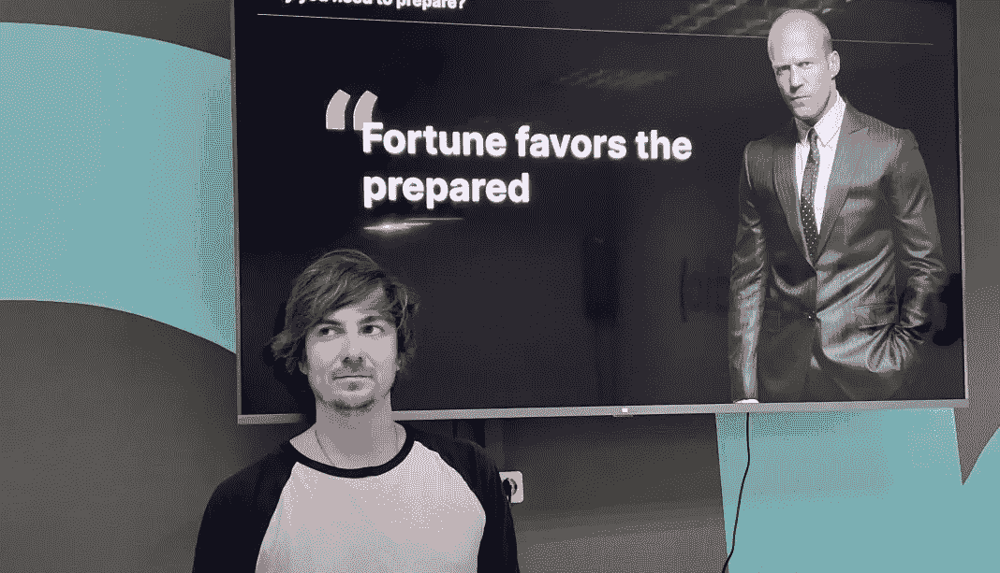

# 恰当的展示

> 原文：<https://medium.com/coinmonks/property-presentation-f5126c632227?source=collection_archive---------55----------------------->

上周五，我们的设计师 Viktor 为 [Crypton Studio](https://crypton.studio) 的员工举办了一场教育会议，主题是“[恰当的展示](https://crypton.studio/blog/Property-Presentation)”。这种聚会对经常在工作中处理演示文稿的员工很有用。

## 会议的主要议题是:

–你为什么需要演示？

–为什么要准备演示文稿？

–怎么做？

# 员工感兴趣的是:

–一场精彩的演讲能挽救一场糟糕的表演吗？(剧透警报—否)；

–演示设计的规则是什么？(剧透警告——都不是)。

期待下一次聚会！

> 加入 Coinmonks [电报频道](https://t.me/coincodecap)和 [Youtube 频道](https://www.youtube.com/c/coinmonks/videos)了解加密交易和投资

# 另外，阅读

*   [有哪些交易信号？](https://coincodecap.com/trading-signal) | [Bitstamp vs 比特币基地](https://coincodecap.com/bitstamp-coinbase) | [买索拉纳](https://coincodecap.com/buy-solana)
*   [加密交易机器人](/coinmonks/crypto-trading-bot-c2ffce8acb2a) | [维护审查](https://coincodecap.com/uphold-review)
*   [如何给 MetaMask 钱包添加 Arbitrum？](https://coincodecap.com/how-to-add-arbitrum-to-metamask-wallet)
*   [KuCoin vs 北海巨妖 vs BitYard](https://coincodecap.com/kucoin-vs-kraken-vs-bityard)
*   [加密交易的最佳 VPN](https://coincodecap.com/best-vpns-for-crypto-trading)
*   [ProfitFarmers 回顾](https://coincodecap.com/profitfarmers-review) | [如何使用 Cornix Trading Bot](https://coincodecap.com/cornix-trading-bot)