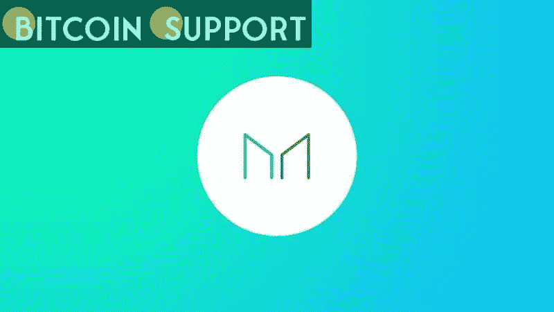
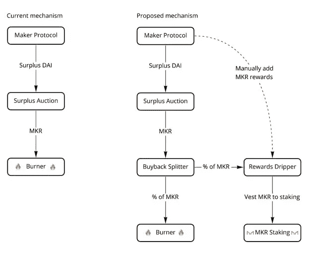

# 马克尔岛社区提议取代 MKR 作为治理标志

> 原文：<https://medium.com/coinmonks/proposal-from-the-makerdao-community-to-replace-mkr-as-the-governance-token-9c49407982f3?source=collection_archive---------41----------------------->

**Visit our website:-** [**https://bitcoinsupports.com/**](https://bitcoinsupports.com/)

这一想法建议创造一种新的 stkMKR 令牌，作为 MKR 参与治理倡议的一种结合资产。MakerDAO 的分散化 stablecoin 平台正在考虑一个重大的象征性经济转变，可能会看到其治理象征 MKR 被逐步淘汰。

3 月 14 日，社群领袖“monet-supply”在 MakerDAO 论坛上发布了一份提案，提出了一个替代的代币经济系统。如果提案通过全面治理投票，该协议可以用名为 stkMKR 的新令牌取代现有的治理令牌 MKR。

这个想法在发布后的几个小时内就收到了大量的回复，其中大多数都是积极的，并且集中在解决方案的技术方面。然后，它必须以制造商改进提案的形式提交给 MKR 股东进行正式投票，通常需要两周时间。当前的令牌组学范例运行在“回购和烧毁”机制上，具有一些缺陷和低效，而赌注解决方案克服了这些缺陷和低效。据“monet-supply”称，现有的流程存在多种缺陷，包括缺乏针对性的激励措施，因为回购和燃烧会将所有资金返还给 MKR 持有者。根据“monet-supply”的说法，还有一个“糟糕的加密叙述”，MKR 发行可能会被用来改善系统。现有制度对攻击治理或操纵投票的威慑也有限。

https://twitter.com/MakerDAO/status/1503442920799670274

提议的解决方案是一种新的 stkMKR 硬币，它将取代 MKR 成为马克尔道的基本治理标志。对于出于治理目的而存放货币的 MKR 持有者来说，它将起到一种赌注或债券的作用。

**“stkMKR 不可转让，代表 MKR 执政。”赌注令牌持有者将获得一部分通过剩余拍卖购买的 MKR 令牌，确保随着时间的推移，stkMKR 得到越来越多 MKR 的支持。”**

**Visit our website:-** [**https://bitcoinsupports.com/**](https://bitcoinsupports.com/)

根据 Monet-supply 的说法，奖励程序已经修改，利用新系统将有更多的奖励。

用户可以使用 MakerDAO 存放加密资产作为抵押，生成分散的稳定币 DAI。该信息随后可用于其他 DeFi 协议或流动性池。当“贷款”还清，抵押品被取走，戴就被烧掉了。

据 CoinGecko 报道，在本文撰写之时，MKR 价格仍维持在 1766 美元不变。然而，该令牌在过去两周下跌了 11%，目前比 2021 年 5 月的历史高点 6292 美元下跌了 72%。

**访问我们的网站:-**[**https://bitcoinsupports.com/**](https://bitcoinsupports.com/)

**免责声明:这些是作者的观点，不应被视为投资建议。读者应该自己做研究。**

> 加入 Coinmonks [电报频道](https://t.me/coincodecap)和 [Youtube 频道](https://www.youtube.com/c/coinmonks/videos)了解加密交易和投资

# 另外，阅读

*   [分散交易所](https://coincodecap.com/what-are-decentralized-exchanges) | [比特 FIP](https://coincodecap.com/bitbns-fip) | [Pionex 评论](https://coincodecap.com/pionex-review-exchange-with-crypto-trading-bot)
*   [用信用卡购买密码的 10 个最佳地点](https://coincodecap.com/buy-crypto-with-credit-card)
*   [最好的卡达诺钱包](https://coincodecap.com/best-cardano-wallets) | [Bingbon 副本交易](https://coincodecap.com/bingbon-copy-trading)
*   [印度最佳 P2P 加密交易所](https://coincodecap.com/p2p-crypto-exchanges-in-india) | [柴犬钱包](https://coincodecap.com/baby-shiba-inu-wallets)
*   [八大加密附属计划](https://coincodecap.com/crypto-affiliate-programs) | [eToro vs 比特币基地](https://coincodecap.com/etoro-vs-coinbase)
*   [最佳以太坊钱包](https://coincodecap.com/best-ethereum-wallets) | [电报上的加密货币机器人](https://coincodecap.com/telegram-crypto-bots)
*   [交易杠杆代币的最佳交易所](https://coincodecap.com/leveraged-token-exchanges) | [购买 Floki](https://coincodecap.com/buy-floki-inu-token)