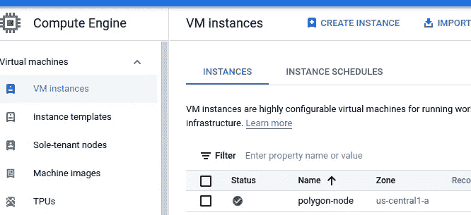

# 作为套利交易者运行多边形节点的利弊

> 原文：<https://medium.com/coinmonks/pros-and-cons-of-running-a-polygon-node-as-an-arbitrage-trader-743822112fb?source=collection_archive---------0----------------------->

## 2 个月后运行多边形节点的思考

Google Cloud console - Compute Engine

# 摘要

*   运行您的多边形节点可以为您提供更快的响应速度、无限制的速率和无限数量的请求。
*   运行一个节点的成本是每月 470 美元。
*   没有…也有可能盈利