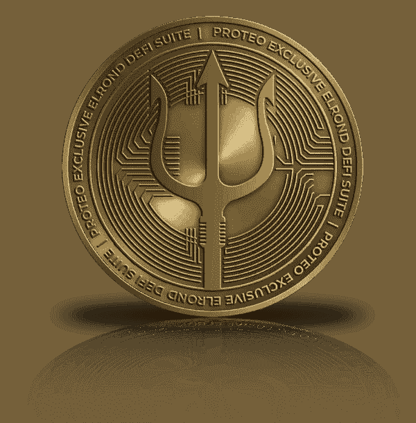

# 埃尔隆德网络上的 proteo DeFi-DEX

> 原文：<https://medium.com/coinmonks/proteo-defi-dex-on-elrond-network-75ac83decb24?source=collection_archive---------9----------------------->

什么是蛋白质？，它的目的是什么，这个产品能给我们作为用户带来什么价值？但是要回答这些问题，首先，什么是 De fi，它意味着什么？

简而言之，De Fi 或分散金融是一个新的、透明的、不受审查的、没有中介的全球金融生态系统，易于访问，每个用户都可以完全控制自己的资产。

分散融资的目标是为所有现有金融服务的集中融资提供一个全球透明的替代方案。这些金融工具把选择权还给消费者。

现在，回到我们的第一个问题，Proteo 是一个 DEX，或者说是一个去中心化的交易所，它是为了解决腐败、通货膨胀或税收等中央经济问题而诞生的，利用了加密货币、区块链和 DeeFi 提供的解决方案，提供了一种具有非常有趣特征的加密货币。作为一个括号，您可以在右上角找到我们的视频，它解释了什么是分散式交换以及它与集中式交换的区别。

Proteo 是一种富有远见的 DeFi 加密货币，是埃尔隆德的先驱，其发行设计、供应和代币燃烧代表了经济的解决方案，并提供了在加密货币世界中获得更公平收入的机会。

它是一种数字资产，很容易与另一种能够创造收入来源的加密资产交换，如使用自动股权池的绿色采矿和流动性采矿等。Proteo 是一个去中心化的交换，和 Maiar 交换一样，你可能想知道当你已经有 Maiar 的时候，为什么还要使用 Proteo？

嗯，Proteo DeFi 架构的一个关键设计点是，他们使用 Maiar DEX 流动性池，而不是他们自己的。

通过这种方式，Proteo 将增加价值，而不是争夺流动性。一个项目将在 Maiar DEX 中有一个 LP 令牌，两个农场都可用:用户可以选择在 Maiar DEX 上赚取 MEX 或在 Proteo DeFi 上赚取 PROTEO。

这将导致双方更高的年利率以及更高的总流动性。更多的流动性意味着更少的价差，这反过来意味着买卖更有效。Proteo 的设计并不是为了与 Maiar DEX 的创新竞争，但正如他们在自己的网站上所说，他们是来补充这些创新的。他们的财政部将永远信任和利用墨西哥和 EGLD 的资产。那么，让我们来看看 Proteo 是如何补充 Maiar DEX 的:

PROTEO 是埃尔隆德独有的 DeFi 套件，利用 Maiar DEX 的稳健性来执行操作。它为投资者提供了新的产品，扩大了 DEX 的可能性，为 DEX 已经建立的坚实工具增加了价值。该项目的一些要点是:

道蛋白缺乏。它将在埃尔隆德网络中进行第二次分散互换，补充 Maiar DEX，加强生态系统，并提供有吸引力的 DeFi 产品，从而增加埃尔隆德生态系统的流动性。它还将成为埃尔隆德网络中不同令牌的登陆平台，促进对 DAO 的访问，在 DAO 中，参与者可以利用所有服务并交换生态系统中其他资产的 PROTEO。

PROTEO 允许用户访问数字资产的几个收入来源，并通过 sPROTEO token 参与管理。

为了使这一切成为可能，PROTEO DeFi 建立了一个金库来管理和发展 DAO 的资金，包括 PROTEO、LP PROTEO-EGLD、LP PROTEO-MEX、LP EGLD-MEX 和 LP EGLD -USDC 代币。

sPROTEO 持有者将能够就管理和蛋白燃烧提出建议。

还有一个关键点是，Proteo DAO 平台会为 EGLD 或 MEX 发售 Proteo 债券，让投资者折价购买。

这是一种策略，财政部向用户提供 PROTEO 折扣和 10 天到期的复利 APY。

一个重要的关键也是赌注，它指的是锁定代币的投资机制，以便从新 PROTEO 的动态发行中获得回报，每天发行代币的 APR。

Proteo 自动赌注池将允许您自动复合。这意味着，你的蛋白质化合物，不需要你做任何事情，自动。你在这个过程中节省了时间和费用。

因此，Proteo DeFi 将是一个具有通缩发行模式的更安全的分散融资平台。此外，在存放 PROTEO 时，用户将获得 sPROTEO 令牌作为备份。通过使用 sPROTEO 令牌作为投资者参与 PROTEO-sPROTEO 池的等价物，它不仅允许访问 Proteo DeFi DAO 治理。

这将使道更安全，投资者将获得每日发行代币的收益。APY 是通过智能合约计算的，该合约根据每日发行的代币分配利润。

因此，收益率的百分比将每天计算，其收益将与平台中锁定的令牌数量成比例。

在 PROTEO DeFi 中，用户可以轻松、即时地将 PROTEO 与埃尔隆德网络生态系统中的其他代币进行交换，从而在生态系统中创造经济，并提供一种机制，帮助区块链开发商推广代币，为他们的用户创造更多收益，同时为埃尔隆德网络生态系统中的代币交换提供替代解决方案。

此外，通过使用区块链技术和智能合同，PROTEO DeFi 将为其用户提供通过 sPROTEO token 获得加密货币贷款的机会，如 EGLD。

使用 NFT 清算人，用户将能够快速接收和支付贷款，这些贷款产生的利息将直接进入贷款钱包，以提高收益率和资本化。

基本上，你可以用 sPROTEO 作为抵押来申请贷款。当你享受新借入的资金时，你继续增加你的蛋白持有量。

该项目的另一个前景是双重耕作，这是一种奖励参与的机制，流动性提供者获得 2 个密码而不是 1 个，作为对他们流动性的奖励。在这种情况下，LP 将通过以下方式获得奖励:

首先，有限合伙人从这两个代币中收取部分交易费用。这些奖励在每天不同的时间间隔支付，并在 LP 的位置上自动计算。它们在资产池的两种资产中支付。

根据 Proteo DeFi 的活动，在提供流动性后，有限合伙人存放他们的有限合伙人代币，以赚取 PROTEO 和来自不同埃尔隆德项目的代币。

对于持有者来说，这是一个增加外汇储备的好方法。

双重奖励可以通过增加集团 APY 来提高流动性提供者的收益率。以两种数字货币获得的奖励可以为有限合伙人提供更大的资产多样化，并有可能降低波动性。

按照他们的路线图，你可以在他们的网站上找到它，所有的里程碑应该在明年年初实现。

这是一个有前途的项目，我们想向你强调，在投资之前，你要做好自己的研究。

本文提供的所有信息都来自他们的官方网站，以及他们的白皮书。

谢谢你看完。下次见，管好你的钱！

**|** [**网站**](https://www.b-successful.com/)**|**[**YouTube**](https://www.youtube.com/channel/UCWrfC_w5wVnrOr8jy0ICoDw)**|**[**推特**](https://twitter.com/BSuccessful_)**|**[**insta gram**](https://www.instagram.com/bsuccessful.crypto/)**|**[**电报**](https://t.me/+NQbP3V_iaKQwMDYy) **|** [**脸书**](https://www.facebook.com/Bsuccesful/?_rdc=2&_rdr)

> 加入 Coinmonks [电报频道](https://t.me/coincodecap)和 [Youtube 频道](https://www.youtube.com/c/coinmonks/videos)了解加密交易和投资

# 另外，阅读

*   [分散交易所](https://coincodecap.com/what-are-decentralized-exchanges) | [比特恩斯 FIP](https://coincodecap.com/bitbns-fip) | [宾邦评论](https://coincodecap.com/bingbon-review)
*   [用信用卡购买密码的 10 个最佳地点](https://coincodecap.com/buy-crypto-with-credit-card)
*   [加拿大最佳加密交易机器人](https://coincodecap.com/5-best-crypto-trading-bots-in-canada) | [Bybit vs 币安](https://coincodecap.com/bybit-binance-moonxbt)
*   [阿联酋 5 大最佳加密交易所](https://coincodecap.com/best-crypto-exchanges-in-uae) | [SimpleSwap 评论](https://coincodecap.com/simpleswap-review)
*   购买 Dogecoin 的 7 种最佳方式 | [ZebPay 评论](https://coincodecap.com/zebpay-review)
*   [最佳期货交易信号](https://coincodecap.com/futures-trading-signals) | [流动性交易所评论](https://coincodecap.com/liquid-exchange-review)