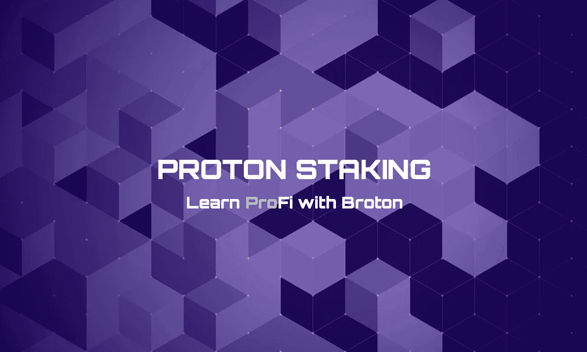
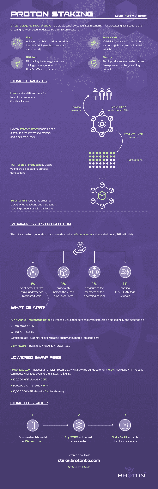

# 信息图表中的质子:赌注

> 原文：<https://medium.com/coinmonks/proton-in-infographics-staking-db59a8e8c63d?source=collection_archive---------56----------------------->

## 跟 Broton 学 ProFi

你们中的大多数人肯定听说过 *DeFi(分散金融)* —这是加密领域的一个既定名称，意思是在没有任何中央中介机构的情况下运行的金融服务，如银行或传统金融中的其他金融机构。

在宝腾，我们称之为 *ProFi* *【专业金融】* —由于宝腾区块链的独特性及其特点，我们希望通过这种方式强调全新水平的 DeFi 服务。

通过这张信息图，我们以直观的形式回答了关于宝腾的最受欢迎的问题:

*   什么是 dpo(或者说赌注来自哪里)？
*   赌注是如何运作的？
*   谁是块生产者，他们的角色是什么？
*   为什么下注时我必须投票？
*   奖励从何而来？
*   通货膨胀率是多少？
*   什么是年利率，它是如何计算的？

此外，您可以[下载](https://brotonbp.com/infographics/stake)该信息图的 PDF 版本，并在我们的网站上阅读详细的[标桩手册](https://brotonbp.com/tpost/hsby5x3901-how-to-stake-xpr-and-vote-for-block-prod)。

要了解更多关于质子和不要错过重要的更新，我们建议你:

*   跟随我们的媒体页面
*   [在 Twitter 上关注我们](https://twitter.com/brotonbp)
*   [加入我们的电报组](https://t.me/brotonbpgroup)

此外，你可以在我们的网站上看到入门指南，快速浏览宝腾。

> 加入 Coinmonks [电报频道](https://t.me/coincodecap)和 [Youtube 频道](https://www.youtube.com/c/coinmonks/videos)了解加密交易和投资

# 另外，阅读

*   [ProfitFarmers 点评](https://coincodecap.com/profitfarmers-review) | [如何使用 Cornix 交易机器人](https://coincodecap.com/cornix-trading-bot)
*   [如何匿名购买比特币](https://coincodecap.com/buy-bitcoin-anonymously) | [比特币现金钱包](https://coincodecap.com/bitcoin-cash-wallets)
*   [瓦济里克斯 NFT 评论](https://coincodecap.com/wazirx-nft-review) | [比茨盖普 vs 皮奥克斯](https://coincodecap.com/bitsgap-vs-pionex) | [坦吉姆评论](https://coincodecap.com/tangem-wallet-review)
*   [如何使用 Solidity 在以太坊上创建 DApp？](https://coincodecap.com/create-a-dapp-on-ethereum-using-solidity)
*   [币安 vs FTX](https://coincodecap.com/binance-vs-ftx) | [最佳(SOL)索拉纳钱包](https://coincodecap.com/solana-wallets)