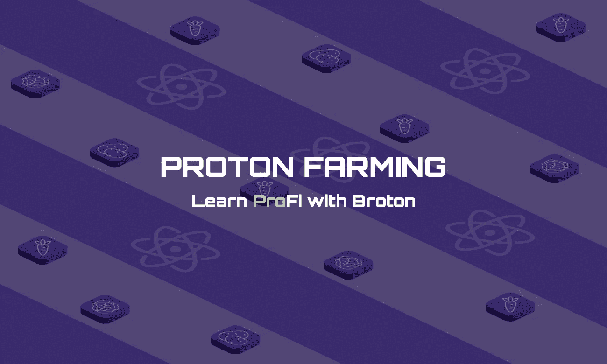
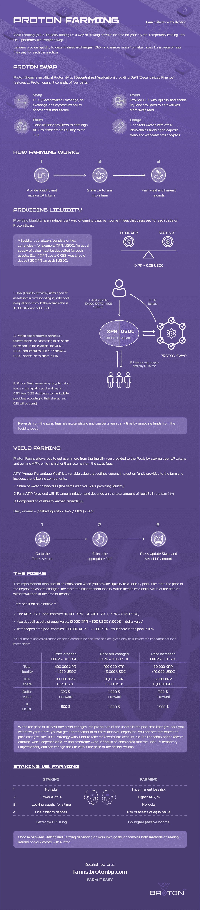

# 信息图表中的质子:高产农业

> 原文：<https://medium.com/coinmonks/proton-in-infographics-yield-farming-a55fb86c642c?source=collection_archive---------43----------------------->

## 跟 Broton 学 ProFi

你们中的大多数人肯定听说过 *DeFi(分散金融)* —这是加密领域的一个既定名称，意思是在没有任何中央中介机构的情况下运行的金融服务，如银行或传统金融中的其他金融机构。

在宝腾，我们称之为 *ProFi* *【专业金融】* —由于宝腾区块链的独特性及其特点，我们希望通过这种方式强调全新水平的 DeFi 服务。

通过这张信息图，我们以直观的形式回答了关于宝腾产量农业的最受欢迎的问题:

*   什么是产量农业？
*   什么是质子交换？
*   什么是流动性池？
*   种田奖励从何而来？
*   什么是 APY，它是如何计算的？
*   有什么风险？
*   什么是「无常的损失」？
*   什么更好:赌博还是耕作？

另外，你可以[下载](https://brotonbp.com/infographics/farms)PDF 版本的信息图，并在我们的网站上阅读详细的[农业手册](https://brotonbp.com/tpost/hovxav1i31-yield-farming)。

要了解更多关于质子和不要错过重要的更新，我们建议你:

*   跟随我们的媒体页面
*   [在 Twitter 上关注我们](https://twitter.com/brotonbp)
*   [加入我们的电报组](https://t.me/brotonbpgroup)

此外，你可以在我们的网站上看到入门指南，快速浏览宝腾。

> 加入 Coinmonks [电报频道](https://t.me/coincodecap)和 [Youtube 频道](https://www.youtube.com/c/coinmonks/videos)了解加密交易和投资

# 另外，阅读

*   [最好的卡达诺钱包](https://coincodecap.com/best-cardano-wallets) | [Bingbon 副本交易](https://coincodecap.com/bingbon-copy-trading)
*   [印度最佳 P2P 加密交易所](https://coincodecap.com/p2p-crypto-exchanges-in-india) | [柴犬钱包](https://coincodecap.com/baby-shiba-inu-wallets)
*   [八大加密附属计划](https://coincodecap.com/crypto-affiliate-programs) | [eToro vs 比特币基地](https://coincodecap.com/etoro-vs-coinbase)
*   [最佳以太坊钱包](https://coincodecap.com/best-ethereum-wallets) | [电报上的加密货币机器人](https://coincodecap.com/telegram-crypto-bots)
*   [交易杠杆代币的最佳交易所](https://coincodecap.com/leveraged-token-exchanges) | [购买 Floki](https://coincodecap.com/buy-floki-inu-token)