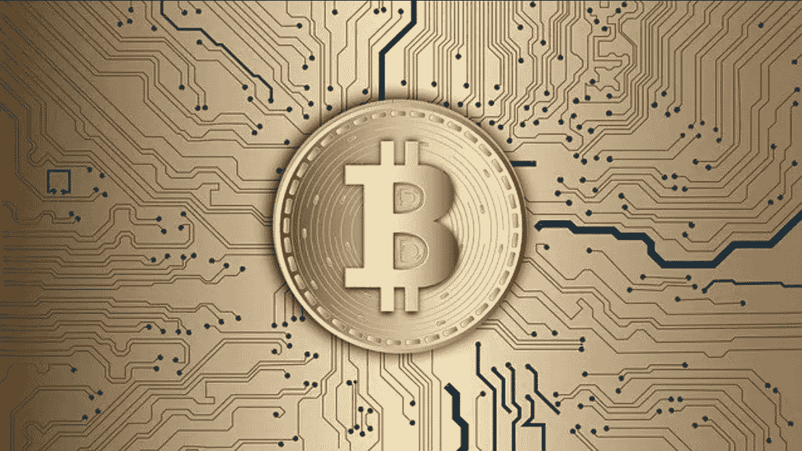

# 2022 年卖空比特币的有效方法

> 原文：<https://medium.com/coinmonks/proven-ways-to-short-sell-bitcoin-in-2022-f8ca8cbb825?source=collection_archive---------21----------------------->

[Short Selling Bitcoin in 2022](https://cryptonewspipe.com/proven-ways-to-short-sell-bitcoin-in-2022/)

卖空[比特币](https://cryptonewspipe.com/category/bitcoin/)简单来说就是在不真正拥有资产的情况下出售资产的行为。即使在市场下跌时，它也能让你获利。

你知道吗，普通的[密码交易员](https://cryptonewspipe.com/2021/07/30/beginners-guide-to-margin-crypto-trading/)只利用了他所熟悉的众多交易方法的 10%的潜力？在他们的交易生涯中，大多数交易者只使用一种交易技术。结果，95%的交易者没能…