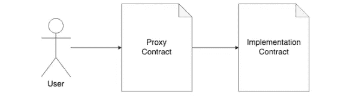
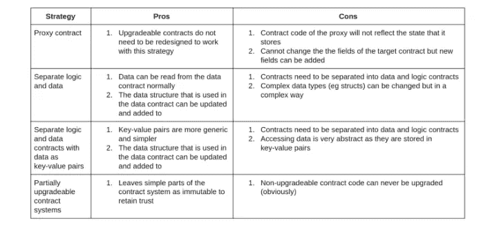

# 代理模式和可升级智能合约

> 原文：<https://medium.com/coinmonks/proxy-pattern-and-upgradeable-smart-contracts-45d68d6f15da?source=collection_archive---------1----------------------->

当智能合约被部署到以太坊区块链时，它们是不可变的，因此不可升级。然而，代码可以重新构建成不同的契约，从而允许逻辑升级，而存储保持不变。说了这么多，用户同意令牌逻辑应该是可升级的吗？

不变性带来的缺点是错误不会被修复，气体优化不会被实现，现有的功能不会被改进…抛弃 EVM 的这个属性也是一个糟糕的解决方案，因为它会剥夺以太坊的一个核心特性。



## 何时使用它

-适应不断变化的环境:修复错误，克服不可变合同的限制
-虚拟升级(现有合同仍然不能更改)。这意味着，尽管原始合同保持不变，但可以部署新版本，并且其地址替换存储中的旧地址
——以避免破坏引用升级合同
的其他合同的依赖性——用户可能不知道新合同版本的发布(它带有新地址)

## 它是如何工作的

首先，外部调用者对代理进行函数调用。第二，代理将调用委托给函数代码所在的委托。第三，结果被返回给代理，代理将结果转发给调用者。因为“delegatecall”用于委托调用，所以被调用的函数在代理的上下文中执行。这意味着代理的存储被用于函数执行，因此导致了委托契约的存储只能被附加的限制。[EIP 协议第七版](https://github.com/ethereum/EIPs/blob/master/EIPS/eip-7.md)引入了“委派呼叫”操作码

给定模式的逻辑，代理也被称为分派器，它将调用委托给特定的模块。这些模块被称为委托(因为工作是由代理契约委托给它们的)。

## 代理的存储用于函数执行是什么意思？

我们知道这种行为的结果是限制了委托契约的存储只能被附加。现在，在升级的情况下，现有的存储变量不能被改变或省略。相反，只能添加新的变量。

这样做的原因是，更改委托中的存储结构会打乱代理中的存储，而代理需要的是以前的结构。

[这里有一个例子](https://github.com/fravoll/solidity-patterns/blob/master/ProxyDelegate/StorageOverwriteExample.sol)

## 语境呢？

因为使用了调用者的存储，所以执行上下文保持不变。因此，“消息发送者”和“消息值”不会改变。

## 将智能合约分为几个相关的智能合约

这是除了 Solidity 之外的语言中常用的方法。例如，你可以有一个代币销售合同，在这种情况下，计算需要发送到以太钱包的代币数量的规则没有明确规定。在这种情况下，金额计算是在一个单独的合同中完成的，如果需要，以后可以升级该合同。

## 契约函数调用的基础

以太坊中的每个交易都有一个可选的“数据”字段，在传输以太网时，该字段必须留空。然而，当与一个契约进行交互时，必须包含一个叫做‘调用数据’的东西。
-函数标识符(散列函数签名的前 4 个字节)，例如` keccak256("transfer(address，uint256)")`
-函数标识符之后的函数参数，根据 [ABI 规范](https://docs.soliditylang.org/en/latest/abi-spec.html#argument-encoding)进行编码

Solidity 编译器有一个分支逻辑，它分析调用数据，并根据从调用数据中提取的函数标识符决定调用哪个函数。因为坚固性不允许我们在那个深度水平上做决定，我们将在后面展示我们将被迫使用汇编来写一些逻辑。

## 如何实现代理委托模式

本质上，业务逻辑是在从代理契约调用的函数中实现的。作为这种链接的结果，用不同的 on 交换实现契约成为可能。这是因为代理契约只知道实现实际业务逻辑的契约的地址。
因为可靠性是一个高层次的抽象，它能给我们的只是一个后备功能。这是一个特殊的函数，每当调用一个不受协定支持的函数时，都会调用这个函数。

最终，我们对于可升级契约的目标是获得“调用数据”并将其原样传递给实现契约，而不需要解析或修改它。

首先，我们需要将呼叫数据加载到内存中

```
 let ptr := mload(0x40)
calldatacopy(ptr, 0, calldatasize())
```

EVM 的内存是在插槽中处理的。每个槽都有一个索引，占用 32 个字节。上面的“calldatasize()”函数获取调用数据大小，并将特定大小的调用数据复制到位于索引“ptr”处的内存槽中，如果不适合，则占用其他内存槽。` mload '从指定的索引中读取 32 个字节。“0x40”是一个特殊的槽，它指向下一个空闲内存槽的索引，因此我们可以将呼叫数据保存到内存的一个空闲槽中。接下来，sload 函数将读取该地址的值。接下来的两个零分别是“out”和“outsize ”,它们允许定义在内存中的什么位置存储返回数据

```
The way to relay the call would be something like this: let result := delegatecall(
 gas(),
 sload(implementation.slot), 
 ptr,
 calldatasize(),
 0,
 0
) 
```

“gas”表示当前合同调用中剩余多少汽油，并告诉另一个合同允许花费多少汽油。“实现”状态变量是可靠性的一个特征，它允许容易地得到状态变量的存储槽地址。

## “委派电话”的实际含义是什么

“delegatecall”用于在代理结构的环境中在委托人处执行功能。这意味着“msg.data”被转发(前 4 个字节中的功能标识符)。在被转发后，为了被执行并触发每个函数调用的转发机制，它被放在代理契约的回退函数中。然而，“delegatecall”只返回一个布尔值，告诉我们执行是否成功。

为了解决这个限制，使用了内联汇编。这允许用一种类似于 EVM 使用的语言对栈进行更细粒度的控制。使用内联汇编，我们可以剖析“delegatecall”的返回值，并将结果返回给调用者。

## 我们能避免使用内联汇编的需要吗？

这可以通过事件将结果返回给调用者来避免。由于事件不能被监听或从契约中监听，我们将使用前端并根据那里的结果采取行动。

## 如果不调用“delegatecall ”,会是什么样子？

当我们希望代理契约返回从被调用方返回的任何内容，并且我们事先不知道返回的数据类型时，我们可以使用如下所示的代码片段:

```
 fallback() external {
 assembly {
 let ptr := mload(0x40)
 calldatacopy(ptr, 0, calldatasize())

 let result := delegatecall(
 gas(),
 sload(implementation.slot),
 ptr,
 calldatasize(),
 0,
 0
 )

 let size := returndatasize()

 returndatacopy(ptr, 0, size)

 switch result
   case 0 {
   revert(ptr, size)
 }
 default {
   return(ptr, size)
 }
 }
}
```

## 如何实现委托？

委托可以像任何其他常规协定一样实现。它不需要知道使用其代码的代理。唯一需要注意的是，在升级合同时，存储顺序必须相同。请记住，只允许添加。

因此，升级机制，即存储委托的当前版本，可以发生在外部存储器中，也可以发生在代理本身中。
-如果地址存储在代理中，则需要实现保护功能。这使得授权地址可以更新代理地址。

这是一个将委托的当前版本存储在自己的存储中的示例

```
 contract Proxy{
 address delegate; // store the address of the delegate
 address owner = msg.sender // store the address of the owner/// [@notice](http://twitter.com/notice) this function allows a new version of the delegate being used without the caller having to worry about it
 function upgradeDelegate(address _newDelegateAddress) public {
   require(msg.sender == owner);
   delegate = _newDelegateAddress;
 }function () external payable {
  assembly {
  let _target := sload(0)
  calldatacopy(0x0, 0x0, calldatasize)
  let result := delegatecall(gas, _target, 0x0, calldatasize, 0x0, 0)
  returndatacopy(0x0, 0x0, returndatasize)
  switch result case 0 {revert(0,0)} default {return (0,   returndatasize)}
 }
 }
}
```

转发机制出现在第二个函数中，这是为每个未知的函数标识符调用的回退函数。因此，对代理的每个函数调用都会触发这个函数并执行汇编代码。

-第 14 行加载存储器中的第一个变量，即委托的地址，并将其存储在存储器变量“target”
-第 15 行将函数签名和任何参数复制到存储器
-第 16 行对“target”地址进行“delegatecall”，包括已经存储在存储器
中的函数数据-第 17 行将返回值复制到存储器
-switch 语句检查执行布尔结果。
—如果结果是肯定的，则结果被返回到函数
的调用方—否则，任何状态改变被恢复

```
 contract Delegate {
 uint public n = 1;function add() public {
 n = 5;
 }
}  contract Caller {
 Delegate proxy;function caller(address _proxyAddress) public {
 proxy = Delegate(_proxyAddress);
 }function go() public {
 proxy.adds();
 }
} 
```

## 调用与委托调用、状态与逻辑

智能合同的状态是持久的，它存储在区块链。此状态可通过状态变量访问。“call”和“delegatecall”都用于调用另一个合约。然而，它们在如何处理被调用方协定的状态
上有所不同:-当使用“call”时，调用方和被调用方具有它们自己的独立状态(默认情况下这是预期的)
-当使用“delegatecall”时，被调用方使用调用方的状态，这意味着您使用“delegatecall”调用的协定使用调用方协定的状态。

## 被呼叫者合约初始化

值得一提的是，当通过代理使用时，被调用方协定构造函数不能用于初始化。当我们使用构造函数初始化状态时，我们希望它在代理协定的状态内初始化。解决方法如下所示:

```
contract BusinessLogic {
 bool initialized;
 uint 256 someNumber;function init() public {
 require(!initialized, “already initialized”);
 someNumber = 0x42;
 initialized = true;
 }
} 
```

## 使用这种模式的影响

1.由于内联装配
2，复杂性增加。模式的复杂性增加了 bug 或意外行为的可能性
3。存储变化:字段不能重新排列或删除
4。潜在的用户信任损失。有了可升级的合约，区块链的一个关键好处，就是不变性，被避免了。
5 .用户必须信任负责的实体，不要在他们的升级中引入任何不想要的行为
6。有必要仔细划分对更改活动合同地址的函数的访问权限

## 使用案例

-包含大量合约的大型 Dapps。一个例子可能是预测市场，在那里，用户赌未来事件的结果。在这种情况下，可升级协定的地址不存储在代理本身中，而是存储在某种地址解析器中。
-解决合同中发现的错误
-解决可能导致合同资金损失的错误



## 例子

-[可升级契约](https://github.com/0v1se/contracts-upgradeable/blob/master/contracts/Upgradeable.sol)验证目标(活动契约版本的地址)是否存储在与当前版本相同的槽中。
- [可以对其他存储域](https://github.com/0v1se/contracts-upgradeable/blob/master/test/contracts/Target.sol)
实施验证-在将这些合同部署到网络之前，需要[测试](https://github.com/0v1se/contracts-upgradeable/blob/master/test/upgradeable.js)所有选项。否则，在下一次更新后，您可能会没有一个有效的合同，并且您也不可能更新它。
- [整个工作流程](https://github.com/Jeiwan/upgradeable-proxy-from-scratch)

## 结论

为了创建可升级的智能契约，代理模式似乎是一个全面的策略。它允许开发人员将可升级机制从契约设计中分离出来。这简化了逻辑设计，并且不容易出错。没有一种策略是完美的，做出正确的选择将取决于用例。所有的策略和设计模式本身都很复杂，应用程序开发人员必须始终避免安全漏洞。

> 加入 Coinmonks [电报频道](https://t.me/coincodecap)和 [Youtube 频道](https://www.youtube.com/c/coinmonks/videos)了解加密交易和投资

## 也阅读

[](https://coincodecap.com/blockfi-review) [## BlockFi 评论:2022 年的利弊和利率

### 今天，我们提出了一个全面的 BlockFi 评论，这是一个成立于 2017 年的加密贷款平台，拥有其…

coincodecap.com](https://coincodecap.com/blockfi-review) [](/coinmonks/buy-bitcoin-in-india-feb50ddfef94) [## 如何在印度购买比特币？2021 年购买比特币的 7 款最佳应用[手机版]

### 如何使用移动应用程序购买比特币印度

medium.com](/coinmonks/buy-bitcoin-in-india-feb50ddfef94) [](/coinmonks/best-crypto-tax-tool-for-my-money-72d4b430816b) [## 加密税务软件——五大最佳比特币税务计算器[2021]

### 不管你是刚接触加密还是已经在这个领域呆了一段时间，你都需要交税。

medium.com](/coinmonks/best-crypto-tax-tool-for-my-money-72d4b430816b) [](https://coincodecap.com/crypto-to-buy-in-2022) [## 9 个 2022 年最值得购买的密码| CoinCodeCap

### 9 个 2022 年最值得购买的加密产品阅读加密产品评论和比较，了解比特币交易和…

coincodecap.com](https://coincodecap.com/crypto-to-buy-in-2022) [](https://coincodecap.com/best-hardware-wallet-bitcoin) [## 存储比特币的最佳加密硬件钱包 2022 | CoinCodeCap

### 硬件钱包是我们存储加密资产的唯一可靠选择。在本文中，我们将讨论 8 个…

coincodecap.com](https://coincodecap.com/best-hardware-wallet-bitcoin) [](/coinmonks/pionex-review-exchange-with-crypto-trading-bot-1e459d0191ea) [## Pionex 评论 2021 |免费加密交易机器人和交换

### Pionex 是为交易自动化提供工具的后起之秀。Pionex 上提供了 9 个加密交易机器人…

medium.com](/coinmonks/pionex-review-exchange-with-crypto-trading-bot-1e459d0191ea) [](/coinmonks/top-3-telegram-channels-for-crypto-traders-in-2021-8385f4411ff4) [## 2022 年密码交易员的三大电报渠道

### 加密信号是来自专业交易者的交易想法，以特定的价格或价格买卖特定的加密货币

medium.com](/coinmonks/top-3-telegram-channels-for-crypto-traders-in-2021-8385f4411ff4) [](https://coincodecap.com/free-crypto-portfolio-trackers) [## 2022 年 5 个最佳免费加密投资组合追踪器

### 在这篇文章中，我们将带你通过一些最好的免费加密投资组合追踪器，让你选择最好的…

coincodecap.com](https://coincodecap.com/free-crypto-portfolio-trackers)