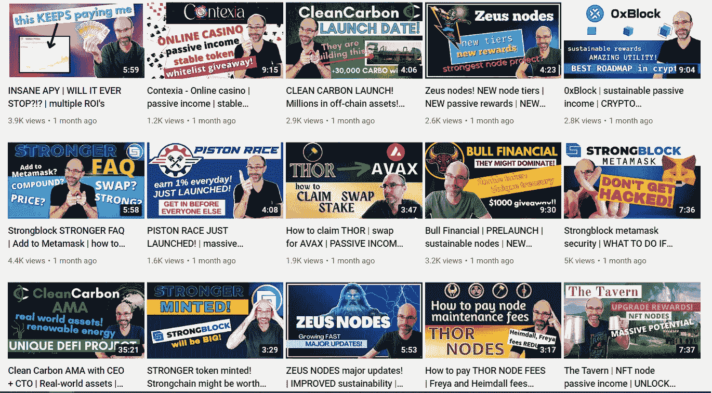
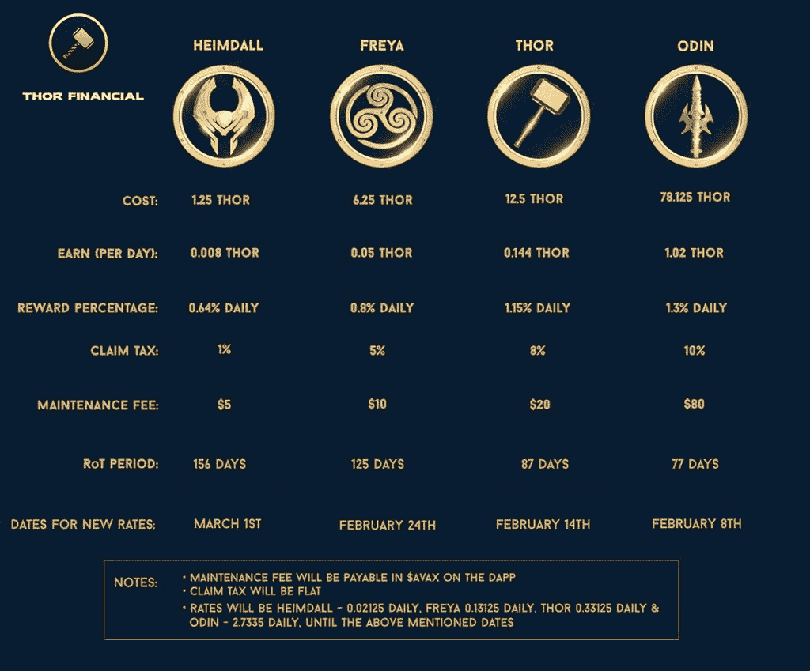
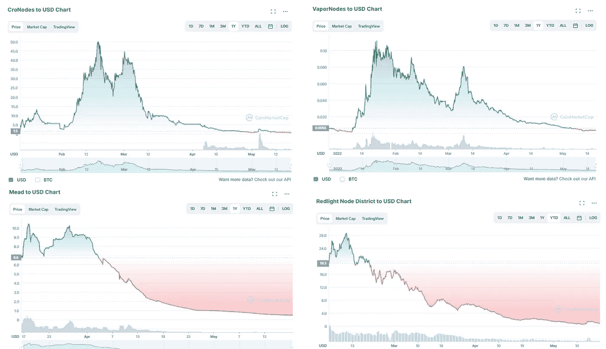

# PSA —为什么您不会通过最新的节点项目获得被动收入

> 原文：<https://medium.com/coinmonks/psa-what-to-consider-to-before-venturing-into-any-naas-project-32706e00a6f5?source=collection_archive---------19----------------------->

嘿，伙计们，一如既往，请记住，这些都不是财务建议，只是为了娱乐和教育目的。请确保你做了自己的研究，找到最适合你的投资。

# 不是所有节点，只是 NaaS(节点即服务)

大约一两个月前，我犯了一个大错误，在 youtube 上研究强节点，从那时起，我发誓我不能阻止所有这些新 NaaS 项目的视频进入我的 youtube 建议源:

This guy tells me what NOT to invest in

如果这对您来说是新的，那么 NaaS 或“节点即服务”通常不是基于实用程序的节点，它在区块链上进行中继(如 POKT)或事务验证，而是 NaaS 节点，它通常只是提供 NaaS 令牌。不要误解我的意思，有一些 NaaS 比其他的更好，更可持续，但在大多数情况下，你可以通过一些不同的指标来识别它们:

## 1)当他们承诺“终生”或“可持续”被动收入时:

这可能是最大的危险信号，因为老实说，他们或任何组织/信托机构/公司/企业都不可能保证终身被动收入。他们能保证你会一直得到他们的原生节点令牌吗？当然可以。一个月后，原生节点令牌还会有价值吗？大概不会。任何人都可以创建一个不断抛出代币的平台，但真正的挑战是为这些代币增加持续的价值。

## 2)存在大量沉没成本的地方:

创建节点时，您无法取回令牌。这并不是说这里有人在偷代币，而是一般如果你想创建一个 NaaS 节点，你放进去的代币，你得把它当成沉没成本，因为你拿不出来。您将“永远”拥有该节点，但获得投资回报的唯一方式是该节点本身支付的利息。就拿流行的 NaaS，托尔节点来说吧:

如果你要投资 12.5 美元创建一个托尔节点，你会吃掉 12.5 美元的托尔，并希望你每天赚的 0.144 美元的托尔最终能弥补成本。以防万一，如果你对数学感到好奇，这将是大约 3 个月(或大约 86.8 天)，这还不包括 8%的索赔税和 20 美元的维护费，这意味着无论你从你的节点索赔多少，你都只会从索赔税中获得 92%的利息，然后不管$THOR 的价格可能是多少，都将获得 20 美元的费用。

因此，假设$THOR 保持与撰写本文时相同的价格(5.99 美元)，在评估索赔税后，您每天将基本上获得价值 0.79 美元的$THOR，这意味着每 30 天您将获得大约 23.80 美元。减去每月 20 美元的维护费，净收益为 3.80 美元，这意味着大约需要 19.7 个月或 591.1 天才能收回最初 12.5 美元的投资。不用说，这不是他们宣传的 87 天。

更新 5/28/22:谢天谢地，THOR 金融团队已经将每月 20 美元的维护费调整为 10 美元，假设 Thor 的价格保持在 5.99 美元，每月净收益为 13.80 美元。这意味着，假设维护费用保持不变，现在大约需要 5.4 个月或 162.8 天来收回您最初 12.5 美元的投资。(然而，在编辑本文时，THOR 的当前价格为 5.08 美元，比本文最初发表时下降了约 16%。更多关于价格变化的信息，请看#4 死亡之山)

## 3)当利率变化时

我讨厌在这里一直把雷神放在十字准线上，但是如果你看上面的图表，你会注意到他们的节点的每种类型的收益率在几个月前已经大大降低了。例如，在一个雷神节点上，你过去每天可以赚 0.33125 美元，但现在减少到 0.144 美元，基本上减少了 43%。这是许多 NaaS 项目的另一个共同特征。虽然我理解为什么有时减少奖励是必要的，以确保一个项目的寿命，但也有这样的时候，费率的改变几乎没有通知，或者根本没有通知。例如，以 NaaS 的另一个项目 Zeus Finance 的时间表为例:

*   2 月 28 日: **10 美元宙斯**给你 1 个宙斯节点，提供**每日 5%的投资回报率**和 **10%的索赔税**
*   3 月 27 日:10 美元宙斯可以让你获得 1 个宙斯节点，每天 5%的投资回报率和 30%的索赔税
*   3 月 31 日:10 美元 ZEUS 可获得 1 个 Zeus node，现在如果你在 30 天内索赔，将获得 50%的索赔税，如果你在 30 天后索赔，将获得 20%的索赔税
*   4 月 4 日: **30 美元宙斯**给你 1 个宙斯节点，每日 **1.6%投资回报率**，30 天申领 50% <税，30 天申领 20%税>
*   5 月 9 日:30 美元宙斯为您带来 1 个宙斯节点，日投资回报率为 1.6%，**80%**<20 天，15%税> 20 天
*   5 月 10 日:30 美元 Zeus 为您提供 1 个 ZEUS 节点，日投资回报率为 1.6%，20 天 80%的索赔税<20 days, and a 15% tax >，**外加 4 美元/月的维护费**和**“节点重新激活费”，即节点成本的 20%+遗失费**，以防您没有支付节点维护费。

好吧，如果这让你晕头转向，基本上，如果你在 3 月 27 日之前得到了一个宙斯节点，你会期望在超过 **22 天**的时间里获得完全的投资回报，假设你要求了你的奖励，并且没有为了一个新节点而将它们复合。

如果你在 5 月 10 日之后制作了一个宙斯节点，如果你考虑到 3 个月的维护费用，它将花费你大约 **83.5 天**。从 3 月 27 日开始到 5 月 10 日，仅仅一个半月的时间，通过一系列的改变，投资回报时间相差了近 4 倍。

更糟糕的是，上面的数学假设宙斯的价格保持不变。如果价格波动，那就另当别论了。这就引出了我的下一个指标…

## 当你看到死亡之山

因此，首先看看所有这些价格图表，想想你看到的共同点:

在所有这些与 NaaS 代币相关的图表中，大约有 1 个月的时间(如果你幸运的话，*可能是*2 个月的时间)，你可以在代币价格上有所上升。通常一旦下降，就会一直下降。这意味着，如果你在看任何 NaaS 的代币价格图表，它看起来像是价格在上山，你，我的朋友，很可能会死在山上。我知道这有点滑稽，但基本上换句话说，如果你在价格高的时候购买一个节点，你将获得的“终身被动收入”投资回报是与 NaaS 令牌价格挂钩的。

以$MEAD token 为例，它是 NaaS token，代表 [thetavern.money.](https://dapp.tavern.money/overview) 如果你在山顶上购买了 100 $MEAD，你将为每瓶 MEAD 支付大约 10 美元，以便铸造一个 NFT 酿酒厂(tavern 的节点之一)，这使得该酿酒厂的价格为 1000 美元。如果价格保持不变，并且您在达到 100%投资回报率之前没有进行任何象征性索赔，则大约需要:

28 天@酿酒厂 1 级获得 1%的日投资回报率(28 %的投资回报率)+ 24 天@酿酒厂 2 级获得 3%的日投资回报率(72 %的投资回报率)= **52 天达到 100%的投资回报率**、**，如果计入 10%的销售税，则总共需要 57.7 天。**

如果你想知道等级是什么，基本上 tavern.money 是 gamifies 他们的节点，如果你推迟要求你的 MEAD，你可以在等级中提升你的 NFT。酿酒厂等级 3，目前是最高等级，每天赚取 4%的投资回报率，换句话说，每天 4 美元的蜂蜜酒代币。如果你在任何时候要求你的$蜂蜜酒，它将把你的酿酒厂恢复到 1 级。如果你认为这个计算不公平，因为我没有考虑第 3 层的盈利潜力，那么按照第 3 层的比率，大约需要 25 天才能获得 100%的投资回报，如果考虑到 10%的销售税，大约需要 27.7 天。

为了简单起见，让我们假设你从第 3 级收入潜力最高的地方开始，然后等了 27.7 天才要求并出售你累积的 100 美元蜂蜜酒。不幸的是，你的 100 美元蜂蜜酒代币现在已经贬值了 90%,价格为每美元蜂蜜酒 0.50 美分。这意味着，为了收回你的 1000 美元投资，你现在需要等待 277.77 天，并希望美元的价值不会进一步贬值。

## 5)当他们使用他们的国库运行其他(合法)节点时

这可能是我发现最具讽刺意味的一个特征，因为当 NaaS 项目开始投资其他节点项目(通常是具有实际效用的项目)时，在某种程度上，这是承认 NaaS 本身是不可持续的。例如，很抱歉又一次抛弃了 Zeus Finance，但他们的第一个财政部举措是将资金投入收益率节点，这样他们就可以获得超过 200%左右的 APY 回报率。但这又引出了一个问题——如果我自己可以简单地制作收益率节点，我为什么还要经历宙斯金融公司的麻烦呢？

在我看来，把钱投资到一个不能为增加价值提供真正盈利途径的项目是非常危险的。如果他们进入了你可以自己做的其他项目，那么本质上你所做的就是不必要的雇佣一个中间人来为你投资。更有意义的是自己做研究，自己寻找并投资这些合法的项目。

## 6)当你在它们的群落中只发现 Hopium 时

这可能是我觉得最讨厌的一个——这时候他们完全关闭了那些对从他们的节点被冲洗感到不安并指责他们传播 FUD 病毒的人。如果有人告诉你，你可以在 30 天或更短的时间内获得投资回报，而现在却需要 300 天……我可以理解为什么人们生气时会想要发泄。阻止/引导/禁止那些提出这些抱怨的人会给你留下一群顽固分子，他们不断告诉每个人加倍下注，买入另一个节点。或者 10 年。这不仅是不真诚的，而且是直接的不负责任或误导。不断地告诉人们他们应该加倍减少他们的节点，希望这个项目会成功，这只会让人们继续挖一个更大的洞。这是一个很好的迹象，表明它不全是氦元素？—如果有人在他们的不和中对暴跌的价格感到不安，并开始对项目提出有效的问题或批评，看看社区的其他人对这个人的反应如何。

# 结论

读完所有这些之后，如果你还想加入 NaaS 项目，我个人只会在几个严格的条件下这样做:

1.  只有我能提前到达，我才会进去。老实说，如果你最喜欢的 youtuber 正在谈论他们如何从中赚了很多钱，那么很可能你已经太晚了。在死亡之山的例子中，我需要在上升轨迹的早期乘风破浪到达顶峰。我的猜测是，即使是在超级早期，我也可能无法在山顶获得 100%的投资回报，但希望是你能够在底部崩溃之前获得 100%的投资回报。如果你足够幸运地这样做了，那么之后你所做的一切都将是 100%的利润。
2.  与第一点相呼应，我会确保你们**尽快出售利润**，如果索赔税的差异很小，我甚至会考虑这样做。你等待的时间越长，你就越有可能从死亡之山上掉下来。这也意味着不要增加你的节点，因为很明显，如果没有实现，任何收益都不是实际收益，如果你实现了，你将远离任何利润。如果代币价格下跌 50%,你基本上要花两倍的时间才能获得 100%的投资回报，这意味着 10%的索赔税差异可能是值得的。
3.  **仔细看看他们的项目路线图:**如果他们使用像“DeFi 项目”这样的模糊术语，或者如果他们说他们将通过营销来扩大规模，这意味着他们唯一能支撑的方式就是通过庞氏骗局让更多的人参与到项目中来。

听着，我又一次不是金融顾问，但在我看来，这些 NaaS 项目对那些相信自己可以快速致富的人来说是超级冒险和近乎掠夺性的。其他实际上促进可应用效用的节点，如 [POKT](https://www.publish0x.com/jaik83/things-to-consider-before-venturing-into-pokt-pool-xrnknzn) 、 [Yield Nodes](https://www.publish0x.com/jaik83/a-deep-dive-analysis-on-yield-nodes-my-only-green-in-a-red-m-xvyvkxw) 或 [Presearch](https://www.publish0x.com/jaik83/an-update-on-my-presearch-node3-months-of-earnings-xknomke) ，可能不会有同样诱人的回报，但在我看来，你不会掉下死亡之山的可能性要大得多。

话虽如此，如果你有任何相反的意见，我很乐意在下面的评论中听到。否则，感谢您花时间阅读这篇文章，我希望它对您有所帮助。另外，请务必在推特上关注我:[https://twitter.com/CryptosWith](https://twitter.com/CryptosWith)

> 加入 Coinmonks [电报频道](https://t.me/coincodecap)和 [Youtube 频道](https://www.youtube.com/c/coinmonks/videos)了解加密交易和投资

# 另外，阅读

*   [WazirX vs coin dcx vs bit bns](/coinmonks/wazirx-vs-coindcx-vs-bitbns-149f4f19a2f1)|[block fi vs coin loan vs Nexo](/coinmonks/blockfi-vs-coinloan-vs-nexo-cb624635230d)
*   [本地比特币评论](/coinmonks/localbitcoins-review-6cc001c6ed56) | [加密货币储蓄账户](https://coincodecap.com/cryptocurrency-savings-accounts)
*   [什么是融资融券交易](https://coincodecap.com/margin-trading) | [成本平均法](https://coincodecap.com/dca)
*   [支持卡审核](https://coincodecap.com/uphold-card-review) | [信任钱包 vs 元掩码](https://coincodecap.com/trust-wallet-vs-metamask)
*   [Exness 点评](https://coincodecap.com/exness-review)|[moon xbt Vs bit get Vs Bingbon](https://coincodecap.com/bingbon-vs-bitget-vs-moonxbt)
*   [如何开始通过加密贷款赚取被动收入](https://coincodecap.com/passive-income-crypto-lending)
*   [BigONE 交易所评论](/coinmonks/bigone-exchange-review-64705d85a1d4) | [电网交易 Bot](https://coincodecap.com/grid-trading)