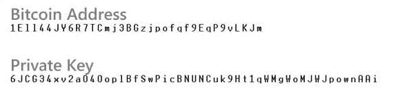
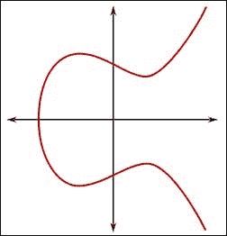

# 加密货币中的公钥和私钥

> 原文：<https://medium.com/coinmonks/public-and-private-keys-in-cryptocurrency-c0910d6a1c20?source=collection_archive---------21----------------------->

**嗯，**

**今天，我们将讨论公钥和私钥，以及它如何成为加密货币的一个非常关键的部分。**

酷！

你们都知道什么是钥匙吧？在我们的日常生活中，我们用它来锁东西，比如说，你有你行李的钥匙，或者你可能有你包的钥匙，等等。像这样，我们将在加密货币中使用这个密钥。

**让我们看看如何:)**

你可能听说过比特币是基于*密码学*的，这是广泛用于计算机安全的数学分支。密码学在希腊语中的意思是*“秘密写作”*，但是密码学的科学不仅仅是秘密写作。

比特币的所有权是通过数字密钥、比特币地址和数字签名建立的。数字密钥实际上并不存储在网络中，而是由用户创建并存储在一个文件中，或者称为*钱包*的简单数据库中。密钥实现了比特币的许多有趣属性，包括分散的信任和控制、所有权和密码验证安全模型。

**因此，这里的关键是图片。让我们来探索它们。**

# 私人密钥

私钥只是一个随机选取的数字。对私钥的所有权和控制权是用户控制与相应比特币地址相关联的所有资金的根本。私钥用于创建签名，在支付比特币时需要签名，以提供交易中使用的资金的所有权。私钥必须在任何时候都保持秘密，因为向第三方透露它等同于让他们控制由该密钥保护的比特币。

你可以用一枚硬币、一支铅笔和一张纸随机挑选你的私钥:投掷硬币 256 次，你就有了一个可以在比特币钱包中使用的随机私钥的二进制数字。然后可以从私钥生成公钥。

**示例:**1e 99423 a4 ed 27608 a 15 a 261 a2 b 0 e 9 e 52 ced 330 AC 530 edec 322 c8 ffc 6 a 32 S5 efyycd 0 DD

# 公开密钥

公钥是用椭圆曲线乘法从私钥计算出来的，这是不可逆的:K = k*G，其中 K 是私钥，G 是一个称为生成点的常数点，K 是得到的公钥。我们可以从一个私钥生成多个公钥，但是不可能从一个公钥生成私钥。

*椭圆曲线乘法*是一类函数，密码学家称之为*“陷阱门”*函数:在一个方向上容易做，在相反方向上不可能做。私钥的所有者可以很容易地创建公钥，然后将其与全世界共享，因为他们知道没有人可以反转该函数并从公钥计算出私钥。这一数学技巧成为证明比特币资金所有权的令人难忘的安全数字签名的基础。

这是关于**公钥和私钥**的基本思路。我相信你对加密货币内部的工作原理有所了解。

今天就到这里。

**稍后带着新文章再见！**

> *加入 Coinmonks* [*电报频道*](https://t.me/coincodecap) *和* [*Youtube 频道*](https://www.youtube.com/c/coinmonks/videos) *了解加密交易和投资*

# 另外，阅读

*   [Bookmap 评论](https://coincodecap.com/bookmap-review-2021-best-trading-software) | [美国 5 大最佳加密交易所](https://coincodecap.com/crypto-exchange-usa)
*   最佳加密[硬件钱包](/coinmonks/hardware-wallets-dfa1211730c6) | [Bitbns 评论](/coinmonks/bitbns-review-38256a07e161)
*   [新加坡十大最佳加密交易所](https://coincodecap.com/crypto-exchange-in-singapore) | [购买 AXS](https://coincodecap.com/buy-axs-token)
*   [红狗赌场评论](https://coincodecap.com/red-dog-casino-review) | [Swyftx 评论](https://coincodecap.com/swyftx-review) | [CoinGate 评论](https://coincodecap.com/coingate-review)
*   [投资印度的最佳密码](https://coincodecap.com/best-crypto-to-invest-in-india-in-2021)|[WazirX P2P](https://coincodecap.com/wazirx-p2p)|[Hi Dollar Review](https://coincodecap.com/hi-dollar-review)