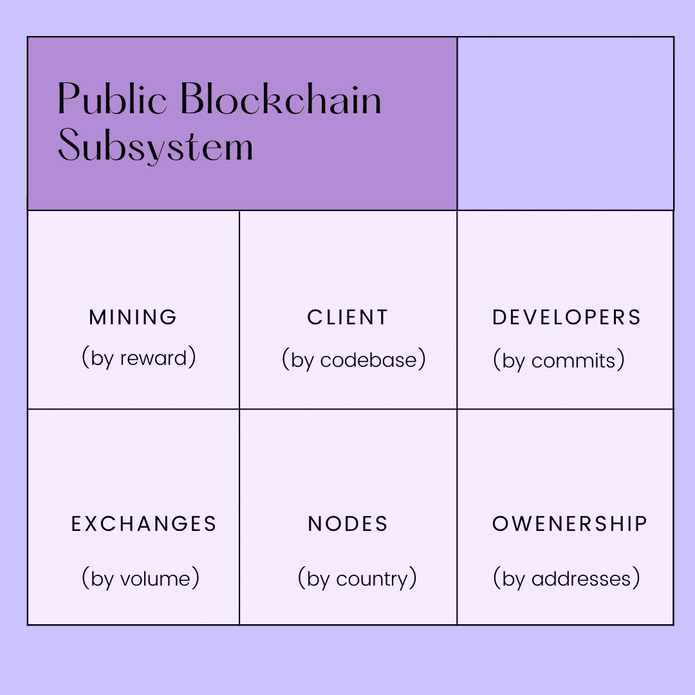

# 公共区块链子系统

> 原文：<https://medium.com/coinmonks/public-blockchain-subsystem-14709f6e40d0?source=collection_archive---------71----------------------->

一个去中心化的系统(像比特币、以太坊)是由一组去中心化的子系统(像挖掘、交易所、节点、开发者、客户端等等)组成的。以下是组成比特币的六个子系统。

Public Blockchain Subsystem

**什么是挖矿奖励？**

采矿奖励，也称为**区块奖励**，是你成功开采一个区块的加密货币的数量。
例如，当你成功开采一个区块并将其添加到区块链中时，你可以获得 6.25 比特币的奖励。就比特币而言，奖励金额实际上是每 210，000 块减半，估计每四年发生一次。预计到 2140 年，这一数字将为零。

**客户端维护的代码库是什么？**

**代码库**是模块、应用程序&库的集合，它们组合在一起以满足特定的应用程序需求。这些完全由客户维护。

**开发者的作用是什么？**

区块链开发者**通过创建系统来记录和存储区块链数据，以防止更改或黑客攻击**，从而实现安全的数字交易。他们设计安全的区块链技术，开发应用程序功能和接口，并维护客户端和服务器端应用程序。

**比特币交易所**

比特币交易所是一个数字市场，交易者可以使用不同的法定货币或替代货币买卖比特币。比特币货币交易所是一个在线平台，充当加密货币买家和卖家之间的中介。

**区块链上的节点是什么？**

节点可以是任何类型的设备(主要是计算机、笔记本电脑或者更大的服务器)。节点构成了区块链的基础设施。区块链上的所有节点都相互连接，它们不断地相互交换最新的区块链数据，因此所有节点都相互同步。

**按地址划分的所有权**

比特币的所有权本质上归结为两个数字，一个[公钥](https://www.gemini.com/cryptopedia/glossary#public-key)和一个[私钥](https://www.gemini.com/cryptopedia/glossary#private-key)。一个粗略的类比是用户名(公钥)和密码(私钥)。公钥的散列称为地址，是显示在区块链上的地址。使用散列提供了额外的安全层。

要接收比特币，发送方知道你的地址就够了。公钥是从私钥派生出来的，你需要用私钥把比特币发送到另一个地址。该系统使收款变得容易，但汇款时需要验证身份。

> 加入 Coinmonks [电报频道](https://t.me/coincodecap)和 [Youtube 频道](https://www.youtube.com/c/coinmonks/videos)了解加密交易和投资

# 另外，阅读

*   [币安 vs FTX](https://coincodecap.com/binance-vs-ftx) | [最佳(SOL)索拉纳钱包](https://coincodecap.com/solana-wallets)
*   [比诺莫评论](https://coincodecap.com/binomo-review) | [斯多葛派 vs 3Commas vs TradeSanta](https://coincodecap.com/stoic-vs-3commas-vs-tradesanta)
*   [Capital.com 评论](https://coincodecap.com/capital-com-review) | [香港的加密借贷平台](https://coincodecap.com/crypto-lending-hong-kong)
*   [如何在 Uniswap 上交换加密？](https://coincodecap.com/swap-crypto-on-uniswap) | [A-Ads 审查](https://coincodecap.com/a-ads-review)
*   [WazirX vs coin dcx vs bit bns](/coinmonks/wazirx-vs-coindcx-vs-bitbns-149f4f19a2f1)|[block fi vs coin loan vs Nexo](/coinmonks/blockfi-vs-coinloan-vs-nexo-cb624635230d)