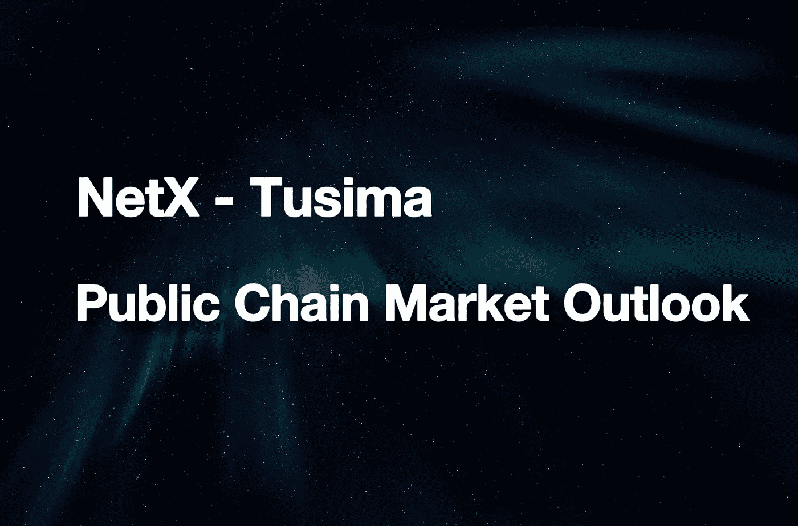
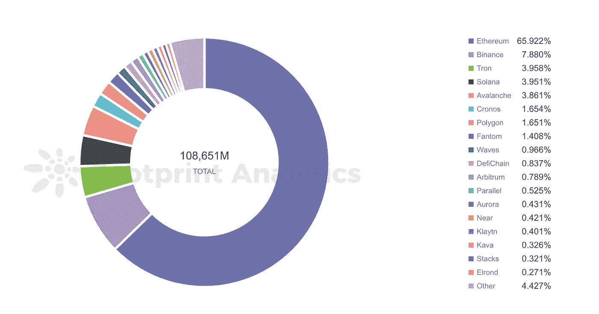
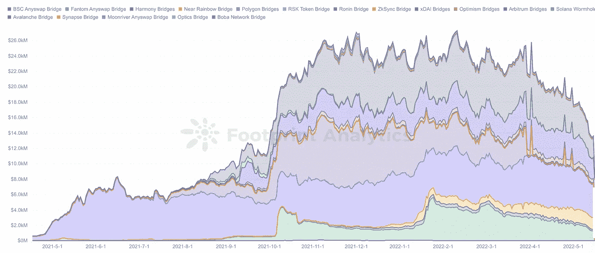
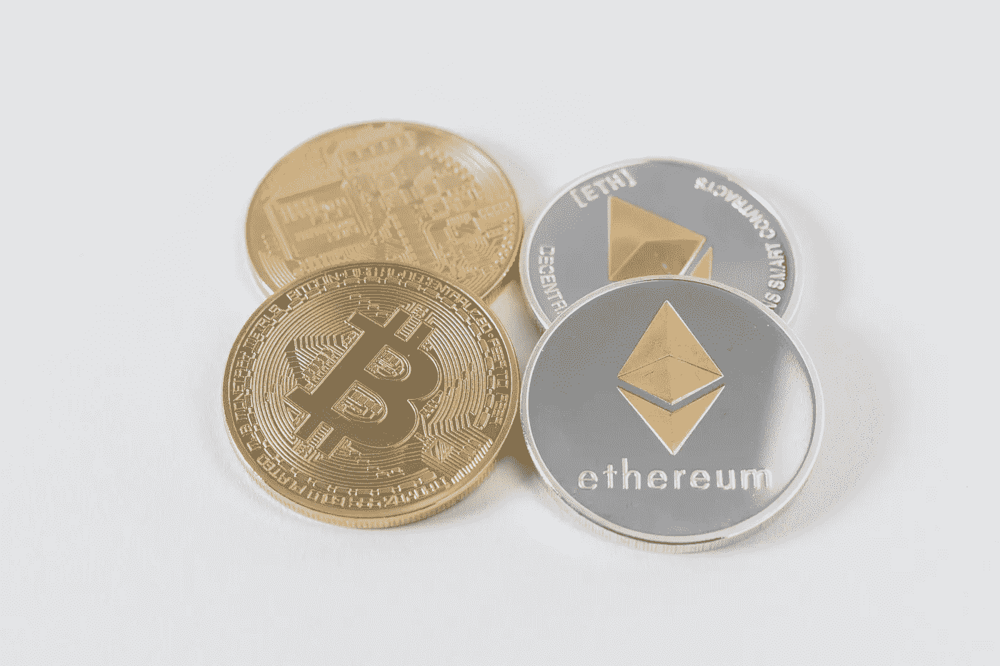

# 公共链市场前景

> 原文：<https://medium.com/coinmonks/public-chain-market-outlook-823eaec076cb?source=collection_archive---------8----------------------->

随着公共连锁店努力赶上或竞争以太坊，一个新的生态正在形成。

在 2022 年，区块链行业试图在与 ETH 的所有整合和疏远中达成新的生态平衡，而后者的市场份额急剧下降至 62%。当包括 DeFi、NFT、GameFi 和 SocialFi 在内的数百个 dApps 在拥挤的以太坊上运行时，就会引发这场灾难。

几乎所有的公共连锁店都寻求以更快、更便宜的方式处理比以太坊更多的交易。他们可能会求助于技术升级、生态动力、传统金融手段或新兴趋势。

总而言之，公共链分为三种类型:

**第一层**:通过升级技术来挑战以太坊。例子包括著名的 CEX 公共连锁店(BSC、Cronos、Heco 等。)、互操作链(Cosmos、Polkadot 等。)、Solana、Avalanche、Terra、Fantom 等。

**侧链**:兼容 EVM 的区块链与以太坊 Mainnet 并行运行，独立运行。处理以太坊的过剩容量。例子包括 Ronin(为 NFT 游戏 Axie Infinity 开发的)和 Polygon(用于构建和连接以太坊的区块链框架)。

**第二层**:以太坊补充的扩展解决方案。自然界以太坊的一部分。构建在现有区块链系统之上的第二个框架通过汇总事务来实现链外可伸缩性。两种主要类型是乐观汇总和零知识汇总(ZK 汇总)。

到目前为止，所有公共链的总 TVL 已经达到 1000 亿美元，比去年高出 5 倍。L1 网络看到了 TVL 的飞速发展，因为他们建立了自己的生态系统，并吞下了大量以太坊市值。

Till now, the total TVL of all public chains has reached $100 billion, five times higher than last year.

随着用户加入并进行更便宜的交易，超市合同正在赚大钱。L2 链和侧链通过其独特的机制、共识、事务执行、数据可用性和隐私保护，享有可伸缩性和分散性。多链生态系统是指多链模型并行运行的生态系统。这个新的概念已经过测试，以进一步增强系统。

以太坊社区也支持主要由 rollups 支持的多链。高吞吐量是通过 L2 扩展解决方案实现的，该解决方案不仅削减了天然气费用，还保障了以太坊主网的安全。以太坊通过欺诈证明或有效性证明来验证链外计算。然后，它用分片技术改进了 rollup calldata。随着区块链世界被分割成几个部分，这些孤立的公共链迫切需要跨链解决方案，其中大部分是运行在以太坊上的 L2 伸缩桥，旨在与以太坊互联。

Cross-chain bridges built on Ethereum

除了各种桥之外，桥聚合器，如 Chainswap 和 FundMovr，在用户和开发者中也很受欢迎。这些平台支持跨链资产交易和交换。公共链竞争者旨在解决紧迫的 Web 3.0 困境，相对较低的成本吸引了许多开发者加入竞争。而竞争导致了细分，这在新的挑战中刺激了对互操作解决方案的需求。

最好的例子是比特币和以太坊，这是区块链最大的两个网络。前者认可使用最广泛的加密货币 BTC。后者运行最多的 dApps，支持 DeFi 生态系统的大部分，价值数十亿美元。互操作性的缺乏拦截了 1 号加密货币和 1 号 DeFi 生态系统之间的资产流动，阻碍了两者的发展。

Photo by [Thought Catalog](https://unsplash.com/@thoughtcatalog?utm_source=unsplash&utm_medium=referral&utm_content=creditCopyText) on [Unsplash](https://unsplash.com/s/photos/blockchain?utm_source=unsplash&utm_medium=referral&utm_content=creditCopyText)

跨链技术阻止了大型实体的垄断。鉴于比特币和以太坊占据了加密市场 60%的大部分份额，交叉链技术被引入来转移交易。区块链互操作性对可扩展性、广泛应用和创新具有重要意义，使其升级成为优先事项。

项目可能会以自己的方式缓解这种令人头疼的扩展问题。但由于缺乏桥梁，水果无法跨越链条进行交流。与此同时，链式法则并不为新的解决方案提供相互关联的基础。

跨链智能合约可能会颠覆 dApps 的开发模式，但不会改变大多数区块链网络在本质上仍然是孤立的事实。这些孤立的链不能在它们之间发送或接收数据。要解决这个问题，桥梁是先决条件。

目前，跨链桥主要针对令牌的传输。本地资产通过一种简单的“铸造和燃烧”方法连接到另一个区块链。然而，数据包、令牌和指令的传输只能在通用网桥上进行。对于这种基础设施，安全性和可靠性尤为重要。必须对代码库进行严格审核，以确保及时将消息传输到预期的链中，没有恶意操纵，也不受外部干扰(如区块链重组)的影响。

可以进一步挖掘跨链技术的潜力，以获得更好的用户体验和更高的效率。与此同时，桥接将使这一领域的竞争力下降，这是保持区块链低价的好方法。互操作性对于区块链的繁荣至关重要，因为它将其投资组合扩展到更多的行业。私人和公共连锁店的结合将吸引更多的观众。一般来说，对用户需求的快速和廉价的响应是成熟的跨链桥的基础。

公共链上的证券以及许多概念链正在与比特币脱钩。连锁生态系统正在建立。专属用户群逐渐被召唤。这样，与 BTC 值的强相关性正在消失。创造性生产力、透明的生产关系和自由竞争的市场是秘密增长的驱动力。类似地，对公共链的倡导强调了增强架构的愿景，而不是推翻原生系统。

***NetX，面向数字生活的可信、可靠的智能自治系统链原生互联网(***[***Trias***](https://www.trias.one/)***)***

[***铁人三项***](https://www.triathon.space/#/)***|***[***Ethanim***](https://www.ethanim.network/)***|***[***tu Sima***](https://www.tusima.network/#/)***| behemotumius | Leviatom | Divina***

> 加入 Coinmonks [电报频道](https://t.me/coincodecap)和 [Youtube 频道](https://www.youtube.com/c/coinmonks/videos)了解加密交易和投资

# 另外，阅读

*   [印度加密交易所](/coinmonks/bitcoin-exchange-in-india-7f1fe79715c9) | [比特币储蓄账户](/coinmonks/bitcoin-savings-account-e65b13f92451)
*   [OKEx vs KuCoin](https://coincodecap.com/okex-kucoin) | [摄氏替代品](https://coincodecap.com/celsius-alternatives) | [如何购买 VeChain](https://coincodecap.com/buy-vechain)
*   [币安期货交易](https://coincodecap.com/binance-futures-trading)|[3 commas vs Mudrex vs eToro](https://coincodecap.com/mudrex-3commas-etoro)
*   [如何购买 Monero](https://coincodecap.com/buy-monero) | [IDEX 评论](https://coincodecap.com/idex-review) | [BitKan 交易机器人](https://coincodecap.com/bitkan-trading-bot)
*   [CoinDCX 评论](/coinmonks/coindcx-review-8444db3621a2) | [加密保证金交易交易所](https://coincodecap.com/crypto-margin-trading-exchanges)
*   [红狗赌场评论](https://coincodecap.com/red-dog-casino-review) | [Swyftx 评论](https://coincodecap.com/swyftx-review) | [CoinGate 评论](https://coincodecap.com/coingate-review)
*   [Bookmap 评论](https://coincodecap.com/bookmap-review-2021-best-trading-software) | [美国 5 大最佳加密交易所](https://coincodecap.com/crypto-exchange-usa)