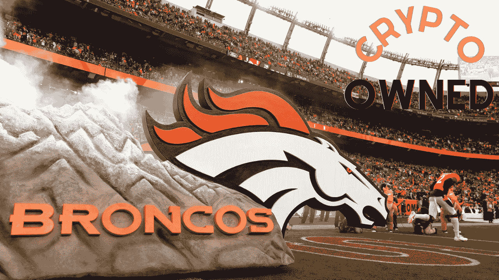

# 公有的“加密 NFL 队？”

> 原文：<https://medium.com/coinmonks/publicly-owned-crypto-nfl-team-e1b8ba0b21e5?source=collection_archive---------25----------------------->

Fun Fact: The Denver Broncos would be the second publicly owned team in the NFL, behind the Greenbay Packers which become publicly traded on August 18th, 1923.

我们都有那些大的亿万富翁的愿望与我们糟糕的最低工资，无论是一个快乐的梦想——乘坐你最喜欢的跑车，度过一个改变生活的豪华假期，或者拥有你最喜欢的足球队,“秘密文化”不仅通过交易的货币利润，而且通过与志同道合的 DeFi 金融家建立网络，共同拥有一个…