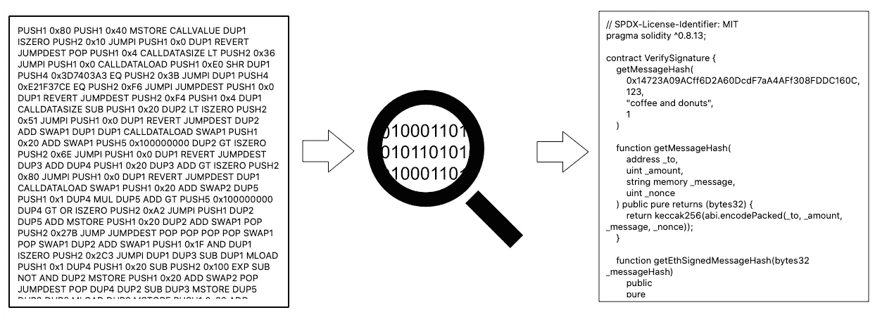
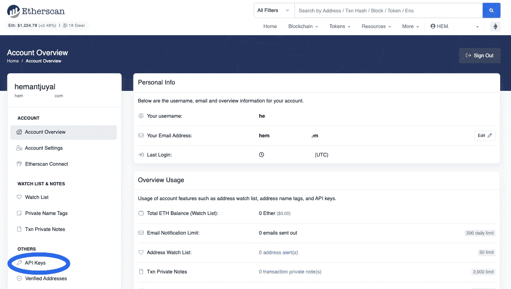
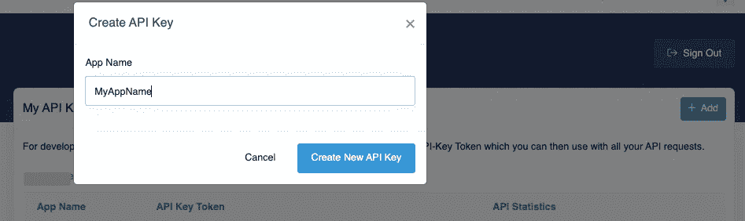
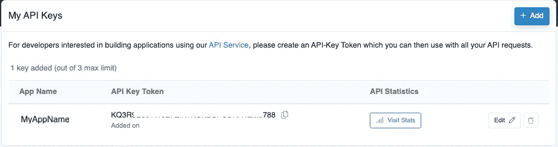
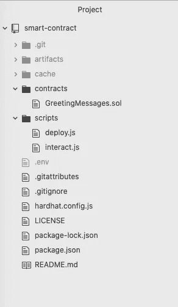
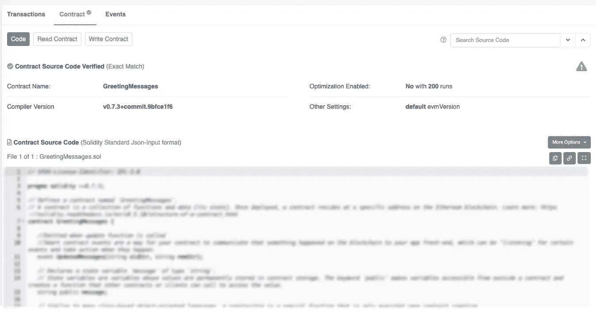

# 在 Etherscan 上发布并验证您的智能合同的真实性

> 原文：<https://medium.com/coinmonks/publish-and-verify-your-smart-contract-for-its-authenticity-on-etherscan-758cf8304793?source=collection_archive---------15----------------------->

我们将学习如何在 Etherscan 上验证我们部署的 solidity 智能合同的真实性。

注意:这是我们之前的工作的下一阶段，我们在这里学习了如何在区块链上部署智能合同。

[](/coinmonks/interacting-with-your-deployed-smart-contract-on-blockchain-using-hardhat-bf14767bc0a5) [## 使用 Hardhat 与区块链上部署的智能合约进行交互

### 我们将学习如何使用安全帽、元面具和炼金术与我们部署的 Solidity 智能合同进行交互

medium.com/@hemantjuyal](/coinmonks/interacting-with-your-deployed-smart-contract-on-blockchain-using-hardhat-bf14767bc0a5) 

# 为什么要验证我们的智能合同？

发布您的智能合同总是好的，这样它就可以被验证为真实性的证明。智能协定或令牌协定的源代码一旦通过验证，就可以公开获取和验证。通过这一过程，透明度和信任得以建立。



Smart Contract: Verification for Authenticity

> 对于新手来说，以太扫描是一个以太坊块浏览器。任何用户都可以访问 Etherscan 来获取以太坊网络的统计信息。该平台的主要目标是展示有关网络区块和交易的数据。

# 创建 Etherscan 帐户并生成 API 密钥

对于验证过程，首先我们需要在 Etherscan 中创建一个帐户，可以使用[链接](https://etherscan.io/login)来完成。创建我们的 Etherscan 帐户后，使用我的个人资料链接，我们可以导航到帐户概览屏幕并选择 **API 键**



Smart Contract: Etherscan Account Overview Screen

**创建以太扫描 API 密钥**

创建一个 Etherscan API 密钥非常简单，你只需提供一个应用名称，然后点击`Create New API Key`按钮。瞧啊。！！！结束了



Smart Contract: Create Etherscan API Keys

记下新创建的 API Key 中的 API Key token，因为我们稍后将在项目中使用它作为配置参数。



Smart Contract: Etherscan API Key Details

# 智能合同项目

如果您之前没有完成项目设置，请参考[智能合约项目设置](/@hemantjuyal/creating-and-deploying-a-smart-contract-on-a-blockchain-c97e9edcc065#112c)部分，因为我们将检查配置文件以验证我们部署的智能合约。我们在前面阶段所做的是将 [greetings 智能合约项目](https://github.com/hemantjuyal/smart-contract-greetings)代码从 [Github](https://github.com/hemantjuyal/smart-contract-greetings) 中签出到我们的本地目录中。

[](https://github.com/hemantjuyal/smart-contract-greetings) [## GitHub 项目代码—在…上部署智能合约并与之交互

### 创建和部署智能合约与部署的智能合约交互在以太网上发布您的智能合约…

github.com](https://github.com/hemantjuyal/smart-contract-greetings) 

克隆项目后，您将看到项目结构如下



Smart Contract: [Github](https://github.com/hemantjuyal/smart-contract) project set-up

**。环境配置更新** 我们在合同交互和部署过程中创建了`[.env](/@hemantjuyal/creating-and-deploying-a-smart-contract-on-a-blockchain-c97e9edcc065#d848)` [文件，其中包含我们的智能合同项目配置。](/@hemantjuyal/creating-and-deploying-a-smart-contract-on-a-blockchain-c97e9edcc065#d848)

为了发布和验证我们的智能合约，我们将通过添加`ETHERSCAN_API_KEY`作为更新的配置来更新我们的`[.env](/@hemantjuyal/creating-and-deploying-a-smart-contract-on-a-blockchain-c97e9edcc065#d848)` [文件](/@hemantjuyal/creating-and-deploying-a-smart-contract-on-a-blockchain-c97e9edcc065#d848)。请记住，我们将在创建 Etherscan 帐户后立即使用我们在上一步中记录的相同 API 密钥，即 [**创建 Etherscan API 密钥**](#f8f8) 。

注意:在[之前的文章部分](/@hemantjuyal/interacting-with-your-deployed-smart-contract-on-blockchain-using-hardhat-bf14767bc0a5#c16b)中，我们已经完成了与我们部署的智能合同进行交互的配置

有了这个我们的`.env`文件将会是什么样子

Smart Contract: .env file updated configuration for verification

# 验证您部署的智能合同

在 CLI 中运行命令，启动源代码发布和验证过程

```
npx hardhat verify CONTRACT_ADDRESS 'Hello and Welcome'
```

根据我们的`.env`配置，命令如下所示，其中`0xac2726........672ba6`代表`CONTRACT_ADDRESS`

```
npx hardhat verify 0xac2726........672ba6 'Hello and Welcome'
```

注意:用提到的`.env`文件配置参数值更改`CONTRACT_ADDRESS`，该值引用我们部署的智能合同地址。你可以参考[上一篇文章](/@hemantjuyal/creating-and-deploying-a-smart-contract-on-a-blockchain-c97e9edcc065)，在那里我们已经创建并部署了一个智能合同。

在 CLI 中运行上述命令将产生如下输出

```
Successfully submitted source code for contract
contracts/GreetingMessages.sol:GreetingMessages at 0xac2726........672ba6 for verification on Etherscan. 
Waiting for verification result...Successfully verified contract GreetingMessages on Etherscan.
[https://goerli.etherscan.io/address/0xac2726........672ba6#code](https://goerli.etherscan.io/address/0xac2726........672ba6#contracts)
```

在您的 CLI /终端屏幕中，复制已验证的智能合约 URL 并导航至链接，该链接将显示已发布我们已验证智能合约详细信息的 Etherscan 页面



Smart Contract: Published and Verified source code

咿咿呀呀…..我们的智能合同在 Etherscan 上发布和验证。现在，任何人都可以查看源代码来验证我们的智能契约是否真的在执行它应该执行的功能。

除此之外，通过 Etherscan，我们还可以使用我们发布的智能合约，因为它具有`Read Contract`和`Write Contract`功能，可以作为一个附加组件，通过暴露的接口来验证操作。

恭喜你！！我们已经做到了，最后让我们来庆祝一下。


Smart Contract: Verification successful and now it’s time for super celebration

> 图片来源:派拉蒙电影公司和莱昂纳多迪卡普里奥。

> **词汇:**
> 
> 以太坊:以太坊是一个去中心化、开源的区块链，具有智能合约功能。来自[维基百科](https://en.wikipedia.org/wiki/Ethereum)
> 
> 以太扫描:以太扫描是一项任何用户都可以查看[以太坊](https://en.bitcoinwiki.org/wiki/Ethereum)网络统计数据的服务。来自[维基百科](https://en.bitcoinwiki.org/wiki/EtherScan)
> 
> Solidity: Solidity 是一种面向对象的编程语言，用于在区块链平台上实现智能合约。受 C++、JavaScript、Python 的影响。
> 
> Hardhat: Hardhat 是一个开发环境，用于编译、部署、测试和调试基于以太坊的软件。

# 其他推荐文章

[](https://coinsbench.com/how-i-did-my-first-crypto-mining-successfully-d3d041dc6117) [## 我是如何成功完成第一次加密挖掘的

### 要成功挖掘加密货币，请遵循以下步骤。第一步是安装 Monero 钱包。第二步是安装 XMRig…

medium.com/@hemantjuyal](https://coinsbench.com/how-i-did-my-first-crypto-mining-successfully-d3d041dc6117) [](https://coinsbench.com/how-to-create-and-sell-your-nft-on-opensea-in-real-without-gas-fee-in-10-mins-801d7e40ab17) [## 如何在 10 分钟内在 OpenSea 上创建和销售你的 NFT 而不用付汽油费

### 相信我…我会让它变得简单明了…创建您的 NFT 并在现实中销售它非常容易…

medium.com/@hemantjuyal](https://coinsbench.com/how-to-create-and-sell-your-nft-on-opensea-in-real-without-gas-fee-in-10-mins-801d7e40ab17) [](/coinmonks/creating-and-deploying-a-smart-contract-on-a-blockchain-c97e9edcc065) [## 在区块链上创建和部署 Solidity 智能合约

### 学习如何使用安全帽、元掩模和炼金术创建和部署 Solidity Smart Contract 的简单方法

medium.com/@hemantjuyal](/coinmonks/creating-and-deploying-a-smart-contract-on-a-blockchain-c97e9edcc065) [](/coinmonks/interacting-with-your-deployed-smart-contract-on-blockchain-using-hardhat-bf14767bc0a5) [## 使用 Hardhat 与区块链上部署的智能合约进行交互

### 我们将学习如何使用安全帽、元面具和炼金术与我们部署的 Solidity 智能合同进行交互

medium.com/@hemantjuyal](/coinmonks/interacting-with-your-deployed-smart-contract-on-blockchain-using-hardhat-bf14767bc0a5) 

> 加入 Coinmonks [电报频道](https://t.me/coincodecap)和 [Youtube 频道](https://www.youtube.com/c/coinmonks/videos)了解加密交易和投资

# 另外，阅读

*   [加密交易机器人](/coinmonks/crypto-trading-bot-c2ffce8acb2a) | [OKEx vs 币安](https://coincodecap.com/okex-vs-binance)
*   [币安 vs FTX](https://coincodecap.com/binance-vs-ftx) | [最佳(索尔)索拉纳钱包](https://coincodecap.com/solana-wallets)
*   如何在 Uniswap 上交换加密？ | [A-Ads 审查](https://coincodecap.com/a-ads-review)
*   [加密货币储蓄账户](/coinmonks/cryptocurrency-savings-accounts-be3bc0feffbf) | [YoBit 审核](/coinmonks/yobit-review-175464162c62)
*   [Botsfolio vs nap bots vs Mudrex](/coinmonks/botsfolio-vs-napbots-vs-mudrex-c81344970c02)|[gate . io 交流回顾](/coinmonks/gate-io-exchange-review-61bf87b7078f)
*   [CoinFLEX 评论](https://coincodecap.com/coinflex-review) | [AEX 交易所评论](https://coincodecap.com/aex-exchange-review) | [UPbit 评论](https://coincodecap.com/upbit-review)