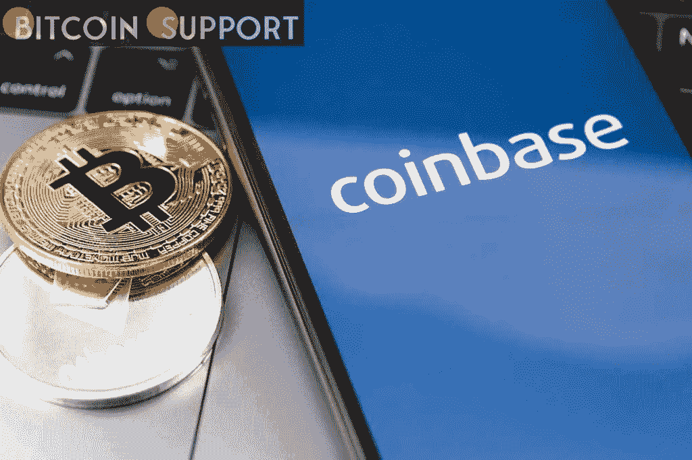
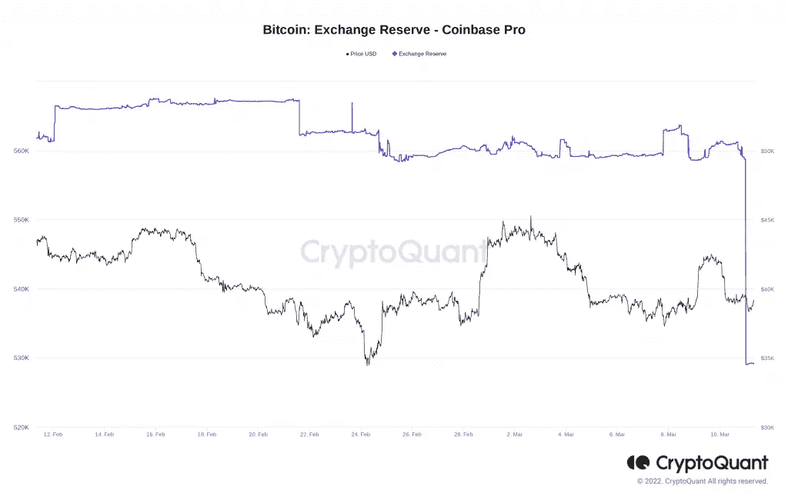
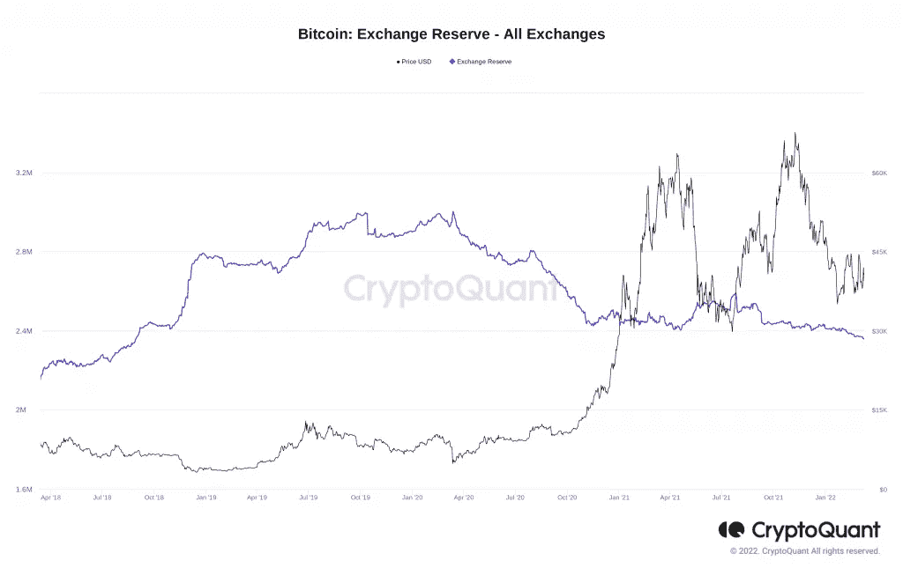
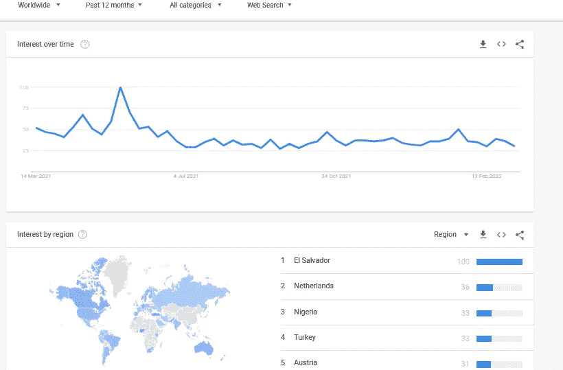

# 批量采购？近 3 万 BTC 在三次交易中转出比特币基地职业

> 原文：<https://medium.com/coinmonks/purchasing-in-bulk-almost-30k-btc-is-transferred-out-of-coinbase-pro-in-three-transactions-db07e6a1f0ec?source=collection_archive---------57----------------------->

**Visit our website:-** [**https://bitcoinsupports.com/**](https://bitcoinsupports.com/)

如果属实，这表明有人向 BTC 作出了超过 10 亿美元的重大财政承诺。比特币(BTC)可能正在恢复机构投资者的兴趣，因为数据显示大量比特币正在离开比特币基地主要交易所。

3 月 11 日，经 Whale Alert、CryptoQuant 等资源监控，一个不知名的钱包从美国平台获得约 3 万 BTC。

**比特币基地 Pro 市值缩水 11.5 亿美元。比特币基地专业投资机构比特币基地专业投资公司的三笔不同交易表明了买入的可能性。

分别为 BTC 9843 人、BTC 9901 人、BTC 9867 人，共计 29620 BTC。

[https://twitter.com/whale_alert/status/1502075145707528197](https://twitter.com/whale_alert/status/1502075145707528197)

[https://twitter.com/whale_alert/status/1502075147796291590](https://twitter.com/whale_alert/status/1502075147796291590)

[https://twitter.com/whale_alert/status/1502075149302087687](https://twitter.com/whale_alert/status/1502075149302087687)

虽然这笔交易对价格表现没有影响，但如果被确认为合法购买而不是内部交易，这将表明一家比特币基地专业企业以大约 39，000 美元的现值向 BTC 划拨了大约 11 亿美元。** 

**Visit our website:-** [**https://bitcoinsupports.com/**](https://bitcoinsupports.com/)

更广泛地说，外汇储备本月和上个月持续下降，再次达到多年来的低点。截至上周五，CryptoQuant 追踪的 21 家交易所的 BTC 储备合计为 235.7 万 BTC。

**Visit our website:-** [**https://bitcoinsupports.com/**](https://bitcoinsupports.com/)

根据 Glassnode 的累积趋势得分，市场现在处于不确定状态，尚未趋向于累积。普通大众对比特币仍然不感兴趣。与此同时，从交易所用户之外对比特币的兴趣来看，购买比特币的个人显然不是这个行业的新来者。根据谷歌趋势的统计，对“比特币”的搜索查询一直保持适度——在 2021 年下半年几乎保持不变。只有去年 5 月份油价跌破 3 万美元才引起了广泛关注，尽管最近全球形势有所好转，但这一趋势并没有逆转的迹象。

在过去的 12 个月里，萨尔瓦多收到了与其人口相比最高的请求，因为该国去年将 BTC 合法化。

**访问我们的网站:-**[**【https://bitcoinsupports.com/】**](https://bitcoinsupports.com/)

**免责声明:这些是作者的观点，不应被视为投资建议。读者应该自己做研究。**