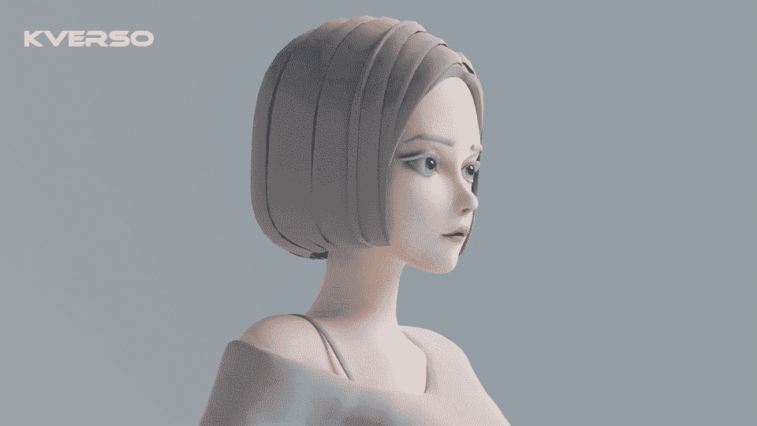
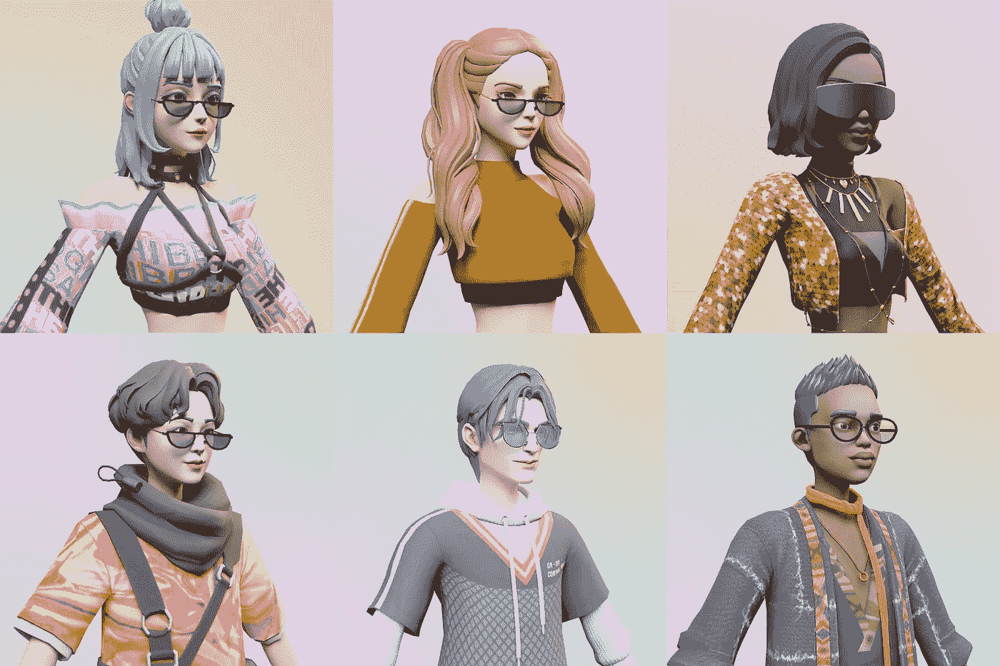
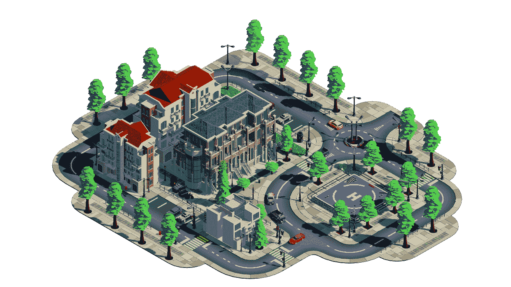

# KVERSO 的 NFT 和元宇宙问答(一)

> 原文：<https://medium.com/coinmonks/q-a-with-kverso-2a734082e7e8?source=collection_archive---------8----------------------->

**1。“Kverso”是什么意思？**

k 是 Keystone 的缩写。我们希望我们的项目能够成为未来网络空间人类生活的基础设施之一。VER 象征着元宇宙，我们希望 K 宇宙的生态能够自成一体，独立成长。所以代表社会，社交，和社会。我们无法用单一的团体或个人来建造一个元宇宙，因此克维尔索的产品对全世界的人类开放。我们希望聚集志同道合的伙伴，Kenners (K-Universe 公民)，在网络乌托邦创造属于我们所有人的东西。

**2。你会如何描述你的艺术风格？**

我们希望每个人除了自己之外，没有其他人可以定义自己。所以卡比肖像应该是多样化的。这就是为什么 KVERSO 团队中的艺术家会参考许多潮流时尚作品和文化时尚。通过使用自建的三维 HPM 模型和光线追踪技术，图像清晰且具有科技感。我们希望 KABI(Kenner Avatars Beyond Imagination)能够体现一种包容和多样化的时尚美学，最重要的是，让自己与 NFT 的其他艺术品区分开来。3D 人像的制作成本和耗时远高于 2D，但这也带来了高度的差异化和坚实的技术壁垒，以避免抄袭。

**3。是什么吸引你去 NFT 创作，而不是传统的基于画布的艺术？**

传统艺术是上流社会的游戏。2021 年，全球艺术品拍卖行业再创新高，成交额增幅超过 70%。富裕群体只是变得更加富裕，普通人的生活却在倒退。去中心化和区块链技术是人类打破传统经济秩序枷锁的机会。元宇宙没有垄断和压迫，我们可以在网络空间建立一个共享的乌托邦。KVERSO 选择出版《卡比 NFT》来招募志同道合的伙伴。我们不想为了取悦少数人而妥协，但我们更愿意向世界各地的所有人开放我们的 KVERSO 愿景。我们的艺术是公共艺术、平等艺术、多元艺术。

**4。为什么是 NFTs？**

最初，KVERSO 团队只想在元宇宙发展游戏行业。在观察了过去一年的市场走势后，我们开始感受到时代的脉搏。元宇宙是一个比游戏大得多的概念，它应该承载人类生活场景的重量，所以我们重新定向了路径。卡比 NFT 提供元宇宙公民身份确认和数字资产安全。肯纳可以用自己在链条上的专属身份和元宇宙之外的身份来定义“我是谁”。卡比是一种艺术，一种资产，也是肯纳的身份徽章。推出 KABI 是我们在 K-Universe 和 KVERSO 打造社群和生态的第一步。

**5。你能告诉我们更多关于你的项目吗？**

克韦尔索项目包括两个关键部分:肯纳和 K 宇宙社区。

KABI 包括 NFT 肖像，可定制的 3D 头像，个人画廊和个人频道，用户可以通过 KENNER 头像体验 3D K-Universe 的下一代社交和多人功能。图库用于保留和展示具有交易功能的用户获取的数字资产；用户可以在他们的频道上发布视觉信息，以展示 Web3.0 时代的网络生活方式，定义自己，并赋予他们虚拟身份。第一批 KABI 持有者将收到一个创作者的包，包括 4 件社区名称为“开拓者”的数字 NFT 服装资产

K-Universe 是一个基于区块链、NFT、3D 引擎、VR 和私有领域流量概念的去中心化社交、游戏和创作共享元宇宙。我们将为肯纳夫妇提供 Web 3.0 级别的社交体验。更多的功能和权利会及时被发现。请关注我们的官方网站和官方账号。

**6。将铸造多少 NFT？你能告诉我们你是如何创造艺术的吗？**

我们将发行 10，000 张 NFT·卡比的肖像。我们还将在未来发布各种 NFT，如服装、土地等。并非所有这些项目都将为 MINT 发布，但我们推出 NFT 的主要原因是为了保护玩家的数字资产。

卡比当然是 KVERSO 最近的核心产品。NFT 头像是去中心化社区的标志，也是打开元宇宙生态的完美钥匙。我们建立了卡比 NFT 使用我们的三维 HPM(高多边形模型)与光线跟踪技术，这是不同于市场上所有的纯 2D 图像。服装和配饰由设计师团队根据近年来的流行趋势和世界上许多国家的传统着装风格进行挑选。我们希望 NFT KBAI 能够尽可能多样化。我们相信这个由 KVERSO 团队优化了 7 个月的作品集一定会刷新去中心化社区。

KVERSO 团队认识到世界是一个整体，WEB3.0 时代的人类社会应该停止因差异而相互歧视，因此我们根据全球种族比例公平分配 KABI 的形象。除了人类，我们也希望每个人都能在 K 宇宙中找到自己的位置。因此，KVERSO 团队还设计了 2%的卡比 NFT，以显示我们对少数群体的支持。

**7。人们可以繁殖，下注，租借你的 NFT 吗？或者它会出现在游戏中或者成为一把刀吗？**

当然，用户可以自由决定他们的 NFT 在区块链上的位置和用途。

道社区是一种非常创新的组织方式。我们对此非常乐观。不过，虽然 K 宇宙的框架已经形成，但几个功能上的连锁效应只有在公民加入后才能得到验证。KVERSO 团队需要保证良好的社区氛围和活跃的 UGC 输出，才能讨论是否采用 DAO 机制。

NFT 的价值增值所涉及的经济体系非常复杂，轻率的决定可能会打乱 K-Universe 的价值逻辑，不利于 KVERSO 社区的长远发展。因此，我们需要仔细讨论并确定整个项目的经济体系，然后才能最终确定。

**8。你为什么在互联网计算机上建立你的项目？**

IC 在技术层面上比其他区块链社区更新颖，完全可以用一个 Web3.0 级别的去中心化框架实现一些优秀的功能。IC 网络支持存储在区块链本身，它还允许三维 NFT 建模，这是 ETH 和其他 L1 区块链不能做到的。我们将把 NFT 资产和部分开放世界功能转移到 IC 网络，以确保用户资产和元宇宙运行的高安全性和可靠性。

**9。你的发布最让你兴奋的是什么，你的发布是哪一天？**

我们真的很期待在 K 宇宙中看到未来的肯纳生活方式。那该有多神奇啊！我们计划在 6 月 1 日推出第一批 1000 个 KABIs，再次邀请大家关注我们的官方 Twitter 账户和 Discord 频道，敬请关注！

**10。你会给那些试图进入 NFTs 世界的人什么建议？**

如果您是消费者，请在购买 NFT 前明确您的需求和预算，并深刻理解这些花哨词语背后的真正含义。很多有才华的人在这个行业展现自己的才华，但也有很多是不值这个价的。仿品和纯利润导向的产品充斥市场。请尽可能多的了解相关信息，知道自己的极限。

如果你是开发人员，也请明确你的目标，以及你将在团队中扮演什么角色。如果你自己建立一个团队，创建一个公司会更有挑战性。你要对偏好和市场需求、投资人偏好、团队运营、会员能力、发展目标、路线图有足够的了解。如果一个项目不能商业化，或者不能投入时间和金钱，结果就不会令人满意。不要太乐观。

11。你能想象未来最有价值的 NFT 空间在互联网计算机上吗？

IC 的技术进步是不可否认的。存储成本较低；速度比其他公共链更快，支持更多样化的数字资产和功能。如果要支持像元宇宙、gamefi 这种拥有大量用户和数据交互的应用，在技术层面 IC 一定是最佳选择之一。

**12。你认为为什么 NFT 在如此短的时间内变得如此有价值？**

在我看来，这是去中心化代币从一般等价物向实用产品过渡阶段的奇特现象。自 NFT 出现以来，去中心化社区可以为全人类提供价值判断，现在它将把服务从钱包账户转移到特定人群。NFT 资产是未来，因为我们很难确认我们资产的所有权。例如，服装制造商可以同时发出 NFT 和发送实体产品，以确保用户不会收到假冒产品。NFT 是非常可靠的资产证明。珠宝、汽车等更昂贵的物品。，也可以用 NFT 来鉴别真伪和追溯来源。NFT 的资产很难被窃取。只要你有一个数字终端，你就可以把你的 NFT 资产带到任何地方。

**13。你认为你比其他竞争对手有什么优势？**

KVERSO 制作的 3D 风格 NFT 肖像在市场上很少见。像素风格的肖像和游戏充斥着今天的元宇宙世界，但这种情况不会永久存在。元宇宙项目的下一阶段需要比当前水平更多的时间和人力成本的 3D 开发资源，这恰好是 KVERSO 团队的优势。虽然我们的 K-Universe 刚刚成形，但底层框架的可扩展性远非 2D 的竞争对手可比。我们目前正在测试一些功能，如 3D 头像定制、装扮功能、3D 服装和具有 with 化功能的建筑模型上传。这些功能将在未来几个月内提供给用户。我们已经建立了数以千计的 3D HPM 模型，以及可以无缝加载的大场景地图，以确保 K 宇宙可以成为市民的实际日常生活场景。Gamefi 已经无法概括 K 宇宙的规模。我们还策划了 Play To Earn 和 UGC，并与 CCC 等多家创作者经济平台达成合作意向。基于比较方案的分散式肯纳主页/社会论坛正在开发中。我们将帮助用户 NFT 他们的创作，以实现未来互惠互利的局面。许多项目方和投资者都看好我们的全面布局，KVERSO 团队有信心实现这些计划。

**14。请告诉我们您在构建项目时面临的挑战？**

我们是一群年轻人，主要是 1995 年到 2000 年的。我们用我们团队的资金开发了 7 个月，营销才 1 个多月。我们确实在资金和团队内部的初期合作上遇到了一些困难。由于发展元宇宙是一项相对困难的任务，发展层面的进展必须循序渐进。

15。你的短期和长期成就和目标是什么？

KVERSO 团队的短期目标是建立一个让 KABI 持有者满意的 K 宇宙社交生态。在我们完成无缝开放世界的基本功能和框架后，我们将允许全球所有玩家注册。建立一个 PGC 和 UGC 游戏社区，并使用合理的奖励机制，鼓励每个人建立元宇宙生态，在那里我们分享并完美平衡社交互动、创作和游戏功能。

希望在 2030 年开发出一个与现实生活平行的 K 宇宙。用户可以在两个世界享受我们的服务和产品，如现实/虚拟并行的创意设计比赛，实体商品的 nfit 化，与品牌和跨界合作等。，为每个人创造不可思议的价值。

**16。给我们一些关于你的路线图的细节？**

2022Q2

赛博空间 K-Universe Beta 测试，多人元宇宙游戏，UGC 装扮&服装上传，聊天功能，社交休闲游戏功能

2022 年第三季度

定制建筑(Dream Builder) Alpha 测试，具有建筑材料定制/上传功能。

2022 第四季度

游戏改变者 Alpha 测试，实现游戏关卡设计功能，玩到赚，UGC & PGC 功能，VR，AR，官方创意活动进行中…

具体情况会根据开发进度实时更新。敬请关注我们的官网和官方账号！

**17。有扩展到元宇宙的计划吗？**

与其说我们在向元宇宙扩张，不如说元宇宙从一开始就是我们的目标。在我看来，卡比·NFT 是克维尔索队打开元宇宙生态的钥匙。我们走过了通向这一最终目标的各种道路，最终确认 NFT 是目前的最佳选择。

18。你的 NFT 将来会被令牌化吗？

KVERSO 团队首先考虑的是卡比 NFT 肖像的艺术和收藏价值，以及它对我们元宇宙社交/游戏能力的重要性。对于代币，我们可以通过 NFT 空投等方式发放。我们认为，NFT 商业化也是一个很好的发展方向。我们希望 KVERSO 社区能够共同构建 Web3.0 一代和面向未来的人类生活场景。为此，我们愿意坚持下去，保持 K 宇宙的健康成长和 PGC&UGC 社区的活力。

**19。许多个人仍然对去中心化技术充满疑虑。你有没有想过吸引那些不熟悉分权的人加入你的 NFT 项目？**

我们会的，但不是现在。只要我们的 K 宇宙足够精彩，人自然会被吸引。我们将证明非功能性技术和去中心化属于全人类，网络乌托邦不是神话传说。

**20。你对其他发展中的元宇宙项目持什么态度？**

我们希望看到权力下放社区的进步发展。Kverso 团队欢迎所有开发者团队与我们合作，突破网络障碍，最终实现跨所有网络使用数字资产。这对每个人都有好处。

**21。将卡比 NFT 持有人将有好处，在你的元宇宙？**

为了表示对我们早期支持者的感谢，正式发布的参与者将在 K-Universe 中获得以下好处:

1.荣誉称号:

早期的 KABI 持有人将被认证为 K-Universe 的创始会员，“BLAZER”将显示在他们的昵称和主页上。

2.早期支持者的数字服装:

一套服装将在第一个入口空投，有几种时尚风格可供选择。每件藏品都是 NFT 的个人财产，可以在网上交易。因此，开拓者成员铸造一枚卡比将总共获得 5 枚 NFT。

3.提前体验肯纳 3D 头像定制:

很快，服装上传和换装功能将对开拓者成员开放。以及建筑材料和模型定制。开拓者成员将有最大的创造性的访问能力，货币化和交易他们的数字服装和建筑纹理。

4.土地购买:

开拓者成员在 K-Universe 土地分配上有优先权。

5.个人资料:

BLAZER 成员可以重命名并写一篇关于他们的 KABI 的简介。一旦配置文件被存储，详细信息将是唯一的。个人资料将显示在官方网站上。