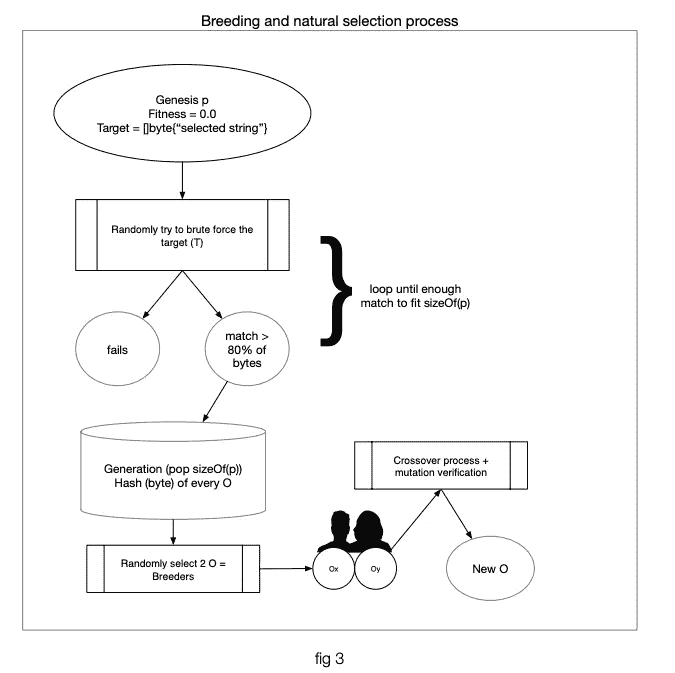
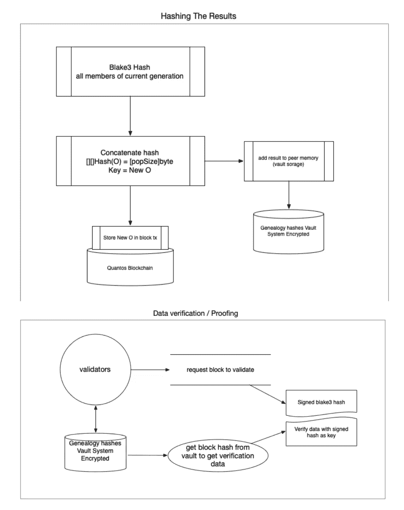

# Quantos 区块链，DNA 的证明，特性和开发 ETA 讲解。

> 原文：<https://medium.com/coinmonks/quantos-blockchain-proof-of-dna-features-and-development-eta-explained-10ca643e944b?source=collection_archive---------71----------------------->

嗨，亲爱的读者，如果你点击了这篇文章，你可能想知道，为什么？什么？另一个区块链哦，不！但是等一下，看完这篇文章你就明白为什么了，我保证！

如果你还没有读过，在这里可以找到理解我一般思维方式的很好的“初级读本”:[https://nicknailers 69 . medium . com/manifesto-for-a-new-world-order-dicted-by-the-free-man-via-fin tech-and-cryptocurrences-4fb 5213 F7 f5e](https://nicknailers69.medium.com/manifesto-for-a-new-world-order-dicted-by-the-free-man-via-fintech-and-cryptocurrencies-4fb5213f7f5e)

以下是那篇文章中的重要内容，这些内容让我开发了 Quantos，并从 2017 年开始为它找到了新的想法。

*   Satoshi 让金钱变得更加大众化和容易获得的愿景并没有实现……到目前为止。
*   交易费、采矿费、最低验证者股份等等…只会扩大贫富之间的差距。
*   现在很难汽油费(即。:以太坊和衍生品)的价格非常高，对于进入 de-fi 市场的人来说，这是为了证明开发和发布一个新的去中心化应用程序的成本是合理的。
*   大多数加密货币相关费用很难预测，因为它们会根据挖掘/验证生态系统而变化，这也导致了其波动性。
*   主流的采用不会发生，直到开发者开发出以用户为中心的区块链，它们仍然是以开发者为中心的，并且对于普通的互联网用户来说在技术上太复杂而难以理解。

# **Quantos 将专注于修复:**

*   费用；
*   公平；
*   通过简化面向用户的生态系统和工具来提高采用率；
*   未来的证明和安全性的增加；

# 从 Quantos 中受益最大的行业:

*   社会项目；
*   高匿名行业(即。:医疗)
*   大型分散项目(社交网络、metaverses、nft 画廊)
*   按次付费内容提供商
*   在线教学
*   奢侈

# DNA 证明(POD)解释

Quantos 依靠一种称为 dna 证据的概念来保护所有内容，如图像、视频、文本，并保证它们是有效的。与传统打样相比，它的优势在于简单、快速且随机安全。这是 Nicolas Cloutier 在 2018 年试验基因编程时发明的。

POD 提供了一种解决方案，可以解决在需要未来证明、高安全级别和管理用户内容的行业中遇到的安全和验证问题。例如:社交网络、医疗数据、付费内容、新闻渠道等等。

下图试图用简单的方式解释类似 DNA 的数据生成过程，这一过程类似于自然选择和适者生存。

更多关于 POD 的技术细节，可以看这里的简化纸:[https://github . com/quantos network/medias/blob/main/proofofdna-explained-quantos-v 1.0 . pdf](https://github.com/quantosnetwork/medias/blob/main/proofofdna-explained-quantos-v1.0.pdf)

# Quantos 功能

*   Quantix，一种类似于 solidity 的脚本语言，增加了一些功能。Quantix 使用 c++开发，SDK 将可用于 javascript、typescript、golang 和 python。
*   稳定且可预测的费用
*   最低余额账户不收费
*   基于帐龄和可信度以及其他标准而不是基于风险金额的分散式风险证明系统。
*   能够存储经过验证和签名的资产并快速提供服务。
*   使用 NIST 后量子算法 round3 候选的健壮密钥库和加密。
*   传输中加密
*   无加密数据匿名化(基于编码)
*   预制且易于使用的脚本来整合商家/购物车(例如 magento2)

# Quantos ETA

Quantos 仍在大量开发中，并非所有功能都已实现。然而，每天都有重大的突破。开发进度和完整代码可以在下面的 github 资源库中找到:【https://github.com/quantosnetwork

如需了解更多信息或想要提供帮助，您可以发送电子邮件至 dev@quantos.network 或 nicknailers69@gmail.com(我的个人邮箱)。

> 加入 Coinmonks [电报频道](https://t.me/coincodecap)和 [Youtube 频道](https://www.youtube.com/c/coinmonks/videos)了解加密交易和投资

# 另外，阅读

*   [Bitsgap 审查](/coinmonks/bitsgap-review-a-crypto-trading-bot-that-makes-easy-money-a5d88a336df2) | [Quadency 审查](/coinmonks/quadency-review-a-crypto-trading-automation-platform-3068eaa374e1) | [Bitbns 审查](/coinmonks/bitbns-review-38256a07e161)
*   [密码本交易平台](/coinmonks/top-10-crypto-copy-trading-platforms-for-beginners-d0c37c7d698c) | [Coinmama 审核](/coinmonks/coinmama-review-ace5641bde6e)
*   [印度的加密交易所](/coinmonks/bitcoin-exchange-in-india-7f1fe79715c9) | [比特币储蓄账户](/coinmonks/bitcoin-savings-account-e65b13f92451)
*   [OKEx vs KuCoin](https://coincodecap.com/okex-kucoin) | [摄氏替代度](https://coincodecap.com/celsius-alternatives) | [如何购买 VeChain](https://coincodecap.com/buy-vechain)
*   [币安期货交易](https://coincodecap.com/binance-futures-trading)|[3 commas vs Mudrex vs eToro](https://coincodecap.com/mudrex-3commas-etoro)