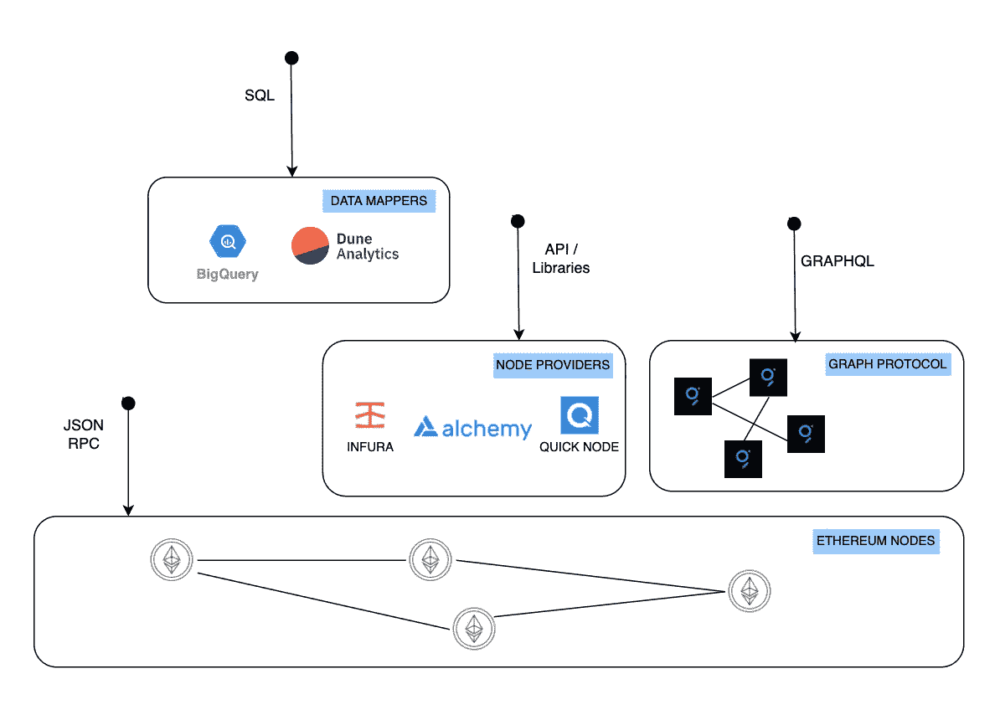

# 查询以太坊区块链

> 原文：<https://medium.com/coinmonks/querying-ethereum-blockchain-a25ebcaca83a?source=collection_archive---------15----------------------->

以太坊公共网络使用 trie 数据结构在区块链中存储数据。网络的每个(完整)节点维护一份区块链数据的副本。虽然 Ethereum 没有提供任何查询语言来访问数据，但是有很多正在积极开发的解决方案可以帮助查询区块链数据。

Endpoints for accessing the Ethereum blockchain data

**使用以太坊节点**

[Geth](https://github.com/ethereum/go-ethereum) 是以太坊的 Go 实现，可以安装在你的本地机器或者服务器上。这会下载整个区块链数据，并使用 LevelDB 对其进行索引。可以使用 Geth 实用程序或 JSON RPC 直接访问数据。虽然这提供了安全性和信任，但是安装和维护您自己的节点会带来很大的开销。

**使用节点提供商**

Web3 APIs(如 [Infura](https://infura.io/) 、 [Alchemy](https://www.alchemy.com/) 、 [Quick Node](https://www.quicknode.com/) )去掉了直接与以太坊客户端交互的复杂性。他们负责安装和管理基础设施，并提供增强的 APIs 库来访问数据。他们提供付费服务，免费账户有限制。尽管它们可以很好地按块和事务访问数据，但对于数据分析中常见的聚合或过滤操作来说，它们效率不高。

**使用数据映射器**

数据映射器通过将区块链数据转换成易于查询的关系/非关系存储来解决上述问题。

[Google Bigquery](https://cloud.google.com/blog/products/data-analytics/ethereum-bigquery-public-dataset-smart-contract-analytics) 连接以太坊节点，将数据转换成表格格式，然后可以使用 SQL 查询。费用基于查询处理的字节数。

[Dune Analytics](https://dune.xyz/browse/dashboards) 允许使用 SQL 查询区块链数据。默认情况下，查询和数据集是公共的。它允许用户探索和派生其他用户的查询，并建立在现有知识的基础上。这极大地改进了开发工作。他们提供免费和付费计划。

**使用图形协议**

[Graph](https://thegraph.com/) 是一个分布式协议，它使用 GraphQL 索引和支持区块链数据的高效查询。通过使用子图(开放 API)，它允许用户有效地检索相关数据，而不依赖于集中的提供者。用户必须支付查询费来提取所需的数据。

虽然大量分散的应用程序依赖于集中的提供商，但 Graph protocol 旨在实现一种真正的分散解决方案来访问区块链数据。它允许任何人构建子图，并激励社区协调和发展网络。鉴于像 Uniswap 和 AAVE 这样的公司正在使用 graph network，这可能是 web3 数据层的潜在游戏规则改变者。

> *加入 Coinmonks* [*电报频道*](https://t.me/coincodecap) *和* [*Youtube 频道*](https://www.youtube.com/c/coinmonks/videos) *了解加密交易和投资*

# 另外，阅读

*   [Bookmap 评论](https://coincodecap.com/bookmap-review-2021-best-trading-software) | [美国 5 大最佳加密交易所](https://coincodecap.com/crypto-exchange-usa)
*   最佳加密[硬件钱包](/coinmonks/hardware-wallets-dfa1211730c6) | [Bitbns 评论](/coinmonks/bitbns-review-38256a07e161)
*   [新加坡十大最佳加密交易所](https://coincodecap.com/crypto-exchange-in-singapore) | [购买 AXS](https://coincodecap.com/buy-axs-token)
*   [红狗赌场评论](https://coincodecap.com/red-dog-casino-review) | [Swyftx 评论](https://coincodecap.com/swyftx-review) | [CoinGate 评论](https://coincodecap.com/coingate-review)
*   [投资印度的最佳密码](https://coincodecap.com/best-crypto-to-invest-in-india-in-2021)|[WazirX P2P](https://coincodecap.com/wazirx-p2p)|[Hi Dollar Review](https://coincodecap.com/hi-dollar-review)