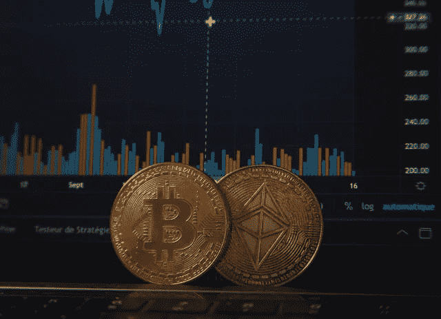

# 比特币和以太坊快速笔记

> 原文：<https://medium.com/coinmonks/quick-note-on-bitcoin-and-ethereum-71b47ae19b37?source=collection_archive---------41----------------------->

# 比特币 vs 以太坊

最近，我的一位同事向我提出了这个问题，当时他正在从投资机会的角度对两者进行比较。

但是从比较的角度来看，这并不简单，因为虽然两者都使用区块链技术，但它们之间有着根本的区别。

以太坊是可编程的，比特币不是。

> 比特币和以太坊有着本质的不同，因为前者旨在实现去中心化金融，而后者旨在实现应用和合同。

# 可编程是什么意思？

比特币是作为一种替代(数字)货币而产生的，它是一种价值储存手段。

以太坊扩展了比特币的基础技术，即区块链。

以太坊利用区块链技术不仅维护了一个分散的支付网络，还存储了安全的分散合同和应用程序(智能合同)。

现在以太坊有了自己的数字货币以太网，用于支持这些合同和交易。

虽然人们将两者进行比较，但以太坊的初衷是为了补充而不是与比特币竞争，因为它们服务于不同的目的。

# 这对你的投资组合意味着什么？

在你的投资组合中，比特币的角色将是保值和充当避风港(想想数字黄金)，而以太坊的角色将是获得去中心化的金融服务(想想大规模去中心化的计算机)。

因此，如果你想知道比特币和以太坊，希望这澄清了一些事情。

> 加入 Coinmonks [电报频道](https://t.me/coincodecap)和 [Youtube 频道](https://www.youtube.com/c/coinmonks/videos)了解加密交易和投资

# 另外，阅读

*   [印度加密交易所](/coinmonks/bitcoin-exchange-in-india-7f1fe79715c9) | [比特币储蓄账户](/coinmonks/bitcoin-savings-account-e65b13f92451)
*   [OKEx vs KuCoin](https://coincodecap.com/okex-kucoin) | [摄氏替代品](https://coincodecap.com/celsius-alternatives) | [如何购买 VeChain](https://coincodecap.com/buy-vechain)
*   [币安期货交易](https://coincodecap.com/binance-futures-trading)|[3 comas vs Mudrex vs eToro](https://coincodecap.com/mudrex-3commas-etoro)
*   [如何购买 Monero](https://coincodecap.com/buy-monero) | [IDEX 评论](https://coincodecap.com/idex-review) | [BitKan 交易机器人](https://coincodecap.com/bitkan-trading-bot)
*   [CoinDCX 评论](/coinmonks/coindcx-review-8444db3621a2) | [加密保证金交易交易所](https://coincodecap.com/crypto-margin-trading-exchanges)