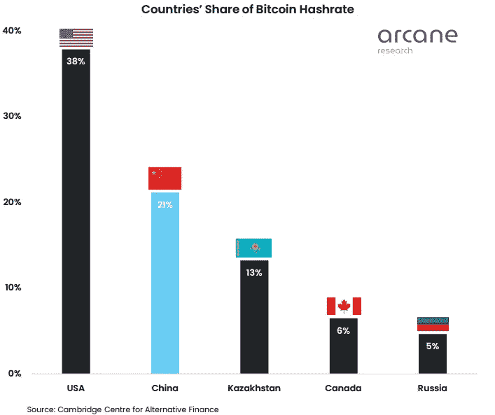

# 快速概述加密、采矿和我们的发展方向。

> 原文：<https://medium.com/coinmonks/quick-overview-of-crypto-mining-and-where-we-are-heading-df705df2895e?source=collection_archive---------43----------------------->

在经历了五月的残酷开局后，加密市场现在似乎可以松口气了。比特币现在的交易价格在 28000 美元到 30500 美元之间。Feer 和 greed 指数在 5 月 17 日短暂触及 8——这是该指数自 2018 年 2 月 1 日以来的历史上第二低的纪录水平，此前 8 次触及这些水平。

**Fear and greed index chart**

比特币连续 8 周提现，这在历史上从未发生过。可能是因为月亮的崩溃，再加上美国美联储不利的宏观政策导致了持续的抛售，和整个市场的恐慌。由于市场总是向前看的，并考虑到比特币、S&P500 和纳斯达克之间的高度相关性，我们预计未来会有更多痛苦。我强烈建议，在这段时间里，只投资高质量的项目，这些项目具有你深信不疑的强大基本面。最好的办法可能是退出风险更高的替代硬币，以及由此产生的投机，因为它们可能会大幅下跌，有些可能永远无法恢复到以前的价格。在我看来，这些整合期对整个加密市场是有益的，有助于将牛奶从奶油中分离出来。专注于建设的项目，以及那些旨在解决现实世界问题的项目，将会比以往更加强大。没有..加密并没有像许多人预测的那样消亡。

**比特币挖掘**

如果你记得中国在 2021 年 6 月禁止比特币挖矿，然而来自剑桥大学剑桥替代金融中心(CCAF)的新数据表明，中国仍然拥有一个庞大的比特币挖矿行业。

如上图所示，大量的比特币哈希值仍然来自中国，在那里非法生产。如果最集权、最独裁的政府之一未能禁止比特币挖矿，问题就出现了。其他政府反对比特币挖矿有意义吗？为采矿业创建一个公平的监管框架是再好不过的策略了，这样双方都可以继续从对方那里受益，这可能会带来创新和经济扩张。一些政府可能会在看到这些新数据后改变主意，并希望从中吸取教训。

**我们要去哪里**

与许多其他人相反，我认为这些持续抛售的时期将我们与其他人区分开来。我们，这个行业的忠实信徒，继续建设、贡献和 DCA(平均成本),以及其他在这里快速赚钱的人，每当一些负面消息冲击市场，或者炒作消失时，他们也是如此。

加密行业肯定处于非常早期的阶段，在最近的特拉-UST 稳定硬币崩溃事件之后，对稳定硬币的监管将会加快，正如美国财政部长珍妮特·耶伦所说，需要一个框架来防范风险。我并不认为对 stablecoins 的监管会对该领域产生负面影响，我们越早制定出框架，对整体采用就越有利，这可能会引领我们进入下一轮牛市。

> 加入 Coinmonks [电报频道](https://t.me/coincodecap)和 [Youtube 频道](https://www.youtube.com/c/coinmonks/videos)了解加密交易和投资

# 另外，阅读

*   【Capital.com】|[港加密借贷平台](https://coincodecap.com/crypto-lending-hong-kong)
*   [如何在 Uniswap 上交换加密？](https://coincodecap.com/swap-crypto-on-uniswap) | [A-Ads 评论](https://coincodecap.com/a-ads-review)
*   [WazirX vs CoinDCX vs bit bns](/coinmonks/wazirx-vs-coindcx-vs-bitbns-149f4f19a2f1)|[block fi vs coin loan vs Nexo](/coinmonks/blockfi-vs-coinloan-vs-nexo-cb624635230d)
*   [本地比特币审核](/coinmonks/localbitcoins-review-6cc001c6ed56) | [加密货币储蓄账户](https://coincodecap.com/cryptocurrency-savings-accounts)
*   [什么是保证金交易](https://coincodecap.com/margin-trading) | [美元成本平均法](https://coincodecap.com/dca)
*   [支持卡审核](https://coincodecap.com/uphold-card-review) | [信任钱包 vs 元掩码](https://coincodecap.com/trust-wallet-vs-metamask)
*   [Exness 回顾](https://coincodecap.com/exness-review)|[moon xbt Vs bit get Vs Bingbon](https://coincodecap.com/bingbon-vs-bitget-vs-moonxbt)