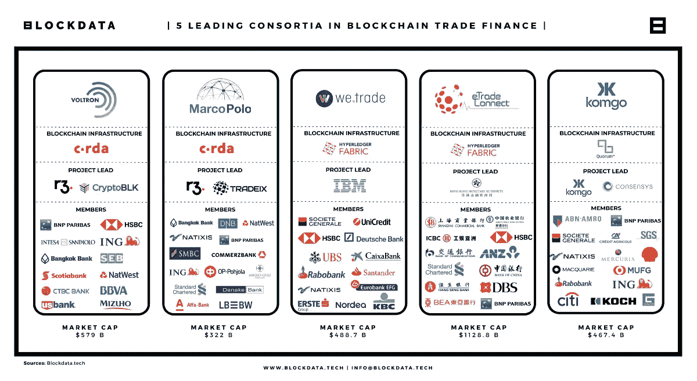

# R.I.P .贸易金融欺诈& NBFCs:区块链的真实用例，终于？

> 原文：<https://medium.com/coinmonks/r-i-p-trade-finance-fraud-nbfcs-a-real-use-case-for-blockchain-finally-6bb983304b88?source=collection_archive---------15----------------------->

# 不再有信用证诈骗？

## R.I.P .贸易金融欺诈和 NBFCs 签发“非评级”信用证。

区块链正在以多种方式变革贸易融资。它可以在以下方面提供帮助:

1.减少完成交易所需的步骤，从而降低成本并提高效率

2.让跟踪交易各方的付款变得更容易，这样欺诈或出错的可能性就更小

3.允许更多的人同时获得交易的相关信息，这有助于他们做出更好的决定，是否应该投资于特定的交易。

想象一下这样一个世界:国际贸易在一个公平的竞技场上进行，所有各方——买方和卖方——都可以相信他们受到安全和透明系统的保护。

在这个世界里，目前控制市场的贸易中间商再也不能对他们的服务收取过高的费用。

> 交易新手？试试[加密交易机器人](/coinmonks/crypto-trading-bot-c2ffce8acb2a)或者[复制交易](/coinmonks/top-10-crypto-copy-trading-platforms-for-beginners-d0c37c7d698c)

在这个世界上，即使是最小的玩家也可以参与全球市场，而不必担心被欺诈者或骗子所害。

想象一下，在这样一个世界里，新兴经济体可以超越传统金融体系，创造大规模赤字，帮助国民摆脱贫困。

# 6.5 万亿美元的贸易融资缺口

国际商会(ICC)的新研究估计，为了回到 2019 年的水平，需要额外的[1.9 至 5 万亿美元](https://iccwbo.org/content/uploads/sites/3/2020/05/icc-trade-financing-covid19.pdf)的贸易融资。

**考虑到这一估计，以及现有的 2019 年贸易融资缺口(1.5 万亿美元)，我们现在需要 3.4 至 6.5 万亿美元才能实现可持续发展目标。在关于如何实现这一目标的持续辩论中，不应忽视银行可以发挥的作用。**

全球贸易融资市场预计在 2022 年达到 610.4 亿美元，预计到 2027 年将达到 858.5 亿美元，CAGR 增长率为 7.06%。

该行业传统上由银行和其他金融机构主导。

然而，随着区块链技术的出现，新的参与者进入了这个市场。

R3 就是这样一家公司，它正在迅速壮大，因为它正在彻底改变全球企业的融资方式。

# 贸易融资市场根本没有数字化

贸易融资市场是世界上效率最低、基于纸张的市场之一，但这不仅仅是令银行及其客户头疼的问题。

对于需要等待数月才能收到海外买家付款的企业来说，这也是一个负担。

通过蜗牛邮件发送文件的缓慢而复杂的过程可能需要几周或几个月的时间，这意味着即使你知道你的付款已经被批准，你仍然要等到一切都通过了才能拿到钱——有时甚至没有！

这种情况不会只发生一次:通常，如果流程的任何一步出现问题(无论是你的文件还是买家提交的文件)，那么一切都必须从头开始，因为没有人知道他们最初是从哪里停止的。

# 现有系统不安全，容易受到欺诈

大多数现存的都不是数字的，并为像 NBFCs 这样的坏演员留下了参与的可能性。不良行为者，如发行无价值信用证的非评级金融公司，被系统性地取消资格，因为他们甚至没有资格加入新的贸易融资平台。

该流程旨在排除那些没有可靠、值得信任的行为历史的人。这可以防止新成员在没有首先证明其价值的情况下加入，并确保只有具有良好记录的公司才被允许加入该网络。

当不良行为者被排除在网络之外时，他们就不能使用网络的服务或利益，这就为他们改进做法创造了强大的动力。

此外，无论是交易确认时间还是支付清算时间，系统都很慢。

# 区块链技术是这个市场的完美解决方案

这个行业缺乏透明度和安全性，导致了一个支离破碎的生态系统，浪费了企业、银行和政府的时间和金钱。

区块链技术是这个市场的完美解决方案。它是分散的、透明的和安全的，这三个特征对于贸易融资来说是至关重要的，但目前市场上的任何其他软件解决方案都不具备。

区块链技术将通过消除与跨境支付相关的中间商成本，为公司和政府节省资金；它还将通过提供交易的实时可见性，使每个参与者都能在供应链流程的任何给定时刻看到自己的商品在哪里，从而提高贸易融资的效率

# 贸易融资有潜力扩展到新兴市场

区块链技术的使用有助于为那些无法获得传统金融服务的人提供新的机会。

区块链能够创造新的市场，这些市场以前由于其地理位置或规模而无法获得。

# 易贸通的平台是贸易融资的未来

易贸通的平台是贸易融资的未来。它基于区块链技术，安全、透明且易于使用。任何市场或行业的任何人都可以使用它来交易任何货币——无论是美元还是欧元、英镑还是人民币。

## 那么，这一切意味着什么呢？

这意味着任何与贸易融资有利害关系的人都应该对 [Easy Trading Connect](https://easytradeconnect.com/) 、 [eTradeConnect](https://www.etradeconnect.net/Portal) 以及他们位于区块链的系统感兴趣。

这些公司已经开发出既安全、可靠又易于企业和银行使用的平台。换句话说，这是许多人一直在等待的解决方案。

Financely 是一家贸易金融公司，为企业提供广泛的服务，包括:

➤ **流动性来源**

➤ **信用证开具和担保**

➤ **资金发放证明**

➤ **付款条件谈判**

Financely Group 由一群具有前瞻性思维的企业家和银行家创立，他们看到了现代化贸易融资流程的需求，尤其是新兴市场和前沿市场的客户。

从那时起，我们与客户密切合作，开发新的业务方法，并取得了一些令人难以置信的成果。我们的客户现在可以期待:

➤ **所有请求的 24 小时周转时间**

➤ **通过** [**等**](https://easytradeconnect.com/) 实时可见自己的贸易交易

➤ **一个从头到尾的精简流程**

我们不与未评级的银行或陈旧的贸易融资系统做生意。相反，我们使用区块链贸易融资财团，其中包括世界上最著名的银行。

这样，您可以确保您的资金是安全的，并且您可以高枕无忧，因为我们会为您提供所需的流动性。

如果您需要信用证或资金证明，我们将在 24 小时内为您提供——因此，如果您想在国际上拓展业务并需要帮助，Financely Group 随时为您服务。