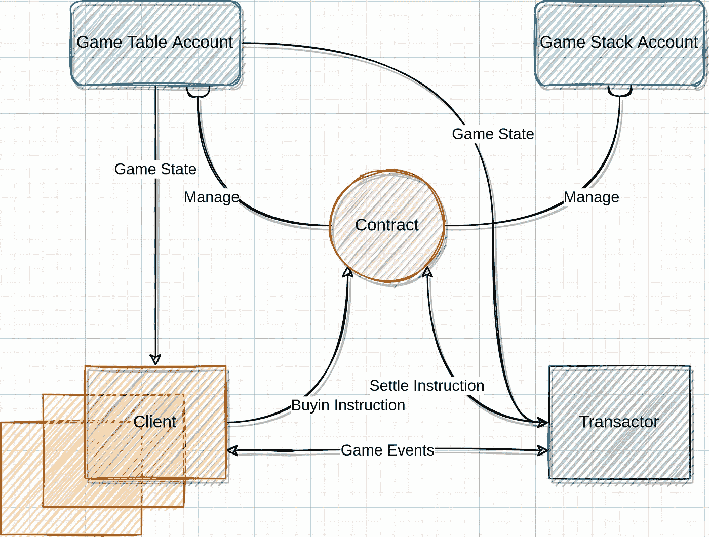

# 种族扑克技术揭示-加入游戏

> 原文：<https://medium.com/coinmonks/race-poker-tech-reveal-join-game-87369be3e825?source=collection_archive---------28----------------------->

嘿！我们很高兴你找到了来这里的路。

这是一系列文章中的第一篇，揭示了分散式技术是如何在 RACE Poker 中使用的。如果你想知道公平是如何保证的，这是你开始的正确地方！

现在，让我们把重点放在买入和索赔上。在传统的在线游戏中，玩家必须注册并存入至少 10 倍买入费的金额。例如，一名玩家可能需要存入$100，但最后却玩了几手$ 5-10 的牌。无论如何支付，玩家的钱都会被某个平台“暂时”保管。通常，该平台会对提现做出一些规定，玩家必须满足一系列要求才能拿回他们的钱。没有安全感，也不方便。游戏主持人可能会争辩说，这些“限制”确实是防止作弊的必要措施，我们同意这一点。但是还有其他方法来抑制恶意玩家。

在 RACE Poker 中，我们的目标是为玩家提供更好、可靠和方便的体验。没有这样的“中间”平台。相反，球员的钱包和区块链合同直接互动。每一个游戏，或者说每一张“桌子”，都是庄家契约所拥有的一个账户。经销商合同将处理玩家的买入和索赔(撤回)请求。玩家不需要存款。他们只有在实际买入时才付款。

像 ETH 这样与区块链合作听起来不现实，因为你必须为每笔交易支付汽油费，这将是一大笔钱。除此之外，你还必须等待确认，这通常需要一些时间。相比之下，索拉纳是一个真正的游戏改变者。索拉纳的费用相当低——买入交易不会让你多花一分钱，而且确认几乎是即时的:一秒钟。

一旦你加入游戏，你的账号地址将被写入游戏账号。每个参与游戏的人都会看到自己的信息。每场比赛都将有一个独立的帐户来存储玩家的买入费。当你离开牌桌，或者成为 SNG 游戏的赢家时，你可以通过庄家合约从这个帐户中取回钱。一切都是透明的，规则是不可改变的。从玩家的角度来看，用区块链合约买入比向一个他们不总是信任的平台存入一大笔钱更合理、更安全。

在下一篇文章中，我们将讨论如何洗牌。

公告:[https://t.me/racepoker_announcement](https://t.me/racepoker_announcement)
推特:[https://twitter.com/RaceGameTeam](https://twitter.com/RaceGameTeam)电报:[https://t.me/racegame](https://t.me/racegame)白皮书:[https://www.racepoker.app/whitepaper.html](https://www.racepoker.app/whitepaper.html)