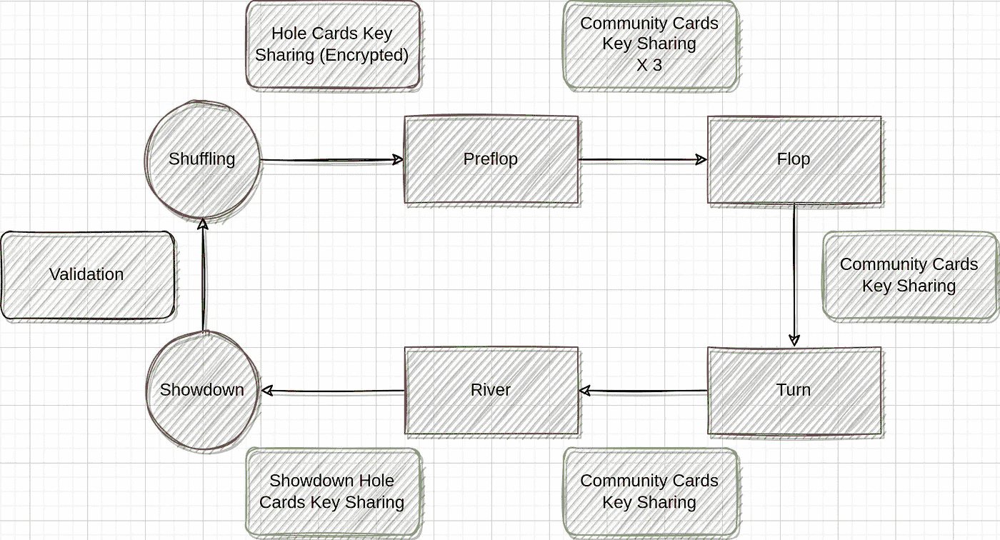

# RACE Poker 技术揭秘—密钥共享和解密

> 原文：<https://medium.com/coinmonks/race-poker-tech-reveal-key-sharing-and-decryption-800420d8a5e4?source=collection_archive---------23----------------------->

Key sharing process

先说密钥共享和解密。

一旦这副牌洗好，游戏将从发玩家的底牌开始。在德州扑克中，每个玩家都有两张底牌。例如，假设我们在游戏中有 6 个玩家，如果你是 UTG 位置，你将获得第 1 张和第 7 张牌(在我们的实际实现中，简化为第 1 张和第 2 张)。所以在你开始之前，每个玩家都要和你分享他们用在这两张卡上的钥匙。在一个 6 人游戏中，总共有 60 个密钥要共享，听起来有点多，但幸运的是密钥共享过程是并行的。

游戏过程中，对于所有客户端来说，游戏到了哪个阶段是显而易见的。对于每个阶段，交易者将提供一个关键身份列表，每个客户都可以检查。同时，每个客户将共享他们的密钥。

有三种类型的密钥共享:

首先，玩家底牌的密钥共享在翻牌圈阶段开始时进行。由于每个共享密钥只能由拥有相应卡的一个客户端读取，因此通信将根据我们在上一篇文章中讨论的方法进行加密。

第二，用于社区卡的密钥共享，在每个后续街道的开始运行。因为社区卡是公共信息，所以这些密钥不需要加密。

最后，摊牌的密钥共享在游戏结束时运行。与社区卡一样，在这种情况下，密钥不加密。

交易者总是能够识别密钥所有者，因为请求是签名的。但是对于加密的密钥，它无法知道正确的密钥是否被共享。事实上，交易者除了公开信息(社区牌和摊牌)之外，没有其他信息。只有接收者能够辨别密钥是否正确。如果交付了假密钥，解密将会失败。万一有恶意客户呢？

嗯，有一些可能无效的情况:

1.解密失败；

2.缺少必需的密钥；

3.来自交易者的数据不是预期的；

4.分散存储(赛后)的数据，不在意料之中。

如果这些情况发生了怎么办？答案是，游戏会中断。对于交易者和客户端，如果他们看到异常，他们将能够向官方服务器报告情况，或者发送交易以停止游戏。在传统的在线扑克游戏中，客户会信任服务器。但是根据 RACE Poker 的设计，为了允许其他人托管一个开源的交易器。任何方向的信任都是不可能的。本质上，共识只有在游戏正常进行时才存在。对于任何突发情况，停止游戏是最好的选择，来自官方团队或社区的治理是必要的。

在下一篇文章中，我们将讨论游戏结果提交。

> 加入 Coinmonks [电报频道](https://t.me/coincodecap)和 [Youtube 频道](https://www.youtube.com/c/coinmonks/videos)了解加密交易和投资

# 另外，阅读

*   [交易杠杆代币的最佳交易所](https://coincodecap.com/leveraged-token-exchanges) | [购买 Floki](https://coincodecap.com/buy-floki-inu-token)
*   [3 commas vs . Pionex vs . crypto hopper](https://coincodecap.com/3commas-vs-pionex-vs-cryptohopper)|[Bingbon Review](https://coincodecap.com/bingbon-review)
*   [加密复制交易平台](/coinmonks/top-10-crypto-copy-trading-platforms-for-beginners-d0c37c7d698c) | [如何在 WazirX 上购买比特币](/coinmonks/buy-bitcoin-on-wazirx-2d12b7989af1)
*   [货币评论](https://coincodecap.com/coinloan-review)|[Crypto.com 评论](/coinmonks/crypto-com-review-f143dca1f74c)
*   [如何在加拿大购买加密货币？](https://coincodecap.com/how-to-buy-cryptocurrency-in-canada)
*   [无聊猿游艇俱乐部(BAYC)评论](https://coincodecap.com/bored-ape-yacht-club-bayc-review)