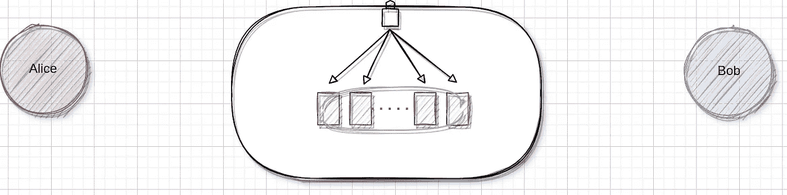
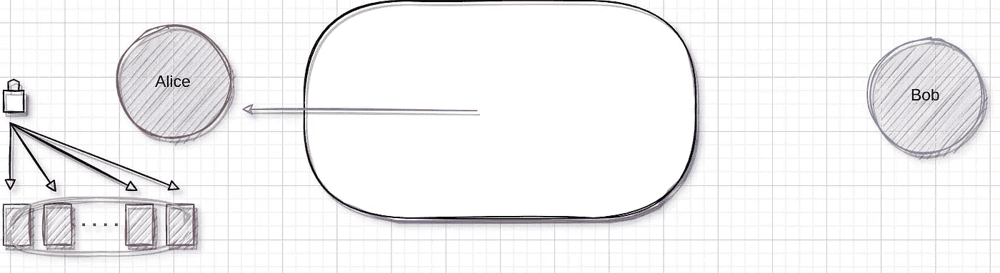
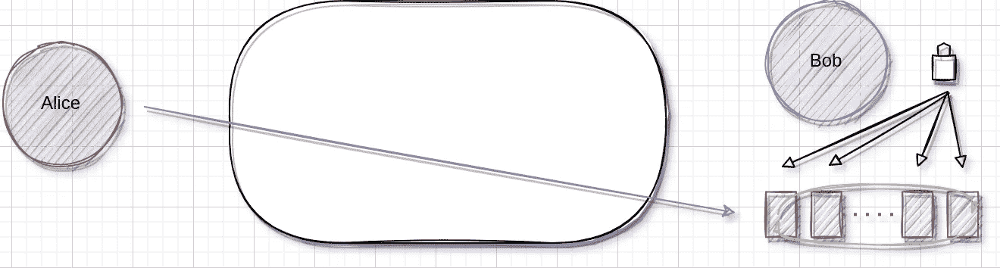
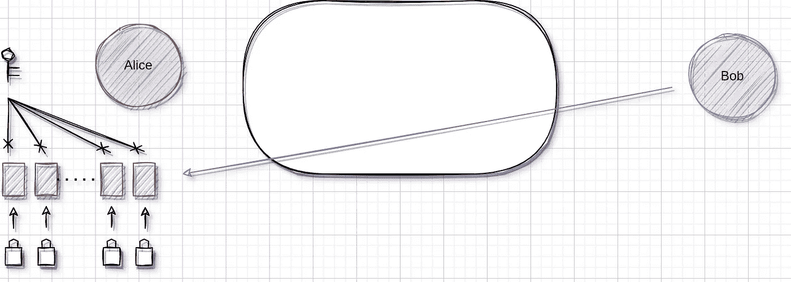
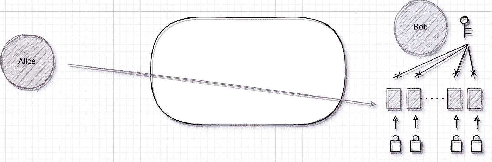
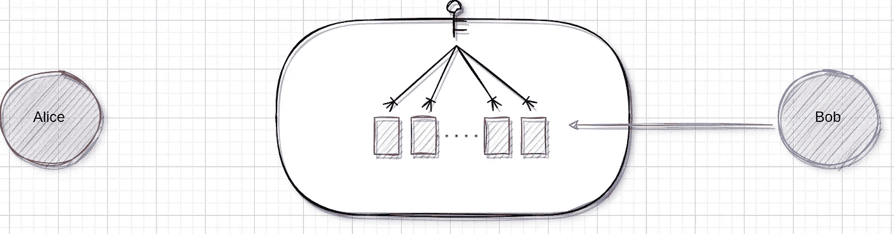

# 种族扑克技术揭示-洗牌

> 原文：<https://medium.com/coinmonks/race-poker-tech-reveal-shuffle-cards-2c5f8bb4f861?source=collection_archive---------24----------------------->

在我们系列的第二部分中，让我们来看看在客户端是如何洗牌的。

在实体纸牌游戏中，玩家面对面坐着，互相观察。在这种情况下，几乎没有作弊的余地。但是对于在线扑克游戏，扑克是从一个客户传递到另一个客户的。除了他们自己，没有一个用户可能知道特定客户端上发生了什么，更不用说游戏中洗牌的机制了。那游戏的公平性怎么保证呢？

有了去中心化的技术，这不再是问题。用户客户端将在洗牌和加密纸牌中扮演重要角色。
最好用一个简单的例子来解释这一点:

想象一下，现在有两个玩家在进行扑克比赛:Alice 和 Bob。Alice 和 Bob 将洗牌并加密这副牌，如下所示:

0.交易者将生成一副牌，并将其交给第一个玩家，
比如爱丽丝。这副牌已经被交易者加密了，所以爱丽丝
实际上从一开始就看不出哪张牌是哪张！

Shuffled by transactor

1.Alice 将生成一个加密密钥 A，并用它来加密这副牌中的每张牌。

2.爱丽丝洗牌。

Shuffled by Alice

3.Alice 将加密和洗牌后的牌递给 Bob。由于她的加密在
处，鲍勃无法知道哪张卡是哪张。
4。Bob 生成一个加密密钥 B，并用它来加密
加密和洗牌的每副牌。

Shuffled by Bob

5.Bob 将经过双重加密和洗牌的牌交还给 Alice。
6。爱丽丝用她的密钥 a 解密每张卡。但是这仍然保留了鲍勃的加密
,所以她不知道哪张卡是哪张(稍后将详细介绍)。
7。Alice 为每张卡生成一个加密密钥( *A1* 、 *A2* 等)。)并分别对它们进行加密。

Locked by Alice

8.爱丽丝把牌递给鲍勃。
9。鲍勃用他的密钥 b 解密每张卡。尽管如此，这仍然保留了爱丽丝的个人
加密，所以他无法知道哪张卡是哪张。
10。鲍勃为每张卡选择一个加密密钥( *B1* 、 *B2* 等等)。)并分别对它们进行加密。然后鲍勃把牌交还给爱丽丝。

Locked by Bob

11.交易者现在将移除其初始加密，然后
为每个玩家发布该副牌(在这种情况下只有 Alice 和 Bob)。

Transactor removes its encryption

整副牌现在都洗好了。

该算法可以扩展到任意数量的玩家。克莱尔、大卫等玩家只需要重复步骤 1-3 和 6-8。

你可能想知道，在第 6 步中，Alice 如何解密 Bob 刚刚洗牌的那副牌？嗯，让这一切成为可能的关键先决条件是一个
交换加密方案，这基本上意味着当数据被加密不止一次时，加密的顺序将无关紧要。在这个在线游戏中，数据是一副虚拟的纸牌，可以用密文的形式表示。

在上面的例子中，洗牌分两个阶段进行。在第一种情况下，每个
玩家使用他们自己的一个密钥来加密整副牌。然后在第二阶段，他们使用 52 个单独的密钥来加密这副牌中的每张牌。不过，加密的顺序真的无关紧要。

在游戏过程中，爱丽丝可以在洗牌的一副牌中挑选 1 和 2 张牌，鲍勃可以挑选 3 和 4 张牌。Bob 随后要求查看分配给他的卡片。爱丽丝同意鲍勃有权查看卡片 3 和 4，并将她个人的卡片钥匙 *A1* 到 *A2* 交给了他。鲍勃用爱丽丝的钥匙和他自己的钥匙解密了他的两张卡。Bob 现在可以看到他的牌，但是 Alice 不知道 Bob 有哪些牌，因为她没有 Bob 的密钥 *B3* 到 *B4* ，而这些密钥是解密这些牌所需要的。

换句话说，一旦洗牌完成，要看到一张特定的牌，必须有所有用来加密这张牌的密钥，也就是说，用户自己的密钥加上所有其他人的密钥。

既然您已经理解了客户端洗牌，在下一篇文章中，我们将介绍在游戏中玩家之间如何共享密钥。

网址:[https://www . race poker . app](https://www.racepoker.app)
推特:[https://twitter.com/RaceGameTeam](https://twitter.com/RaceGameTeam)
不和:[https://discord.gg/tzR4sHjNNx](https://discord.gg/tzR4sHjNNx)
电报:[https://t.me/racegame](https://t.me/racegame)
公告:[https://t.me/racepoker_announcement](https://t.me/racepoker_announcement)
白皮书:[https://www.racepoker.app/whitepaper.html](https://www.racepoker.app/whitepaper.html)