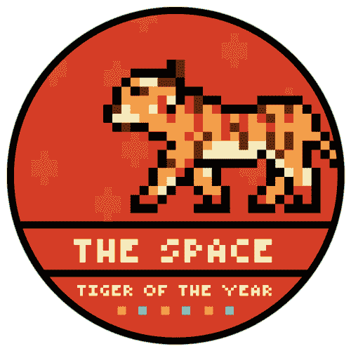
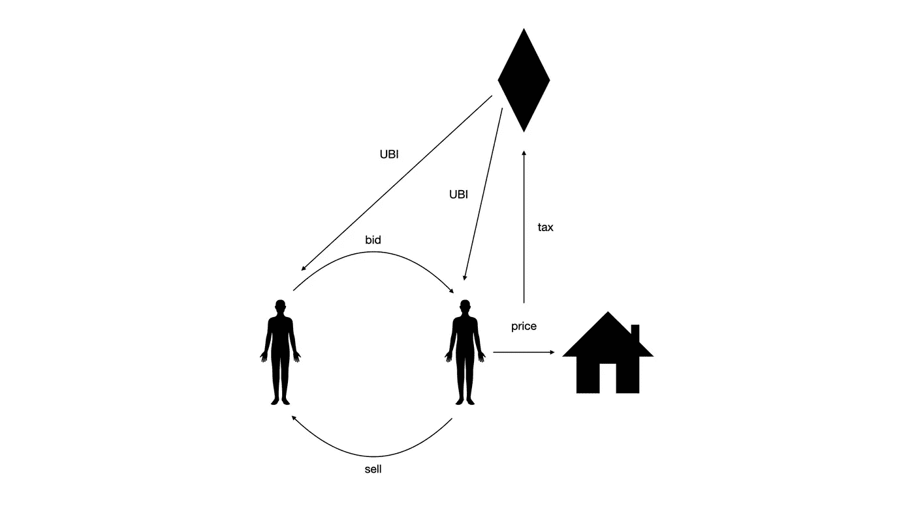
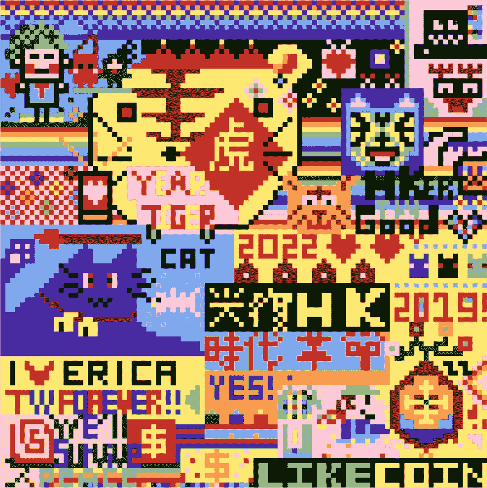
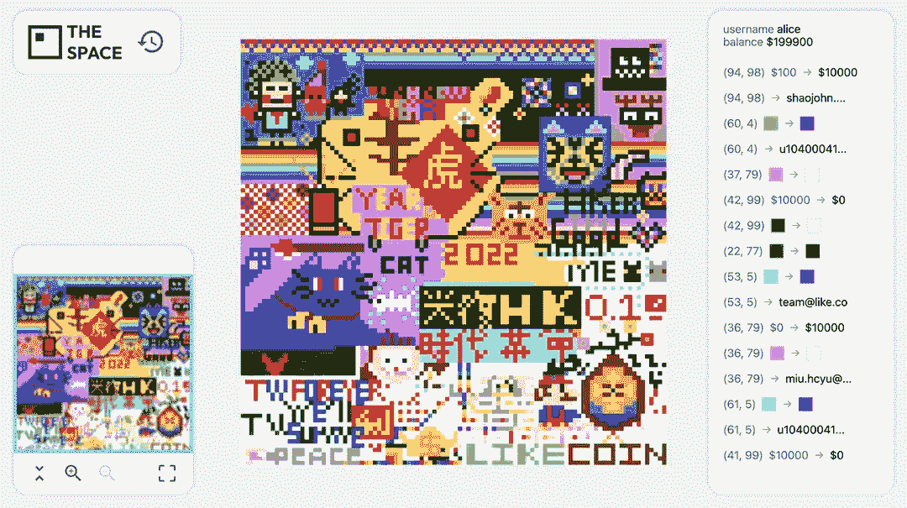
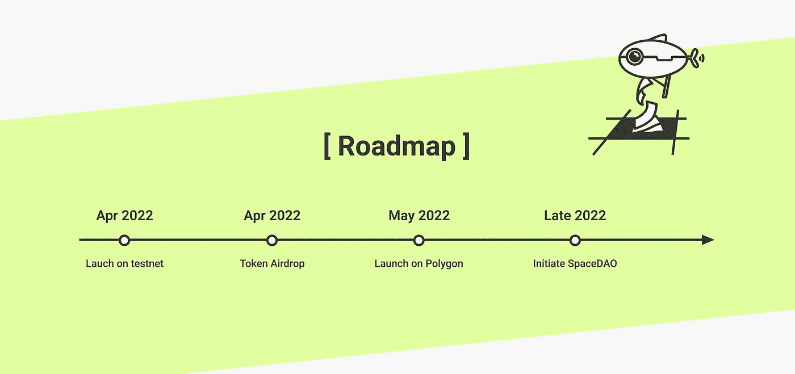

# 激进市场可以在区块链发挥作用。我们的 web3 实验——空间——展示了这一点。

> 原文：<https://medium.com/coinmonks/radical-markets-can-work-on-blockchain-our-web3-experiment-the-space-shows-how-1b5d49b91d27?source=collection_archive---------11----------------------->

A co-creation from 50 artists on The Space with [proceeds towards Ukraine](https://bit.ly/36lBKV2)

> 市场面临一个经常影响政治的类似难题。最富有的人的偏好很容易凌驾于其他所有人之上。一个结合了市场和民主的最佳元素，结合了它们的优点，抵消了它们的缺点的混合设计怎么样？
> 
> -埃里克·a·波斯纳和格伦·韦埃尔的《激进市场》
> 
> 想象所有的人/分享整个世界…
> 
> 约翰·列侬

在过去的几个月里， [Matters Lab](https://bit.ly/3JfXyjh) 推出并测试了一个原型*，*这是一个大规模的实验，玩家可以在区块链的数字公共涂鸦墙上标记、拥有和交易彩色像素。

虽然[这个空间](https://bit.ly/3tWe7dQ) 受到类似的合作性社会实验的启发，如 [Reddit Place](https://www.youtube.com/watch?v=XnRCZK3KjUY&t=1s) 和[艾未未和奥拉维尔·埃利亚松的公共艺术月亮，](https://olafureliasson.net/archive/artwork/WEK108821/moon#:~:text=Moon%20is%20the%20first%20collaboration,on%20a%20virtual%20moon's%20surface.) 这个空间超越了一个合作画布，并冒险进入激进的市场概念，如普遍基本收入(UBI)和[哈伯格税](https://vitalik.ca/general/2018/04/20/radical_markets.html)。

我们对这样的问题很感兴趣:激进市场能像区块链实验一样工作吗？我们怎样才能让内容创作者拥有新的经济模式，从他们的作品中获利？在一个真正分散和自治的环境中，一个社区将如何合作或管理冲突？

当 Reddit 在 2017 年发布一个合作艺术项目时，用户很快就在一个 1000*1000 像素的数字白板上写满了国旗、LGBT 旗帜、互联网迷因和蒙娜丽莎的重演。不幸的是，在我们看到它的全部潜力之前，Reddit Place 在 72 小时后就被关闭了——所有的艺术品都被埋葬在互联网的信息墓地中，尽管你可以在这里看到该项目的延时视频。

在中央服务器上，决策者对项目的生命周期有绝对的控制权。但是在 web3 上，一切都记录在公共账本上，我们希望这个空间能够永远存在。

# 空间是什么？

The Space NFT

[空间](https://bit.ly/3tWe7dQ)是一个永久的、吸引人的公共空间，在分散的 Web3 上运行，由区块链支持，成员可以在数字公共涂鸦墙上标记、拥有、交易和着色像素。

[这个空间](https://bit.ly/3tWe7dQ)重现了 Reddit Place 上的“游戏”，同时采用不可替换的令牌(NFT)来保护每个像素的权利。哈伯格税管理公共空间，通用基本收入(UBI)系统确保每个参与者都能受益。

通过智能合同，该机制可以公开、透明、永久地存储在区块链，并且每个人都可以检查或确认。

这个空间由区块链支持，由一个分散的自治组织(DAO)拥有。Dao 是互联网固有的实体，其成员在没有中央领导的情况下共同制定规则和决策。

这意味着当局不能关闭[空间](https://bit.ly/3tWe7dQ)，所有的艺术作品将永远可以访问，不像 web2 上的类似项目。

# 什么是哈伯格税？

How the Harberger Tax and Universal Basic Income work on The Space.

[The Space](https://bit.ly/3tWe7dQ) 是第一个将区块链应用程序与哈伯格税(Harberger Tax)和普遍基本收入(UBI)等概念相结合的大规模实验，以解决公共和私人所有权之间的困境。

当 Glen Weyl 和 Eric Posner 在他们的《激进市场》一书和论文中详细讨论了哈伯格税的概念后，这个概念迅速流行起来。

根据文章: [*什么是哈伯格税&区块链适合在哪里？西蒙·德·拉·鲁维耶*](/@simondlr/what-is-harberger-tax-where-does-the-blockchain-fit-in-1329046922c6)哈伯格税是一种借助市场力量优化公共资源配置以增加社会福利的经济政策。

税收确保了一个社会能够有效地利用公共资源来促进经济发展和每个人的福利。它利用市场力量来监管公共资产，减少财产和货币分配中的低效率。

[文章](/@simondlr/what-is-harberger-tax-where-does-the-blockchain-fit-in-1329046922c6)还陈述了税收的两个主要原则:

1.  公民给自己的财产定价，并按价格的一定比例纳税。
2.  这处房产一直在出售。在任何给定的时间点，任何人都可以按你设定的价格从你那里购买房产。

这些原则防止了某个群体垄断社会的财富，但为每个人创造了平等的实现财富的机会。

Rouviere 在[的文章](/@simondlr/what-is-harberger-tax-where-does-the-blockchain-fit-in-1329046922c6)中写道:

> 有了哈伯格税，资产所有者无法设定高的垄断价格(这对他们个人来说代价很高)，或者能够引入额外的讨价还价成本(卖方总是设定价格)，它更容易让市场将财产分配给有生产能力的所有者。

一些规模较小但高度创新的哈伯格税项目的例子有[这种艺术品总是在出售](/@simondlr/this-artwork-is-always-on-sale-92a7d0c67f43)、[外卡](https://wildcards.world/)和[地理网络项目](https://www.geoweb.network/)。

# 空间的游戏机制

A co-creation on The Space. Source: [Neverlandseeker](https://matters.news/@Neverlandseeker/the-space-%E6%96%B0%E6%98%A5%E5%85%B1%E5%89%B5-%E4%B8%8D%E6%98%AF%E5%83%8F%E7%B4%A0%E6%88%B0%E7%88%AD%E8%80%8C%E6%98%AF%E5%8F%AC%E5%96%9A%E5%87%9D%E8%81%9A%E4%B9%8B%E5%8A%9B-bafyreicf5lcqdmbsdl6x7xsywvhr5r7efbo4t2wsscqbzlezfpl3sb3kvm)

在[空间](https://bit.ly/3tWe7dQ)中，每一个像素都是可交易的 NFT。通过区块链交易，像素所有者可以编辑他们像素的颜色，在空间的数字墙上创建任何他们喜欢的艺术品。[点击此处查看实况](https://bit.ly/3MOTDw4)。

像素被标记为 ERC721 标记，并根据**哈伯格税进行交易:每个地块的所有者必须为其地块标上价格，并提供购买**。

利用哈伯格税，空间的像素所有者可以为他们的像素设定任何他们想要的价格。他们还必须向 smart 合同支付一定比例的土地价格税，其中一部分将以通用基本收入(UBI)的形式返还给所有土地所有者。然而，并不是每个人都会获得相同的收入，因为 UBI 是按像素分配的，拥有更多像素的人可以分享更高的红利。

哈伯格税鼓励每个像素在任何时候都保持销售。我们希望挑战现有的所有权观念，探索一种超越社会主义或资本主义市场的新型所有权。

所以，简而言之，[空间](https://bit.ly/3tWe7dQ)的规则是:

*   像素所有者可以为他们的像素设定任何价格，并根据其价格纳税。
*   如果所有者不想出售像素，他或她可以提高价格，以防止购买。但这意味着所有者也必须支付更高的税来保留像素。
*   收到的税收百分比记录在智能合同上，并以通用基本收入(UBI)的形式分配给[空间](https://bit.ly/3tWe7dQ)上的每个像素所有者。
*   无论像素所有者决定出售还是保留他们的像素，社区都从中受益。如果他们保持他们的像素，社区享有更高的 UBI。如果他们出售他们的 pixel，社区就能拥有他们喜欢的艺术品。

在制定这些规则时，我们希望建立有限公共资源的最有效分配，并最大限度地提高“像素市场”的流动性。

空间是公共资源，但我们正在为市场上的买家将其私有化。另一方面，尽管有私有化和交易，空间本质上仍然属于公众。

有趣的是，Web3 和加密货币带来了一种新的所有权形式，超越了无法归类的资本主义和社会主义。最接近的描述是一个激进的市场:一个真正开放、自由和竞争的市场，可以带来巨大的平等、繁荣和合作。

# 预期挑战

尽管[太空](https://bit.ly/3tWe7dQ)被设定为一个互利的游戏，但我们预计当我们向公众发布它时，会有三种类型的太空参与者:

*   **创作者:**传递信息，为社会问题做贡献，创作艺术品，并愿意为此纳税
*   **投机者**:购买预测价格会上涨的像素区域，然后以更高的价格卖出
*   **搭便车者:**购买最便宜的像素作为他们获得 UBI 的门票，并仔细评估他们需要支付的 UBI 和 Harberger 税的金额之间的平衡。

而且创作者既可以合作创作一个对社会有贡献的宏大项目，也可以通过交易恶意破坏他人的项目。看到参与者如何在[空间](https://bit.ly/3tWe7dQ)中相互交流是很有趣的。

# 测试空间

Participants trading and coloring pixels on The Space. Source: [Neverlandseeker](https://matters.news/@Neverlandseeker/the-space-%E6%96%B0%E6%98%A5%E5%85%B1%E5%89%B5-%E4%B8%8D%E6%98%AF%E5%83%8F%E7%B4%A0%E6%88%B0%E7%88%AD%E8%80%8C%E6%98%AF%E5%8F%AC%E5%96%9A%E5%87%9D%E8%81%9A%E4%B9%8B%E5%8A%9B-bafyreicf5lcqdmbsdl6x7xsywvhr5r7efbo4t2wsscqbzlezfpl3sb3kvm)

我们一直在测试不涉及真钱的[太空](https://bit.ly/3tWe7dQ)的第一阶段原型。我们希望在有限的时间内，以较小的规模启动它，进行观察、调整和故障排除。经过反复重申，我们的目标是改善用户体验、社会动态和优化经济结构。

自去年 12 月以来，我们已经为总共 300 名创作者推出了五场游戏测试活动，他们将至少 50，000 个令牌着色为像素。

在我们最新的测试发布中，50 名台湾艺术家在[上共同创造了空间](https://bit.ly/3tWe7dQ)，最终的艺术作品[在 akaSwap](https://bit.ly/36lBKV2) 上被铸造成 NFT。99%的收益将捐给 [@IMC_Worldwide](https://mobile.twitter.com/IMC_Worldwide) 、 [@DirectRelief](https://mobile.twitter.com/DirectRelief) 和 [@save_children](https://mobile.twitter.com/save_children) 。

虽然我们还没有在原型中实现任何类型的税收或奖励机制，但在这个小规模的实验中，我们已经看到了玩家如何相互合作来解决问题并创造新的经济。

敬请关注我们的下一篇文章，我们将揭开参与者如何互动、解决冲突以及在[空间](https://bit.ly/3tWe7dQ)上共同创造。

# 空间:一个激进的网络 3 社会实验

The roadmap of [The Space](https://twitter.com/thespace2022?utm_source=mattersmedium&utm_medium=medium-blog&utm_campaign=the-space&utm_term=web-3&utm_content=radical-markets-can-work-on-blockchain-our-web3-experiment-the-space-shows-how-M4).

在 Matters 团队，我们热衷于运营一个去中心化的自治组织(DAO)来建立一个自治用户社区，我们已经成功地用 [Matters.news](https://bit.ly/3Id6Vig) 做到了这一点。

我们在空间方面更进了一步，建立了一个合作的社会实验，它将永远在区块链开放。任何人都可以参与空间，只要他们持有空间令牌。

激进市场可能永远不会成为现实。在实践中，它对公司、市场和国家的运作方式造成了太多的动荡。[空间](https://bit.ly/3tWe7dQ)展示了一个“如果”( what if)控制的社会实验，一项可以建立和改进的技术。这是一个渐进的温和的想法，我们可以从中获得乐趣。

用一位参与者的话说:

> 这个空间是一个社会实验，一个有积极结果的实验。即使没有领袖的社区也能集体创造出美好的东西，这也是我热爱这个游戏的原因。凝聚力令人着迷。

说到底，[空间](https://bit.ly/3tWe7dQ)是一个社会实验，旨在演绎玩家如何在一个没有中央政府的世界中合作、创造，有时甚至对抗，他们制定自己的规则，并分享利润。

我们很期待看到太空中的[如何发展。你呢？](https://bit.ly/3tWe7dQ)

太空的最终版本将于 2022 年 4 月在 testnet 上首次亮相，并将于 2022 年 5 月正式推出。

***对 NFTs 感兴趣？找到我们的狩 NFT 收藏，*** [***行记***](https://bit.ly/3u4mS5I) ***，上开海*** [***这里***](https://bit.ly/3IbWviY) ***。***

****

加入 Coinmonks [电报频道](https://t.me/coincodecap)和 [Youtube 频道](https://www.youtube.com/c/coinmonks/videos)了解加密交易和投资