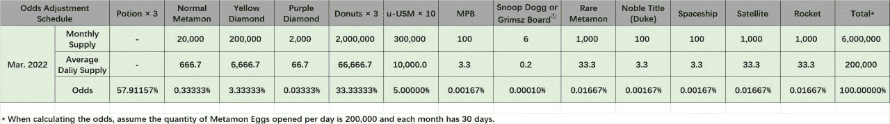
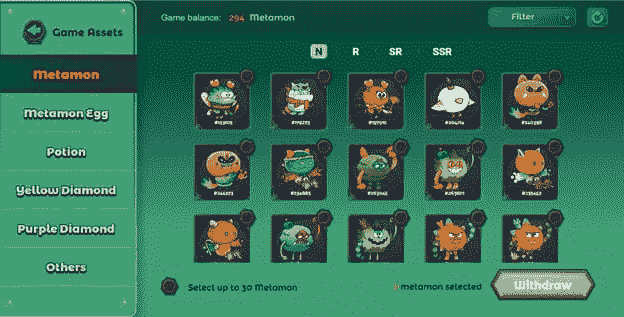

# 卡卡电台和 StealthEX AMA 概述-所有你需要知道的

> 原文：<https://medium.com/coinmonks/radio-caca-stealthex-ama-recap-all-you-need-to-know-7b7844b0723?source=collection_archive---------54----------------------->

2022 年 3 月 3 日，我们在 [Telegram 社区聊天](https://t.me/StealthEX_io)中窃取了[x](https://stealthex.io/)&AMA Caca 电台的会话，以下是一份摘要。只需要花一点时间通读和学习一切你需要的关于电台卡卡。

我们很高兴裁缝加入:RACA 土耳其社区的超级管理员！

你能介绍一下你的项目吗？

裁缝:当然，我想先看一段视频。请查看[这个演示视频](https://twitter.com/mayemusk/status/1430242417484173315)，它非常有助于了解整个生态系统以及 RACA 和美国的发展过程。

Caca 电台是 Maye Musk 神秘盒子(MPB) NFT 的独家经理，也是 USM 元宇宙的治理令牌。USM 是一个 MMO 3D 地图元宇宙，具有相同的分散式风格，而我们有一个真正的 3D 行星，可以像行星一样按比例放大和缩小。这项功能是首次在全球游戏市场上展示。

2021 年 10 月在 BSC 上推出了 Caca 电台。在这个游戏中，RACA 扮演“AXIE Infinity”中的“AXS”角色。Metamon 游戏稍后将扩展到美国火星(USM)。

我们被宣布为 [BSC MVB III 冠军](https://mobile.twitter.com/BinanceChain/status/1463897137901572105)。

**StealthEX:** 为了让我们都跟上进度:我们将在关闭聊天的情况下，从 Twitter 上的一轮问题开始 AMA。Twitter 上的问题得到回答后，我们将开放几分钟的聊天时间，让每个人都可以提问。

# 来自 Twitter 的问题

Q1:你能告诉我们更多关于 Maye Musk 神秘盒子的事情吗？为什么它这么值钱？

**Tailor:** 卡卡电台发布的第一个系列是 [Maye Musk 的 NFT](https://twitter.com/cz_binance/status/1410057493162598402) 。之所以取这个名字，是因为我们将 Maye Musk 的《NFT》作品定位为未来在 Radio Caca 市场乃至整个 NFT 市场的最高级别作品。就像社区里流传的口号，Maye Musk，NFT 妈妈。这是一个获得无限 NFT 作品的宝箱。持有母盒将获得后续 NFT 作品的空投和电台 Caca 市场的最高礼遇。

当然，最高的还是母盒的收藏价值。Maye Musk 在 BSC 上发布了她自己的 [NFT。这对于整个区块链行业来说，是一个具有重大意义和代表性的事件。会有无数的区块链巨鲸想要持有这个藏品，而母盒的总量只有 6000 只(Maye Musk 和她的团队的数量为 1000–1199 只)，现在只发放了两千多盒，无法满足他们的收藏需求。](https://twitter.com/cz_binance/status/1410057493162598402)

这里是[一篇描述 MPB](https://radiocaca.medium.com/maye-musk-koda-mystery-box-54751a34f3c2) 所有好处的文章。

**Q2:超能游戏现在很流行。你能分享一些关于这个游戏的信息吗？**

**Tailor:** Metamon 是 BSC 上的一款流行游戏，RACA 在其中扮演 AXIE Infinity 中的“AXS”角色。Metamon 游戏将会在稍后扩展到火星合众国(USM)。
meta mon 的[正式版现已上线。](https://metamon.radiocaca.com/)

为了改善游戏体验和减少汽油费，我们发布了一个新版本，用户需要用 RACA 换取 u-RACA (1 RACA =1u-RACA 仅在游戏中使用)，并在游戏中存放 Metamon、Metamon 蛋、药水、钻石。

在超能游戏中有三种主要的享受方式

1.  挑战。
    当你用自己的元门向对手的元门发起挑战时，你将花费一些 u-RACA 作为挑战费。
2.  火车。玩家可以通过升级使用奖励来发展他们的 Metamon。
3.  赢得并赢得。玩家有机会获得 Metamon 鸡蛋碎片作为奖励，打开后会显示奖励。

变形人是游戏中的角色。
Metamon 是具有不同形象、属性、稀有性和等级的 NFT 资产。Metamon 的稀有程度分为四类。

1.  正常供应量:200 万。
2.  稀有(R)供应:20，000。
3.  超级稀有(SR)供应量:200。
4.  超级超级稀有(SSR)货源:20。

每个元对象都有一个唯一的令牌 ID。

Metamon 练级，经验和属性系统
Metamon 会在挑战中获得经验点。Metamon 可以在你赚到足够的经验值后升级。还有一个巨大的药剂和钻石 NFT 用例。你可以从这张照片上看到 NFT 用的药剂和钻石。

经验值系统允许玩家通过使用药剂来增加 Metamon 的经验值。每个变形人的经验值每天可以通过药水增加两次，每次操作会增加 50~150 点经验值。

稀有度高的怪物需要消耗更多的药剂来增加经验值。这个新特性将允许低级的元兽更快地升级到 60 级，并参与元兽王国战争。

Attr 系统允许玩家通过使用药水来增加 Metamon 的五个属性。五种属性中的一种可以通过药水每天增加一次，每次操作增加 0~2 点属性。

在这五种属性中，智慧和体型是攻击属性，而隐身和勇气是防御属性。运气就是暴击概率。运气越高，Metamon 就越幸运。

Metamon 有三个领域:

*   初级战场(1 级—20 级)，每次挑战消耗 10 u RACA。
*   中级战场(21 级—40 级)，每次挑战消耗 10 u RACA。
*   高级战场(41 级—60 级)，每次挑战消耗 10 u-RACA。

在不同的战场上战斗将在以后的版本中获得不同的奖励。每场战斗结束后，你将获得一些 Metamon 蛋碎片作为奖励

Metamon Egg 片段可以合并成 meta mon Egg，这就是 NFT。Metamon Egg 碎片不是 NFT 资产(不能交易)。Metamon 蛋可以交易。

我们将在每个版本中让 Metamon 变得更有趣。我们还将确保我们的游戏比 Axie 有更好的经济模式(这样玩家可以为自己赚更多)。

**Q3:你刚才提到 Metamon 是一款玩赚游戏，你能描述一下它的经济体系吗？**

**裁缝:**是的。你使用 u-RACA 来挑战&战斗其他变形人。每一次挑战都会为你赢得 Metamon egg 碎片，当你收集到足够多的碎片时，你可以将它们合并成 Metamon egg。

Metamon 蛋是神秘的盒子。当您打开一个 Metamon 彩蛋时，您可能会赢得以下 NFT 之一:

1.  300 万 u-USM ( [令牌详情](https://www.radiocaca.com/#/usm-chain)
2.  600 万个甜甜圈(USM 中“Metamon 王国战争”游戏中 Metamon 的食物)
3.  药水
4.  黄色钻石
5.  紫色钻石
6.  正常元
7.  稀有元素
8.  贵族头衔(公爵)
9.  宇宙飞船
10.  火箭
11.  MPB (100)
12.  史努比·道格或格莱姆斯(又名克莱尔·伊莉斯·鲍彻)滑板 NFT。你可以在 [RACA NFT 市场](https://market.radiocaca.com)上买卖这些 NFT。

我们的主要目标是确保我们的玩家和社区在玩这款漂亮有趣的游戏时有一个令人惊奇的体验。Metamon 每天获得 20 能量。每个挑战消耗 1 点能量。每天，您可以对每个元门挑战多达 20 次。Metamon energy 将在世界协调时每天下午 18:00 重置。

如果你想玩并获得更多奖励，你可以简单地使用另一个元。这就是为什么许多用户拥有不止一个 Metamon。

**Q4:meta mon 进入 USM 3D 星球元宇宙后会发生什么？**

**Tailor:** 随着越来越多的元宇宙内容逐渐被揭开，每一个 NFT 都会履行它所承诺的故事，从《元蒙斯》开始。

在 USM 3D 星球元宇宙中，Metamons 如何保持其价值甚至增长其价值？

在元蒙王国战争中，胜利者将获得土地。这个计划是要给这些霸主分配大约 9 万块土地。更多细节将于三月底公布。

在火星上持有 Metamons 将获得独特的贵族头衔，并被授予独家待遇，访问和津贴。

作为租赁资产。USM 中有租赁市场，玩家可以租借元兽暂时获得贵族头衔和特权，并借出元兽享受丰盛的收入。目前，租借的变形金刚不会被部署在变形金刚王国的战斗中。

作为赌注资产。许多在元宇宙的资产，如建筑和景观的建筑材料，将作为赌注奖励分配给 Metamon 的持有者。在 3D 星球内标记元不会改变所有权状态，也不会影响 3D 星球内的任何用例。

## Metamon 经验药剂

所有的 Metamon 元宇宙用例都需要 60 级。目前，玩家必须通过研磨来获得等级。但是，贵族头衔有限，先到先得。如果你的元兽进入 USM 太晚，即使你拥有足够多的元兽，你也永远不会获得你应得的头衔。

我们希望提升我们的用户体验，更重要的是，我们希望确保所有人都能尽快公平地探索元宇宙。我们在上面提到了细节，以及如何让 Metamon 所有者更快地加入新的 Metamon 王国游戏和 USM 元宇宙。

## 将梅塔蒙斯转运到元宇宙

Metamon 持有者需要注意几个重要的更新。

Lv 60 Metamons 不会再赚鸡蛋碎片了。我们要明确的是，我们要降低鸡蛋的排放率。这对蛋农是有利的。

将元对象部署到 USM 是不可逆的。用户将无法将 Metamons 移回 Metamon 岛游戏。这是有益的，因为 Metamon 持有者将能够进入一个全新的 USM 经济。

即将推出的 Metamon Farming 功能将仅在 USM 中可用。

## 头衔和贵族头衔

使用 web3 钱包进行身份验证的用户将连接到区块链版本的 USM。Web3 用户自动获得元宇宙公民身份，并获得“火星人”称号。

为了区分持有超魔的火星人，持有超过 100 N 个 60 级或同等级别超魔的人享有不同的贵族等级和额外津贴。排名不会永久不变，会根据火星人账户的 NFT 持有情况进行调整。

这意味着贵族等级可以通过从即将开放的火星 NFT 市场租赁 NFT 来获得，在那里，Metamon 的所有者可以选择将他们心爱的 Metamons 出租，以获得丰厚的收益。

出售 Metamons 将导致失去头衔。USM 中的大多数超能战士不会被交易，因为拥有贵族头衔可以确保在许多大型赛事中获得最佳体验和利益。元蒙的价值体现在贵族头衔的价值上。

当前可用的贵族军衔，从高到低:

当达到上限时，新的合格贵族不能获得该等级，直到该等级的一个或多个成员被取消资格并腾出他们的等级。

## NFT 稀有度换算表

下表规定了各种 NFT 和 N 元元素之间的转换:

## 高贵的待遇

成为火星贵族有额外的好处。首先也是最重要的，会有吹牛的权利。贵族头衔将会明显而鲜明地展示给所有人看。其他特殊显示效果正在考虑和开发中。

其次，在活动等情况下资源有限时，贵族社会会得到优待。例如，在 150，000 名观众面前与音乐家进行实时互动一定是一种非常棒、非常激动人心的体验。然而，这种规模的实时支持是非常具有挑战性的(想象一下像魔兽世界这样的 MMO RPG)。因此，拥有贵族头衔是获得这种机会的先决条件。

随着元宇宙的发展，越来越多的额外津贴将成为火星贵族的专属。

## 安宁(male pattern baldness)

持有 MPB 的火星人将保证得到 10 块 N 土地。地契是 MPB 的一部分，随着 MPB 所有权的变更，地契将随 MPB 一起转移。

## 车辆

目前火星上有两种交通工具(也是 NFT ):特斯拉 Cybertruck 和 Grimsz Board & Snoop Dogg Board。

除了驾驶和滑板，它们还可以出租给婚礼/招待会等活动。

随着我们的进步，越来越多酷的交通工具将会加入进来，比如自行车、游艇、飞机甚至宇宙飞船。敬请期待！

我看到 RACA 正与许多大学合作建设 USM。你能告诉我们更多细节吗？

**Tailor:**Caca 电台与剑桥大学区块链学会合作，共建元宇宙教育体系，赋能教育改革，推动教育公平的落实。元宇宙作为一个融合虚拟世界和现实世界的载体，蕴含着给教育、社交、内容、办公等场景带来变革的巨大机会。目前，随着新冠肺炎疫情在全球的普及，网络教育已经成为首选方式。“元宇宙+教育”已经成为全球数字创新的新战场。

构建“元宇宙+教育”世界，赋能教育改革，促进教育公平

自新冠肺炎在全球爆发以来，全球教育行业遭受了沉重的打击，行业主题不断变化。来自 192 个国家的约 16 亿学生，即世界学生人口的 91%，在学业进展中遭受了中断。网络教学已经成为当前教育领域的焦点。

2021 年，元宇宙的概念继续流行，脸书、微软、腾讯等互联网科技公司加快了元宇宙基础设施的发展。

现在，Caca 电台和剑桥大学区块链协会已经宣布联合建立一个“元宇宙+教育”系统，以启动互联网教育的迭代升级，这可能会对该行业在推动教育改革、促进公平和实施全民教育计划方面产生深远的影响。

随着元宇宙、DeFi(分散金融的缩写)、NFT、DAO、公共第一层和第二层区块链以及跨链通信和桥接基础设施等技术的不断开发和部署，RACA 元宇宙(USM)教育世界将很快推出一系列计划:

1.  智能远程课程
    易受外部干扰(如全球疫情)的物理和地理位置不再是决定性因素。全球的教师和学生从未如此紧密地联系在一起。
    课程工具不再受教室设备的限制，这是一种范式转变，将催生新的学习行为。例如，物理教室依赖于标准演示设备，如黑板、投影仪或有限尺寸的屏幕，但在元宇宙，可以建立一套新的工具，如虚拟 3D 环境，以提供身临其境的教学体验。人们将会看到越来越多的为不同学科优化的新型教学实践出现。
2.  教育不公平的根源在于教育资源的有限性。改善教育公平是推出 RACA 元宇宙(USM)教育世界的最大目标。有了 USM，教育资源有限的地区的学生只要有互联网连接就可以轻松获得世界一流的教育。博物馆、歌剧院等将建在 USM 内，大量著名的球场将在 USM 内开放。文化、教育和技术的融合对每个人来说都是触手可及的。数字化将稀缺性转化为丰富性，这是为每个人提供包容性的关键，无论他/她的社会经济地位如何。另一方面，加密技术，如 NFT，使数字稀缺性的独立可验证性。在 USM 中，教育资源将被映射到区块链的 NFTs 中，以实现教育资源的公平共享。平等获得高质量的教育和学习内容意味着未来的平等机会。这是卡卡电台把教育带给每个人的计划。
3.  公平透明的教育
    USM 将通过创建课程 NFT 来利用区块链的开放和不可改变的特性，以避免版权侵权和纠纷，并为课程的销售过程带来透明度。区块链技术将在 USM 教育世界中发挥作用，即作业、考试、行为和成绩将被记录在链条上，形成更加全面、开放、公平的信用记录激励机制和对学生学习行为的动态优化指导。
    在元宇宙 USM，教育资源是模块化的。教师可以使用和重组现有模块，高效地构建新的教育场景，从而真正掌握自己的教育资源。
    USM 元宇宙的教育资源 NFT 将由 Caca 电台发布。卡卡电台有一个本土令牌(代号:RACA)。RACA 也是 USM 的治理标志。因此，这三者形成了生态系统的三足鼎立。【Caca 电台与剑桥大学共建的教育场景聚集了大量用户。在卡卡电台的生态系统中，NFT +元宇宙+教育完美融合。未来，Caca 电台将继续为教育行业带来更多惊喜。
    总之，Caca 电台将建设一个巨大的元宇宙，USM，这里汇集了许多创新，如、、DAO、DeFi、VR，教育是其中之一，将从中受益匪浅。USM 将根据 NFT+DeFi 的当前发展建立一个元宇宙生态系统，以促进一个健康、开放、公平和透明的教育未来，使每个人都能享受其利益。

**Q6:你将如何鼓励加密社区让 METAMON 游戏成为最好的游戏？！**

**裁缝:**游戏产业在世界范围内是巨大的。根据 Messari 的 2022 年报告，游戏行业的价值超过了电影和音乐行业的总和。P2E 是博彩业的未来。我们有巨大的优势，因为我们是第一个取代我们位置的人。

P2E 游戏通常有一些基本规则。奖池对游戏经济至关重要。按照这个池子的大小，游戏是可持续的。Metamon 岛游戏的主要特点是它将与 USM 元宇宙成为一个整体。如果你想参加 USM，你需要 Metamon 岛游戏。其他项目没有这个。他们有游泳池，我们有大海。你要照顾的是游泳池，不是大海。

**Q7:Caca 电台名气很大，它是否只关注 NFT 和 P2E 奥运会项目？有没有计划推出自己的 NFT 市场，甚至是密码交易所？**

卡卡电台已经有了自己的 NFT 市场。(https://market.radiocaca.com/#/market-place)从 2021 年 8 月到 2022 年 1 月，Caca 电台的 NFT 市场交易量超过 20 亿美元。这是一部巨著。这个市场上只卖 Caca 电台的 NFT。

我们开始与 ETH、OKX 等不同的连锁店建立联系，我们的主要目标是扩展这些连锁店，让每个用户都参与到我们的项目中来。为此，我们很快将建立另一个 NFT 市场，每个项目的 NFT 都可以在那里上市。(但没有自己的密码交易所)这个 NFT 市场将不同于 NFT 卡卡电台市场。NFT 市场也将是最好的。我们正在建立最聪明的生态系统。

**问题 metamon 岛会长期存在吗？我刚开始知道 raca，但是已经有新的更新了。现在开始还来得及吗？既然是新手，可以告诉我应该怎么做吗？我已经阅读了 radiocaca 的媒体，加入 tg &关注你的 twitter。谢谢🙂**

**裁缝:**我们的项目是一个终身项目。Metamon 岛游戏将永远在议程上，并将继续饲料 USM 元宇宙。与元宇宙的竞争项目相比，我们是非常新的。Caca 电台于 2021 年 5 月 16 日开播。还不到一岁。我们的路线图一开始就宣布为 15 年。我们有很多事要做。你从不迟到。

我们希望每个人都尽快参与到 USM 元宇宙和 Metamon 王国中来。这也需要 60 级的元门。为此，我们在游戏中加入了新的经验药剂。每个玩家都将能够从我们尽快公布的系统中受益。我给你的建议是，试着以最好的方式理解我们广阔的生态系统，跟随公告。升级 Metamon，看看要积极参与系统的地。

**Q9:项目未来最远大的目标是什么？根据项目路线图，您最重要的下一个优先事项是什么？团队是否有足够的资金和社区来实现这个目标？**

我们的目标是改变世界。毫无疑问。未来就要来了，我们的开发团队不是活在当下，他们肯定是活在未来。社区的兴奋一直是我们的动力。它将继续是。我们与世界领先的公司(例如，亚马逊、苹果、微软、特斯拉、SpaceX……)一起努力让自己被人记住。所有这些公司的发展都直接影响到我们的生活。他们创造了一个愿景。我们也产生视觉。我们想要改变未来，我们对此很认真。

**Q10:CACá电台已经与许多大学签署了合作协议。你认为元宇宙(USM)将如何影响未来的教育？你和我一样相信元宇宙会在未来革新积极的教育方法吗？**

**裁缝:**我刚才说了我们是多么关注未来。大学意味着下一代，意味着未来。我们希望下一代和我们在一起，我们已经和世界各大洲的许多大学俱乐部合作。我们邀请他们去元宇宙大学。我们希望从他们的愿景中受益。我们重视他们的想法和项目。我们互动地为他们提供他们需要的环境。

元宇宙的概念比我们想象的更广泛、更包容。我们与年轻一代分享我们的技术和劳动力，这样我们将共同建设未来。一个全新的时代。团队中的每个人都很乐意成为其中的一员。

大自然对人类的负面影响是不可否认的。新冠肺炎疫情是这方面最明显的例子。有可能通过技术将所有这些负面影响最小化。教育的普遍原则从未如此接近于被应用。随着区块链系统在元宇宙的建立，我们将消除外部因素的负面影响。我们将努力为大学生提供最有生产力的环境。这个等式的结果就是效率。

# 现场提问

**Q1:Raca 的团队到目前为止出售过任何 Raca 令牌吗？**

裁缝:没有，球队这次还没有卖掉 RACA。他们不会卖的。未来 3-5 年的所有费用都由 BNB 的土地销售支付，3300 万美元在球队的保险箱里。这些都将用于未来的营销费用和项目费用。

Q2:《变形金刚》是第一个大受欢迎的游戏。你有可能在新的即将到来的 mk 游戏中接触到大量的观众吗？

**量身定制:**新用户对我们来说非常重要。该团队对未来几天有非常不同的计划。我们将是一个在世界上被听到和知道的比以往任何时候都多的项目。

**Q3:有很多元宇宙项目，为什么选择 USM？**

**裁缝:**虽然我们是一个非常新的项目，但我们已经做了多年来老项目做不到的事情。我们揭露了更多。有一个伟大的团队在幕后不停地工作。核心员工，不包括社区经理，超过 200 人。

先把话说在一边。请进入并体验每个项目的元宇宙宇宙。加入最新的元宇宙 USM。亲身体验为什么是 RACA。

**Q4:你的平台是否有审计证书，让用户觉得更可信、更安全、更可靠？**

当然，首先，RACA 代币的合同已经通过 CertiK 的审核。第二，我们的技术团队是最好的。他们经验丰富，使用标准的开发和测试流程。

**问题 5:许多大学都参加了 Raca。这些大学会建立校园并把他们的教育交给元宇宙吗？**

**裁缝:**当然！这是我们的主要目标。所有的学生都将在元校园…来自世界各地的学生将在一起。与大学生活中的课程一样重要的是与来自世界各地的人见面和分享。我们将为他们提供这样的环境。每个大学生都将学习，并与其他大学生有一个共享的环境。

我们还将为学生提供教育课程。我们想在某些领域为未来培养他们。

感谢您的巨大兴趣！

我相信这应该回答了你关于$RACA 的大部分问题，我们非常感谢你抽出时间来到这里！

в别忘了你还可以在 StealthEX 平台上用 400+的资产兑换 RACA 币😎

只需遵循这些简单的步骤:

1.  选择兑换的货币对和金额。比如 [BTC](https://stealthex.io/coin/btc) 到 [RACA](https://stealthex.io/coin/raca) 。
2.  按下“开始交换”按钮。
3.  提供硬币将被转移到的收件人地址。
4.  移动你的加密货币进行交易。
5.  收到您的加密硬币！

*如果您对 StealthEX exchange 服务还有其他问题，您可以前往我们的* [*常见问题解答部分*](https://stealthex.io/faq) *，在那里找到所有必要的信息。*

*关注我们上* [*中*](https://stealthex-io.medium.com/) *，* [*推特*](https://twitter.com/Stealthex_io) *，* [*电报*](https://t.me/StealthEX) *，*[*YouTube*](https://www.youtube.com/channel/UCeES_XBesX76ge7xf1meuSw)*， [*Reddit*](https://www.reddit.com/user/Stealthex_io) *获取* [*StealthEX*](https://stealthex.io/)*

如果您在兑换硬币方面有任何问题，我们随时准备为您提供支持。我们的团队尽最大努力保护所有成员并回答他们的问题。

非常欢迎您访问[*StealthEX exchange*](https://stealthex.io/)*看看它有多快多方便。*

*原载于 2022 年 3 月 4 日*[*https://stealthex . io*](https://stealthex.io/blog/2022/03/04/radio-caca-stealthex-ama-recap-all-you-need-to-know/)*。*