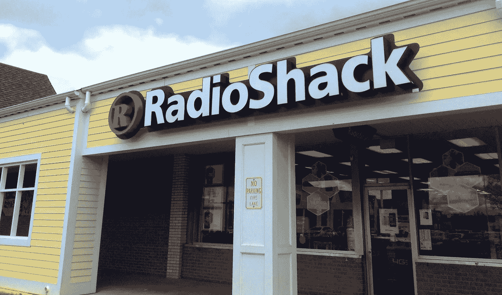
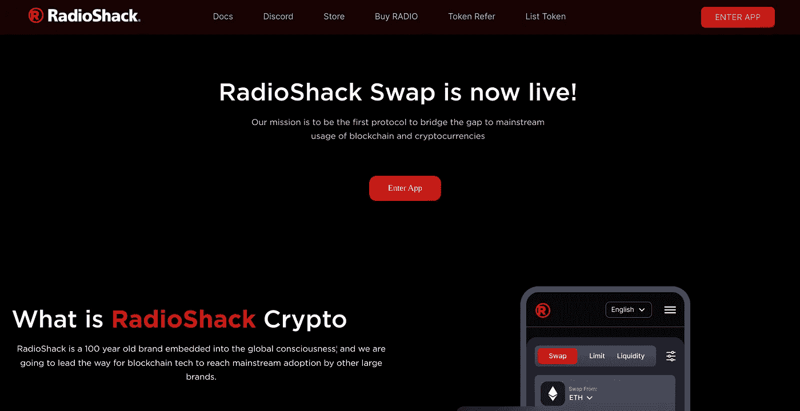

# 夏克电台以加密交换的方式回归

> 原文：<https://medium.com/coinmonks/radio-shack-returns-as-a-crypto-swap-5925a7922c62?source=collection_archive---------25----------------------->

Image Credit: [JeepersMedia](https://www.flickr.com/photos/39160147@N03/14078554646)

我喜欢加密货币和整个去中心化概念、元宇宙和 Web-3 的一点是它向前发展的创造力。请考虑一下 NFT。如果你愿意，NFT 就像任何其他金融投资或证券一样，但当你购买代币时，你会得到一些很酷的回报，一件相当罕见的数字“艺术品”。

最著名的 NFT 是[无聊猿游艇俱乐部](https://boredapeyachtclub.com/#/)，收集了 1 万张图片，展示了各种姿势的无聊猿。一些人通过出售他们在 BAYC 的投资变得非常富有，但这并不是他们如此时髦的原因。它是一件可分享的、稀有的、独特的艺术品的附加层。

NFT 是去中心化世界中最具创造性的方式，试图将自己强加于有些古板和传统的美国金融和证券业。然而，这种创造性的商业趋势并不仅限于 NFTs。只要去[和](https://decentraland.org/)走一趟，告诉我它在视觉上并不惊艳，在用户层面上也很吸引人。例如，米勒莱特拥有的酒吧([金属酒吧](https://qa2.millerlite.com/metalitebar))，实际上看起来是一个很酷很时尚的去处。当你考虑到主导去中心化世界的公司、平台和组织是如何命名、推出或收购的——新的 Radio Shack 就是一个很好的例子——时，创造力的标尺会变得更高。是的，我说的是*新*无线电室！

哪个 20 岁以上的美国人对 Radio Shack 这个品牌不太熟悉？在我们集体生活的某个时刻，我们去了 Radio Shack，因为它是镇上唯一一家卖你需要的东西的电器商店，比如说，连接你的电缆。可悲的是，Radio Shack 在经历了漫长而痛苦的死亡后于 2017 年去世，这是一个大规模增长的互联网市场的结果，这个市场充满了一个人试图修复某些东西所能想到的一切可能的工具或电缆或连接点。无线电室从头到尾都是实体的。当 Radio Shack 最终关闭时，我们很多人的心都碎了。这是一个时代的终结。

这就是为什么当[Retail Ecommerce Ventures](https://www.retailecommerceventures.com/flow.php?id=FS-6586&utm_source=youtube&utm_medium=video&utm_campaignid=11626341560&utm_adgroupid=111165402377&utm_feeditemid=&utm_targetid=kwd-836757210673&utm_interestid=&utm_physicallocation=9033298&utm_matchtype=e&utm_network=g&utm_device=c&utm_devicemodel=&utm_ifmobile=&utm_ifnotmobile=[value]&utm_ifsearch={ifsearch+:[value]}&utm_ifcontent=&utm_creativeid=480106651857&utm_term=retail%20ecommerce%20ventures&utm_placementID=&utm_target=&utm_param1=&utm_param2=&utm_randomid={44random}&utm_adposition={a44dposition}&gclid=Cj0KCQjw-daUBhCIARIsALbkjSbOu97wrruCROxkhhOaHI-WSH6o6pXV1WfGi5jI32Qnn_sYLF9J-rMaAhOeEALw_wcB)(REV)，一家致力于重新推出因电子商务而失败的流行品牌的公司，在 2020 年收购 Radio Shack 品牌及其资产时，我的心有点颤动。 [REV 创始人 Alex Mehr 和 Tai Lopez](https://www.theverge.com/2021/12/22/22849943/radioshack-defi-cryptocurrency-radio-token-launch) 在某种程度上是在稀薄的空气中经营，因为 REV 正在购买在美国消费者中已经有很大比例的品牌价值的品牌，并将它们重新投放到他们第一次失败的空间——互联网，在某些情况下是去中心化的世界，这对那些喜欢这些品牌的人来说充满了机会，可以在一个全新的水平上重新与他们接触。

RadioShack.org，一个分散的加密货币互换平台，声称其“使命是成为第一个弥合区块链和加密货币主流使用差距的协议。”

我认为 REV 更深层次的使命是让我们这些超过 40 岁的人离开围栏，开始玩加密货币和去中心化金融，他们给了我们一个使用平台，这个平台的特点是进入门槛更低，加上前门上的名字既熟悉又值得信赖。从营销的角度来看，这是纯粹的辉煌。你知道在国家层面建立一个品牌有多难吗？拥有推出拥有熟悉和可信品牌名称的新品牌的能力，有助于这些企业跨越如此巨大的营销鸿沟，盖伊·川崎写了多本关于这方面的畅销书。

至于加密货币互换是否会成为骗子的洗钱天堂？我现在还不能回答这个问题，但是货币互换会议听起来很有潜力。我计划关注这个领域，因为我的企业有这样做的既得利益，也因为从个人角度来看，我的好奇心现在已经达到顶峰。我希望 RadioShack.org 能够避免困扰非金融交易和加密货币的金融欺诈和洗钱陷阱。我想我知道答案，但不想草率行事。让我们先让 Radio Shack 的粉丝们在阳光下泡一会儿。

**免责声明:Alacer Group 的* [*Velocity 金融犯罪解决方案套件*](https://www.linkedin.com/company/2423176/admin/) *提供 360°覆盖，帮助金融机构、银行和加密货币交易所遵守 BSA / AML 法规。*

表示“受到某种对待的人”:dividend | reverend