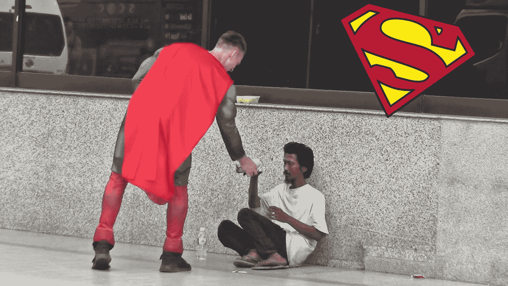
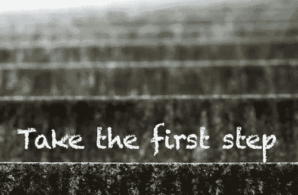
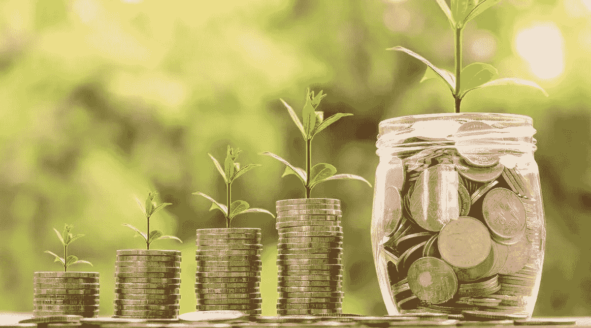

# 通过社会使命实现快速增长——我们如何做到三次！

> 原文：<https://medium.com/coinmonks/rapid-growth-through-social-missions-how-we-did-it-3-times-5e09a76eda8d?source=collection_archive---------46----------------------->

一个有效的社会使命运动就像往火上浇火箭燃料。结果可能是爆炸性的，火焰会迅速蔓延。

我有幸组建了一个团队，发起了几次非常有效的社会使命运动。我亲眼目睹了结果。退一步说，令人印象深刻，令人兴奋！

一个精心策划的战略创造了一个由顾客和品牌大使组成的忠诚社区。在客户和组织之间建立起真正的信任。这种信任导致特派团团结起来的真正伙伴关系。溢出效应是强大的、传染性的和永久的。

每个企业都可以，也应该支持一项社会使命。支持一个是投资人类的机会。投资未来的机会。这是“去做”的特权，而不是“去做”的义务。

**选择你支持的事业**

有没有一个慈善机构或使命是你最关心的？例如，我们选择支持麦当劳叔叔之家、许愿组织和密歇根大学儿童医院。他们对我们家来说是非常私人的。想想你可能已经拥有的关系。

是否有与您的产品和服务相关的原因？你觉得支持哪些慈善机构或任务是幸运的？你想改变的世界是什么样的？这是一个开始你的传奇的机会。把它私人化，这样你就有激情去完成它。

选择多个慈善机构很好，我甚至推荐它。支持 2-3 个原因是易于管理的，并增加了您的共享受众的规模。这也为全年参与公益活动提供了更多机会。参与这项事业至关重要。橡胶必须接触路面。这向慈善机构、社区和你的员工表明，你的承诺是真诚和重要的。

**联系，提交，开始！**

一旦你确定了你的目标，联系他们看看你如何参与并帮助支持他们。获取他们的年度活动日历，并创建一个您可以实现的参与计划。承诺第一年的目标。把目标定得低一些，超越自己的目标，这没什么。记住，大多数大事都是从小事开始的。关键是要承诺，要去！

**员工的参与是强大的**

和你的团队一起服务，让他们一起服务，这和办公室里发生的任何事情都不一样。会有欢笑，也会有泪水。在一起服务时建立起来的纽带是强大而独特的。这些深厚的纽带会留住员工，并因为公司所代表的意义而真诚地感谢公司。

服务和参与公益活动是奇迹发生的时候。捕捉这些神奇的时刻，并在多个社交渠道上分享它们，就成了一场强大的、有粘性的、潜在的病毒式宣传。这是人们喜欢和参与的阵容。

在为你的团队服务时，要睁大眼睛。注意那些真正能应付自如的员工。这是一个很好的方法来识别那些有服务天赋和热情的团队成员。记下并与他们讨论未来的服务活动。给他们一个机会在这些活动中发挥领导作用。传递火炬，看它能传多远！

**费用呢？我的生意已经很艰难了。**

“费用呢？”每次都是第一个问题。就像日出，我知道它的到来。不过没关系。我理解为什么大多数人会问这个问题。

首先，我是一个以盈利为目的的商业领袖。我有责任创造利润。没有利润，我们都回家。

社会使命运动不“耗费”金钱，它们是一种投资。对你的企业和社区的投资。买一送一！如果设计和建造正确，它们将是一项具有多种回报形式的强大投资。回报包括收入增加、利润增加、忠诚的客户和不断壮大的品牌大使群体。一个精心设计和实施的社会使命活动将会比最好的传统营销活动高出 10 倍甚至更多。我知道，因为我做过。我经历过，强烈建议！

**最后的想法**

如果你对在你的生意中加入社会使命犹豫不决，我恳求你试一试。如果你承诺，你将体验到投资你的企业和你的社区所带来的经济和社会回报！

你怎么想呢?非常感谢您的反馈。我重视每一个观点，喜欢向别人学习！