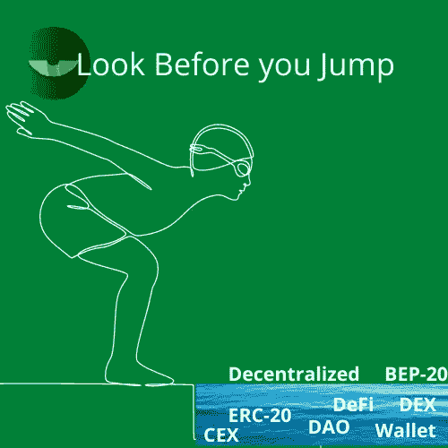
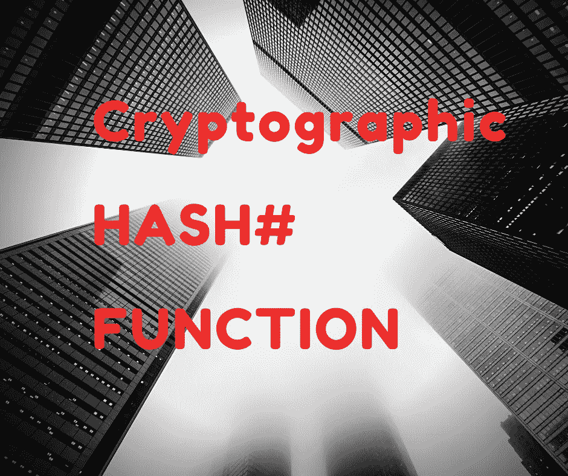

# 我什么时候才能赶上加密货币的行话:保持简单做 ETF

> 原文：<https://medium.com/coinmonks/rat-race-when-i-am-ever-going-to-catch-up-with-the-cryptocurrency-jargon-keep-it-simple-do-etfs-c19409914b2?source=collection_archive---------48----------------------->

秘密空间里暴发户的故事比比皆是，你可以试着看一看，看看自己在哪里；不要贪婪地试图被动地从秘密空间赚取一些收入。

我一直在寻找一个相对较短的时间，我不能在加密货币术语形成的迷宫中找到我的路；我正在尝试了解加密货币是什么，区块链看起来很简单，比特币没问题，没有替代币或只是硬币，代币可以像股票但不是股票，钱包可以是热的或冷的，或可以是集中或分散的交易所或管理可以是集中或分散的自治组织(DAO ),即使市场不等人，也可以投票表决要采取的行动，或赌注，流动性池，农场，采矿， 分散一切，包括 DeFi，如果你认为你已经看到了这一切，那么你就没有见过加密货币密钥，它可以是公共的或私人的，o o o 你应该知道，如果你放错了你的私人密钥你就完了，kabish，finito，然后是我个人最喜欢的 HODL(坚持亲爱的生活)有趣的东西。 唷！进入 crypto，你就再也不会感到无聊了。所以我想知道

1.我什么时候才能让所有的术语都进入激烈的竞争？

2.如果技术人员掌握了所有的金融技术术语，那就没那么难了，对吗？

**所以让我们一起来上一堂密码术语课**

在本课程中，我们将学习以下内容的含义，以及如何和何时恰当地使用它们，包括但不限于

自适应状态分片、地址、Airdrop、Airnode、算法市场操作(AMOs)、算法 Stablecoin、Altcoin、反洗钱(AML)、套利、原子互换、AtomicDEX、自动做市商(AMM)、信标链、BEP-2、BEP-20、BEP-721、BEP-95、比特币、比特币优势(BTCD)、比特币改进提案(BIP)、区块、区块链、区块链 1.0、区块链 2.0、区块链 3.0、区块探索者、区块高度、区块奖励、区块链 冷钱包、抵押代币、抵押稳定币、可组合代币、确认、共识、共识机制、核心钱包、交叉链、加密资产、加密货币、加密货币对、加密散列函数、加密、曲线 AMO、保管、代达罗斯钱包、DAO、分散、DApps、分散货币、分散交换(Dex)、分散社交网络、分散稳定币、DeFi、DeFi 聚合器、DeFi Degens、委托担保凭证(dPOS)、确定性钱包、DEX 聚合器、钻石手、数字货币、数字美元、DAG 等等

我们会暂时停在这里，从我们下节课停下来的地方继续，我们也会用新的单词，名字和含义更新列表，这些单词，名字和含义可能会在下节课之前出现，就好像有一场比赛要形成这个世界上最先进的命名和定义，举个例子-

**加密散列函数**定义为(简短定义)加密散列函数从可变大小的交易输入中产生固定大小的散列值。

**龙——解说。**

*一个* ***密码哈希函数*** *是一种算法，即特定动作的可重复序列，可用于将任意可变长度的数据串转换为固定长度和格式的数据串，称为哈希。*

*哈希函数的一个最简单的例子是将一个数字中的数字相加，直到剩下一个数字输出。例如，如果输入是 49，那么 4 和 9 相加得到 13，其数字 1 和 3 再次相加得到 4 的输出。不管输入数字有多长，输出总是一位数。*

*然而，这不是一个好的算法，因为，为了很好地执行它的功能，散列函数需要具备几个特征:*

对于任何给定的输入，计算一个输出应该是容易的，但是几乎不可能逆转该过程并计算一个已知输出的输入；

***确定性*** *—将一个特定的输入馈入算法应该总是产生相同的输出；*

***碰撞阻力*** *—两个不同的输入应该很不可能产生相同的输出；*

***雪崩效应****——即使改变输入中的一位数据也会导致完全不同的输出。*

*哈希函数应用于许多用例中，例如，在传输长期存储的计算机文件后，作为校验和来验证其完整性，或者用于随机化函数。*

它们也是挖掘工作证明加密货币的关键组成部分，如使用 SHA-256 哈希函数的比特币(BTC)。为了给区块链增加一个新的区块，并获得新开采的比特币的奖励，矿工首先需要产生一个低于特定阈值的哈希值，称为目标值。

*散列是伪随机的，并且在实际运行散列函数之前不可能预测任何输入的输出，这一事实确保了矿工不能凭空印刷新的比特币，并且需要证明他们已经完成的工作。*

到了那里，你就可以很容易地直走了。

顺便说一下，我提到过，我们会看看这个空间中的一些玩家，他们的令牌以及令牌是如何使用的，Cryptostars 将在下节课中帮助我们。

我什么时候才能学会所有这些术语，以及如何应用它们，然后开始我的老鼠赛跑。我得出的结论是，加密货币尚未为大规模采用做好准备，当它做好准备时，暴发户的机会将会失去，所以我认为仍然需要使用更简单的方法，为此我正在考虑像 MatrixETF 这样的 ETF 部分

**MatrixETF**

MatrixETF 是下一代去中心化 ETF 平台，支持跨链，其目标是为用户建立去中心化、自动化、个性化和多元化的投资组合，以及帮助用户轻松享受长期、稳定和高效的金融服务。

> *加入 Coinmonks* [*电报频道*](https://t.me/coincodecap) *和* [*Youtube 频道*](https://www.youtube.com/c/coinmonks/videos) *了解加密交易和投资*

# 另外，阅读

*   [有哪些交易信号？](https://coincodecap.com/trading-signal) | [Bitstamp vs 比特币基地](https://coincodecap.com/bitstamp-coinbase) | [买索拉纳](https://coincodecap.com/buy-solana)
*   [ProfitFarmers 回顾](https://coincodecap.com/profitfarmers-review) | [如何使用 Cornix 交易机器人](https://coincodecap.com/cornix-trading-bot)
*   [十大最佳加密货币博客](https://coincodecap.com/best-cryptocurrency-blogs) | [YouHodler 评论](https://coincodecap.com/youhodler-review)
*   [my constant Review](https://coincodecap.com/myconstant-review)|[8 款最佳摇摆交易机器人](https://coincodecap.com/best-swing-trading-bots)
*   [MXC 交易所评论](/coinmonks/mxc-exchange-review-3af0ec1cba8c) | [Pionex vs 币安](https://coincodecap.com/pionex-vs-binance) | [Pionex 套利机器人](https://coincodecap.com/pionex-arbitrage-bot)