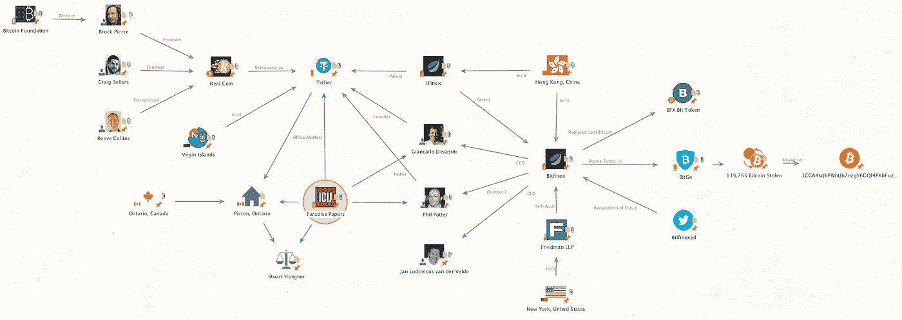

# Razzlekahn 第 1 部分:建立一些背景。

> 原文：<https://medium.com/coinmonks/razzlekahn-part-1-establishing-some-background-2f4d1c9d37d7?source=collection_archive---------29----------------------->

This image was politely borrowed from [CoinDesk.com](https://www.coindesk.com/markets/2021/06/07/bitfinex-now-owns-a-stake-in-no-kyc-bitcoin-exchange-hodl-hodl/)

如果你还没有看过我对这个案例的介绍，请花几分钟看看 [*解开 Razzlekahn 阴谋:一个新的视角*](https://osint-doc.medium.com/untangling-the-razzlekahn-conspiracy-an-osint-perspective-9e121857c4e5) 。

**建立一些背景:**

任何调查的第一步都是建立一些背景。在 Dutch 和 Heather 被捕时，我从未听说过 Bitfinex，更不用说该交易所在 2016 年遭到黑客攻击。

我在谷歌上快速搜索了一下，找到了加密货币记者艾米·卡斯特的一篇文章。这篇文章提供了导致黑客攻击的简短时间表，并提供了 Bitfinex 中主要参与者的高级概述。

我从文章中提取了关键实体，并使用[Maltego Community Edition](https://www.maltego.com/downloads/)创建了一个网络图。虽然本文的目的是提供调查的背景，但是如果您对使用 Maltego 感兴趣，您可以在这里找到我的逐步说明:[第 1 部分](https://youtu.be/t7B2m1hZpvc)，[第 2 部分](https://youtu.be/SA0Q_DBTozc)。

Graphic Created Using [Maltego CE](https://www.maltego.com/downloads/)

总结一下这个案件的背景，Phil Potter，Giancarlo Devasini，Jan Ludovicus van der Velde 于 2013 年在香港成立了 Bitfinex 公司。2016 年 6 月，Bitfinex 将其比特币转移到由一家名为 BitGo 的公司保护的钱包中。2016 年 8 月，大约 12 万枚比特币被非法匿名转出 Bitfinex 钱包。

调查 Bitfinex 盗窃案时，不可能不注意到整个事件有多么可疑。我可能需要回来充实 Bitifex 抢劫案的更多内容，但目前，我只是在寻找一个基线。虽然 Bitfinex 抢劫案很有趣，但达奇和希瑟是第一个被正式联系在一起的人；尽管如此，他们只是被指控洗钱，而不是偷窃。我的想法是，随着我们从 Dutch 和 Heather 向后工作，我们将开始看到 Bitfinex 中的一些基线玩家出现。随着联系的出现，我们可以以后再关注这些。

可以看下面的视频，对网络图进行总结和讨论。

> *加入 Coinmonks* [*电报频道*](https://t.me/coincodecap) *和* [*Youtube 频道*](https://www.youtube.com/c/coinmonks/videos) *了解加密交易和投资*

# 另外，阅读

*   [3 商业评论](/coinmonks/3commas-review-an-excellent-crypto-trading-bot-2020-1313a58bec92) | [Pionex 评论](https://coincodecap.com/pionex-review-exchange-with-crypto-trading-bot) | [Coinrule 评论](/coinmonks/coinrule-review-2021-a-beginner-friendly-crypto-trading-bot-daf0504848ba)
*   [莱杰 vs n 格拉夫](/coinmonks/ledger-vs-ngrave-zero-7e40f0c1d694) | [莱杰纳诺 s vs x](/coinmonks/ledger-nano-s-vs-x-battery-hardware-price-storage-59a6663fe3b0) | [币安评论](/coinmonks/binance-review-ee10d3bf3b6e)
*   [Bybit Exchange 审查](/coinmonks/bybit-exchange-review-dbd570019b71) | [Bityard 审查](https://coincodecap.com/bityard-reivew) | [Jet-Bot 审查](https://coincodecap.com/jet-bot-review)
*   [3 commas vs crypto hopper](/coinmonks/3commas-vs-pionex-vs-cryptohopper-best-crypto-bot-6a98d2baa203)|[赚取加密利息](/coinmonks/earn-crypto-interest-b10b810fdda3)
*   最好的比特币[硬件钱包](/coinmonks/hardware-wallets-dfa1211730c6) | [BitBox02 回顾](/coinmonks/bitbox02-review-your-swiss-bitcoin-hardware-wallet-c36c88fff29)
*   [BlockFi vs Celsius](/coinmonks/blockfi-vs-celsius-vs-hodlnaut-8a1cc8c26630)|[Hodlnaut 点评](/coinmonks/hodlnaut-review-best-way-to-hodl-is-to-earn-interest-on-your-bitcoin-6658a8c19edf) | [KuCoin 点评](https://coincodecap.com/kucoin-review)
*   [Bitsgap 审查](/coinmonks/bitsgap-review-a-crypto-trading-bot-that-makes-easy-money-a5d88a336df2) | [Quadency 审查](/coinmonks/quadency-review-a-crypto-trading-automation-platform-3068eaa374e1) | [Bitbns 审查](/coinmonks/bitbns-review-38256a07e161)
*   [密码本交易平台](/coinmonks/top-10-crypto-copy-trading-platforms-for-beginners-d0c37c7d698c) | [Coinmama 审核](/coinmonks/coinmama-review-ace5641bde6e)