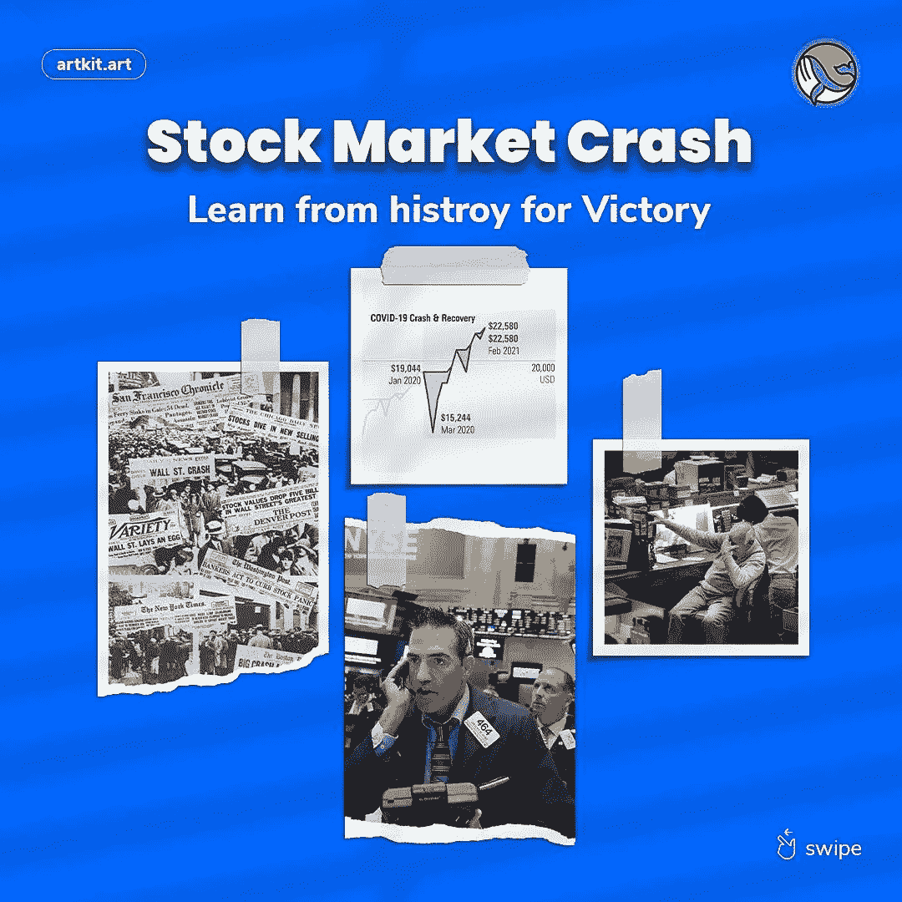
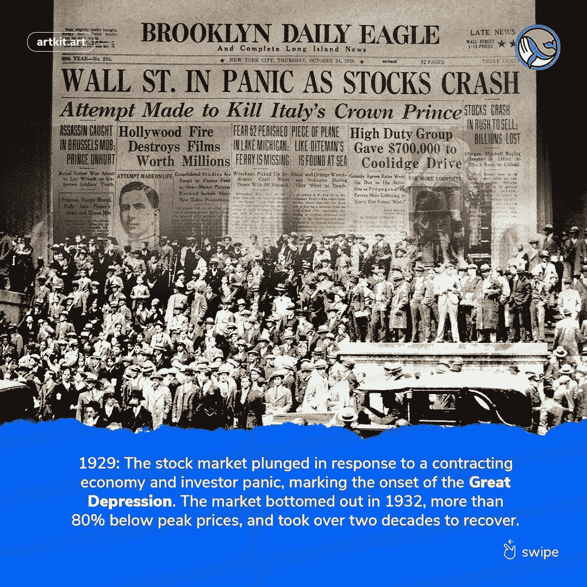
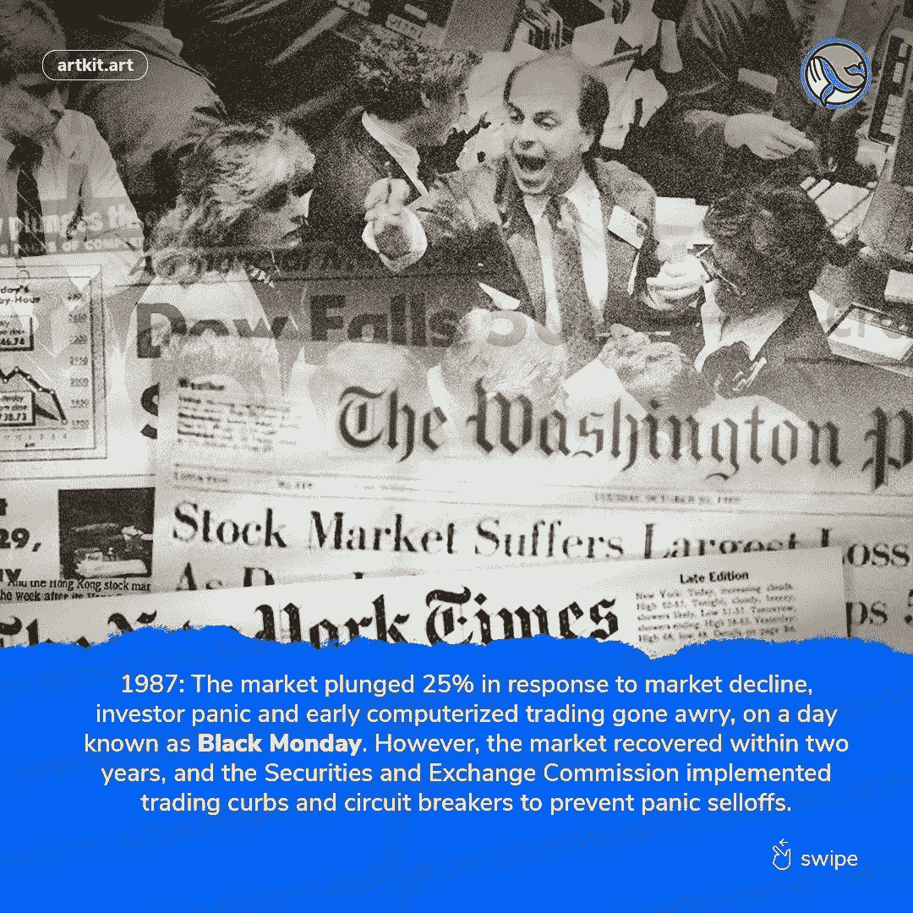
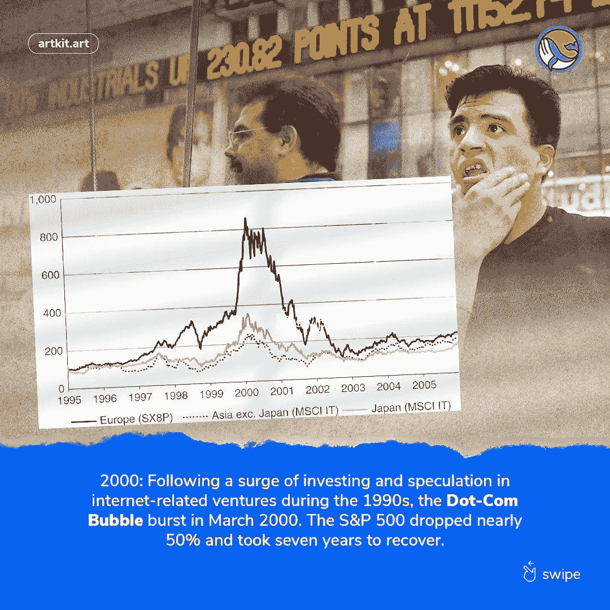
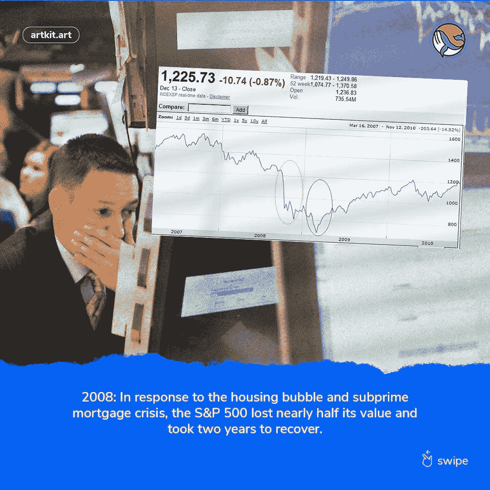
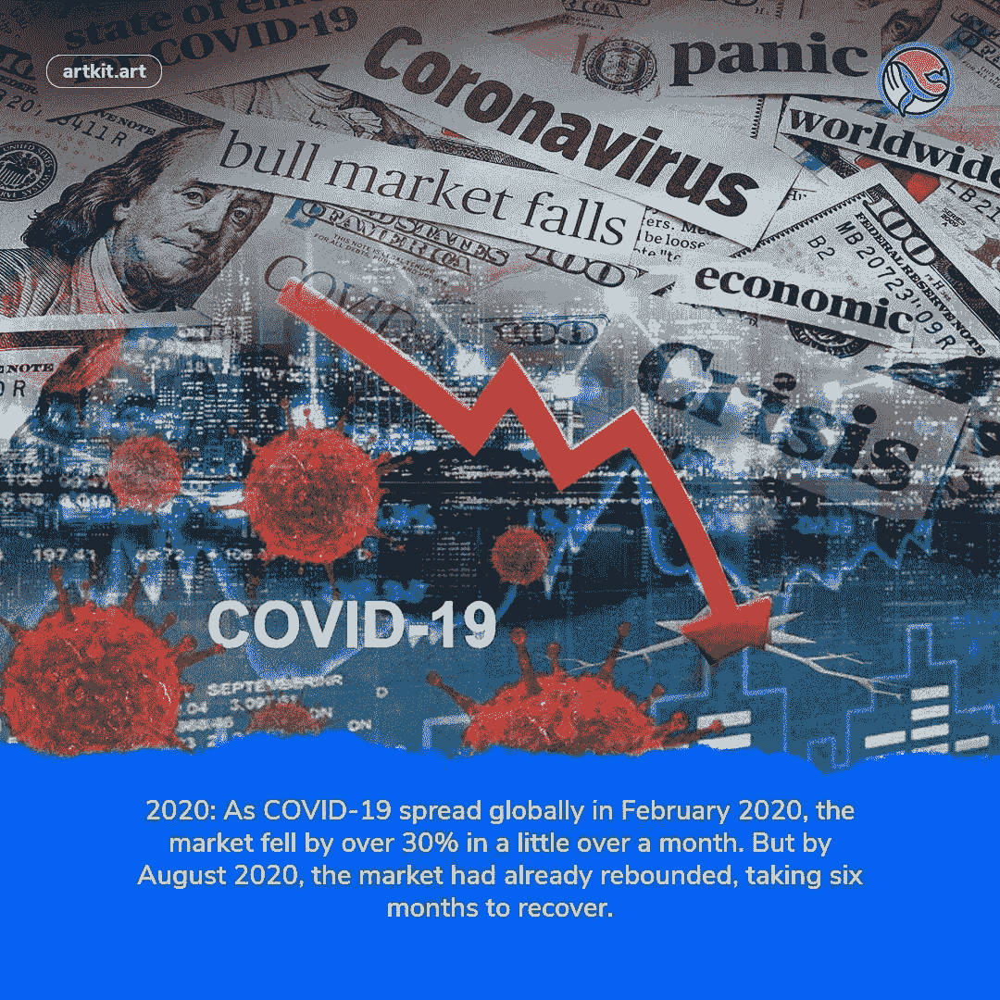

# 重新审视股市崩盘以及从中吸取的教训。

> 原文：<https://medium.com/coinmonks/re-examining-stock-market-crashes-and-lessons-to-learn-from-them-822f43c37b7a?source=collection_archive---------29----------------------->

**简介**

> 这篇文章的主要焦点是历史上的股票市场崩溃以及我们能从中学到什么。

股市崩盘是指股票价值大幅下跌。当主要股市指数在短时间内损失超过 10%的价值时，就被称为股市崩盘。市场崩盘通常会突然发生，通常是在股价长期上涨之后。股市崩盘的一个显著特征是投资者恐慌性抛售，他们急于迅速平仓以限制损失或执行追加保证金通知。每个投资者最大的噩梦是市场快速而剧烈的下跌，几天之内将多年的收益化为乌有。仅举几个例子，散户投资者、专业交易者、机构基金经理和退休人员都会受到影响。股市崩盘很少发生；他们经常让投资者措手不及，但一旦他们这样做了，他们就会产生广泛的损失和更坏的后果——而复苏可能需要几代人的时间。
尽管股市崩盘可能会很快发生，但市场上许多最严重的灾难都产生了长期而深远的影响。

以下是对一些最著名的市场崩盘的分析。
。
**1929 年的大萧条**
1929 年的大萧条标志着世界经济史的一个转折点。这件事发生在 1929 年 10 月 29 日，股市崩盘之后。从 1929 年 10 月 29 日持续到 1933 年 3 月 4 日的大萧条让美国满目疮痍。
这段时间经济下滑的原因经常被争论，但主要有三种理论:一是高利率导致货币供应过剩，造成物价和工资的通胀压力；第二，由于人们担心利率会升得更高，贷款数量减少了；第三，银行囤积现金，因为他们觉得把钱放在金库里比以比平时更高的利率贷出去更安全。

**黑色星期一股灾(1987)**
发生在 10 月 19 日的 1987 年黑色星期一股灾，是历史上最大的一次股灾。计算机化的交易和运用算法快速交易股票是股市崩盘的原因。这引发了大规模抛售，股票单日下跌近 22%。

互联网泡沫破裂(2000 年)
20 世纪 90 年代末的互联网泡沫是由投资者的高预期和互联网的快速普及引发的投机泡沫。术语“网络公司”指的是那些主要业务是在互联网上或通过互联网进行的公司，其股票价格由于对未来利润的预期而被抬高。在 2000 年 IT 繁荣达到顶峰后，媒体开始质疑这些公司是否会成功，它们的价值是否过高。2000 年 3 月 10 日，纳斯达克综合股票指数达到 5132 点的高点，但随后在 2001 年 4 月开始快速下跌。到 2002 年 10 月，它已经从峰值下跌了 80%以上。

**2008 年金融危机**
2008 年的全球金融危机是一场波及全球每个国家的重大金融灾难。这场危机是由金融体系崩溃引发的，而金融体系崩溃是由各种因素造成的，包括不负责任的贷款行为和欺诈。结果，一些银行破产或被国有化。

**2020 年冠状病毒崩盘**
随着新冠肺炎在全球蔓延，股市也在某个时候崩盘。到 2020 年 5 月，股市恢复到疫情之前的峰值，不像以前的崩盘需要数年时间才能恢复。随着美联储降低利率，向货币市场注入 1.5 万亿美元，国会在 3 月底通过了 2.2 万亿美元的救市计划，大量的刺激资金推动了快速复苏。

# **从市场崩盘中吸取的教训**

1.不要惊慌，专注于长期的卖出会减少损失。这可能需要一些时间，但如果你持有，你的资产应该会回来。长期投资者几乎总是最好忽略哪怕是最惊人的短期市场波动！历史上每一次股市崩盘都导致了复苏。问题是我们永远不知道我们什么时候会恢复。我们只是不知道什么时候会发生。只有当你卖出时，你才会在崩盘时赔钱。
不要试图把握市场时机；不可能的。当市场下跌时，考虑投资；—它们一开始可能会跌得更远，但如果你一次投资一点，你就会从美元成本平均化中获利。在市场下跌期间，维持最初的投资组合配置是将新资本投资于股票的最有说服力的理由之一。随着当前股票市场的抛售
股息再投资:如果你一次不依赖收入，将你的股息再投资。当股息被再投资时。这种复合效应经常被称为“世界第八大奇迹”自危机开始以来，你对投资组合的损失无能为力。然而，弥补这些损失并最终恢复投资组合增长的最佳方法是积累现金储备，并用它们以低价购买股票。

2。从长期来看，市场复苏可能需要几天、几个月甚至几年的时间。不同的市场对同一问题可能会有不同的反应。这就是为什么我们建议投资者有 3-5 年的投资期限——足够的时间(理想情况下)让投资从低迷中反弹。市场崩盘将考验这种方法和基金经理的“勇气”。他们的反应很能说明问题。他们能坚持自己的战略，无视噪音，并在相关机会出现时抓住它们吗？还是他们冻结或行为不当？损失越小，恢复所需要的收益就越小:如果一只基金的价值比市场和同行跌得少，它恢复的机会就越少。在这种情况下，可以获得显著的优异表现和“增值”。这就是为什么我们更喜欢投资策略表明他们应该以这种方式行事的基金，你会在我们的大多数基金建议中看到这种倾向。

**撞车时该怎么办**

当其他人都感到恐惧的时候，是买入的好时机。1929 年股市崩盘之后是长期的萧条，在此期间股市几乎不存在。股票直到 1937 年才开始反弹，然后在 1942 年再次反弹。这些时代被视为收购相对于当前价值大幅折价的股票的机会，也是与二战后出现的拥有新技术和增长潜力的新公司进行投资组合多元化的机会。在股市崩盘时减少你的生活开支，这样当市场下跌超过你的预期时，你可以购买更多！。在 1907-1908 年间，这种方法为许多投资者带来了丰厚的回报。

**结论**
通过阅读这篇文章，你至少对股市崩盘和教训有所了解，但这篇文章并不是真正关于股市，而是最近的加密停机时间。鉴于加密市场在当今经济中的巨大相关性，理解其运作方式至关重要。我们来看看近年来一些最大的股票市场崩盘，以及我们可以从中学到什么。

你应该尽一切可能保住你的工作(或公司)和收入，同时也为下一步的发展定位你的金融投资组合。尽管屈服于一时的恐慌很容易，但下一代白手起家的亿万富翁很可能会在这段不确定时期后打下基础。你可以加入他们，但前提是你愿意立即采取果断行动。

现在真的是时候不要恐慌，而是要更多地关注市场，投资那些有真实愿景和潜在用例的项目，并有强大的团队支持。所以当所有人都在后悔没有投资的时候，你会欢欣鼓舞，放声大笑

感谢您的阅读

[**加入我们的 facebook 社区**](https://www.facebook.com/artkitofficial)
[**请在 Twitter 上关注我们**](https://twitter.com/artkit_art)[**在我们的网站上注册**](https://artkit.art/)
[**加入我们的全球电报**](https://t.me/artkitofficial)

[**在 LinkedL 上与我们联系**](https://www.linkedin.com/company/artkit)**n**
[**关注我们的 Instagram**](https://www.instagram.com/artkit_art)

> 加入 Coinmonks [电报频道](https://t.me/coincodecap)和 [Youtube 频道](https://www.youtube.com/c/coinmonks/videos)了解加密交易和投资

# 另外，阅读

*   [币安 vs FTX](https://coincodecap.com/binance-vs-ftx) | [最佳(SOL)索拉纳钱包](https://coincodecap.com/solana-wallets)
*   [比诺莫评论](https://coincodecap.com/binomo-review) | [斯多葛派 vs 3Commas vs TradeSanta](https://coincodecap.com/stoic-vs-3commas-vs-tradesanta)
*   [Capital.com 评论](https://coincodecap.com/capital-com-review) | [香港的加密借贷平台](https://coincodecap.com/crypto-lending-hong-kong)
*   [如何在 Uniswap 上交换加密？](https://coincodecap.com/swap-crypto-on-uniswap) | [A-Ads 审查](https://coincodecap.com/a-ads-review)
*   [WazirX vs coin dcx vs bit bns](/coinmonks/wazirx-vs-coindcx-vs-bitbns-149f4f19a2f1)|[block fi vs coin loan vs Nexo](/coinmonks/blockfi-vs-coinloan-vs-nexo-cb624635230d)
*   [本地比特币评论](/coinmonks/localbitcoins-review-6cc001c6ed56) | [加密货币储蓄账户](https://coincodecap.com/cryptocurrency-savings-accounts)
*   什么是融资融券交易