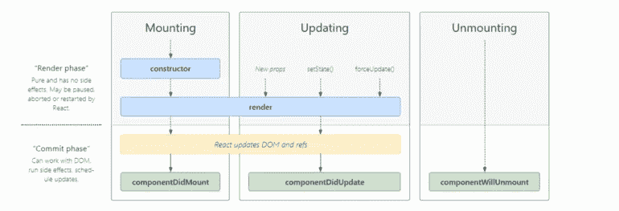
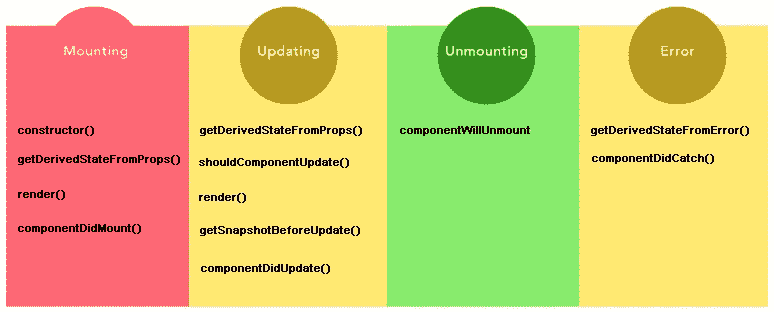
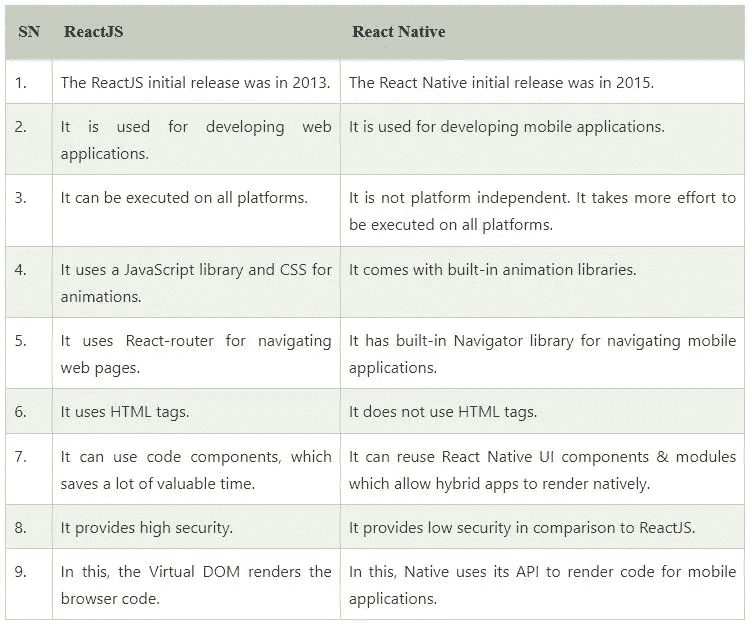
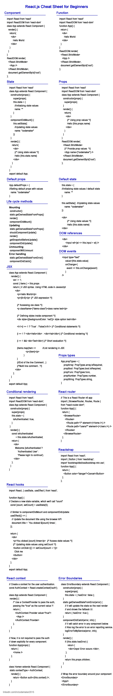

# React.js 初学者备忘单

> 原文：<https://medium.com/coinmonks/react-js-cheatsheet-for-beginners-5665425d9026?source=collection_archive---------3----------------------->


React 是 Meta 开发的一个 JavaScript 库，用于用最少的代码高效地构建用户界面。React.js 的主要目标是通过将页面分解成更小的 UI 组件来提供尽可能好的呈现性能。

React.js 的主要特点是代码编写简单。我们可以使用 JSX 语法将 JavaScript 代码嵌入到 HTML 代码中，不像 Angular 这样的技术，我们必须编写更多的代码行。

在本文中，我们将学习 React.js 的基础知识。

# 入门指南

## 目录

*   [React 环境设置](#7435)
*   [组件](#a471)
*   [状态](#7bfb)
*   [道具](#ad83)
*   [设置默认道具/状态](#9198)
*   [生命周期方法](#7313)
*   [DOM 引用](#6421)
*   [DOM 事件](#fecd)
*   [JSX (Javascript XML)](#5b07)
*   [条件渲染](#d22d)
*   [房产验证](#0511)
*   [反应路由器](#dab1)
*   [反应钩](#a831)
*   [反应上下文](#45e9)
*   [反应陷阱](#9aeb)
*   [错误边界](#f04a)
*   [React.js vs React native](#0d49)

## React 环境设置

创建 react 应用的先决条件: [Node.js](https://nodejs.org/en/download/) 和 NPM

示例应用程序创建命令，

```
npx create-react-app hello-world
cd hello-world
npm start
```

## 成分

组件是独立的、可重用的代码。它类似于 JavaScript 函数，通过一个`render()`函数返回 HTML。组件大致分为两类组件和功能组件。

**类组件**

**功能组件**

## 状态

state 是 React 组件类的一个实例，可用于存储属于组件的属性值。当状态发生变化时，组件会重新呈现。

## 小道具

Props(属性)是只读的不可变组件。它是一个存储属性值的对象，并作为从一个组件向另一个组件传递数据的媒介。它将值传递给组件，就像将参数传递给函数一样。

## 设置默认属性/状态

`defaultProps`用于设置道具的默认值。它可以被定义为一个组件属性来设置类的默认属性。它还为构造函数中的状态提供默认值。

**默认道具**

**默认状态**

## 生命周期方法

React 用于在每个阶段的组件执行期间调用多个生命周期方法。创建组件时调用的方法称为挂载。每次组件更新都称为更新。组件的移除称为卸载。整个过程被称为“组件生命周期”。

*   **挂载生命周期方法**
    构造函数()
    静态 getDerivedStateFromProps()
    render()
    componentdimount()
*   **更新生命周期方法**
    静态 getDerivedStateFromProps()
    shouldcomponentdupdate()
    render()
    getsnapshotbeforedupdate()
    componentDidUpdate()
*   **卸载生命周期方法**组件将卸载
*   **错误处理生命周期方法**
    静态 getderivedstatefromrerror()
    componentDidCatch()



Image credits projects.wojtekmaj.pl



## DOM 引用

React 在组件中使用引用进行 DOM 访问。这可以通过向应用程序中的元素添加 ref 属性来实现。

## DOM 事件

事件是用户操作或系统生成的操作可能触发的操作。React 有自己的事件处理系统，称为合成事件，与 DOM 元素上的事件处理非常相似。

React 事件与 DOM 事件在语法上有些不同。它们是:

*   React 事件以 camelCase 格式命名，而不是小写格式。
*   React 事件处理程序需要函数而不是字符串。

## JSX (Javascript XML)

JSX 使用户能够用 HTML 编写 JavaScript。它用 JavaScript 编写 HTML 元素并将它们放在 DOM 中，没有任何`createElement()`或`appendChild()`方法。

## 条件渲染

React 提供了条件呈现，根据应用程序的某些条件或状态来呈现特定的组件或代码片段。

## 属性验证

Props 验证是一种用于避免 props 数据相关问题的机制。`PropTypes`是一个 react 组件属性，它使用户能够验证通过 props 传递的值的数据类型。

## 反应路由器

React Router 是一个 JavaScript 库，用于在 React 应用程序中创建路由。路由是一种机制，当 URL 路径匹配路由器文件中的任何“路由”时，我们可以导航到不同的页面。

**安装**

```
npm install react-router-dom --save
```

有两种类型的路由器组件:

*   **BrowserRouter:** 用于处理动态 URL。
*   **HashRouter:** 用于处理静态请求。

**示例**

## 反应钩

在 React 16.8 中引入了钩子。它使用户能够在功能组件中直接使用属性和状态。在不编写类的情况下，管理组件状态并在状态发生某些变化时执行后效非常有用。

钩子类似于 JavaScript 函数，但是在使用它们的时候遵循这些规则是很重要的。

1.  只在顶层调用钩子
    钩子应该总是用在 React 函数的顶层，并且不要在循环、条件或嵌套函数中调用它们。
2.  **仅从 React 函数调用钩子**仅从函数组件和自定义钩子调用钩子。

内置挂钩分为两种——基本挂钩和附加挂钩。

**基本挂钩**

*   使用状态
*   使用效果
*   使用上下文

**附加挂钩**

*   用户教育
*   使用回调
*   使用备忘录
*   useRef
*   useImperativeHandle
*   useLayoutEffect
*   useDebugValue

## 反应上下文

上下文使用户能够将数据传递给子组件，而无需在每一级手动向下传递属性。

## 反应阱

Reactstrap 是一个 javascript 库，它提供了内置的引导组件，使得为应用程序创建带有内置验证的 UI 变得更加容易。Reactstrap 现在支持 Bootstrap 5.1。

**安装:**

```
npm install reactstrap react react-dom
npm install --save bootstrap
```

**示例:**

## 误差边界

React 16 引入了一种新的方法，通过使用错误边界来处理应用程序中的错误。它允许用户保持应用程序运行，尽管在运行时出现错误，并向用户显示一个回退用户界面。

## React.js vs React native

React.js 是一个开源 JavaScript 库，用于构建 Web 应用程序的用户界面，而 React Native 用于开发 iOS 和 Android 的移动应用程序。React Native 与 React 几乎类似，但是，它使用本机组件而不是 web 组件作为构建块，并通过浏览器面向移动平台。



Image credits Javapoint

# 摘要



感谢阅读这篇文章。

感谢 [Gowri M Bhatt](https://www.linkedin.com/in/gowri-m-bhatt-85b31814b/) 审阅内容。

获取 pdf 格式的文章:[React.js-cheatsheet.pdf](https://drive.google.com/file/d/1lbtfakCKy9X3YWMMAdtqDIpgpBYHbGXp/view?usp=sharing)

这篇文章也可以在 [Dev](https://dev.to/codemaker2015/reactjs-cheatsheet-for-beginners-5f6b) 上找到

如果你喜欢这篇文章，请点击拍手按钮👏并且分享出来帮别人找！

如果您有兴趣进一步探索，这里有一些我认为有用的资源:

[](https://reactjs.org/tutorial/tutorial.html) [## 教程:反应简介-反应

### 本教程没有假设任何现有的 React 知识。在本教程中，我们将构建一个小游戏。你可能会…

reactjs.org](https://reactjs.org/tutorial/tutorial.html) [](https://reactjs.org/docs/state-and-lifecycle.html) [## 状态和生命周期-反应

### 本页介绍了 React 组件中状态和生命周期的概念。你可以找到详细的组件 API…

reactjs.org](https://reactjs.org/docs/state-and-lifecycle.html) [](https://reactjs.org/docs/introducing-jsx.html) [## 介绍 JSX - React

### 考虑这个变量声明:这个有趣的标记语法既不是字符串也不是 HTML。它叫 JSX，是一个…

reactjs.org](https://reactjs.org/docs/introducing-jsx.html) [](https://reactjs.org/docs/hooks-intro.html) [## 介绍钩子-反应

### 钩子是 React 16.8 中的新增功能。它们允许您使用状态和其他 React 特性，而无需编写类。这个…

reactjs.org](https://reactjs.org/docs/hooks-intro.html) 

> 加入 Coinmonks [电报频道](https://t.me/coincodecap)和 [Youtube 频道](https://www.youtube.com/c/coinmonks/videos)了解加密交易和投资

# 另外，阅读

*   [5 款最佳加密交易终端](https://coincodecap.com/crypto-trading-terminals) | [最佳 DeFi 应用](https://coincodecap.com/best-defi-apps)
*   [最佳网上赌场](https://coincodecap.com/best-online-casinos) | [币安评论](/coinmonks/binance-review-ee10d3bf3b6e) | [BitMEX 评论](https://coincodecap.com/bitmex-review)
*   [麻雀交换评论](https://coincodecap.com/sparrow-exchange-review) | [纳什交换评论](https://coincodecap.com/nash-exchange-review)
*   [美国最佳加密交易机器人](https://coincodecap.com/crypto-trading-bots-in-the-us) | [变化回顾](https://coincodecap.com/changelly-review)
*   [在印度利用加密套利赚取被动收入](https://coincodecap.com/crypto-arbitrage-in-india)
*   [Godex.io 审核](/coinmonks/godex-io-review-7366086519fb) | [邀请审核](/coinmonks/invity-review-70f3030c0502) | [BitForex 审核](https://coincodecap.com/bitforex-review)
*   [5 款最佳免费加密货币制图工具](https://coincodecap.com/crypto-charting-tools)