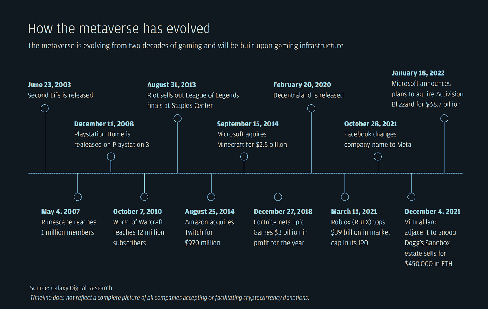
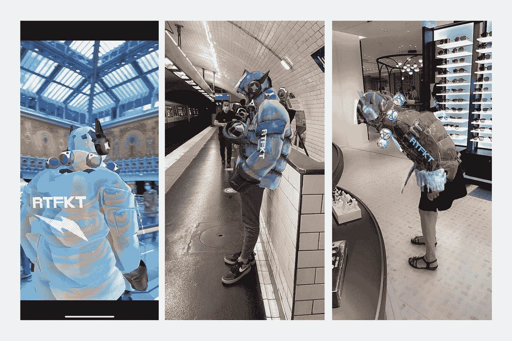
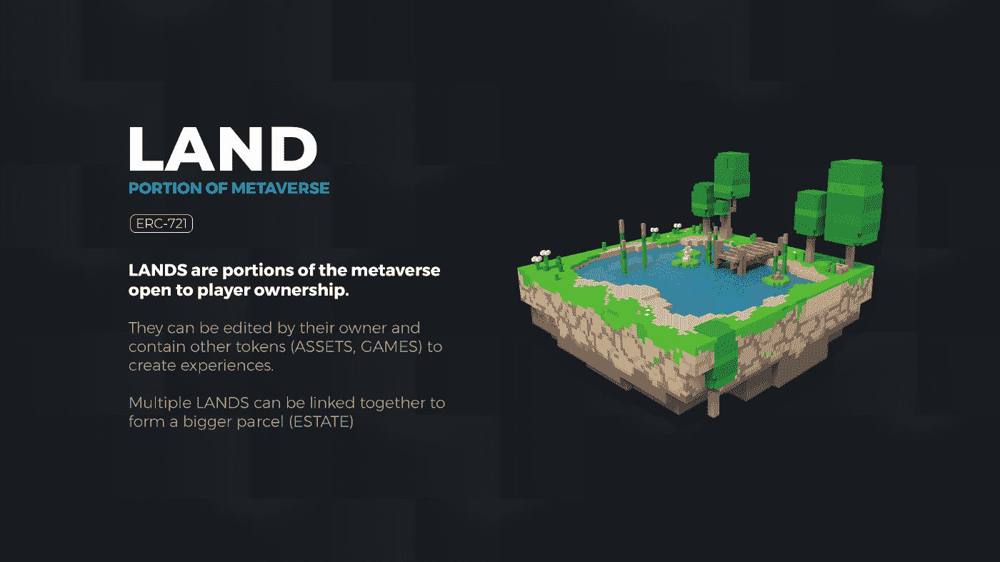
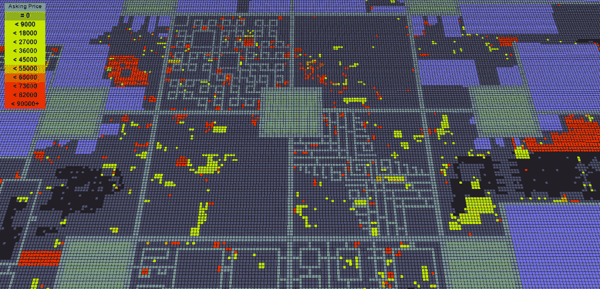
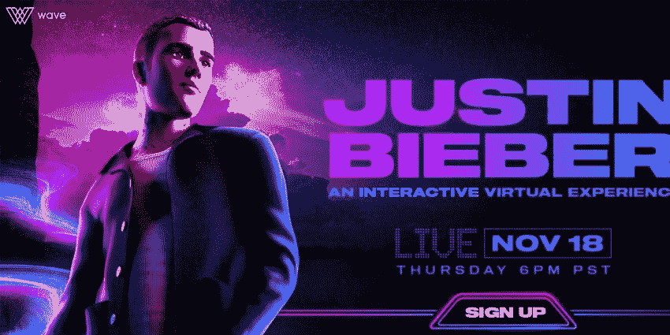
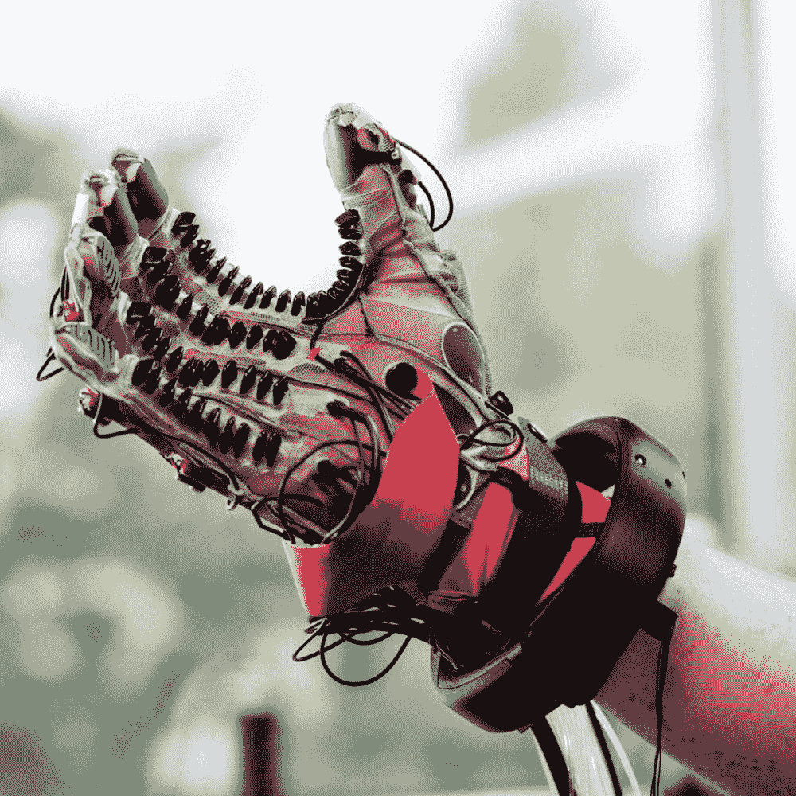
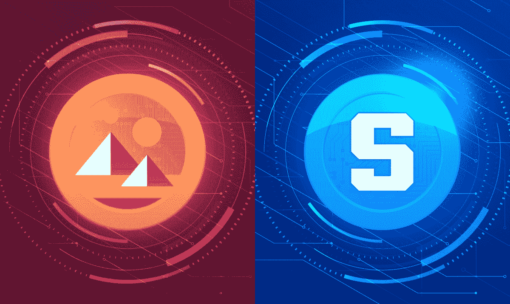

# 元宇宙

> 原文：<https://medium.com/coinmonks/ready-or-not-metaverse-is-coming-b5b0e51c04a0?source=collection_archive---------2----------------------->

finextra.com

# 介绍

元宇宙的想法可以追溯到过去。

“元宇宙”这个词是作家尼尔·斯蒂芬森(Neal Stephenson)在 1992 年的科幻小说《冰雪奇缘》(Snow Crash)中发明的，这部小说预测了互联网的一个基于虚拟现实的继任者。故事中的人们利用自己的数字化身来探索网络世界，经常是为了逃避黯淡的现实。

大约 30 年后，它现在正在成为现实，或者说是虚拟现实(当然不包括反乌托邦)。

在这篇文章中，我们将谈论所有关于元宇宙。

# 什么是元宇宙？

*图片来源:nianticlabs.com*

简单地说，元宇宙就是打破二维界限的互联网。

如果我们认为互联网是我们正在看的东西，元宇宙是互联网的一个版本，我们可能会以一个化身或自己在 3D 中的虚拟表示来体验。这是一个沉浸式的空间结构，而不是当前桌面或手机上的 2D 网络。

我们最终可以在元宇宙发展成熟的数万亿美元的经济。不仅仅是数字产品和娱乐的经济，还有沉浸式环境中的服务，有设计师、造型师，甚至心理学家。

**元宇宙的进化**

*图片来源:银河数码*

从很多方面来说，这是一种线性进化。在线多玩家角色扮演世界，如模拟人生或第二人生，已经运营了 20 多年，用户平均每周花 20 个小时在这些领域。如今的类似公司，如《我的世界》、Roblox 和堡垒之夜，拥有数亿玩家和庞大的支持经济体。

几种新技术的结合为这种元宇宙的出现铺平了道路。增强现实和虚拟现实耳机变得更加实惠和强大，这改善了用户体验。区块链的出现实现了数字货币和 NFT，这实现了数字商品的稀缺性和所有权。交易和拥有数字商品的新方法允许创作者通过代币来赚钱。这种民主的所有权制度，以及互操作性的前景，有可能提供巨大的经济机会。

# 元经济

数字世界和现实世界的迅速融合带来了巨大的商业前景。以下是元宇宙正在兴起的一些产业。

**元宇宙时尚**

据 Statista 称，时尚产业是一个价值 2.5 万亿美元的全球行业，影响着地球上的每个人。这一行业已经进入元宇宙，各公司再现了作为时尚和文化特征的体验。虚拟时尚允许表达众多的自我。随着屏幕服装成为新的街头服装，虚拟形象服装已经走了很长的路。

在虚拟时尚界，NFT 是元宇宙的时装，在这里，数字工匠不受约束的创作可能会比大公司的作品价格更高，而这种资产在稀缺性和真实性的驱动下，正迅速成为加密的身份象征。

数字时尚正以多种方式被采用。首先，你可以用一个 AR 滤镜给自己戴上，见下图。

*图片来源:时尚商业*

或者你可以把它变成元宇宙或区块链电脑游戏中的头像，如下图所示:

*图片来源:商业内幕*

随着越来越多的人开始进入虚拟世界，花更多的时间在虚拟环境中，我们将开始消费数字服装、美容、珠宝等等。

许多初创公司正在进入这个市场，以使用户体验更加友好，因为现在购买 NFT 可能很复杂。

已经进入元宇宙的主要品牌有耐克、阿迪达斯、古驰等等。

**游戏**

*图片来源:popularmechanics.com*

到 2023 年，全球游戏市场有望达到 2000 亿美元(《全球游戏市场报告》，Newzoo，2021)，其中移动游戏占了最大份额。

根据市场研究和分析公司 App Annie 的数据，游戏玩家每年仅在手机游戏上的支出就超过 1000 亿美元，全球有超过 30 亿人在玩视频游戏。此外，在 2021 年，游戏玩家下载了 829.8 亿个移动游戏，预计到 2025 年，游戏将占 Google Play 收入的 71%。

游戏现在是世界上最主要的娱乐形式，但到目前为止，只有这些游戏的开发者获得了财务收益，而游戏玩家只是花钱来享受它们。Roblox、Pokemon Go 和堡垒之夜每年都从游戏内购买中获得可观的收入。据估计，一个主要游戏《诸神之战》(Clash of Titans)已经为开发商 Supercell 带来了接近难以想象的 35 亿美元的总收入。

由于集中的经济模式，开发商和发行商拥有所有游戏内资产的权利，并有权以他们认为合适的方式分配这些资产。

然而，随着元宇宙的出现，它导致了游戏赚钱模式的兴起。本质上，与传统游戏不同，“玩赚”模式意味着你在游戏中拥有的所有数字资产都是你的，你可以做任何你想做的事情，包括在二级市场上出售。这些资产存储在区块链上，因此您不必担心它们的安全性。发行商或开发商将不会对玩家在游戏中购买的任何物品拥有任何权利。

主要的游戏开发商，如 GTA 的 Take Two Interactive，育碧和其他几个已经表达了对区块链游戏的兴趣。

**数字房地产**

*图像来源:媒体*

虚拟房地产可能是数字所有权发展的下一步。元宇宙有很多地块，每个元宇宙平台都提供有限数量的地块供购买，这些地块通过区块链技术进行跟踪。

土地被分成成千上万块，每一块都有固定的大小(例如，16 米 x16 米),都是自己在区块链的认证 NFT，这意味着每一块土地都是完全独特的，不可复制的。请参见以下内容:

*图片来源:分散的土地.游戏博客*

因为每个元宇宙平台都公布了将会存在的地块的精确数量，所以稀缺性就产生了，这就是土地价值的来源。

你可以使用各种编程工具在你的土地上建造零售开发、艺术工作室、赌场、博物馆和任何你想要的东西。

【vmsd.com】图片来源:T2

建立一个虚拟购物中心，出租给销售时尚头像的商店就是一个例子。因此，实际上，它们变成了亚马逊、Etsy 或 Shopify 等市场的 3D 类似物，在一个地方可以找到几个不同的卖家和零售商品或体验，而不必从头开始构建所有的技术。

位置在虚拟世界中很重要，就像在现实世界中一样。这一切都归结于预测的用户流量，如果一块土地获得更多的用户流量，土地所有者将能够更容易地通过广告，销售 NFT，提供公司或服务，或提供游戏来赚钱。

【theartnewspaper.com】图片来源:T4

例如，Tokens.com 以 250 万美元的价格买下了分散式的时装区的土地，这里的客流量很大。

**演唱会**

音乐产业发展的下一步是在元宇宙举办虚拟音乐会。例如，虚拟人不再受物理限制的约束，在虚拟音乐会中，音乐家可以立即更换衣服或将舞台从外太空领域转换到水下领域。

实质上，虚拟音乐会可能和常规音乐会一样具有娱乐性和情感意义。粉丝可以与流行艺术家互动，并影响整个音乐会的进程。越来越多的艺术家正在尝试元宇宙体验，品牌赞助和虚拟商品是品牌利用蓬勃发展的娱乐趋势的方式。

元宇宙的一些艺术家包括史努比狗、贾斯汀比伯、Lady Gaga、爱莉安娜·格兰德等等。

**社交互动**

*“在接下来的两三年内，我预测大多数虚拟会议将从 2D 相机图像网格转移到元宇宙，一个拥有数字化身的 3D 空间，”* —比尔盖茨。

许多公司老板已经认识到虚拟会议相对于面对面会议的优势，包括节省成本、更容易与世界各地的同事互动等等。缩放现在用于这种会议，但这可能会很快改变。

*图片来源:推特*

你可以戴上眼镜或耳机，让自己完全沉浸在那个空间中，而不是用相机和二维体验进行标准的变焦通话。无论你身在何处，这些虚拟现实体验都有可能极大地改善与他人联系时的选择。在许多情况下，元宇宙选项可能比典型的缩放会议更有助于个人联系。人们将能够更有效地参与，而不仅仅是盯着屏幕，这可能会提高此类会议对许多企业和个人的价值。

**感受虚拟世界**

【vox.com】图片来源:T4

下一个难题是既能看到这些虚拟环境，又能感觉到它们。一个这样的例子是公司正在努力开发的手套，它将让用户感觉像拿着一个物体。该手套有许多传感器，可以跟踪佩戴者的运动，并在手套表面充气以提供感觉。

# 哪个元宇宙？

有两种类型的元经文，区块链的公共的，如分散的土地或沙盒和私人的，如元(以前的脸书)。

**分散&沙盒**

*图片来源:zipmex.com*

今天，两个最大的区块链元经文是分散的土地和沙盒。它们都有相同的基本前提，即用户可以探索虚拟环境，并与其中的其他玩家和对象进行交互。

分散土地中的代币分为三种:法力(当地货币)、穿戴(可穿戴设备和物品)和土地(虚拟土地)。在沙盒中，有四种类型的令牌:沙子(原生货币)、资产(用户创建的项目)、游戏(用户创建的游戏)和土地(虚拟的土地)。

沙盒和分散土地元经文允许用户购买虚拟土地，并使用它来创建自己的世界。换句话说，用户可以创建、体验和货币化他们的内容和应用。

**沙盒**打算在 2022 年底之前将该平台部署在移动设备上，以及 Xbox 和 Playstation 等主机上。此外，他们希望到 2023 年底，该平台上可以提供 5000 款游戏。此外，沙盒打算建立游戏中的工作，这将允许用户以与他们在现实世界中相同的方式工作。

分散的土地希望吸引创作者、公司和名人到这个地区，让他们在 2022 年初制作 NFT 水滴和广告。更重要的是，有一个提议正在酝酿中，让分散土地与其他元宇宙世界互通。

**梅塔(脸书)**

【youtube.com】图片来源:T4

相比之下，虽然 Meta 称其虚拟世界是去中心化的，但从区块链的角度来看，它与“去中心化”是不同的，因为 Meta 是由一个中心化的实体管理的。

Meta 的元宇宙是 3D 制作的，进入虚拟环境需要一个 VR 头戴设备。Meta 的元宇宙的全部意义在于超越电脑屏幕的限制，与他人在一起，无论他们相距多远。

尽管很难预测在这一点上哪个会成功，但值得注意的是，根据元宇宙游戏企业 Advokate Group 最近进行的一项民意调查，超过 77%有兴趣加入元宇宙的受访者担心 Meta 持有数据。

此外，87%的人支持元宇宙支持分权的区块链。这一观点在 Z 世代受访者中更为强烈，他们比千禧一代更倾向于想要一个区块链·元宇宙。

# 摘要

我们并不是说我们现在所知的元宇宙将取代所有的人类互动，而是说它可能是今天 2D 互联网的继承者。

在未来几年，元宇宙几乎肯定会以某种形式渗透到每个行业，JP 摩根预测年收入机会超过 1 万亿美元。

不要认为这只是一个暂时现象；这是一个游戏改变者，我们不知道它会走向何方。

*免责声明:本文包含的信息仅用于教育目的，并不构成 Wheatstones 的任何形式的建议或推荐，用户在做出(或避免做出)任何投资决策时也不打算依赖这些信息。*

> 加入 Coinmonks [电报频道](https://t.me/coincodecap)和 [Youtube 频道](https://www.youtube.com/c/coinmonks/videos)了解加密交易和投资
> 
> 另外，阅读

*   [比特币基地赌注](https://coincodecap.com/coinbase-staking) | [热点评论](/coinmonks/hotbit-review-cd5bec41dafb) | [库币评论](https://coincodecap.com/kucoin-review)
*   购买 Dogecoin 的 7 种最佳方式
*   [iTop VPN 审查](https://coincodecap.com/itop-vpn-review) | [曼陀罗交易所审查](https://coincodecap.com/mandala-exchange-review)
*   [比特币基地 vs 瓦济克斯](https://coincodecap.com/coinbase-vs-wazirx) | [比特鲁点评](https://coincodecap.com/bitrue-review) | [波洛涅克斯 vs 比特鲁](https://coincodecap.com/poloniex-vs-bittrex)
*   [美国最佳加密交易机器人](https://coincodecap.com/crypto-trading-bots-in-the-us) | [经常性回顾](https://coincodecap.com/changelly-review)
*   [A-Ads 审查](https://coincodecap.com/a-ads-review) | [Bingbon 审查](https://coincodecap.com/bingbon-review) | [Mudrex 投资](https://coincodecap.com/mudrex-invest-review-the-best-way-to-invest-in-crypto)
*   [最好的卡达诺钱包](https://coincodecap.com/best-cardano-wallets) | [Bingbon 副本交易](https://coincodecap.com/bingbon-copy-trading)
*   [氹欞侊贸易评论](https://coincodecap.com/anny-trade-review) | [Paybis 评论](https://coincodecap.com/paybis-review) | [Keevo 钱包评论](https://coincodecap.com/keevo-wallet-review)
*   [印度最佳 P2P 加密交易所](https://coincodecap.com/p2p-crypto-exchanges-in-india) | [柴犬钱包](https://coincodecap.com/baby-shiba-inu-wallets)
*   [8 大加密附属计划](https://coincodecap.com/crypto-affiliate-programs) | [eToro vs 比特币基地](https://coincodecap.com/etoro-vs-coinbase)
*   [最佳以太坊钱包](https://coincodecap.com/best-ethereum-wallets) | [电报上的加密货币机器人](https://coincodecap.com/telegram-crypto-bots)