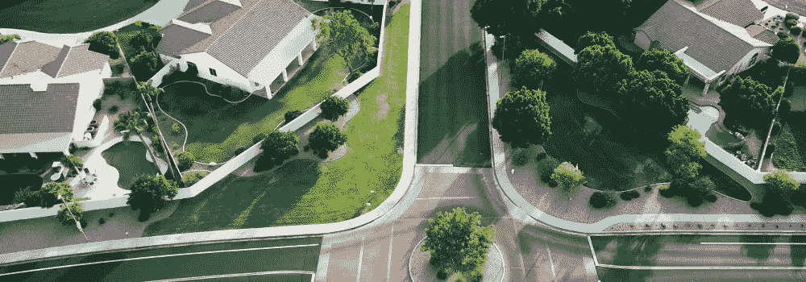

# 投资者的房地产市场分析

> 原文：<https://medium.com/coinmonks/real-estate-market-analysis-for-investors-62f0b248e4bb?source=collection_archive---------17----------------------->

无论你的首选房地产投资策略，彻底的房地产市场分析是至关重要的，你的成功。这种分析需要的不仅仅是查看可比销售额和确定社区是否好。为了确保你的投资发挥最大作用，你需要对当地市场和房地产有一个全面的了解。

研究当地的房地产市场，看看它是否适合投资，这被称为房地产市场分析。投资者利用这一过程来确定哪些房地产是受欢迎的，它们将以什么价格出售，以及是否可以盈利。这是决定投资者想在哪里购买房产的最关键步骤之一。

当构建你的房地产市场分析，你应该集中在四个关键领域:经济分析，计算投资回报率，财产价值估计和风险。值得注意的是，房地产市场分析不同于比较营销分析。你会关注生活成本、就业增长、社区设施等，而不仅仅是你所在市场最近出售的房产。

虽然这听起来像是一项重大的事业，但你对房地产市场进行全面分析的工作将有助于你确定哪里可以获得最佳投资回报。这个指南将帮助你为你正在考虑的每个市场创建你的房地产市场分析。

# 房地产分析的关键组成部分

你将需要更多的信息，而不仅仅是谁住在附近，什么房产是热门的。经济分析应该包括在你的整体房地产市场分析中，以便更深入地了解当地情况，并预测未来的变化。

# 经济分析

你将需要更多的信息，而不仅仅是谁住在附近，什么样的[房产是热门的](https://blog.ark7.com/blog/welcome-to-austin-texas-the-hottest-real-estate-market-in-america/)。经济分析应该包括在你的整体房地产市场分析中，这样你可以更深入地了解当地的情况，并预测未来的变化。

# 生活费用

在一个给定的市场中，维持一种特定的生活方式所需的钱数就是生活成本。

因为商品和服务的成本因城市而异，计算生活成本可以告诉你在特定地区生活的负担能力。因此，它有助于您更好地了解当地人口及其房地产趋势和偏好。

生活成本受到住房负担能力以及食品、娱乐和交通费用的影响。工资范围和小时工资也是根据这些费用来衡量的，所以生活费用也与收入有关。生活成本计算器是将这些数据添加到你的房地产营销分析中的一个简单方法。

# 就业和人口趋势

就业机会影响当地的住房需求和房屋价值。美国劳工统计局收集并提供各地区的失业率、就业增长和工资数据。你可以按州或地区搜索他们的资源，看看哪些地区最有就业增长的潜力。

人口普查数据也是你考虑投资的地区总体人口趋势和人口变化的重要信息来源。例如，如果你的目标市场是年轻的专业人士，你可以使用人口普查数据来确定千禧一代涌入社区的地区。

不要忘记做自己的研究，除了看这些更大的来源，房地产市场分析。关注当地新闻和任何进入你的市场的新业务。他们会给这个地区带来新的就业机会吗？有哪些类型的工作，有多少？此外，要留意那些正在搬出社区的企业。你应该评估这些类型的公司开业和倒闭对进出你的市场的人的影响。

# 邻里和环境因素

学校怎么样？附近有医院吗？购物机会多吗？公共交通又如何呢？所有这些因素都会影响房产的销售速度。如果你打算出租房产，考虑你想吸引什么样的房客也很重要。这个地区适合家庭居住，还是更适合单身人士或夫妇居住？这里有很多退休人员吗，还是大部分是刚毕业的大学生？

气候会影响房产的转售价值和维护难度。例如，佛罗里达州的一个家庭需要的屋顶类型与佛蒙特州的不同。此外，如果你生活在一个极端天气条件下，如大雪或洪水，你需要考虑到这一点时，计算维修费用。即使你自己不住在房子里，你仍然需要雇人在你不在的时候照看房子。

另一个重要的问题是，是否有任何环境问题会影响到遗产。例如，是否有洪水或滑坡的风险？有没有在相邻的地产上做过什么工作？

# 房地产投资回报率

当你考虑购买一处投资房产时，了解这些数字是很重要的。不仅仅是房产的价格和你能赚多少钱。如果你买了那处房产，了解你的投资回报率(ROI)是很重要的。

在房地产投资中，投资回报率(ROI)是一个用于评估投资物业与原始投资成本相比产生多少收入的指标。投资回报率数字以百分比表示，帮助投资者确定某个特定房产是否会产生高回报，或者是否最好放弃这笔交易。

在决定是否投资房产时，除了投资回报率之外，你还应该考虑其他因素，如现金流、费用和租金。然而，投资回报率是一个重要的考虑因素，因为它让你知道你的回报。它还可以帮助您并排比较属性。

因为它提供了一个具体的，真实的潜在投资的利润图，投资回报率对任何投资者来说都是一个有价值的工具，无论经验水平如何。

虽然这听起来可能很复杂，但是可以使用一个简单的公式来计算您的投资回报率:

(投资收益-投资成本)÷投资成本=投资回报率

根据您的投资类型，您还可以进行额外的 ROI 计算和评估，但如果您想保持简单，并在分析中获得可靠的数据点，此公式为评估您的选项提供了一个很好的基准。

# 评估价值

有许多不同的方法来评估一处[房产](https://support.ark7.com/hc/en-us/articles/360033505632-Where-are-the-investment-properties-located-)是否值其要价。最常见的方法之一是审查 comps。这包括查看与被估价的房产相似的房产，并确定它们最近的售价。待售房产提供可比房产的最新价值。此外，封闭销售为价格随时间的变化趋势提供了历史背景。房地产经纪人可以帮助你完成这个过程，并且可以通过他们的多重列表服务(MLS)提供关于 comps 的信息。

没有现有结构或基础设施(如道路和公用设施管线)的空地或未开发土地通常被视为不如已开发房地产有价值。但这一规则也有例外，尤其是当空地或土地位于非常抢手的社区时。

当评估一块空地或未开发土地的价格时，最好对该房产进行实地考察，并对其所在的市场做一些研究。

在确定一块空地或未开发土地的市场价值时，需要考虑以下几点:

*   位置。
*   分区(这样你就知道什么用途是允许的)。
*   大小(以英亩和平方英尺为单位)。
*   海拔和地形(多少财产是可用的)。
*   任何公用设施连接(水、下水道、煤气、电)。
*   环境问题(潜在洪水、湿地)。

# 评估风险

当你购买房地产时，你是在赌房地产的价值会随着时间的推移而上升，你的成本会低于你最终出售的价格。如果你低买高卖，你就赚了一大笔钱。

但作为投资者，你要承担财务风险。例如，如果利率上升或下降，如果经济放缓或加快，如果你的财产价值增加或减少，所有这些事情都可以显著影响你从房地产中赚多少钱。

为了帮助管理风险，以下是投资者面临的一些最常见的风险:

*   **经济风险。衰退可能和市场调整一样糟糕，因为它可能导致失业率飙升，这可能迫使借款人违约。房产价值也在下降，使得房产更难出售，并增加了丧失抵押品赎回权的损失。**
*   **市场风险。市场调整会让你的投资血本无归。股票市场不会每天都上涨，所以你的投资组合可能会下跌几年，但仍然会出现盈利。**
*   **现金流风险。**如果你正处于强劲的牛市之中——如果价格正在快速上涨——并且你正在偿还贷款或提前还款，那么随着价格回落，你有可能会拖欠还款，甚至损失利息收入。
*   **物业管理风险。**物业管理可能是一笔很大的开支，而且找到好的物业经理并不总是那么容易。因此，物业管理公司也可能倒闭。
*   **租赁风险。找到好的房客可能很难，与坏的房客打交道可能更难。坏房客会造成损害，迟交房租或根本不交房租，并给其他房客造成无法接受的条件。**
*   **租户风险。**如果投资者依靠租金收入来支付抵押贷款，失去一个租户——或者有一个租户延迟付款或根本不付款——可能会导致财务困难。出于这个原因，一些专家建议储备三到六个月的抵押贷款。
*   **法律风险。**你在一项资产上投入了大量资金，而这项资产可能会变成你在法律上无法处理的东西(比如出售)。如果你的贷款变成止赎或卖空，你可能会失去一切。
*   **权利风险。**权利风险是指项目可能无法获得城市开发批准或无法在预期时间框架内获得批准。例如，对一个新的建筑项目获得批准可能需要多长时间的估计可能不准确，可能会导致项目完成和获得投资回报的延迟。
*   **施工风险。**您的投资物业在建设和翻新过程中可能出现的潜在问题，例如成本超支和延期。
*   **地理风险。**指可能对整个地理区域产生负面影响的政治、经济或自然事件。

# 准备比较市场分析

房地产市场总是在变化，所以能够分析它对任何投资者来说都是一项重要的技能。比较市场分析(CMA)是一个很好的起点，但找出哪些因素是最重要的，以及如何利用它们来为你带来优势可能是一个挑战。CMA 是对你所在地区最近售出的类似房产的比较。你可以通过看类似的房产卖多少钱来估计你的房产值多少钱。

作为准备 CMA 的第一步，收集您所在地区最近销售的所有必要信息。你需要:

*   销售地址和日期。
*   每平方英尺价格或每平方英尺价格范围。
*   位置。
*   平方英尺。
*   卧室、浴室和停车位的数量。

将你所学的一切放入一个组织良好的电子表格或数据库中。这将使你以后更容易分析你的数据。为上面列出的每个变量列一列，为符合比较标准的每个房屋销售列表或销售日期列一行。计算每个家庭销售列表或销售日期的每个变量之间的比率，以比较数据。例如，如果一处房产的卧室比另一处多，但每平方英尺的售价较低，那么它可能更有价值，因为它有更多的居住空间。

在决定投资地点之前，你应该准备一份关于多处房产和社区的 CMA。

# 最后的想法

最终，对于“我应该投资什么？”这个问题，没有一个通用的答案每个市场和物业都需要自己的深入分析。然而，创建房地产市场分析的最大好处之一是，你将被迫考虑广泛的因素，无论你在考虑什么样的房地产购买，这都是有帮助的。

市场分析的有用程度取决于你用来实施它的工具。您从房地产市场分析中收集的信息会推动您的投资决策，并为您的长期业务战略提供信息。重要的是要记住，房地产市场由许多移动的部分组成，每个部分都可能倾向于购买或租赁，这取决于当地经济的动态。

> 加入 Coinmonks [电报频道](https://t.me/coincodecap)和 [Youtube 频道](https://www.youtube.com/c/coinmonks/videos)了解加密交易和投资

# 另外，阅读

*   [如何在 FTX 交易所交易期货](https://coincodecap.com/ftx-futures-trading) | [OKEx vs 币安](https://coincodecap.com/okex-vs-binance)
*   [CoinLoan 评论](https://coincodecap.com/coinloan-review) | [YouHodler 评论](/coinmonks/youhodler-4-easy-ways-to-make-money-98969b9689f2) | [BlockFi 评论](https://coincodecap.com/blockfi-review)
*   [XT.COM 评论](https://coincodecap.com/profittradingapp-for-binance)币安评论 |
*   [SmithBot 评论](https://coincodecap.com/smithbot-review) | [4 款最佳免费开源交易机器人](https://coincodecap.com/free-open-source-trading-bots)
*   [比特币基地僵尸程序](/coinmonks/coinbase-bots-ac6359e897f3) | [AscendEX 审查](/coinmonks/ascendex-review-53e829cf75fa) | [OKEx 交易僵尸程序](/coinmonks/okex-trading-bots-234920f61e60)