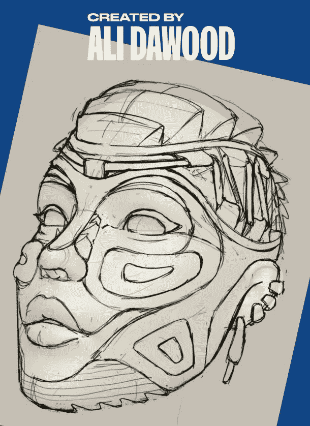

# 现实生活中的鞋子设计师创造了运动鞋头 NFT 系列

> 原文：<https://medium.com/coinmonks/real-life-shoe-designers-created-the-sneaker-heads-nft-collection-2ac4243e469d?source=collection_archive---------14----------------------->

[Real-Life Shoe Designers Created The Sneaker Heads NFT Collection](https://cryptonewspipe.com/real-life-shoe-designers-created-the-sneaker-heads-nft-collection/)

运动鞋很受欢迎，因为它们功能多样、舒适、时尚。运动鞋经常与著名的运动员和名人联系在一起。但是，当你把两者结合起来，你会得到什么？认识一下 Sneaker Heads，一个由现实生活中的鞋子设计师 Ali Dawood 创造的 5000 个 NFT 的集合。