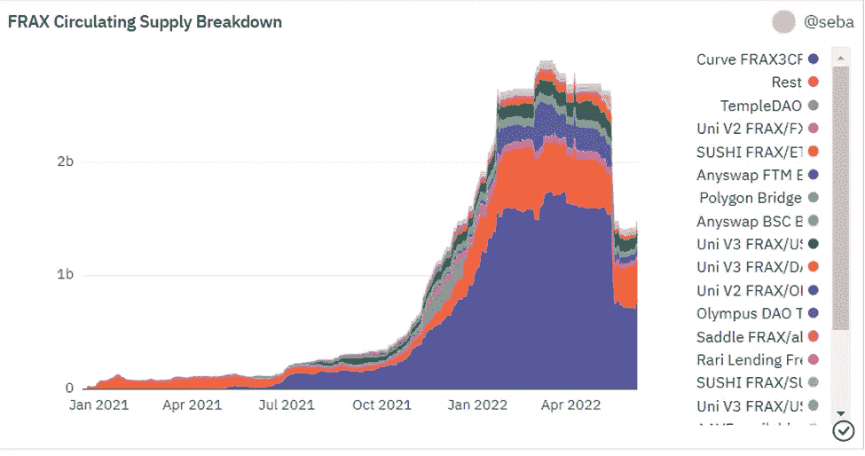
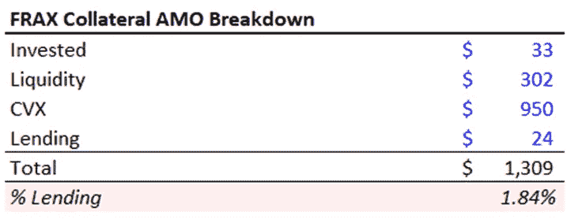

# 真实世界贷款:远离自给自足的加密收益

> 原文：<https://medium.com/coinmonks/real-world-lending-diversifying-away-from-self-feeding-crypto-yields-b4eb23fcfce2?source=collection_archive---------27----------------------->

Photo by [Anne Nygård](https://unsplash.com/@polarmermaid?utm_source=unsplash&utm_medium=referral&utm_content=creditCopyText) on [Unsplash](https://unsplash.com/s/photos/real-world?utm_source=unsplash&utm_medium=referral&utm_content=creditCopyText)

当前的隐性冬天已经耗尽了流动性，而在扩张阶段，流动性对于提高收益率至关重要。为了建立 TVL，一个有争议的成功的关键衡量标准，一系列新的协议哄骗投资者为他们的生态系统提供新的资金。更高的产量是通过本地令牌分发制造的。

为了吸引美元流动性而吸引美元流动性，并不是一件好事。在收缩阶段，就像我们现在所处的阶段，随着代币停止升值，本地收益率会下降。流动性提供者知道这一点，因此当风向改变时，他们会迅速打包走人。

在奖励用户的同时，本地产量农业也吸引了唯利是图的资本，并吸收了大部分协议资源，远离了实际产量分配。最终，随着时间的推移，它降低了协议对其利益相关者的价值。以 FRAX 为例， [0xHam](0xHamZ.substack.com) 强调了在卢娜/UST 坠毁事件中，FRAX 的供应量被除以 2。

Dune Analytics, 0xHam

FRAX 主要用其抵押品购买 CVX，很少用于实际贷款。这在扩张阶段是有益的，但是在收缩阶段将该方案置于危险之中。这大概就是内生价值和外生价值的全部区别。内生价值来自内在的收益机会，只为粘性利益相关者解锁。

0xHam

更长时间锁定流动性是稳定的关键。这意味着这种锁定应该有足够的回报来吸引存款。DeFi 发现这些天储户的 APY 相当不错，即使是 6 个月的锁定期。重要的是，这假设存款货币将保持稳定。

确保更长时期的流动性，有助于将资金配置到产生收益的投资上。这实际上类似于银行的工作，即计算存款人和借款人之间的利差。产量来源可以在 DeFi yield farming 中找到，并更广泛地进入现实世界的贷款。

到目前为止，DeFi 的局限性是什么？首先，最近的事件表明，并非所有自称“稳定的人”实际上都是稳定的#UST。其次，资产配置严重缺乏对风险管理的考虑，很难判断投资者的净风险调整回报率是多少。第三，大部分收益来自农业奖励提供的递归贷款，这只是由现实世界的收益机会逐渐补充。

从长远来看，利用真实世界的贷款是 DeFi 成功的关键因素。真实世界的贷款正通过 TruFi 或 Goldfinch 等信贷协议变得容易获得。制造者也开始提供它们。目前，用例仅限于新兴市场的短期抵押贸易融资，或金融科技资金管理。不过，这方面的发展很快。目前，Goldfinch 在其“高级池”中提供 8%的 APY，为其各种信贷交易提供多样化的分配。尽管 Goldfinch 确保其“高级资金池”受到第一损失“支持者”份额的保护，但这并没有改变潜在非流动性信贷投资的高风险性质，这些投资大多以本币计价，投向新兴市场的中型企业。

DeFi 的大好机会是什么？DeFi 协议应该设计自己的高级-低级部分，即存款将是高级的，承销商将是低级的。因此，储户不仅将获得存款货币的自然收益率，还将获得部分优先份额分配的收益率。分配将在真实世界和 DeFi 产量中进行。

去那里需要什么？

——选好存款币种:、戴、、、

-建立有粘性的利益相关者基础。促进验证的赌注，而不仅仅是奖励赌注者。

-在你的收益分配中规划出风险回报。仔细分析交易对手和结构化风险，无论是定义交易还是真实交易。这需要这两个领域的专家技能，精通 DeFi 产量农业的定量分析师，以及信贷专家。

-什么是安全的短期回报？Uniswap v3 的非激励性 USDC/戴资金池能否被视为 DeFi 短期流动性的低风险利率？它与 TradFi 的货币市场利率相比如何？

-确保通过对冲和保险对交易风险进行相应的缓冲。这应该会减轻你的独立违约风险。

-提供股权缓冲，使您的协议免受系统性风险的影响。《巴塞尔协议 III》要求银行提供约 10%的风险加权资产作为股本，以及 100%的流动性覆盖率(高质量流动资产/总净现金流)。适用于分散化银行的比率应该是多少？

**关于—**

*360 咨询有限责任公司是一家总部位于波士顿的 RIA 公司，管理投资，包括加密*

👉[上午 9 点至 30 点](https://twitter.com/930AM2)🐰🕳

**来源—**

👉现实世界的 0xHam 收益[https://twitter.com/0xHamz/status/1533819879391842309](https://twitter.com/0xHamz/status/1533819879391842309)

👉《搭车人指南》让出[https://research.thetie.io/the-hitchhikers-guide-to-yield/](https://research.thetie.io/the-hitchhikers-guide-to-yield/)

👉制造商现实世界收益路线图[https://twitter.com/MakerDAO/status/1535290688413306881?s = 20&t = iN-257 rnglznglfnciorxq](https://twitter.com/MakerDAO/status/1535290688413306881?s=20&t=iN-257RNGlzNglfncIorXQ)

👉新型信贷协议【https://thedefiant.io/defi-credit-protocols-rising/ 

> 加入 Coinmonks [电报频道](https://t.me/coincodecap)和 [Youtube 频道](https://www.youtube.com/c/coinmonks/videos)了解加密交易和投资

# 另外，阅读

*   [币安 vs FTX](https://coincodecap.com/binance-vs-ftx) | [最佳(SOL)索拉纳钱包](https://coincodecap.com/solana-wallets)
*   [如何在 Uniswap 上交换加密？](https://coincodecap.com/swap-crypto-on-uniswap) | [A-Ads 审查](https://coincodecap.com/a-ads-review)
*   [加密货币储蓄账户](/coinmonks/cryptocurrency-savings-accounts-be3bc0feffbf) | [YoBit 审核](/coinmonks/yobit-review-175464162c62)
*   [Botsfolio vs nap bots vs Mudrex](/coinmonks/botsfolio-vs-napbots-vs-mudrex-c81344970c02)|[gate . io 交流回顾](/coinmonks/gate-io-exchange-review-61bf87b7078f)
*   [CoinFLEX 评论](https://coincodecap.com/coinflex-review) | [AEX 交易所评论](https://coincodecap.com/aex-exchange-review) | [UPbit 评论](https://coincodecap.com/upbit-review)
*   [AscendEx 保证金交易](https://coincodecap.com/ascendex-margin-trading) | [Bitfinex 赌注](https://coincodecap.com/bitfinex-staking) | [bitFlyer 审核](https://coincodecap.com/bitflyer-review)