# Realio 网络:潜在的 100 倍宝石💎

> 原文：<https://medium.com/coinmonks/realio-network-digital-private-equity-dfb2724334e8?source=collection_archive---------7----------------------->

让我们深入研究一份项目报告&在市场自行其是的时候教育我们自己。熊市是密码教育的最好时机。**# coindcxpathbeaker**

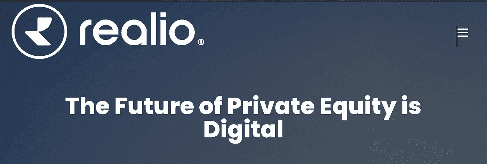

**项目** : Realio 网络

本地令牌 : $RIO

**网站直接报价:**

“私人股本的未来是数字化的。

我们正在通过分散融资(“DeFi”)消除投资、交易和利用独家房地产、私募股权和其他真实资产的障碍。"

**项目网络可用性:**

以太坊—合同地址:0xf 21661d 0d 1d 76d 3 ECB 8 e 1 b 9f 1c 923 dbfffa e 4097

## **Realio 网络的独特卖点:**

*   一个专有的第二层区块链分布式网络，用于发行和互连分散的生态系统
*   该网络是模块化的，具有完全的可扩展性
*   一个独特的投资平台，利用其流动性投资于各种资产类别，重点投资于房地产，然后将一定比例的回报分配给用户
*   用户可以'**令牌化**'各种资产类型

**关键增值服务:**

*   该网络旨在实现资产监管的现代化，即资产发放、分析和交换的过程
*   该网络还旨在通过自动信任和消除网络上出现的不必要的第三方来降低成本和消除摩擦
*   改善数据访问和数据质量
*   介绍增强网络服务执行和增加流动性的潜力
*   节点即服务(NaaS)和 DaaS (DeFi 即服务)

## Realio 网络内的服务:

*   多币种自助保管钱包—这包括通过 Prime trust 进行冷藏

**Realio 网络的工作方式**

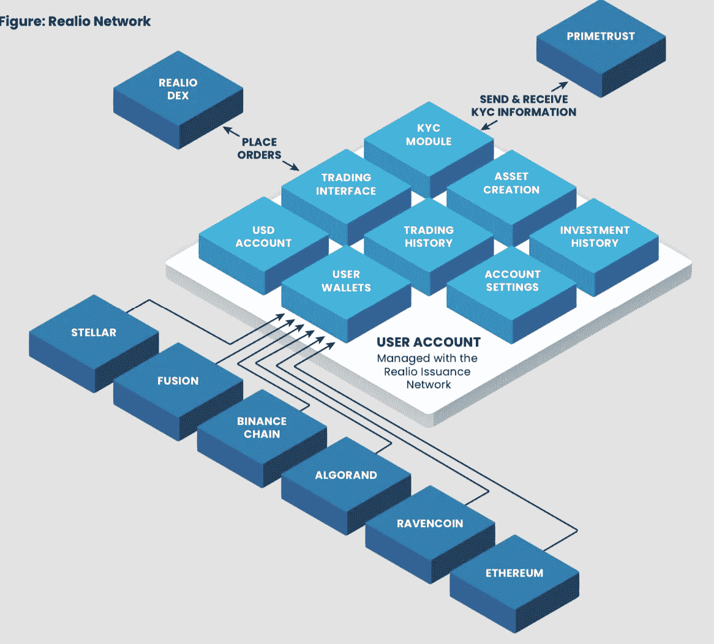

Working mechanism of Realio Network with interoperability

*   **互操作性** —为所有区块链插入&播放点的单一条目。当前的集成包括:
*   **以太坊**
*   **恒星**
*   **乌鸦币**
*   **融合**
*   **BNB 智能链**
*   **算法和**

**RealioX —分散交换**

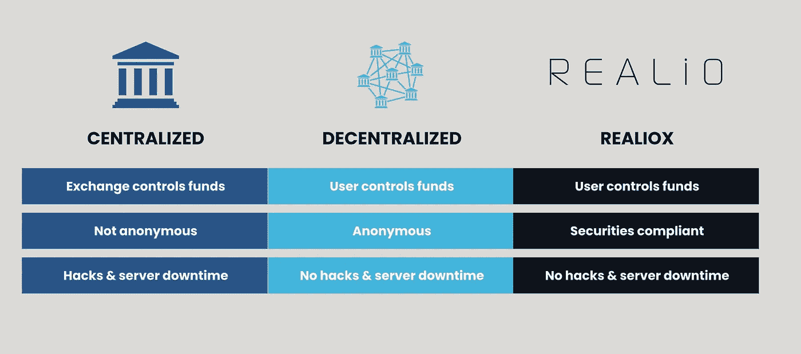

*   多辖区合规性，包括美国 SEC 法规的豁免

**被动收入机会包括:**

*   做市商奖励
*   利润再分配
*   分块奖励(针对节点运营商)

**Realio 网络上的多令牌实用程序**

*   **$ RIO**–维持网络的实用令牌

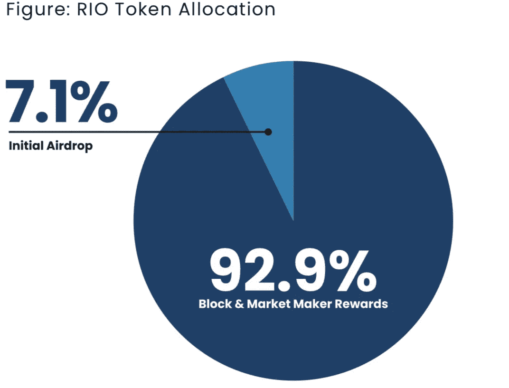

*   **$ RST**–代表 Realio 生态系统中所有权的安全令牌

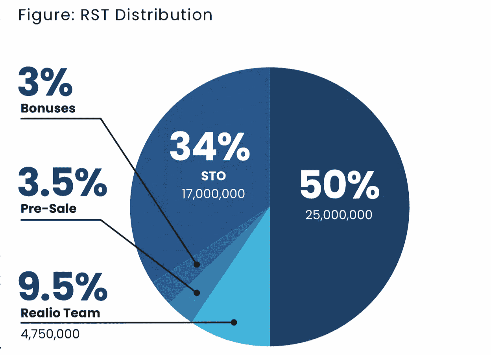

*   **$rUSD** —由授权的美国信托公司支持的与美元挂钩的稳定货币

(安信)。1:1 可兑换美元和网络平面入口/出口的媒介

## 项目审计报告:

我不能零下降的任何来源，确认合同地址的项目审计进行了 Realio 网络🚩

## 团队和顾问:

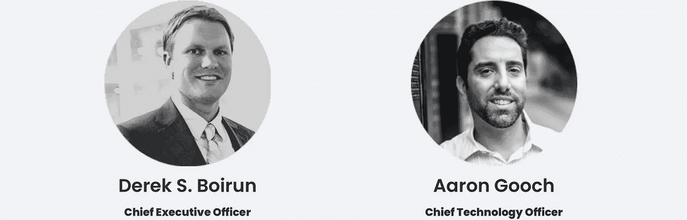

**德里克·s·博伊伦(CEO &联合创始人)——**目前经营着包括 Realio 在内的多个组织。[领英](http://://www.linkedin.com/in/derekboirun/)

**亚当·古奇(CTO &联合创始人)——**在创立 Realio 之前，在软件工程和区块链开发方面有着良好的记录。[领英](https://www.linkedin.com/in/aaron-gooch-5887b313/)

**马塞洛·莫亚诺(首席体验官&联合创始人)**——一位获奖的网络开发人员。[领英](https://www.linkedin.com/in/marcelomoyano/)

**Eduardo Romeiro(工程总监&联合创始人)**拥有超过 12 年的软件工程师经验。[领英](https://www.linkedin.com/in/eduardo-romeiro-5204b759/)

该团队的其他成员包括:

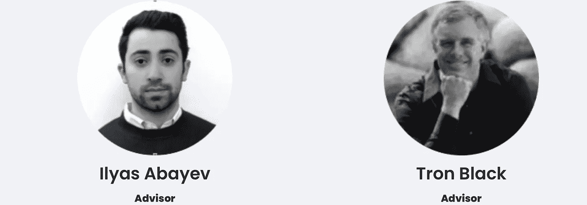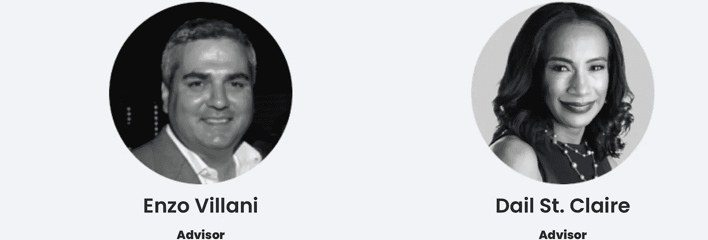

从理论上来说，这是一个非常好的团队。

## 合作伙伴和/或风险投资者:

我猜这个项目的主要风险投资是瓦伦特斯资本管理公司，仅仅是因为贝扎德·陶菲克在核心团队中的高级顾问角色。

## Realio 项目路线图:

我找不到该项目的详细或逐步淘汰的路线图。我唯一能找到的资料，是 Twiiter 官方账户的一条推特:

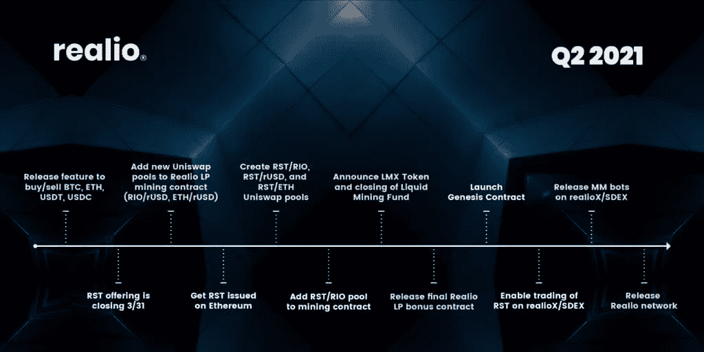

Q2 2021

## 真实网络令牌组学:

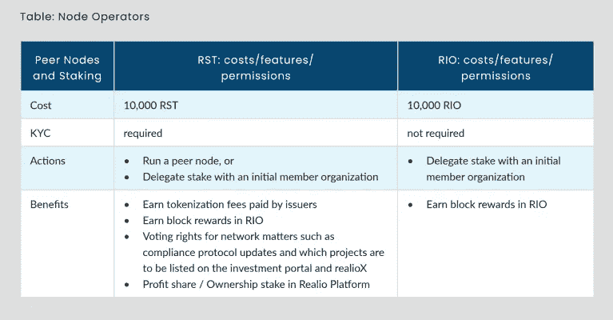

Realio Network Tokenomics

*   $里约和$RST 是该项目的本土标志
*   $RIO 是一次公平的发行(无预售，无广告),发行时即获得全部授权。
*   力拓股份的 92.9%用于奖励，7.1%用于空投。

**$RST 分布如下:**

1.  **团队分配 9.5%**
2.  **预售分配 3.5%**
3.  **3%的奖金分配**
4.  **34%分配给 STO(证券代币发行)**
5.  **50%的供应锁定在金库，以备将来发放**

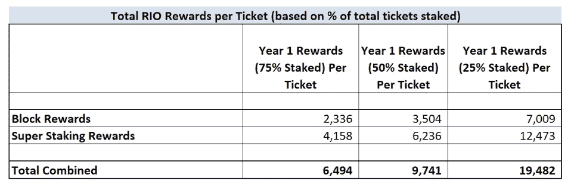

RIO rewards breakup

$ **里约公用事业包括:**

*   下注$RIO 成为 RealioX 上的交易者，或者如果与合作伙伴机构下注，则获得大宗奖励
*   燃烧$RIO 成为做市商(奖励由新铸造的$RIO 支付)
*   从其他人支付限价订单交易费用中支付给 RealioX 交易商的报酬
*   这是一个兼具通胀和通缩机制的混合体。

## 社交媒体和相关链接社区:

*   推特:[https://twitter.com/realio_network](https://twitter.com/realio_network)
*   电报:[https://t.me/realio_fund](https://t.me/realio_fund)
*   中:[https://medium . com/@ dboirun/the-realio-platform-realiox-and-the-realio-](/@dboirun/the-realio-platform-realiox-and-the-realio-)网络-开发-更新-93facf5c0c10
*   https://coinmarketcap.com/currencies/realio-network/
*   白皮书:[https://acrobat.adobe.com/link/review?uri = urn:aaid:scds:US:3 ad 94d 79-8530-](https://acrobat.adobe.com/link/review?uri=urn:aaid:scds:US:3ad94d79-8530-)3db 6–89a 7-f1 af 02 da 0d 3 e
*   网址:[http://www.realio.fund/](http://www.realio.fund/)

## 要点:

如果你主要是一个交易者，你很可能对从这个项目中获利的机会不感兴趣。

然而，记住当前的市场条件，如果你正在积极寻找一个长期的游戏，那么这可能是一个隐藏的 gen。

我本人没有使用过该平台，所以我无论如何不会谈论被动收入中的奖励水平，但有各种其他方法来产生它，并且似乎最有利可图的收入将是作为节点运营商。

## 作为项目的风险领域

缺乏成熟的路线图和项目安全审计当然是一个问题。

然而，这个项目不是一个骗局或 rugpull，它已经存在太久了，现在这是一个严肃的考虑。我仍然喜欢项目审计，因为它会突出与项目相关的风险&无论突出的风险是否已经被 teamx 减轻

总体而言，这是一个出色的项目，但考虑到当前看跌的市场结构，我建议你将重点放在本报告的教育部分，而不是将其视为投资指南。

***注:以上信息均不应视为财务建议，作者也不认可该项目。我与 Realio network &没有任何关系，我也没有因为这篇报道从他们那里得到任何报酬。***

…

非常感谢 [CoinDCX](https://medium.com/u/a30fa2b03c2f?source=post_page-----dfb2724334e8--------------------------------) 给我这个机会来撰写如此详细的报告，并成为**# coindcxpathbaker**计划的一部分，使我能够与加密领域的每个人分享这些知识。

> 加入 Coinmonks [电报频道](https://t.me/coincodecap)和 [Youtube 频道](https://www.youtube.com/c/coinmonks/videos)了解加密交易和投资

# 另外，阅读

*   [Bookmap 点评](https://coincodecap.com/bookmap-review-2021-best-trading-software) | [美国 5 大最佳加密交易所](https://coincodecap.com/crypto-exchange-usa)
*   最佳加密[硬件钱包](/coinmonks/hardware-wallets-dfa1211730c6) | [Bitbns 评论](/coinmonks/bitbns-review-38256a07e161)
*   [新加坡十大最佳加密交易所](https://coincodecap.com/crypto-exchange-in-singapore) | [购买 AXS](https://coincodecap.com/buy-axs-token)
*   [红狗赌场评论](https://coincodecap.com/red-dog-casino-review) | [Swyftx 评论](https://coincodecap.com/swyftx-review) | [CoinGate 评论](https://coincodecap.com/coingate-review)
*   [投资印度的最佳密码](https://coincodecap.com/best-crypto-to-invest-in-india-in-2021)|[WazirX P2P](https://coincodecap.com/wazirx-p2p)|[Hi Dollar Review](https://coincodecap.com/hi-dollar-review)
*   [加拿大最佳加密交易机器人](https://coincodecap.com/5-best-crypto-trading-bots-in-canada) | [库币评论](https://coincodecap.com/kucoin-review)