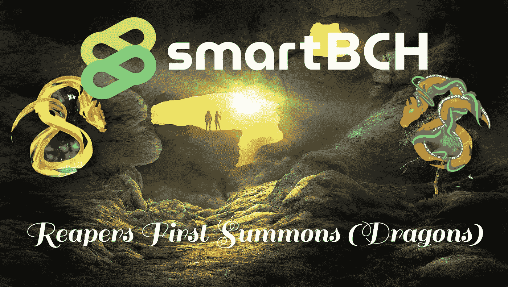

# 收割者首先立即召唤空投铸币厂！

> 原文：<https://medium.com/coinmonks/reapers-first-summons-airdrop-mints-instantly-da51942d44a6?source=collection_archive---------19----------------------->

不少难得一见的 NFT 艺术家在 smartBCH 上发布他们的作品，褚就是其中之一。

随着 Josh Ellithorpe 开发 Reapers 平台和智能合约，这一组合的结果是爆炸性的！

昨天收割者团队发布了一个新的集合，1111 个召唤收割者 NFT 空投给收割者持有者。