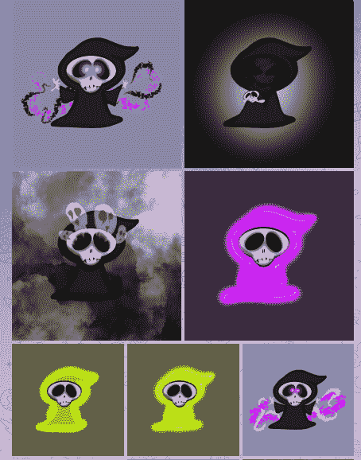

# 收割者 NFT 以 500 BCH(185，000 美元)的价格售出-稀有列表

> 原文：<https://medium.com/coinmonks/reapers-nfts-sold-out-for-500bch-185k-rarity-list-da8b87acafbe?source=collection_archive---------6----------------------->

*Photo: by Clem Onojeghuo on* [*Unsplash*](https://unsplash.com/photos/xJXxMR5PXoY) *(modified)*

收割者是最新的 NFT 系列，一发布就售出了 10，000 台。

铸造价格为每 NFT 0.05 BCH，整个系列仅用了大约 3 个小时就铸造完成，产量高达 500 BCH(18.5 万美元)。

这是 smartBCH NFTs 的新纪录。这也是 smartBCH 网络内 NFT 市场蓬勃发展的证据。

爱好者可以通过艺术家楚的文章了解更多关于收割者的收藏:[收割者准备召唤了！](https://read.cash/@Chu/the-reapers-are-ready-to-summon-7d65bd97)

收割者是 smartBCH 上最新的 NFT 系列，成功地完成了造币阶段，吸引了大量的人群和数量。

([*source*](https://reapers.cash/))

smartBCH 上以前成功的收集:

*   **法朋克:**造币相 100BCH 卷( [read.more](https://read.cash/@Pantera/lawpunks-nft-sold-for-record-33-bch-smartbch-volumes-spike-dfbb8256) )
*   **池畔河豚:**薄荷阶段 7.35BCH 体积(阅读更多)
*   **现金猫:**造币期 500BCH 成交量
*   **王座:**薄荷相位 300BCH 体积

SmartBCH 目前是 NFTs 领域最热门的智能合同网络之一，这一点不断得到证明，发布了几十个新系列，并在几个小时内完成了 mint 阶段。

# 稀有列表

[*(source*](https://reapers.cash/)*)*

那些想从这个系列中得到一些非功能性食物的人仍然可以在 OASIS 以相对较低的价格进行交易，因为一些非功能性食物仍然以全新的价格拍卖和出售。

收割者系列的创作者是艺术家“楚”和开发商乔希·埃利索普。

## 稀薄

NFT 的稀有特征可以在这里找到。

我创建了一个 excel 电子表格，缩短了每种特质类型的稀有程度，并提供如下。

根据 raritydata，我们观察到只有 0.21%的 NFT 具有某种“特殊”特征(10，000 个 NFT 中只有 21 个)，因此这将是收藏家们最期待的特征。

事实上，在给定的特殊性状的统计数据中，没有提到这些特殊性状是什么，或者它们是否存在(还没有？).

收割者电报的这个固定的柱子的统计数据被减去。

Josh Ellithorpe 在这个[电报链接](https://t.me/ReapersNFT/3932)中提到了 21 个特殊收割者:

其余的性状在稀有程度上各不相同，而性状类别的组合将会给包含最稀有性状的 NFT 带来更高的价值。

# 总之:NFT 在 smartBCH 蓬勃发展

它始于特定的步骤、低 TVL 指数和缓慢但健康的增长。

SmartBCH 今天受到主要指数的跟踪，机构基金也在关注它。

21Shares 是第一家在德意志交易所“Xetra”平台上推出 [BCH ETP](https://read.cash/@Pantera/bitcoin-cash-etp-in-europe-abch-01effa54) 的基金。21Shares 是一家跟踪加密货币资产的基金管理公司，最近发布了关于多个区块链的 TVL 概览。

([source](https://twitter.com/21Shares/status/1483747448879210498))

SmartBCH 正处于一个已经吸引注意力的阶段。其他平台(Solana、Avalanche、Fantom、Polygon)的 TVL 并不是从几十亿美元开始的。帮助这些网络吸引投资者经历了一个漫长的过程。

然而，这一过程也包括研讨会、参加会议、与知名基金经理讨论、公关和营销。这些网络大多遵循一定的程序来吸引数十亿资金用于运营和发展。

NFT 领域是智能合约行业的一部分，最近吸引了大量感兴趣的人群，并创造了大量交易量。

SmartBCH 已经证明，它可以吸引大量的 NFT 领域，尤其是当一个有价值的集合出现。

Writing at the following websites: ● [ReadCash](https://read.cash/@Pantera) ● [NoiseCash](https://noise.cash/u/Pantera99) ● [Medium](/@panterabch) ● [Hive](https://hive.blog/@pantera1) ● [Steemit](https://steemit.com/@pantera1) ●[Vocal](https://vocal.media/authors/pantera) ● [Minds](https://www.minds.com/pantera99/) ● [Twitter](https://twitter.com/Panterabch) ● [LinkedIn](https://www.linkedin.com/in/panterabch/) ● [Reddit](https://www.reddit.com/user/coinflip1211) ● [email](https://read.cash/@Pantera/localcryptos-p2p-exchange-is-now-offering-bitcoin-cash-trading-06637230#bad-link)

**相关文章:**

*   [*像 BlockNG 一样去做！—法律令牌&法律朋克 NFT 在 smartBCH* 上成功 ](https://read.cash/@Pantera/do-it-like-blockng-law-token-lawpunks-nft-success-on-smartbch-33ac73be)
*   [*法小混混:高卷中的 NFT*](https://read.cash/@Pantera/law-punks-high-volumes-in-the-smartbch-nft-field-44051206)
*   [*《权力的游戏:女王 NFTs on SmartBCH！*](https://read.cash/@Pantera/game-of-thrones-queens-nfts-on-smartbch-dc592178)
*   [*smart BCH NFTs 完全指南(2021 年 12 月)*](https://bch101.com/blog/75)

> **免责声明**:本内容发布的所有材料均用于娱乐和教育目的，并符合**合理使用准则**。无意侵犯版权。如果您是或代表本文所用材料的版权所有者，并且对所述材料的使用有疑问，请发送[电子邮件](https://read.cash/@Pantera/cryptouknowns-battlegrounds-the-crypto-battle-royal-part-i-0ca762da#bad-link)。

如果你喜欢这篇文章，别忘了订阅并点赞！

*原载于*[*https://read . cash*](https://read.cash/@Pantera/reapers-nfts-sold-out-for-500bch-185k-rarity-list-437d8158)*。*

