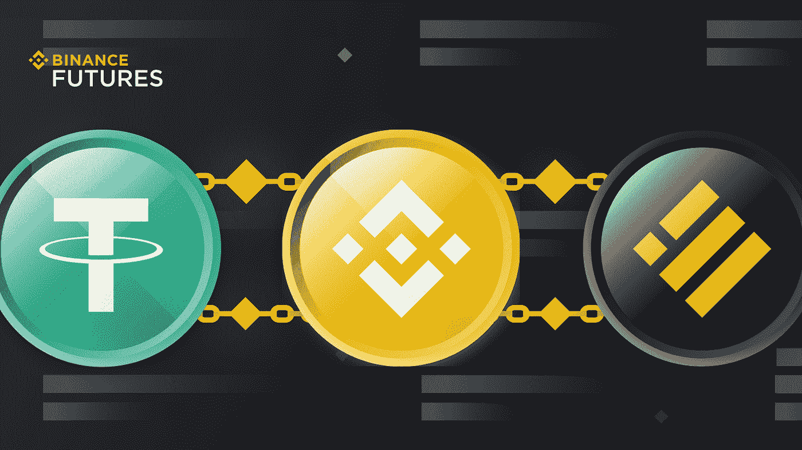
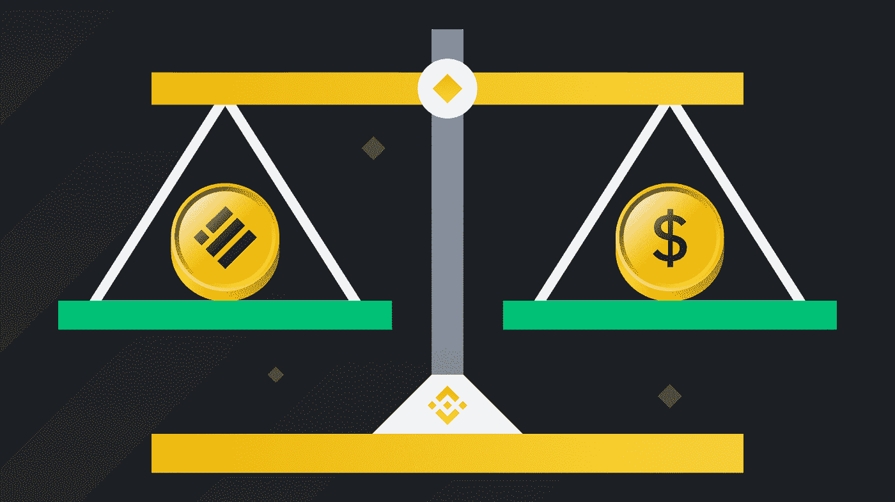
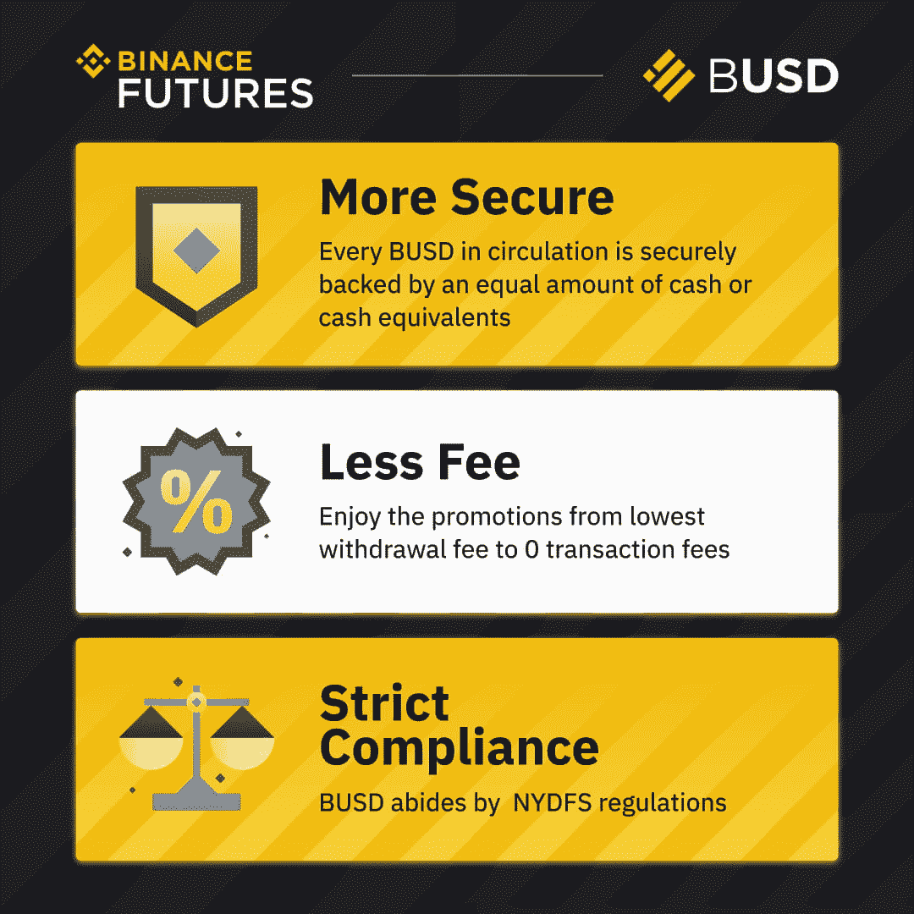
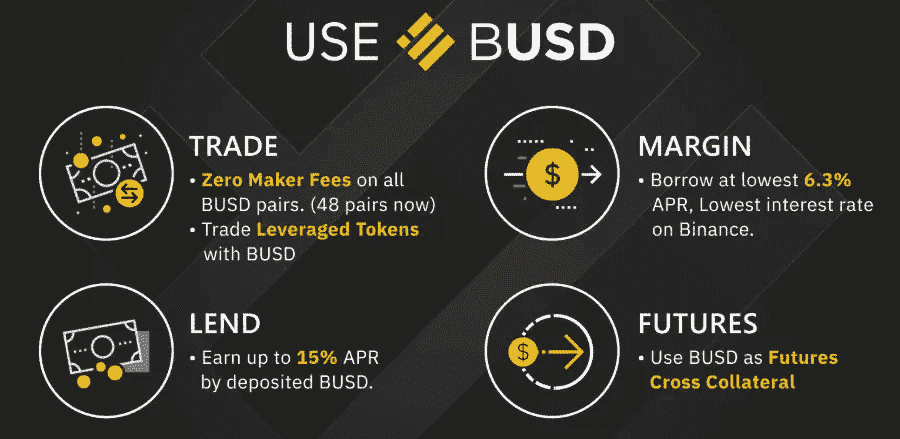
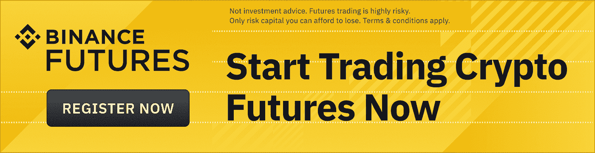
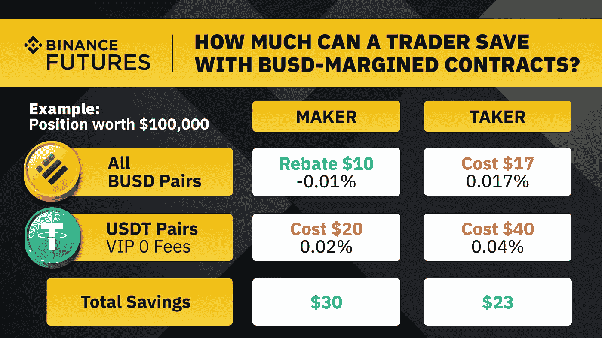

# 交易 BUSD 保证金期货的理由

> 原文：<https://medium.com/coinmonks/reasons-to-trade-busd-margined-futures-fddd5513e9b2?source=collection_archive---------7----------------------->

Photo: Binance

[BUSD 保证金期货](https://www.binance.com/en/event/BUSD_Margined_Futures?ref=P10U1GSP)合约是在 BUSD(或币安美元)报价、抵押和结算的线性期货产品。BUSD 保证金期货合同形成的交易可以很容易地用美元(或其他法定货币)计算。换句话说，BUSD 保证金合约使用起来直观快捷，与 USDT 保证金合约类似。币安和 [Paxos 发行的](https://www.paxos.com/a-regulated-stablecoin-means-having-a-regulator/) BUSD 是一种符合 NYDFS 的稳定币，由超过 36 个交易所和 20 个钱包支持。Paxos 信托公司是 BUSD 的发行人，也是其美元托管人。让我们来探索和学习 [BUSD 保证金期货](https://www.binance.com/en/futures?ref=P10U1GSP)如何为你带来丰厚的利润。

[交易加密货币期货](https://www.binance.com/en/futures?ref=P10U1GSP)

**什么是 Stablecoins？**

Photo: Binance

稳定货币(主要)是与美元挂钩的非波动加密货币，其货币价值保持不变。一般来说，一个单位的稳定币是以一个单位的固定(实际)货币(或美元)来估价的。作为一种价格稳定的虚拟加密货币，BUSD 稳定币通常不会受到不可控投机的影响。比特币(BTC)本身很容易出现剧烈波动，经常会反映加密货币市场的脉搏。

与其他加密货币相比，稳定币的价值理想情况下保持固定，因为它们与美元或黄金挂钩。Statista 报道称，在 2017 年 1 月至 2022 年 4 月期间，避免波动的前 10 大稳定公司的市值(MCAP)超过了 1000 亿美元。USDT 的 MCAP 是 820 亿美元，USDC 的是 490 亿美元，而 BUSD 的是 170 亿美元。

两个 stablecoins，Paxos Standard (PAX)和 Gemini Dollar (GUSD)，是受纽约州金融服务局监管(并获得批准)的。以基础资产的价值为抵押，稳定货币通常以 1:1 的比率与可交易的法定货币(美元或欧元)挂钩。

**什么是 BUSD？**

Photo: Binance

如今，稳定货币是一种非常受欢迎的加密货币资产类别。BUSD 于 2019 年推出，是一项受到高度监管的资产，由纽约市消防局每月进行严格审计。BUSD 可以以 1:1 的比率兑换美元。BUSD 可以零费用购买或赎回，但这样做也可能招致银行手续费或电汇费。通过 ERC-20 和 BEP-2 区块链标准转移 BUSD 既快捷又实惠。为了保持与美元的挂钩，Paxos 分配并保留了相当于 BUSD 市场总供应量的美元。BUSD 起到对冲市场波动风险的作用。

了解更多关于 BUSD 的信息。

**持有和抵押 BUSD 有什么好处？**

Photo: Binance

BUSD 储备资产 100%由现金和现金等价物支持，每月由独立第三方进行审计。这些审计旨在确保 BUSD 代币的供应得到美元的适当支持。这些储备存在 FDIC 担保的银行账户和美国国债中。由于其提供的可靠性和 DeFi 用例，BUSD 的采用率直线上升。BUSD 是填补 DeFi 和传统金融之间存在的差距的答案，因为它提供了一种货币独立的新解决方案。

BUSD 保护其用户免受通货膨胀的影响，同时也为他们赢得了健康的 APY(年收益率)。用户被允许以象征性的费用购买和交易 BUSD，以获得行业领先的现货和保证金市场流动性。

BUSD 严格遵守适用于稳定资本的纽约 DFS 财务条例。币安期货的 BUSD 交易是负担得起的，总体交易费用较低，利润较高。币安还定期提供费用折扣和制造商回扣。BUSD 提供多种交易合约(如 BTC、瑞士联邦理工学院、BNB 等)。).

在这种情况下，交易可以从用户选择的加密货币开始，并以稳定的货币结算。这样，交易者不用支付兑换费，因为根本不需要。最后，由于 BUSD 的法定货币挂钩，计算回报也变得更加容易。这使得 BUSD-M 期货交易者计算法定货币变得不那么复杂。

持有 BUSD 的突出好处之一是它可以与各种版本的《区块链议定书》协调运作。这简化了交易，同时也最大限度地降低了交易和取款费用。其不同的协议有:BUSD ERC20，BUSD TRC-30，BUSD BEP2，BUSD BEP 20 等。该功能允许币安用户也通过币安桥轻松交换。

**如何开始交易 BUSD 保证金期货？**

Photo: Binance

BUSD-M 期货交易非常简单，只需要一个期货交易账户。一个简单易行的买卖 BUSD-币安期货合约的五步流程如下:

1.  **账户注册**:注册一个币安期货交易账户。在开始币安期货交易之前，启用期货帐户资金的 2FA 验证。
2.  **资金存款:**办理 BUSD 存款。币安期货为各种加密货币资产提供应有的抵押支持。
3.  **选择合约**:选择您喜欢的 BUSD-M 期货合约。只需在 usdⓢ-m 期货标签下选择 BUSD Perpetual。
4.  **杠杆选择**:选择合适的 BUSD-M 期货合约杠杆。虽然默认情况下杠杆通常设置为 20 倍，但仍然可以相应地调整它。
5.  **下单:**根据币安期货的可用订单类型下单。新手可以选择限价单或市价单来购买他们的第一份 BUSD-M 期货合约。

**如何使用多资产模式交易 BUSD-M 期货？**

Photo: Binance

**利用模拟交易提高交易技巧**

币安期货的模拟交易平台可以帮助有志于交易的新手在测试网环境中提高他们的技能。这是一个模拟交易平台，允许在加密货币市场中进行实时(现场)交易，没有资本(损失)风险。

了解更多关于[币安期货的模拟交易](https://www.binance.com/en/support/faq/b3706b248f2b4b1caabb4bf253bf067f)平台。

**结论**

Photo: Binance

BUSD-M 期货主要是一种规避风险的交易方式，适合波动性很高的加密货币市场。当多资产模式被引入时，BUSD-M 期货的收益和特征都得到了极大的改善。多资产模式允许在一个账户中进行投降式对冲。受益于套利、自动免于清算等。，也是可能的。有了可承受的收取费用和制造商回扣，币安的费用折扣是值得享受的。

在多资产交易模式下，用户可以交易各种加密货币期货，同时提供 USDT 或 BUSD 作为抵押品。多资产模式允许交易者在 BUSD 保证金合同中分享他们的保证金。这样做可以让他们享受多样化的交易体验。因此，在 BUSD 保证金交易中，交易者可以以较低的手续费和做市商回扣进行交易。BUSD 保证金(BUSD-M)期货是在 BUSD 报价、抵押和结算的线性期货产品。费用折扣适用于任何一个 BUSD 期货交易对，即。瑞士联邦理工学院/BUSD 或 BTC/BUSD 永久合同。

多资产模式只需一个账户就可以对冲投降风险。这让交易者从套利中获利，同时自动免于平仓等。多资产模式通过提供多功能性增强了币安期货的交易。在激活多资产模式的情况下交易 BUSD-M 合同将带来成本节约的好处。除了现货和保证金市场的交易费用，BUSD-M 合约的交易费用也可以通过持有 BUSD 来降低。多资产模式还允许交易者使用相同的加密货币进行跨方向交易(因为交易者可以在 BUSD 或 USDT 进行交易)。

在[币安博客](https://www.binance.com/en/blog/futures/how-to-use-the-multiassets-mode-to-trade-busdm-futures-421499824684902672?ref=P10U1GSP)上了解更多关于多资产模式的信息。

新来币安吗？[今天注册](https://accounts.binance.com/en/register?ref=P10U1GSP)！

**免责声明**:本文仅用于教育目的，不应被理解为投资建议。

> 加入 Coinmonks [电报频道](https://t.me/coincodecap)和 [Youtube 频道](https://www.youtube.com/c/coinmonks/videos)了解加密交易和投资

# 另外，阅读

*   [支持卡审核](https://coincodecap.com/uphold-card-review) | [信任钱包 vs 元掩码](https://coincodecap.com/trust-wallet-vs-metamask)
*   [Exness 回顾](https://coincodecap.com/exness-review)|[moon xbt Vs bit get Vs Bingbon](https://coincodecap.com/bingbon-vs-bitget-vs-moonxbt)
*   [如何开始通过加密贷款赚取被动收入](https://coincodecap.com/passive-income-crypto-lending)
*   [BigONE 交易所评论](/coinmonks/bigone-exchange-review-64705d85a1d4) | [电网交易 Bot](https://coincodecap.com/grid-trading)
*   [氹欞侊贸易评论](https://coincodecap.com/anny-trade-review) | [CoinSpot 评论](https://coincodecap.com/coinspot-review)
*   [新加坡十大最佳加密交易所](https://coincodecap.com/crypto-exchange-in-singapore) | [收购 AXS](https://coincodecap.com/buy-axs-token)