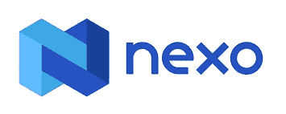
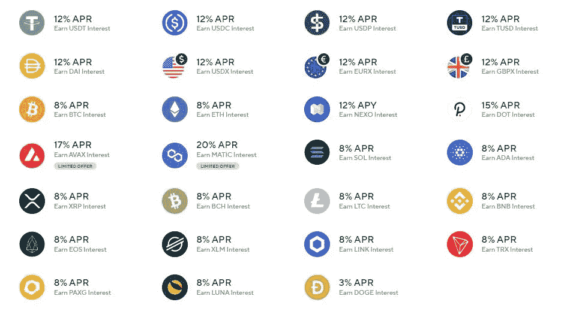
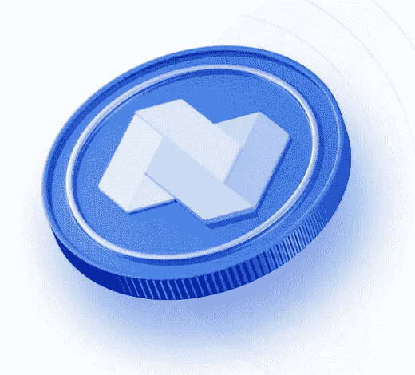
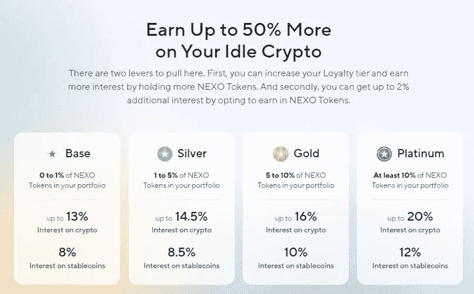
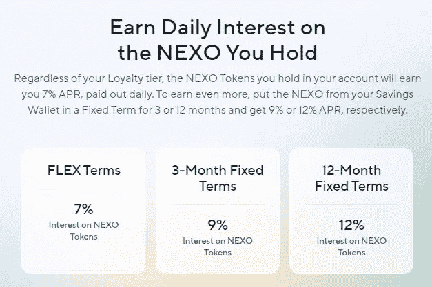
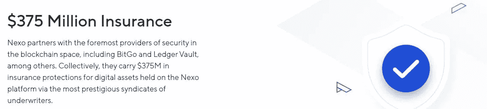
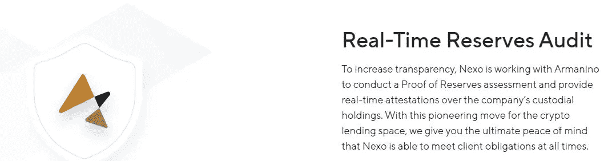
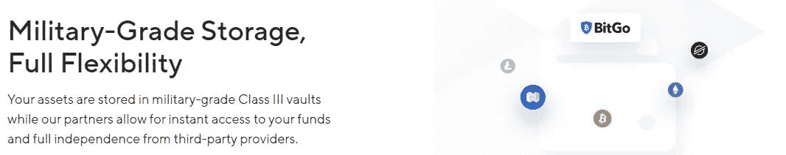
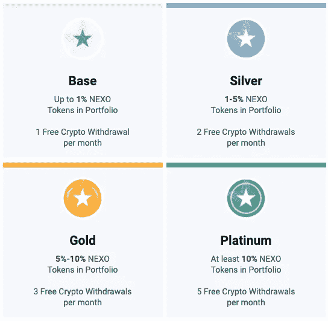
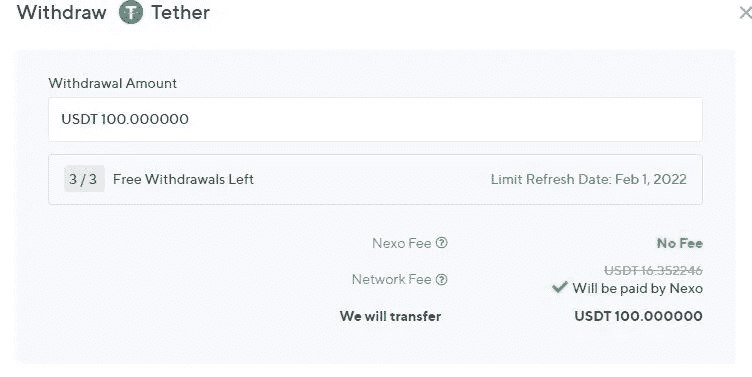

# 我喜欢使用 Nexo 的原因

> 原文：<https://medium.com/coinmonks/reasons-why-i-love-using-nexo-522527e05eb2?source=collection_archive---------4----------------------->

被动收入是我们所有人在投资旅程中追求的——毕竟，有钱为你工作而不是只为钱工作会让我们有更多的时间做生活中重要的事情，不是吗？我的加密货币投资之旅充满了起起落落——作为多次骗局的受害者，我通过艰难的方式获得了一定程度的知识和智慧，我将在接下来的几天里高兴地分享这些知识和智慧。在那些卓有成效且合法的投资中，我非常自豪地与大家分享。Nexo 是我引以为豪的投资决策之一。

[**Nexo**](https://nexo.io/ref/hce5cfdt5o?src=web-link) 是一个加密货币利息账户和借贷平台，拥有超过 100 万用户，管理着 120 亿美元的资产，是市场上最大的加密利息账户平台之一，为各种数字资产提供 6%至 12%的年百分比收益率，包括比特币、以太坊、莱特币、avax、trx 和 ripple 等。

# **我喜欢使用 Nexo 的原因**

# **#1 闲置资产的诱人利率**

按照爱因斯坦的说法，“复利是世界第八大奇迹。懂的人赚，不懂的人赔。”

[**Nexo**](https://nexo.io/ref/hce5cfdt5o?src=web-link) 为加密货币和法定货币提供高达 20%的年利率，这让传统金融机构提供的利率显得微不足道！你可以选择用实物赚取，或者用 Nexo 赚取各种各样的硬币，这将带来额外的 2%的年收益率。利息每天复利，这意味着你每天都有利息支出。钱可以随时添加和提取。存款没有锁定期。如果你决定选择每月更新的固定期限，你可以额外获得 2%的年收益率。现在，你坐在那里的闲置资产上有了美味的现金流！

# **#2 一个简单&直白的交流平台**

有了 Nexo Exchange，您可以享受即时无障碍交易、固定价格执行和无限数量的互换，这是最智能的交易所。从 150 多种市场配对中选择。只需打开 nexo 平台，选择您的货币对，指定您想要兑换的金额，然后点击兑换；真的就这么简单！

根据您的忠诚度等级，您甚至可以从每笔交易中获得高达 0.5%的返现，这就引出了我们的下一点。

# **#3 伟大的忠诚度计划——NEXO token**

NEXO 是在首次发行硬币时创建的，并分发给团队和早期采用者。该公司与 NEXO 股东分享高达 30%的利润。NEXO 令牌支撑着贷款和存款生态系统；持有代币的买家有权分享公司利润的 30%,比如股息。Nexo 声称，自 2018 年以来，它已经向令牌持有者支付了超过 900 万美元。

自从加入 Nexo 并从我闲置的加密货币 Nexo token 中赚取利息以来，我的利息除了复利之外，还随着 Nexo token 的价值增长而呈指数增长。这是收益的两倍！

您的忠诚度等级取决于您投资组合中 Nexo 代币的权重。您的级别越高，您可以享受的特权就越多，例如更高的利率和每月更多的免费加密取款次数。

账户中持有的 NEXO 代币将获得 7%的年收益率，12 个月固定期限的年收益率高达 12%。

最后但同样重要的是，持有 Nexo 代币让您有机会参与任何未来的治理投票，从而设计 NEXO 的未来。

# **#4 基金是 SAFU 与 Nexo**

Nexo 充当所有存款的托管人，这意味着该公司存储您的数字资产。它通过与加密货币保管解决方案 BitGo 的合作来实现这一目标。Nexo 由 Bitgo 和 Ledger Vault 为 3.75 亿美元的数字资产投保。

Nexo 定期接受审计，以提供该公司保管股份的证明。

Nexo 的资产存储在有多重签名保护的冷钱包中，私钥离线存储在 III 级银行金库中以进行物理保护；同时允许第三方供应商提供流动性。

Nexo 的安全基础设施通过了 ISO 认证。所以，你的资金在 Nexo 上非常安全！

# **# 5 免费取款！**

随着最近 eth 汽油费飙升，通过 ERC20 网络发送硬币可能是一种相当痛苦的经历。根据你的忠诚度等级，Nexo 每月会收取一定次数的交易费用。这相当于节省了大量的区块链费用。

Nexo 内部转账不会影响您每月的免费密码取款，因为它们是离线的。一旦达到免费取款限额，网络将自动向您收取费用。费用不是固定的，取决于各自区块链的当前条件。在提交提款之前，您将看到处理交易所需的金额。一旦达到免费取款限额，网络将自动向您收取费用。费用不是固定的，取决于各自区块链的当前条件。在提交提款之前，您将看到处理交易所需的金额。根据其#ZeroFees 政策，您可以进行无限制的免费 FiatX 提款、加密和 FiatX 转账到您的 Nexo 钱包，以及信用额度提款。Nexo 不收取任何信贷额度发起费、外汇费和汇兑费。

# #6 通往菲亚特的高效桥梁

Nexo 对菲亚特非常友好。用 fiat(银行转账/信用卡)方便地购买加密货币。轻松交换加密货币和数字法定货币，然后在 Nexo 上显示为 USDx、EURx 或 GBPx(每种货币的价值与其法定货币相当)。在这种数字法令上赚取高达 12%的利率——这一利率远远高于银行提供的利率。在这方面，Nexo 实质上已经成为一家数字银行。

只是为了测试菲亚特服务，我提取了 10 美元到我的本地(马来西亚)银行账户。一小时后，它出现在我当地的银行账户上——比我预想的要快得多！

# #7 良好的客户服务

Nexo 拥有非常可靠的客户支持系统，响应时间相当快；到目前为止，我和他们在一起的经历非常愉快。可以通过 Nexo.io 主页右下角的聊天框找到他们。

# #8 大电报社区

在一个生动的 telegram 平台上与其他 Nexo 用户联系，讨论有关 Nexo 的问题并交流想法，以及向聊天组中随时可用的客户支持人员提出问题。

t.me/nexofinance

附言:有很多假的 Nexo 团体声称提供高得离谱的 APYs/airdrops——不要上当！经常检查你是否在正确的官方电报组。

# 最后的想法

Nexo 不仅仅是一个普通的钱包——无论你的投资策略是什么，是持有硬币以获得长期利润，还是积极交易以在低点买入，在高点卖出，Nexo 都是一个可靠的钱包，以确保你的资产安全。我个人利用 Nexo 作为加密货币钱包和交易所，以及一个可以相对快速地提取到我当地银行账户的数字法定货币商店。然而，我还没有探索 Nexo 提供的贷款功能。你对此有什么想法？欢迎在下面的版块发表评论！

[**点击此处**](https://nexo.io/ref/hce5cfdt5o?src=web-link) **注册 Nexo，立即获得 25 美元的注册奖金！**

*一如既往，这不是财务建议！而只是我投资过的，觉得值得分享的投资平台。在投资前做好自己的研究，不要存你输不起的钱。下面有什么问题可以随时问我。*

*如果你喜欢这篇文章，* [*关注&订阅*](/@cybery) *！*

*查看以下平台！*

*🎁*[*Cakedefi*](https://cakedefi.com/?ref=677920)*一站式投资平台，以高达 200%的年利率烘焙被动现金流！* [*用 50 美元存款得到 50 美元*](https://cakedefi.com/?ref=677920) *。*

*🎁*[*Nexo*](https://nexo.io/ref/hce5cfdt5o?src=web-link)*全球最先进、受监管的数字资产机构，在 200 多个司法管辖区提供 40 多种法定货币的即时加密贷款、每日资产收益、交换和服务。* [*用 100 美元存款得到 25 美元*](https://nexo.io/ref/hce5cfdt5o?src=web-link) *。*

*🎁* [*摄氏度*](https://celsiusnetwork.app.link/174094633e) *一个金融科技平台，提供带息储蓄账户、借贷，以及用数字和法定资产进行支付。* [*在 BTC 拿 50 美元*](https://celsiusnetwork.app.link/174094633e) *拿 400 美元存款。*

*🎁*[*BlockFi*](https://blockfi.com/?ref=a16e37fd)*一种加密货币交易所和钱包。* [*用 100 美元存款得到 10 美元*](https://blockfi.com/?ref=a16e37fd) *。*

*🎁* [*库币*](https://www.kucoin.com/land/register/r/rJH29LZ) *最大的加密货币交易所之一。*

*🎁***最大的加密货币交易所。**

**🎁*[*honey gain*](https://r.honeygain.me/CYBER577DD)*一款众包 app，从你未使用的互联网带宽中赚钱。* [*获得 5 美元*](https://r.honeygain.me/CYBER577DD) *，不需要资金。**

**针对马来西亚投资者**

**🎁*[*Stashaway*](https://www.stashaway.my/referrals/kenleel9jx)*免费投资 6 个月！**

**🎁Wahed code 'KENLIE1' RM10 注册奖金**

**🎁Capbay P2P 代码' 8879c6' RM100 注册奖金**

**接我* [*中*](https://cybery.medium.com/)*|*[*read . cash*](https://read.cash/r/TraderFX)*|*[*Youtube*](https://www.youtube.com/c/SmartInvestingChannel)|[*电报*](https://t.me/kkkk289) *|* [*推特*](https://twitter.com/cybertraderfx)*

> *加入 Coinmonks [电报频道](https://t.me/coincodecap)和 [Youtube 频道](https://www.youtube.com/c/coinmonks/videos)了解加密交易和投资*

# *另外，阅读*

*   *[3 商业评论](/coinmonks/3commas-review-an-excellent-crypto-trading-bot-2020-1313a58bec92) | [Pionex 评论](https://coincodecap.com/pionex-review-exchange-with-crypto-trading-bot) | [Coinrule 评论](/coinmonks/coinrule-review-2021-a-beginner-friendly-crypto-trading-bot-daf0504848ba)*
*   *[莱杰 vs Ngrave](/coinmonks/ledger-vs-ngrave-zero-7e40f0c1d694) | [莱杰 nano s vs x](/coinmonks/ledger-nano-s-vs-x-battery-hardware-price-storage-59a6663fe3b0) | [币安评论](/coinmonks/binance-review-ee10d3bf3b6e)*
*   *[Bybit 交易所评论](/coinmonks/bybit-exchange-review-dbd570019b71) | [Bityard 评论](https://coincodecap.com/bityard-reivew) | [Jet-Bot 评论](https://coincodecap.com/jet-bot-review)*
*   *[3 commas vs crypto hopper](/coinmonks/3commas-vs-pionex-vs-cryptohopper-best-crypto-bot-6a98d2baa203)|[赚取加密利息](/coinmonks/earn-crypto-interest-b10b810fdda3)*
*   *最好的比特币[硬件钱包](/coinmonks/hardware-wallets-dfa1211730c6) | [BitBox02 回顾](/coinmonks/bitbox02-review-your-swiss-bitcoin-hardware-wallet-c36c88fff29)*