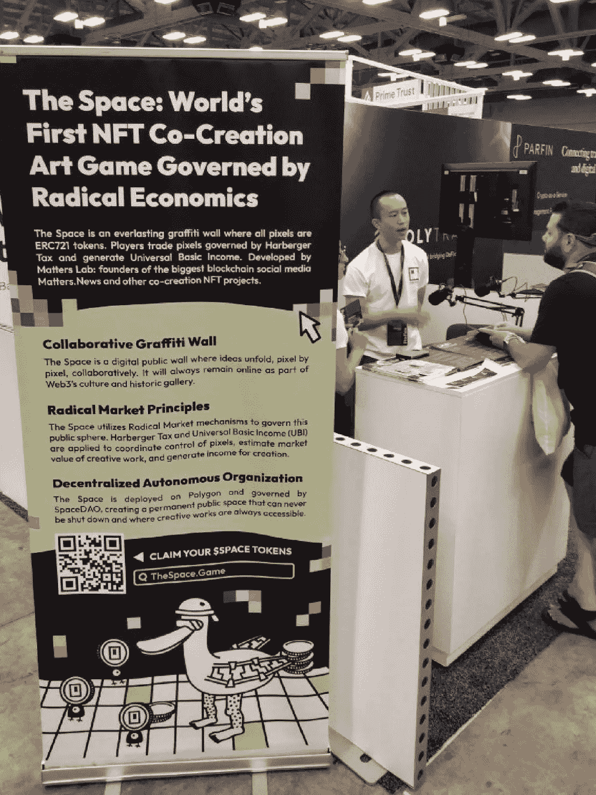

# 回顾 2022 年共识:尽管面临加密冬天，Web3 仍继续蓬勃发展

> 原文：<https://medium.com/coinmonks/recap-from-consensus-2022-web3-continues-to-thrive-despite-crypto-winter-2961ece9b824?source=collection_archive---------14----------------------->

The Space powered by Matters Lab showcases at Consensus 2022

尽管密码寒冬，今年的年度会议共识回到了真人形式，吸引了 17，000 人讨论密码景观，Web3 开发和数字资产的未来。加密节于 6 月 9 日至 12 日在德克萨斯州奥斯汀举行。Matters Lab 团队惊讶地看到奥斯汀的加密货币社区正在蓬勃发展，因为它已经成为许多 Web3 项目的热点。

[Matters Lab](http://matters-lab.io) ，作为拥有 100，000 名内容创作者的受欢迎的 Web3 社交媒体生态系统，很荣幸带着我们的最新项目 [The Space](http://thespace.game) 参加了这个节日。我们介绍了[部分共同所有权的概念](/geekculture/radical-markets-blockchain-monopoly-how-a-draw-to-earn-game-imagines-the-redistribution-of-ba3fa361cefc)和[在 Pixel NFT 联合创作游戏](https://matterslab.medium.com/radical-markets-can-work-on-blockchain-our-web3-experiment-the-space-shows-how-1b5d49b91d27)中应用的激进经济学。这个空间将进一步加强 Matters Lab 在注意力经济领域的未来探索，探索如何[建立一个更公平的社交图谱](https://matters.news/@guo/217736-designing-ownership-for-collaborative-content-bafyreiao4n6qzzxa6ccovypipytz52lvkam3tfz55saj7d2hef4bqtlac4)。

尽管加密寒冬，更多的与会者仍然对加密生态系统和新项目保持乐观，Web3 的崛起引起了会议的注意，更多的风投正在投资 Web3 基础设施。

“看到 Web3 在过去 5 年的增长速度，真是令人惊讶。它从一个小众和极客的话题开始，发展成为一个即使在这样的熊市也能吸引各行各业人才的行业。”物联网 CTO 郭说。

关于创造者经济，NFT 是所有权的容器，大多数项目都在试验他们能往容器里塞什么。像 [Traveloggers](https://traveloggers.matters.news/) 和 [The Space](https://wiki.thespace.game/introduction-to-the-space) 这样的项目很重要，因为它们用容器本身进行实验。

我们坚信，Web3 是一个带来审查弹性和更好的内容经济的机会。此外，这个空间背后的潜在经济模式引起了许多专业人士的兴趣。随着数百名参观者来到我们的展位，我们很高兴地分享了 Fairdrop 认领贴纸，该贴纸以$空间欢迎新玩家。

共识 2022 设法在线下集中巨大的能量。这给了我们一个机会，把我们的好朋友[茶叶项目博客](https://medium.com/u/f0e5d77ac295?source=post_page-----2961ece9b824--------------------------------)、激进 x 改变和[地壳网络](https://medium.com/u/f5f406454044?source=post_page-----2961ece9b824--------------------------------)聚集在一起。很高兴能与 [CoinDesk](https://medium.com/u/f2fa6f2d51a6?source=post_page-----2961ece9b824--------------------------------) 、Cointelegraph、 [BlockBeats](https://medium.com/u/590e1454b701?source=post_page-----2961ece9b824--------------------------------) 、 [Huobi Global](https://medium.com/u/65d3e2271234?source=post_page-----2961ece9b824--------------------------------) 、币安实验室、巴别亚洲和冒险实验室建立潜在的未来合作伙伴关系。

最后，CoinDesk 的 Consensus 是一个分享和交流所有 Web3 想法的好地方。我们梦想着 Web3 的重要性。

**立即申领您的$ SPACE**:[https://thespace.game/claim](https://thespace.game/claim)

> 加入 Coinmonks [电报频道](https://t.me/coincodecap)和 [Youtube 频道](https://www.youtube.com/c/coinmonks/videos)了解加密交易和投资

# 另外，阅读

*   [印度的加密交易所](/coinmonks/bitcoin-exchange-in-india-7f1fe79715c9) | [比特币储蓄账户](/coinmonks/bitcoin-savings-account-e65b13f92451)
*   [OKEx vs KuCoin](https://coincodecap.com/okex-kucoin) | [摄氏替代品](https://coincodecap.com/celsius-alternatives) | [如何购买 VeChain](https://coincodecap.com/buy-vechain)
*   [币安期货交易](https://coincodecap.com/binance-futures-trading)|[3 commas vs Mudrex vs eToro](https://coincodecap.com/mudrex-3commas-etoro)
*   [如何购买 Monero](https://coincodecap.com/buy-monero) | [IDEX 评论](https://coincodecap.com/idex-review) | [BitKan 交易机器人](https://coincodecap.com/bitkan-trading-bot)
*   [CoinDCX 评论](/coinmonks/coindcx-review-8444db3621a2) | [加密保证金交易交易所](https://coincodecap.com/crypto-margin-trading-exchanges)
*   [红狗赌场评论](https://coincodecap.com/red-dog-casino-review) | [Swyftx 评论](https://coincodecap.com/swyftx-review) | [CoinGate 评论](https://coincodecap.com/coingate-review)