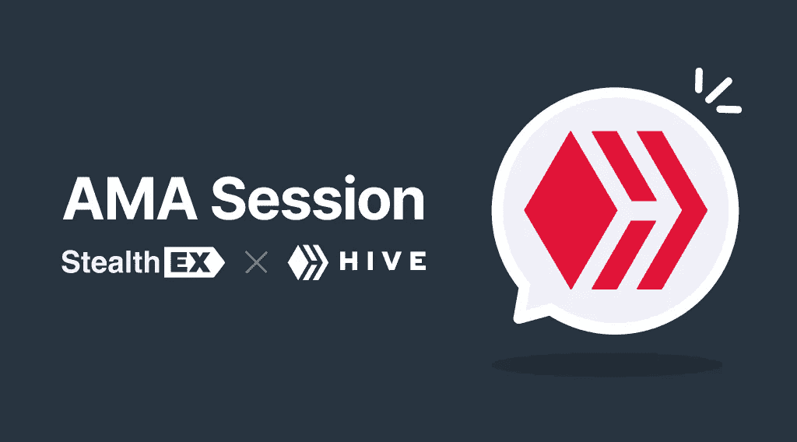

# 独家 AMA 回顾:蜂巢区块链 x StealthEX

> 原文：<https://medium.com/coinmonks/recap-of-exclusive-ama-hive-blockchain-x-stealthex-344eee91b84e?source=collection_archive---------55----------------------->

2022 年 4 月 15 日，我们在我们的 [Telegram 社区聊天](https://t.me/StealthEX_io)中进行了[stealth the x](https://stealthex.io/)&HIVE 区块链 AMA 会话，这里是一个回顾。只需要花一点时间通读并了解您需要的关于 HIVE 加密货币的一切。

感谢大家今天的参与！我们很高兴 HIVE 负责全球推广和运营的 Reese (@murtherx)加入我们🙌

像往常一样，我们将在关闭聊天的情况下，通过 Twitter 上的一系列问题开始 AMA。完成后，我会将聊天功能重新打开一会儿，让您可以提出自己的问题。

很高兴来到这里。

Ben Frost，StealthEX: 很高兴在这里见到你！事不宜迟，你准备好开始了吗？这些问题没有特定的顺序

李斯:我们开始吧。

# 来自 Twitter 的问题

**Q1:考虑到 splinterlands 的繁荣，并假设另一个项目，而不是主要项目，也有类似的繁荣，Hive 会向这些特定利基的新用户提供什么，以便他们了解并利用平台的其余部分？**

许多用户在开始使用《夹板大陆》后创建了自己的 Hive 账户，他们在这个生态系统中有点迷失，没有意识到它的规模以及有多少游戏和 dapps。与 Hive 这么大的东西有关的一切都是一个学习过程，我们确实有许多有用的地方可以获得指导，例如我们的许多 Discord 聊天(有 100 多个)，当然还有电报、文档和博客。我们完全期待有许多这样的 dapps 成为一个巨大的吸引力。在 Hive 上很快会有一个新版本(叫做 Ragnarok ),它有可能与 Splinterlands 的 draw 相抗衡。由于 Hive 是可扩展和免费的，我们可以欢迎所有这样的项目和它们吸引的用户。

**Ben Frost，StealthEX:** 哦，我已经知道 Ragnarok 了，期待！也期待 dapps 整体的爆款！

**Q2:作为一个分支，它的代码是基于分支时可用的 Steem 版本，你能提到任何显著的变化吗？？？**

**Reese:** 当恶意收购发生时，我们别无选择，只能分叉原始 Steem 链，以确保它的分散和公共延续(原始的被私有化)，我们的开发人员对代码的状态以及需要优化和修复的内容感到惊讶。此后，我们对治理和其他关键功能以及与分层解决方案和扩展相关的功能进行了改进。在这里列出来太多了，但是[的变更列表可以在我们的博客](https://hive.blog/@hiveio)上，在我们的 HF (hardfork)帖子上或者在我们的[领导开发团队的博客](https://hive.blog/@blocktrades)上找到。总的来说，Hive 现在与它开始时有很大的不同，它是为易于集成而设计的。

Ben Frost，StealthEX: 有时候困难会让最终的产品比想象中的还要好，我想你会继续磨练 Hive 的💪

**Q3:Hive 有在委内瑞拉、尼日利亚、非洲等危机国家经济上改变生活的证词，是真的吗？为什么会这样？**

**Reese:** 是的，这是真的，它正在发生，因为居住在这些地区的 Hive 社区成员正在利用 Hive 的力量来支持他们自己的生活，并改变其他人的生活。就在昨天，我们发表了一篇文章，内容是关于一名委内瑞拉当地的机械师开始在他的店里接受 HBD。在那之前，这家商店濒临倒闭，现在又重新开张营业了。下面是他的故事。加纳的一个郊区正在修建一口水井，施工将于本周晚些时候完成，这也得到了 Hive 的一名当地社区成员的支持，他看到人们必须步行一英里才能获得饮用水。另一个来自尼日利亚的人正在一个村庄修理另一口井，他发现这口井已经坏了一年，人们没有合理的用水渠道。这只是本周的几个突出的故事，但来自世界各地的许多人都在寻找机会改变他们在 Hive 上的生活，改变他们邻居的生活。原因很简单:Hive 很受欢迎，任何人都可以加入并实现他们的目标。这里没有障碍，也没有像其他平台上那样的“首选用户”。Hive 同样欢迎所有人。

Ben Frost，StealthEX: 哇，这些故事真的很有震撼力。让你重新评估加密对世界的影响，尤其是对一些最需要帮助的社区。

**Q4:我的问题是 Hive 是一个伟大的生态系统，它还没有完成成长，但它的一个巨大吸引力是用户可以创建内容。现在，他们有什么可以提供给一个内容创作者，** [**蜂巢博客**](http://HIVE.BLOG) **有什么吸引猎取人才的地方？**

里斯:我们不猎取人才。我们对所有个人的贡献一视同仁，由其他社区成员决定是给予高度评价还是中度评价。Hive 允许通过 7 天的窗口对发布的内容进行定时货币化。也就是说，你发布一个博客，人们会通过上下投票来管理它，在 7 天结束时，博客会达到它的最终价值。内容创作者(任何个人)获得每篇博客文章或评论价值的 50%,另外 50%在管理者之间按比例分配。由于 Hive 有强大的社区，自然需要人们在上面与其他人交流。这意味着，那些只是交叉发布到 Hive 而不是真正参与的人，会比那些真正来到 Hive 并希望了解他人并展示自己的写作、艺术、音乐等的人做得差得多。我们提供的是一个强大的社区和支持网络；每个人都能欣赏的东西。

**Ben Frost，StealthEX:** 我在很多场合访问过 HiveBlog，不得不承认这是一个很棒的产品。货币化是公平和透明的，我 100%肯定观众会有机增长。

**Q5:我想问一下，#HIVE 的竞争优势是什么？你比其他竞争者有什么优势？关于安全性、可扩展性、社区开发等特性，你认为你已经完成了还是需要继续开发？**

里斯:我们在各方面都很稳定。你不必担心是否会有一场混战，或者是否所有投资者都会决定抛售 HIVE 和 HBD。或者一场灾难会彻底摧毁蜂巢。由于我们的分散化，我们拥有内在的稳定性，这种稳定性不仅受到我们关键技术的地理分布和操作技术的技术社区成员的支持，还受到一个成熟可靠的社区的支持。现在我们在 Hive 上有大约 250 万个钱包。我们正与其他生态系统不断发展的公司进行友好竞争，例如以太坊，但我们通常支持 Web 3 领域的所有公司，并希望通过推广我们独特的解决方案，我们可以塑造一个更美好的未来。我们是独一无二的；我们是高度可扩展的，我们的交易是免费的，依赖于可补充的资源信用而不是高额费用，我们的阻塞时间是 3 秒，我们有无数的功能可以轻松访问信息和集成，如新的 HAF (Hive 应用程序框架)。我们肯定没有完成任何事情，我们将继续优化和改进。一旦任何区块链停止持续改进，它就开始落后和停滞不前。Hive 不玩那个游戏。我们不断重新评估我们已经取得的成就，并继续我们的发展。

**本·弗罗斯特，StealthEX:** 说得好！我认为我们都在集体支持 crypto 的集体成功，hive 区块链的优势很难掩盖。

**Q6:你能给我演示一下$HIVE 令牌的分发吗？与不持有$HIVE 代币的人相比，持有$HIVE 代币的人有什么额外的好处？对于长期持有者来说，还有什么好处吗？**

是的，我们有许多社区成员定期发布关于发行版的更新。这是昨天的一份报告。那些通过给 Hive 加电(在不影响其完整性的情况下将 HIVE 转化为 HIVE 动力)而持有股份的人能够通过参与发布内容的监管来进一步增加他们的股份。我之前提到过，策展人分享所有帖子/评论奖励的 50%。那些精心策划并始终如一地选择有价值的高质量原创内容的人会从中赚得不少。这可能是一个有利可图的机会，也是一个令人愉悦的情感满足的机会。我们稳定的 HBD 货币(与美元挂钩)还有一个可变年利率的储蓄账户功能。年利率由社区通过其治理机制决定。目前设定为 20%。这意味着，如果你今天在你的账户上存了 1000 美元，一年后你会有 1200 美元。HBD 一直保持稳定，它可以被视为一个可靠的不干涉投资。

[以下是来自同一位分析师的一些额外统计数据](https://hive.blog/hive-133987/@arcange/hive-statistics-20220414-en)。这些也是昨天的。

**Ben Frost，StealthEX:** 太好了，我很欣赏这种透明的分析方法。我相信社区会检查数据的！

**Q7:对于投资者和用户来说，平台必须是优秀的，诚信需要公开和可信。请告诉我们更多关于您的透明度(如团队成员)和安全措施的信息。您的平台目前正在接受审计吗？**

**Reese:** Hive 是完全透明的，任何个人或组织都可以独立审计它，验证它上面的一切，没有任何障碍或特殊信息。我们有许多块浏览器，任何人都可以在那里看到[块和交易](https://hiveblocks.com/@hiveio)的内容(以主博客账户为例)。人们不需要任何特殊知识来辨别交易。我们的团队成员只是社区成员。没有正式的角色。关于我的角色，如果你注意到了，我并没有给自己贴上导演或者其他什么的标签。我只是有一个我参与并负责的任务。这是因为 Hive 不是公司或组织，它没有任何员工。任何人都可以通过他们的开源贡献加入这个团队，如果你看看[我们的 Gitlab](https://gitlab.syncad.com/hive) 就可以看到许多贡献者。关于我们的安全措施，我们既有链上治理相关的措施，以防止另一个 51%的攻击，导致创建 Hive。这是通过延迟治理和限制来阻止恶意行为者实现的。也有分级密钥与交错的权限，恢复(回滚)的可能性，妥协的帐户，改变计时器等。许多安全特征被简单地构建到链的一般功能中。此外，我们还开发了许多安全认证服务，如 Hivesigner 和 Hive Keychain，这些服务集成在所有基于 Hive 的可信 dapps 中，使用户能够完全控制自己的钱包，让他们高枕无忧。我们还有许多专注于前端的解决方案，专注于减少所有加密中常见的网络钓鱼企图。针对这一点，有一些基于社区的强大倡议，如 Hivewatchers，他们的作用是确保我们能够保持我们的生态系统对剥削和恶意方的弹性。我们定期关注社区成员的个人安全意识。我们不知道现有组织目前进行的任何审计；也就是说，我们自己的社区会根据个人的判断进行持续的审核。这就是透明的意义所在。

没想到那是一大段文字！关于 Hive 非常关注的安全性，我有很多话要说。

**Ben Frost，StealthEX:** 不，这太棒了，这正是人们在问及安全问题时所期待的！非常彻底🙂

**问题 8:您能给我们概述一下令牌组学吗？代币是否设计为随着平台的成功而涨跌，是否包含任何稀缺路径，如入股、店铺或烧钱？**

**Reese:** Hive 的充气率递减，设计为每 25 万块递减 0.01%。这大约是每年 0.5%的基础上，直到它达到 0.95%。在通货膨胀本身之外，一部分用于组成奖励池，从该奖励池中提取所有发布和监管奖励(这是通货膨胀的 65%)，剩余部分用于其他基金，如我们的 DHF(分散蜂巢基金)等。到目前为止，HIVE 在总体加密趋势方面有起有落，但它安然度过了熊市，并相当好地克服了挑战，即使在动荡时期也被视为稳定的投资。这是因为，正如我前面提到的，它天然地抵抗泵和转储，地毯拉是不可能的。我们不会人为组织焚烧，但许多社区成员会自行焚烧。此外，在 Hive 上创建付费账户会导致账户成本被烧掉——这只是[一篇关于夹板岛热潮导致](https://hive.blog/hive-167922/@dalz/splinterlands-burned-one-million-hive-in-2021-for-creating-new-accounts-or-data-on-account-creation)在 2021 年大烧的文章。

**本·弗罗斯特，StealthEX:** 再一次，对于我们社区的问题，这是一个简单明了的回答，太棒了🙌

**Q9:你能分享一下迄今为止你所能描述的 Hive 的合作关系吗？你有计划在未来建立更多的战略伙伴关系吗？**

Reese: 这很难，因为我们建立了许多合作关系。例如，我们与其他残疾人组织连锁 Telos、Scorum 和 Peerplays 建立了伙伴关系。对于那些感兴趣的人来说，我们在最近的[两周年纪念文章](https://hive.blog/hive/@hiveio/two-years-of-hive-celebrating-our-2nd-anniversary-together)中实际上涵盖了其中的许多。

Hive 欢迎与志同道合的项目或服务提供商建立合作伙伴关系，这些项目或服务提供商专注于 Web 3 的理想、透明度和去中心化，并且旨在将用户放在第一位。我们相信与他人建立牢固的桥梁。我们也欢迎任何这样的整合。许多在其他连锁店开始他们生活的 dapps 最终看着 Hive，因为我们是一个更受欢迎的房地产建筑；我们将很快看到更多这方面的公告。总的来说，任何希望与 Hive 合作的人都应该主动联系我，我很乐意帮助他们。

**Ben Frost，StealthEX:** 对这一轮非常有见地的 Twitter 问题的精彩总结！

现在，我将打开聊天一会儿，让聊天中的问题积累起来，然后再关闭。就选几个你最喜欢的问题，慢慢回复。

# 现场提问

Q1:你是全球项目还是本地项目？目前你是专注于哪个市场，还是专注于建立和成长以获得客户、用户和合作伙伴？

**里斯:**我们是一个全球性的项目。Hive 开发者、用户、节点操作者(称为见证人)以及 Hive 涉及的其他所有人都分散在世界各地。如果我们只关注节点运营商和开发商，我想他们在加拿大、美国、土耳其、墨西哥、德国、法国、澳大利亚、尼日利亚、印度等等。Hive 不基于任何一个司法管辖区或地理区域，将来也不会。

**Q2:你能分享一下你的社交媒体链接吗，这样我们就可以随时了解最新情况。**

这些可以在 hive.io 的底部找到

**Q3:你们这个项目是不是只针对精英投资人，其他资金少的怎么样，是不是对所有人开放？**

**里斯:**蜂巢是给大家的。你根本不需要做任何投资就可以加入他的生态系统；这是通向加密的大门。人们可以简单地创建一个免费的 Hive 账户(由其他社区成员捐赠),并通过发帖和参与来增加他们的股份。蜂巢由多种类型和规模的投资者和利益相关者组成；所有的都是有价值的，都是受欢迎的

**Q4:你们有什么大的促销活动吗？对于即将到来的事件，您的项目路线图计划是什么？？？谢了。**

里斯:社区成员组织了许多当地活动。要跟上他们实际上是不可能的，除非努力跟随他人，并为此阅读蜂巢博客、博客或 T21。

**Q5:在你的产品创作过程中，你是否考虑过社区的反馈/请求，以便为你的项目扩展新的想法？许多项目失败是因为目标受众和客户不被理解。所以我想知道你们产品的理想消费者是谁？**

Reese: 我们的项目是由社区创建的。我们都是社区成员，100%。

你的项目是一个只针对说英语的国家的社区吗？还是针对非其他语言的用户？

**里斯:**我们不是英语项目。实际上，我们社区的大多数成员都把英语作为第二语言。内容是受欢迎的，并以多种语言出版，从他加禄语到乌尔都语。

我有兴趣投资你的项目。我何时何地能购买你的代币？？是已经上市的交易所吗？？

里斯:你可以在这里的 [StealthEX](https://stealthex.io/) 买到！

**Q8:蜂巢及其生态系统的发展通过 DHF 得以持续；分散的蜂巢基金，你能解释一下这个基金吗，你如何保护这个基金，你的商业模式是什么**

**里斯:**问得好。DHF 是一个基于提议的机制，通过治理参与，一组提议得到资助。其工作方式是，单个提案所有人撰写他们的概述，并自行决定在一个设定的时间范围内请求特定金额的 HBD(与美元挂钩)。机构群体利益相关方投票支持该提案。一旦达到一定的门槛，就批准了。如果没有达到这个阈值，它就没有资金，提案所有者可以在思考为什么他们的提案被拒绝后再尝试一次。社区成员总是乐意提供反馈。这里有一份当前提案的清单，包括有资金支持的和没有资金支持的。

Ben Frost，StealthEX: 就这样！非常感谢@murtherx 花时间来告诉我们 Hive 的一切。我想我代表每个人说，这是一个疯狂的信息和深入了解项目的内部工作。

在这之后，我一定会去检查你提供的所有资料来源！

还有，就像最近提到的，你可以[在 StealthEX 交换平台](https://stealthex.io/?to=hive)上交换$HIVE。

再次感谢里斯为可爱的 AMA 和所有的信息🙂

# 如何购买蜂巢加密币？

只需进入 [StealthEX](https://stealthex.io/) 并遵循这些简单的步骤:

1.  选择兑换的货币对和金额。例如， [BTC](https://stealthex.io/coin/btc) 到[蜂巢](https://stealthex.io/coin/hive)。
2.  按下“开始交换”按钮。
3.  提供硬币将被转移到的收件人地址。
4.  移动你的加密货币进行交易。
5.  收到您的加密硬币！

如果你对 StealthEX 交换服务还有其他问题，你可以去我们的 [*常见问题部分*](https://stealthex.io/faq) *找到所有必要的信息。*

*关注我们上* [*中*](https://stealthex-io.medium.com/) *，* [*推特*](https://twitter.com/Stealthex_io) *，* [*电报*](https://t.me/StealthEX) *，*[*YouTube*](https://www.youtube.com/channel/UCeES_XBesX76ge7xf1meuSw)*， [*Reddit*](https://www.reddit.com/user/Stealthex_io) *获取* [*StealthEX*](https://stealthex.io/)*

如果您在兑换硬币方面有任何问题，我们随时准备为您提供支持。我们的团队尽最大努力保护所有成员并回答他们的问题。对于所有请求，请通过 support@stealthex.io 向我们发送消息

非常欢迎您访问[*StealthEX exchange*](https://stealthex.io/)*看看它有多快多方便。*

*原载于 2022 年 4 月 19 日*[*https://stealthex . io*](https://stealthex.io/blog/2022/04/19/recap-of-exclusive-ama-hive-blockchain-x-stealthex/)*。*

> 加入 Coinmonks [电报频道](https://t.me/coincodecap)和 [Youtube 频道](https://www.youtube.com/c/coinmonks/videos)了解加密交易和投资

# 另外，阅读

*   [AscendEx 保证金交易](https://coincodecap.com/ascendex-margin-trading) | [Bitfinex 赌注](https://coincodecap.com/bitfinex-staking)
*   [最好的卡达诺钱包](https://coincodecap.com/best-cardano-wallets) | [Bingbon 副本交易](https://coincodecap.com/bingbon-copy-trading)
*   [印度最佳 P2P 加密交易所](https://coincodecap.com/p2p-crypto-exchanges-in-india) | [柴犬钱包](https://coincodecap.com/baby-shiba-inu-wallets)
*   [八大加密附属计划](https://coincodecap.com/crypto-affiliate-programs) | [eToro vs 比特币基地](https://coincodecap.com/etoro-vs-coinbase)
*   [最佳以太坊钱包](https://coincodecap.com/best-ethereum-wallets) | [电报上的加密货币机器人](https://coincodecap.com/telegram-crypto-bots)