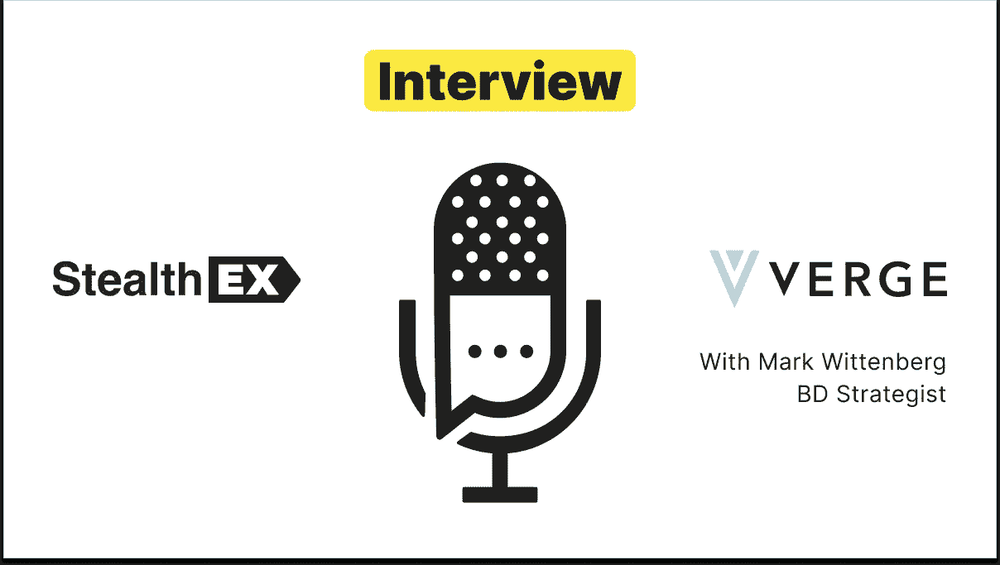

# 独家 AMA 回顾:边缘硬币 x 窃取 x 推特空间

> 原文：<https://medium.com/coinmonks/recap-of-exclusive-ama-verge-coin-x-stealthex-twitter-spaces-eb35dabff4e3?source=collection_archive---------58----------------------->

3 月 28 日，我们有机会了解了 Verge crypto 在 AMA 上所做的一切。

Verge crypto 是一种分散的开源加密货币，提供各种级别的私人交易。它通过 Tor 混淆用户的 IP 地址，并利用秘密交易使其难以确定用户的地理位置来做到这一点。

如果您错过了 Twitter Spaces live 会话，您可以随时收听以下录音:

在 [Medium](https://stealthex-io.medium.com/) 、 [Twitter](https://twitter.com/Stealthex_io) 、 [Telegram](https://t.me/StealthEX) 、 [YouTube](https://www.youtube.com/channel/UCeES_XBesX76ge7xf1meuSw) 和 [Reddit](https://www.reddit.com/user/Stealthex_io) 上关注我们，获取 [StealthEX.io](https://stealthex.io/) 更新和关于密码世界的最新消息。

## 如何购买 Verge 币？

欢迎在 [StealthEX](https://stealthex.io/) 上购买 XVG crypto。

只需遵循这些简单的步骤:

1.  选择兑换的货币对和金额。例如， [BTC](https://stealthex.io/coin/bitcoin) 到 [XVG](https://stealthex.io/coin/verge) 币。
2.  按下“交换”按钮。
3.  提供硬币将被转移到的收件人地址。
4.  移动你的加密货币进行交易。
5.  收到您的加密硬币！

如果您在兑换硬币方面有任何问题，我们随时准备为您提供支持。我们的团队尽最大努力保护所有成员并回答他们的问题。对于所有请求消息我们通过 [*支持@stealthex.io*](mailto:support@stealthex.io) *。*

*如果您对 StealthEX exchange 服务还有其他问题，您可以前往我们的* [*常见问题部分*](https://stealthex.io/faq) *，在那里找到所有必要的信息。*

**非常欢迎您访问**[**StealthEX exchange**](https://stealthex.io/)**，看看它有多快多方便。**

> 加入 Coinmonks [电报频道](https://t.me/coincodecap)和 [Youtube 频道](https://www.youtube.com/c/coinmonks/videos)了解加密交易和投资

# 另外，阅读

*   [CoinFLEX 评论](https://coincodecap.com/coinflex-review) | [AEX 交易所评论](https://coincodecap.com/aex-exchange-review) | [UPbit 评论](https://coincodecap.com/upbit-review)
*   [AscendEx 保证金交易](https://coincodecap.com/ascendex-margin-trading) | [Bitfinex 赌注](https://coincodecap.com/bitfinex-staking) | [bitFlyer 审核](https://coincodecap.com/bitflyer-review)
*   [麻雀交换评论](https://coincodecap.com/sparrow-exchange-review) | [纳什交换评论](https://coincodecap.com/nash-exchange-review)
*   [支持卡审核](https://coincodecap.com/uphold-card-review) | [信任钱包 vs MetaMask](https://coincodecap.com/trust-wallet-vs-metamask)
*   [TraderWagon 回顾](https://coincodecap.com/traderwagon-review) | [北海巨妖 vs 双子座 vs BitYard](https://coincodecap.com/kraken-vs-gemini-vs-bityard)